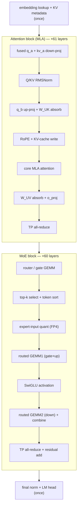

# Decode 算子數學對照

先把整個 decode step 的數學路徑對齊。下圖是高階 pipeline；實際 trace 會把多個數學 operation 融成同一個 kernel，或把一個 operation 拆成數個 kernel。模型維度與 `moe_tp_size` 的來源見 [概觀與模型組態](index.md)。

符號約定：$t$ 是目前 decode token，$u$ 是可被 attend 的歷史 token，$\ell$ 是 layer， $h_{\ell,t} \in \mathbb{R}^{H}$，$H=7168$。MLA 的 KV latent 記為 $c_{\ell,u} \in \mathbb{R}^{d_c}$，RoPE key 分量記為 $k^R_{\ell,u}$。MoE 的每個 expert partition intermediate size 是 $I=256$，所以 gate/up 輸出寬度是 $2I=512$。

## 序章：embedding lookup + KV metadata

Decode 的新 token 先做 embedding lookup；位置、sequence 與 cache slot 則進入後續 paged-KV metadata。

$$
h_{0,t} = E[x_t], \qquad
\mu_t = \big(\operatorname{seq}(t),\operatorname{pos}(t),\operatorname{slot}(t)\big).
$$

這裡的 $\mu_t$ 不改變 hidden vector 的值，但決定 RoPE 的位置 $p_t=\operatorname{pos}(t)$ 以及 KV-cache 寫入/讀取的 slot。

## Attention block（MLA，×61）

**fused $q_a$ + $kv_a$ down-proj**。AITER trace 裡的第一段 dense GEMM 會把 hidden 投到 query low-rank 與 KV latent。

$$
q_{a,\ell,t} = h_{\ell,t} W^{DQ}_{\ell}, \qquad
\big[c_{\ell,t}, k^R_{\ell,t}\big] = h_{\ell,t} W^{DKV}_{\ell}.
$$

**Q/KV RMSNorm**。低秩 query 與 KV latent 各自做 RMSNorm：

$$
\operatorname{RMSNorm}_{\gamma}(x)
= \gamma \odot \frac{x}{\sqrt{\frac{1}{d}\sum_{i=1}^{d} x_i^2 + \epsilon}},
\qquad
\hat q_{a,\ell,t}=\operatorname{RMSNorm}_{\gamma_q}(q_{a,\ell,t}),
\quad
\hat c_{\ell,t}=\operatorname{RMSNorm}_{\gamma_{kv}}(c_{\ell,t}).
$$

**$q_b$ up-proj + $W^{UK}$ absorb**。$q_b$ up-projection 產生每個 head 的 non-RoPE query 與 RoPE query；non-RoPE query 會先吸收 K up-projection，讓 attention logit 直接在 KV latent 維度上計算。

$$
\big(q^N_{\ell,t,r}, q^R_{\ell,t,r}\big)
= \operatorname{split}\!\left(\hat q_{a,\ell,t} W^{UQ}_{\ell,r}\right),
\qquad
\tilde q^C_{\ell,t,r} = q^N_{\ell,t,r} {W^{UK}_{\ell,r}}^{\top}.
$$

其中 $r$ 是 attention head，$\tilde q^C_{\ell,t,r} \in \mathbb{R}^{d_c}$。這一步把 原本的 $(q^N)^\top(W^{UK}c)$ 改寫成 $(\tilde q^C)^\top c$。

**RoPE + KV-cache write**。RoPE 是一個依位置旋轉的 block-diagonal 變換。對每個 2 維 pair：

$$
\operatorname{RoPE}_{p}(a_{2i},a_{2i+1})
=
\begin{bmatrix}
\cos \theta_{p,i} & -\sin \theta_{p,i} \\
\sin \theta_{p,i} & \cos \theta_{p,i}
\end{bmatrix}
\begin{bmatrix}
a_{2i} \\
a_{2i+1}
\end{bmatrix}.
$$

因此目前 token 的 RoPE query / key 與 KV-cache 寫入為：

$$
\bar q^R_{\ell,t,r}=\operatorname{RoPE}_{p_t}(q^R_{\ell,t,r}), \qquad
\bar k^R_{\ell,t}=\operatorname{RoPE}_{p_t}(k^R_{\ell,t}), \qquad
\operatorname{KVCache}_{\ell}[\operatorname{slot}(t)]
\leftarrow \big(\hat c_{\ell,t},\bar k^R_{\ell,t}\big).
$$

**core MLA attention**。decode token 對所有可見歷史 token 做 causal attention；logit 由 latent-KV dot product 與 RoPE dot product 相加：

$$
s_{\ell,t,u,r}
= \frac{
(\tilde q^C_{\ell,t,r})^{\top}\hat c_{\ell,u}
+(\bar q^R_{\ell,t,r})^{\top}\bar k^R_{\ell,u}
}{\sqrt{d_q}},
\qquad
\alpha_{\ell,t,u,r}
= \operatorname{softmax}_{u \le t}(s_{\ell,t,u,r}).
$$

MLA core attention 的低秩輸出是：

$$
z_{\ell,t,r}
= \sum_{u \le t} \alpha_{\ell,t,u,r}\,\hat c_{\ell,u}.
$$

**$W^{UV}$ absorb + $o_{\text{proj}}$**。value up-projection 與 output projection 可吸收成 一個 per-head 輸出矩陣：

$$
\tilde W^O_{\ell,r}=W^{UV}_{\ell,r} W^O_{\ell,r}, \qquad
a_{\ell,t}^{(r)}
= z_{\ell,t,r}\tilde W^O_{\ell,r}.
$$

把所有 heads 與 TP rank 的 partial output 加總後，得到 attention 分支輸出：

$$
a_{\ell,t}
= \operatorname{AllReduce}_{\text{TP}}\!\left(\sum_r a_{\ell,t}^{(r)}\right),
\qquad
u_{\ell,t}=h_{\ell,t}+a_{\ell,t}.
$$

## MoE block（×60）

MoE block 只出現在 layer 1–60；layer 0 是 dense MLP。下面的公式描述 Kimi K2.5 的 384 routed experts 加 1 個 shared expert 的路徑。

**router / gate GEMM**。router logits 由 hidden state 做一次 GEMM 得到；Kimi 系列使用 sigmoid-style independent expert scores，再加上 load-balancing correction bias 做 top-k。

$$
\rho_{\ell,t}=u_{\ell,t} W^{G}_{\ell}, \qquad
s_{\ell,t,e}=\sigma(\rho_{\ell,t,e}), \qquad
\tilde s_{\ell,t,e}=s_{\ell,t,e}+b_{\ell,e}.
$$

**top-k select + token sort**。先選出 routed experts，再對選中分數重新歸一化。token sort 只是改變執行順序，方便 grouped GEMM 以 expert 為單位連續處理 row。

$$
\mathcal{R}_{\ell,t}
= \operatorname{TopK}_{e}\big(\tilde s_{\ell,t,e}, k=8\big), \qquad
g_{\ell,t,e}
= \frac{s_{\ell,t,e}}{\sum_{j\in\mathcal{R}_{\ell,t}} s_{\ell,t,j}}
\quad (e\in\mathcal{R}_{\ell,t}).
$$

令每個 assignment row 為 $(t,e,g_{\ell,t,e})$。sort kernel 建立一個 permutation：

$$
\pi_{\ell}=\operatorname{argsort}_{(t,e)}(e), \qquad
\operatorname{rows}_{\ell,e}
=\{(t,e,g_{\ell,t,e}) : e\in\mathcal{R}_{\ell,t}\}.
$$

!!! Example "數值例子：一個 decode batch 會產生多少 expert rows"
    若 decode batch 有 $B=256$ 個 token、$k=8$、$E=384$，每層 routed assignment 數是 $B k=2048$。均勻分散時，每個 routed expert 平均只有 $2048/384\approx5.3$ rows；若 shared-expert fusion 開啟，還會多 $B=256$ 個 shared rows，合計 2304 rows。這就是 trace 裡 grouped GEMM row 很碎、需要 sort/pack 的原因。

**expert-input quant（FP4）**。AITER 對 expert activation 做 per-1x32 block 的 MXFP4 動態量化。對 block $B_b$：

$$
\Delta_{\ell,t,b}
= \frac{\max_{i\in B_b}|u_{\ell,t,i}|}{x_{\max}^{\mathrm{FP4}}}, \qquad
\hat u^{\mathrm{FP4}}_{\ell,t,i}
= Q_{\mathrm{FP4}}\!\left(\frac{u_{\ell,t,i}}{\Delta_{\ell,t,b}}\right),
\quad i\in B_b.
$$

!!! Example "數值例子：per-1x32 scale 不是免費的"
    Hidden size $H=7168$、block size 32 時，每個 expert row 有 $7168/32=224$ 個 scale。上例 2048 個 routed rows 需要 $2048\cdot224=458{,}752$ 個 scale bytes（若每個 scale 用 uint8，約 0.44 MB）。FP4 activation 本體是 $2048\cdot7168\cdot0.5\approx7.34$ MB，所以 scale overhead 約 6%。它不主導頻寬，但會影響 packing layout 與 kernel 設計。

**routed GEMM1（gate+up）**。每個被選中的 expert 用自己的 $W_{13}^{(e)}$ 做 gate/up 合併 GEMM：

$$
y_{\ell,t,e}
= \hat u^{\mathrm{FP4}}_{\ell,t} W^{(e)}_{13,\ell}, \qquad
y_{\ell,t,e}
= \big[y^g_{\ell,t,e}, y^u_{\ell,t,e}\big],
\quad
y^g,y^u \in \mathbb{R}^{I}.
$$

**SwiGLU activation**。

$$
m_{\ell,t,e}
= \operatorname{SwiGLU}(y_{\ell,t,e})
= \operatorname{SiLU}(y^g_{\ell,t,e})\odot y^u_{\ell,t,e},
\qquad
\operatorname{SiLU}(x)=x\,\sigma(x).
$$

**routed GEMM2（down）+ combine**。down projection 回到 hidden size，並用 router weight 做 combine：

$$
d_{\ell,t,e}=m_{\ell,t,e} W^{(e)}_{2,\ell}, \qquad
o^{\mathrm{routed}}_{\ell,t}
= \sum_{e\in\mathcal{R}_{\ell,t}} g_{\ell,t,e}\,d_{\ell,t,e}.
$$

若 shared-expert fusion 開啟，shared expert $s$ 被附加成固定權重 $g_{\ell,t,s}=1$ 的 第 9 個 assignment：

$$
\mathcal{R}^{+}_{\ell,t}=\mathcal{R}_{\ell,t}\cup\{s\}, \qquad
o^{\mathrm{MoE}}_{\ell,t}
= \sum_{e\in\mathcal{R}^{+}_{\ell,t}} g_{\ell,t,e}\,E_{\ell,e}(u_{\ell,t}),
\quad g_{\ell,t,s}=1.
$$

Fusion 關閉時，shared expert 是獨立分支：

$$
o^{\mathrm{MoE}}_{\ell,t}
= o^{\mathrm{routed}}_{\ell,t}+E_{\ell,s}(u_{\ell,t}).
$$

**TP all-reduce + residual add**。MoE output 先跨 TP rank 加總，再回加 residual：

$$
\bar o^{\mathrm{MoE}}_{\ell,t}
= \operatorname{AllReduce}_{\text{TP}}\!\left(o^{\mathrm{MoE}}_{\ell,t}\right),
\qquad
h_{\ell+1,t}=u_{\ell,t}+\bar o^{\mathrm{MoE}}_{\ell,t}.
$$

這條 fusion 開 / 關的差異，在 [Shared-expert fusion 開 / 關](fusion.md) 會用實際 trace 的 kernel 順序具體對照。

## 尾聲：final norm + LM head

最後一層 hidden state 做 final RMSNorm，再投到 vocabulary logits：

$$
\hat h_{L,t}=\operatorname{RMSNorm}_{\gamma_f}(h_{L,t}), \qquad
\ell_t=\hat h_{L,t} W_{\mathrm{LM}}^{\top}, \qquad
P(x_{t+1}=v\mid x_{\le t})
= \operatorname{softmax}(\ell_t)_v.
$$
