# Shared-expert fusion 開 / 關對照

這頁把 decode 一層的實際 GPU kernel 順序攤開，並用 **shared-expert fusion 開啟 / 關閉** 兩組 trace 對照。數學路徑見 [Decode 算子數學對照](decode-math.md)，模型維度見 [概觀與模型組態](index.md)。

## 怎麼從 trace 框出 decode 一層

SGLang 已經用 `record_function("Decode")` 包住 decode 路徑，因此 trace 內會出現一段 名為 **`Decode`** 的 `user_annotation`。解析時以這段 annotation 作為外框：

1. 選出 GPU kernel 數最多的 `Decode` 視窗，通常這也是 warmup 後最乾淨的一段。
2. 在視窗內以「每層第一個 kernel」`fused_qk_rmsnorm`（input / QK RMSNorm）為界， 取相鄰兩個 anchor 之間的 kernel，得到**完整的一個 decode layer**。

以 conc4 / ISL1024 的 trace（rank 0）為例，`Decode` 視窗裡剛好有 **61 個 `fused_qk_rmsnorm`**，正好對應 61 層。fusion 開啟時，一層包含 **17 個 kernel**； fusion 關閉時，一層變成 **24 個 kernel**。多出的 7 個 kernel 來自 standalone shared expert pipeline。

## Shared-expert fusion 開啟

baseline 啟動參數如下；此時 shared expert 被放進 routed path，成為固定的第 9 個 assignment：

```bash
python3 -m sglang.launch_server --host 0.0.0.0 --port 31999 \
  --model-path /models/Kimi-K2.5-MXFP4 --tensor-parallel-size 4 \
  --mem-fraction-static 0.9 --kv-cache-dtype fp8_e4m3 --disable-radix-cache \
  --enable-aiter-allreduce-fusion --trust-remote-code \
  --moe-runner-backend aiter --numa-node 1 1 1 1
```

以下是從 trace 切出的單層 kernel 順序。節點名稱保留 profiler 中可辨識的短名：

```mermaid
flowchart TB
  A0["hidden h · M×7168 · BF16"] --> A1["1 · fused_qk_rmsnorm<br/>input/QK RMSNorm + quant"]
  A1 --> A2["2 · hgemm_bf16_16x64x64x8_SPK3<br/>QKV-A / Q_b projection"]
  A2 --> A3["3 · _batched_gemm_a16wfp4 (K=128)<br/>K-absorb BMM"]
  A3 --> A4["4 · _fused_qk_rope_cat_and_cache_mla<br/>RoPE + KV-cache write"]
  A4 --> A5["5 · mla_a8w8_qh16_qseqlen1_gqaratio16_ps<br/>MLA core attention"]
  A5 --> A6["6 · kn_mla_reduce_v1_ps<br/>split-KV reduce"]
  A6 --> A7["7 · _batched_gemm_a16wfp4 (K=256)<br/>V-absorb BMM"]
  A7 --> A8["8 · hgemm_bf16_16x64x64x8_SPK2<br/>o_proj"]
  A8 --> A9["9 · allreduce_fusion_kernel_1stage<br/>TP all-reduce ①"]
  A9 --> A10["10 · hgemm_bf16_16x64x128x7_SPK8<br/>router gate GEMM"]
  A10 --> A11["11 · grouped_topk_kernel<br/>biased grouped top-k（8 routed）"]
  A11 --> A12["12 · opus_moe_sorting_entry<br/>MoE sort（385 experts，含 shared 第 9 名）"]
  A12 --> A13["13 · fused_mx_quant_moe_sort<br/>routed+shared input MXFP4 quant"]
  A13 --> A14["14 · mfma_moe1_silu_mul_afp4_wfp4_fp4<br/>MoE GEMM1 gate/up + SwiGLU"]
  A14 --> A15["15 · mfma_moe2_afp4_wfp4_bf16_cshuffle<br/>MoE GEMM2 down + combine"]
  A15 --> A16["16 · allreduce_fusion_kernel_1stage<br/>TP all-reduce ②"]
  A16 --> A17["17 · hgemm_bf16_16x64x64x7_SPK7<br/>下一層 input proj 起點"]
  A17 --> AOUT["next layer"]
  class A0,AOUT accBlue;
  class A5,A6 accTeal;
  class A9,A16 accAmber;
  class A12 accGreen;
  class A14,A15 flagship;
```



下表保留 profiler 中的完整 kernel 名稱。數字是 fusion ON、conc4 單層中各 kernel 的單次耗時：

<div class="aiter-stage-table" markdown>

|   # | 完整 kernel 名稱（trace 原樣）                                                                                                             | 功能                            |   µs |
| --: | ------------------------------------------------------------------------------------------------------------------------------------------ | ------------------------------- | ---: |
|   1 | `_ZN5aiter23fused_qk_rmsnorm_kernelIDF16bLi256ELi8ELb1ELi1EEEvPT_S2_PKS1_S4_S4_S4_ffiiiiiii`                                               | input / QK RMSNorm + quant      |  4.1 |
|   2 | `hgemm_bf16_16x64x64x8_SPK3_W1x2x1_BLDS1_TN_AS1_0`                                                                                         | QKV-A downproj / Q_b upproj     |  4.8 |
|   3 | `_batched_gemm_a16wfp4_kernel_BLOCK_SIZE_M_16_BLOCK_SIZE_N_64_BLOCK_SIZE_K_128_..._GRID_MN_8_PRE_QUANT_1_..._CG`                           | K-absorb BMM                    |  4.5 |
|   4 | `_fused_qk_rope_cat_and_cache_mla_kernel`                                                                                                  | RoPE + KV-cache write           |  4.2 |
|   5 | `aiter::mla_a8w8_qh16_qseqlen1_gqaratio16_ps`                                                                                              | MLA core attention（FP8 KV）    |  9.4 |
|   6 | `_Z19kn_mla_reduce_v1_psI23MlaReduceKernelV1TraitsILi512ELi16ELi1EEfDF16bEv23MlaReduceKernelV1Params`                                      | split-KV reduce                 |  4.6 |
|   7 | `_batched_gemm_a16wfp4_kernel_BLOCK_SIZE_M_16_BLOCK_SIZE_N_64_BLOCK_SIZE_K_256_..._GRID_MN_2_PRE_QUANT_1_..._CG`                           | V-absorb BMM                    |  5.5 |
|   8 | `hgemm_bf16_16x64x64x8_SPK2_W1x2x1_BLDS1_TN_AS1_0`                                                                                         | o_proj                          |  8.9 |
|   9 | `_ZN5aiter30allreduce_fusion_kernel_1stageIDF16bDF16bLi4EEE...`                                                                            | TP all-reduce ①（attention 後） |  7.8 |
|  10 | `hgemm_bf16_16x64x128x7_SPK8_W1x1x2_BLDS1_TN_AS1_0`                                                                                        | router gate GEMM                |  5.5 |
|  11 | `void aiter::grouped_topk_kernel<c10::BFloat16, float __vector(4), 1, true, true, false>(...)`                                             | biased grouped top-k            |  6.8 |
|  12 | `void aiter::opus_moe_sorting_entry<aiter::MoeSortingKernel<aiter::MoeSortingProblemEx<int, float, 1, true, false, false, true, 0>>>(...)` | MoE sort（385 experts）         | 11.2 |
|  13 | `_ZN5aiter30fused_mx_quant_moe_sort_kernelIDF16bN4opus5fp4_tELi256ELi32EEE...`                                                             | routed+shared input MXFP4 quant |  4.2 |
|  14 | `mfma_moe1_silu_mul_afp4_wfp4_fp4_t32x128x256_pm1_fp4q_sort_async_v32`                                                                     | MoE GEMM1 gate/up + SwiGLU      | 26.0 |
|  15 | `mfma_moe2_afp4_wfp4_bf16_cshuffle_t32x256x256_vscale_fix3_pm1`                                                                            | MoE GEMM2 down + combine        | 16.3 |
|  16 | `_ZN5aiter30allreduce_fusion_kernel_1stageIDF16bDF16bLi4EEE...`                                                                            | TP all-reduce ②（MoE 後）       |  9.1 |
|  17 | `hgemm_bf16_16x64x64x7_SPK7_W1x2x1_BLDS1_TN_AS1_0`                                                                                         | （下一層的 input projection）   |  8.7 |

</div>

關鍵觀察：fusion 開啟後，**MoE 段只剩 4 個 kernel**（sort → quant → GEMM1 → GEMM2）。 shared expert 不再以獨立 kernel 出現；它被 append 成第 385 個 expert，也就是 top-k 的 第 9 個 assignment，並與 384 個 routed experts 一起在 `mfma_moe1/2` 中完成。單層中最重的 兩個 kernel 是 `mfma_moe1`（26 µs）與 `mfma_moe2`（16 µs）。

## Shared-expert fusion 關閉

關閉 fusion 只需要多加一個 `--disable-shared-experts-fusion`：

```bash
python3 -m sglang.launch_server --host 0.0.0.0 --port 31999 \
  --model-path /models/Kimi-K2.5-MXFP4 --tensor-parallel-size 4 \
  --mem-fraction-static 0.9 --kv-cache-dtype fp8_e4m3 --disable-radix-cache \
  --enable-aiter-allreduce-fusion --trust-remote-code \
  --disable-shared-experts-fusion \
  --moe-runner-backend aiter --numa-node 1 1 1 1
```

關閉後，attention 段（kernel 1–9）不變；MoE 段會多出一條 **standalone shared expert** 鏈。在 routed GEMM 開始之前，shared expert 先自行執行 quant → GEMM → split-K reduce → SiLU → 第二段 GEMM：

```mermaid
flowchart TB
  B0["hidden h · M×7168 · BF16（attention 後）"] --> B9["9 · allreduce_fusion_kernel_1stage<br/>TP all-reduce ①"]
  B9 --> B10["10 · _dynamic_mxfp4_quant<br/>shared expert input quant"]
  B10 --> B11["11 · _gemm_afp4wfp4 (KSPLIT_2)<br/>shared MLP GEMM（gate/up）"]
  B11 --> B12["12 · _gemm_afp4wfp4_reduce<br/>shared split-K reduce"]
  B12 --> B13["13 · act_and_mul (SiLU)<br/>shared SwiGLU"]
  B13 --> B14["14 · _dynamic_mxfp4_quant<br/>shared down-input quant"]
  B14 --> B15["15 · _gemm_afp4wfp4 (KSPLIT_1)<br/>shared MLP GEMM（down）"]
  B15 --> B16["16 · hgemm_bf16_16x64x128x7_SPK8<br/>router gate GEMM"]
  B16 --> B17["17 · grouped_topk_kernel<br/>routed top-k（8 experts）"]
  B17 --> B18["18 · opus_moe_sorting_entry<br/>routed MoE sort"]
  B18 --> B19["19 · fused_mx_quant_moe_sort<br/>routed input MXFP4 quant"]
  B19 --> B20["20 · mfma_moe1_silu_mul_afp4_wfp4_fp4<br/>routed GEMM1 gate/up + SwiGLU"]
  B20 --> B21["21 · mfma_moe2_afp4_wfp4_bf16_cshuffle<br/>routed GEMM2 down + combine"]
  B21 --> B22["22 · vectorized_elementwise (add)<br/>routed + shared 相加"]
  B22 --> B23["23 · allreduce_fusion_kernel_1stage<br/>TP all-reduce ②"]
  B23 --> B24["24 · hgemm_bf16_16x64x64x7_SPK7<br/>下一層 input proj 起點"]
  B24 --> BOUT["next layer"]
  class B0,BOUT accBlue;
  class B9,B23 accAmber;
  class B10,B11,B12,B13,B14,B15 accGreen;
  class B20,B21 flagship;
```



下表只列 fusion OFF 相對 fusion ON 多出或改變的 MoE 段，也就是 kernel 10–22：

<div class="aiter-stage-table" markdown>

|   # | 完整 kernel 名稱（trace 原樣）                                                                                               | 功能                                |   µs |
| --: | ---------------------------------------------------------------------------------------------------------------------------- | ----------------------------------- | ---: |
|  10 | `_dynamic_mxfp4_quant_kernel`                                                                                                | shared expert input MXFP4 quant     |  4.7 |
|  11 | `_gemm_afp4wfp4_kernel_BLOCK_SIZE_M_8_BLOCK_SIZE_N_64_BLOCK_SIZE_K_512_..._NUM_KSPLIT_2`                                     | shared MLP GEMM（gate/up，split-K） | 11.6 |
|  12 | `_gemm_afp4wfp4_reduce_kernel_BLOCK_SIZE_M_16_BLOCK_SIZE_N_64_ACTUAL_KSPLIT_2_..._activation_NONE`                           | shared split-K reduce               |  4.3 |
|  13 | `_ZN7sgl_hip10activation18act_and_mul_kernelI14__hip_bfloat16...silu...EEEvPS3_PS4_i`                                        | shared SwiGLU（act_and_mul）        |  4.4 |
|  14 | `_dynamic_mxfp4_quant_kernel`                                                                                                | shared down-input MXFP4 quant       |  4.4 |
|  15 | `_gemm_afp4wfp4_kernel_BLOCK_SIZE_M_8_BLOCK_SIZE_N_64_BLOCK_SIZE_K_512_..._NUM_KSPLIT_1`                                     | shared MLP GEMM（down）             |  4.2 |
|  16 | `hgemm_bf16_16x64x128x7_SPK8_W1x1x2_BLDS1_TN_AS1_0`                                                                          | router gate GEMM                    |  5.7 |
|  17 | `void aiter::grouped_topk_kernel<...>(...)`                                                                                  | routed top-k（8 experts）           |  6.8 |
|  18 | `void aiter::opus_moe_sorting_entry<...MoeSortingProblemEx<int, float, 1, true, false, false, true, 0>>>(...)`               | routed MoE sort                     | 10.9 |
|  19 | `_ZN5aiter30fused_mx_quant_moe_sort_kernelIDF16bN4opus5fp4_tELi256ELi32EEE...`                                               | routed input MXFP4 quant            |  4.0 |
|  20 | `mfma_moe1_silu_mul_afp4_wfp4_fp4_t32x64x256_pm1_fp4q_sort_async_v32`                                                        | routed GEMM1 gate/up + SwiGLU       | 28.2 |
|  21 | `mfma_moe2_afp4_wfp4_bf16_cshuffle_t32x128x256_vscale_fix3_pm1`                                                              | routed GEMM2 down + combine         | 13.8 |
|  22 | `void at::native::vectorized_elementwise_kernel<8, at::native::CUDAFunctor_add<c10::BFloat16>, std::array<char*, 3ul>>(...)` | routed + shared 相加                |  4.4 |

</div>

**Fusion 開 / 關的數學等價**。令 routed experts 集合為 $\mathcal{R}$（$|\mathcal{R}|=8$），routing 權重為 $g_i$，shared expert 為 $E_s$。 fusion 關閉時，shared expert 是一條獨立加法分支：

$$
o_{\text{off}}
  = \sum_{i \in \mathcal{R}} g_i\, E_i(h)
  + E_s(h),
$$

其中 $\sum_{i \in \mathcal{R}} g_i\, E_i(h)$ 對應 routed grouped GEMM（kernel 16–21）， $E_s(h)$ 對應 standalone shared stage（kernel 10–15）。fusion 開啟時，shared expert 被設為固定權重 $g_s=1$ 的「第 9 名」，併入同一個集合 $\mathcal{R}^{+}=\mathcal{R}\cup\{s\}$：

$$
o_{\text{on}} = \sum_{j \in \mathcal{R}^{+}} g_j\, E_j(h),
\qquad g_s = 1,\;\; |\mathcal{R}^{+}| = 9.
$$

兩者數值等價（$o_{\text{on}}=o_{\text{off}}$），但 launch 結構不同。fusion 把 6 個 standalone shared kernel（quant ×2、GEMM ×2、reduce、SiLU）以及 1 個 routed+shared add kernel 移除；代價只是讓 grouped GEMM 的 expert 數從 384 變 385，並讓每個 token 的 assignment row 從 8 變 9。

**端到端效果（本機實測，conc4..64，ISL/OSL 1024）。** fusion ON 在所有 concurrency 都比 fusion OFF 快；launch overhead 佔比較高時，差距尤其明顯：

| concurrency | fusion ON output tok/s/GPU | fusion OFF output tok/s/GPU | ON 提升 |
| ----------: | -------------------------: | --------------------------: | ------: |
|           4 |                      16.00 |                       15.03 |   +6.5% |
|           8 |                      44.77 |                       31.13 |  +43.8% |
|          16 |                      62.71 |                       59.21 |   +5.9% |
|          32 |                     214.46 |                      191.39 |  +12.1% |
|          64 |                     281.27 |                      241.91 |  +16.3% |
