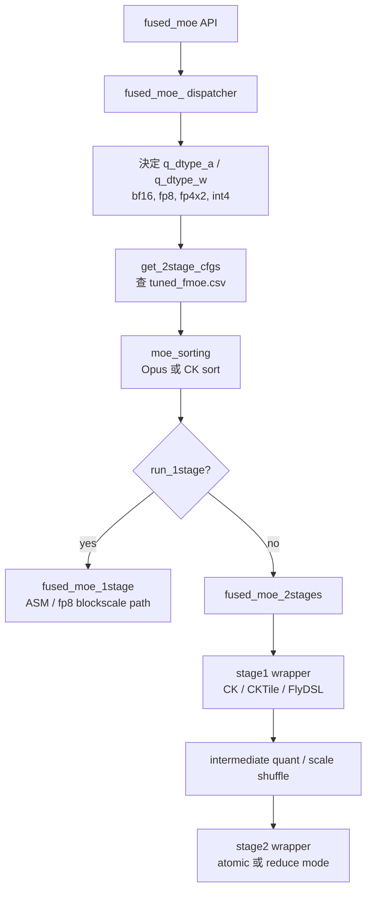
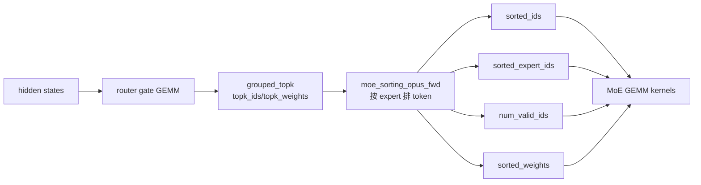

# AITER decode 深入解析：Kimi-K2.5 MXFP4 的 MoE 執行路徑

<div class="page-meta" markdown>
<span class="chip"><strong>Trace:</strong> `/dockerx/sglang-gpu-perf/prof_sweep/*/traces`</span>
<span class="chip"><strong>Model:</strong> Kimi-K2.5-MXFP4</span>
<span class="chip"><strong>Backend:</strong> SGLang + AITER MoE</span>
<span class="chip"><strong>Target:</strong> gfx950 / MI355X / TP4</span>
</div>

本章把 `/dockerx/sglang-gpu-perf/` 裡的 profiling traces 對回 Kimi-K2.5
decode 架構與 AITER 原始碼。核心目標不是背 kernel 名稱，而是建立一條可操作的
對照鏈：

```text
Chrome/Kineto trace bucket
  -> Kimi-K2.5 decode stage
  -> SGLang 呼叫的 AITER operator
  -> AITER Python dispatcher
  -> HIP / CK / FlyDSL / HSACO kernel
  -> 可 tune 的 config 或實作檔案
```

本章使用的 profiling 摘要來自
`/dockerx/sglang-gpu-perf/docs/kimi_k25_decode_profile_breakdown.md`，trace
分類規則來自
`/dockerx/sglang-gpu-perf/scripts/profiling/analyze_decode_trace.py`。

## 1. Kimi-K2.5 decode 的一層在做什麼

在 decode 階段，每一步只有新 token 進入，但每一層仍然要走完整的 attention、
MoE 與 tensor-parallel communication。Kimi-K2.5 的 profiling taxonomy 把一層
拆成 25 個 stage，其中 stage 16 保留未使用，因此 trace 中會看到 `15 -> 17`。

```mermaid
flowchart LR
  X[hidden states<br/>M x hidden] --> N1[1. Input RMSNorm + quant]
  N1 --> QA[2. QKV-A downproj]
  QA --> QB[3. Q_b upproj]
  QB --> KA[4. K-absorb bmm]
  QB --> R[5. RoPE + 6. KV write]
  R --> MLA[7. MLA core attention<br/>+ 8. split-KV reduce]
  MLA --> VA[9. V-absorb bmm]
  VA --> OP[10. o_proj]
  OP --> AR1[11. TP all-reduce]
  AR1 --> G[12. Router gate GEMM]
  G --> TK[13. grouped top-k + MoE sort]
  TK --> Q1[14. routed input MXFP4 quant]
  Q1 --> M1[15. MoE GEMM 1<br/>gate/up + fused SwiGLU]
  M1 --> M2[17. MoE GEMM 2<br/>down projection + combine]
  TK --> SQ[19-22. shared expert path]
  M2 --> AR2[TP / residual path]
  SQ --> AR2
  AR2 --> OUT[23-25. residual / copy / metadata]
```



在 Kimi-K2.5 MXFP4 + TP4 的設定下，MoE 是 decode 的主要負載。8k context 的
stage-separated trace 顯示，concurrency 32/64 時 routed expert GEMM 約占
decode GPU-busy time 的**52%**，attention 約**14.5-16.9%**，TP all-reduce
約**11%**。這表示吞吐型 serving 的第一優先不是 Python scheduling，而是 AITER
MoE GEMM 與 communication kernel 本身。

## 2. Trace 中的主要 bucket

<div class="aiter-stage-table" markdown>

| Bucket                | 8k c4 | 8k c8 | 8k c16 | 8k c32 | 8k c64 | 主要 kernel 名稱                                      |
| --------------------- | ----: | ----: | -----: | -----: | -----: | ----------------------------------------------------- |
| MoE expert GEMM       | 26.3% | 32.9% |  42.6% |  52.6% |  52.0% | `mfma_moe1`, `mfma_moe2`                              |
| Attention             | 18.3% | 18.2% |  15.8% |  14.5% |  16.9% | `mla_a8w8`, `mla_reduce`, RoPE/KV                     |
| Dense projection GEMM | 18.6% | 16.5% |  13.3% |  10.3% |   9.7% | `hgemm_bf16_*`, `Cijk_*`                              |
| MoE route/sort/quant  | 14.5% | 13.1% |  11.5% |   7.1% |   5.6% | `grouped_topk`, `moe_sorting`, `mxfp4_quant_moe_sort` |
| TP communication      | 14.8% | 12.7% |  11.5% |  11.1% |  11.5% | `allreduce_fusion`, `cross_device_reduce`             |
| Shared expert GEMM    |  6.8% |  5.9% |   4.6% |   4.0% |   4.0% | `_gemm_afp4wfp4*`, shared MLP GEMM                    |

</div>

解讀重點：

-**MoE expert GEMM 隨 batch 上升後成為主瓶頸。**這不是因為每個 token 變慢，
而是 route 到 top-k experts 後，routed GEMM 的總工作量支配整個 decode step。 -**stage-1 約為 stage-2 的 2 倍。**stage-1 同時計算 gate/up projection，還要做
fused activation/multiply；stage-2 是 down projection，把 intermediate state
回到 hidden size 並依 routing weight 合併。 -**route/sort/quant 在低 concurrency 更重要。**小 batch 時 GEMM 沒有完全攤平
kernel launch 與排序成本，因此 `grouped_topk`、`moe_sorting`、MX scale shuffle
會變成 latency-sensitive path 的目標。 -**TP all-reduce 不會像 GEMM 一樣被 batch 攤平。**trace 裡 `allreduce_fusion`
與 `cross_device_reduce` 仍占 11-18%，所以它是 MoE GEMM 之後的固定成本。

## 3. AITER MoE 的總入口

SGLang 端把 MoE runner backend 設成 AITER 後，真正進入 AITER 的主入口是：

```text
/dockerx/sglang-gpu-perf/patch/aiter-shared-expert-topk/aiter/aiter/fused_moe.py
```

關鍵函式：

- `fused_moe(...)`：使用者 API，接收 `hidden_states`、`w1`、`w2`、
  `topk_weight`、`topk_ids`、scale 與 quant metadata。
- `fused_moe_(...)`：真正的 dispatcher。它決定 activation dtype、weight dtype、
  `q_dtype_a`、是否走 gfx1250 grouped path、是否走 1-stage 或 2-stage。
- `get_2stage_cfgs(...)`：讀取 `AITER_CONFIG_FMOE_FILE`，用模型 shape 與 dtype
  查 tuned config，決定 `kernelName1`、`kernelName2`、`block_m`、`ksplit`、
  `run_1stage` 與 `flat`。
- `fused_moe_2stages(...)`：呼叫 stage-1 GEMM、必要的 activation/quant，再呼叫
  stage-2 GEMM。



### config lookup 怎麼決定 kernel

`get_2stage_cfgs(...)` 的 lookup key 包含：

```text
gfx, cu_num, token, model_dim, inter_dim, expert, topk,
act_type, dtype, q_dtype_a, q_dtype_w, q_type, use_g1u1, doweight_stage1
```

這裡的 `token` 不是原始 batch，而是 `get_padded_M(M)` 後的 tier；decode 的小 M
會被補到 power-of-two，超大 M 則落到固定 tier。若 `AITER_ONLINE_TUNE=1` 且找不到
config，AITER 會呼叫
`csrc/ck_gemm_moe_2stages_codegen/gemm_moe_tune.py` 產生新的 tuned rows。

實務上，Kimi-K2.5 decode tuning 主要要檢查：

- `aiter/configs/tuned_fmoe.csv`
- `aiter/configs/untuned_fmoe.csv`
- `aiter/configs/model_configs/*tuned_fmoe*.csv`
- 環境變數 `AITER_CONFIG_FMOE`

## 4. Router、top-k 與 MoE sort

decode 進入 MoE 後，第一件事是從 router logits 選出每個 token 的 top-k experts，
再把 token 依 expert 分桶，讓後續 grouped GEMM 可以按 expert 連續讀取。



要看原始碼：

| 部件                 | 入口                                       | 低層實作                                                                    |
| -------------------- | ------------------------------------------ | --------------------------------------------------------------------------- |
| grouped top-k        | `aiter/ops/topk.py`、`aiter/ops/moe_op.py` | `csrc/include/moe_op.h`、`csrc/pybind/moe_topk_pybind.cu`                   |
| Opus MoE sort        | `aiter/ops/moe_sorting_opus.py`            | `csrc/include/moe_sorting_opus.h`、`csrc/pybind/moe_sorting_opus_pybind.cu` |
| CK MoE sort fallback | `aiter/fused_moe.py::_moe_sorting_impl`    | `csrc/py_itfs_ck/moe_sorting_kernels.cu`                                    |
| shared expert append | `fused_append_shared_experts` trace bucket | patch: `patch/aiter-shared-expert-topk/aiter-shared-expert-topk.patch`      |

`moe_sorting(...)` 會輸出五個主要 tensor：

- `sorted_ids`：排序後的 token id，含 padding。
- `sorted_weights`：對應 routed weight。
- `sorted_expert_ids`：每個 block 對應的 expert id。
- `num_valid_ids`：有效 token 數，讓 kernel 跳過 padding。
- `moe_buf`：stage-2 的 accumulate buffer，通常是 `[M, model_dim]`。

若 tuned config 標記 `flat=1`，AITER 會走 `_moe_prepare_unsorted_input(...)`，
讓 FLAT kernel 在 kernel 內處理 routing；這是 gfx950-only 的特殊 path。

## 5. Routed input quant：MXFP4 scale 怎麼被排到 GEMM layout

Kimi-K2.5 MXFP4 的 routed expert GEMM 不直接吃 bf16 activation。stage-1 前要把
activation quantize 成 MXFP4 / MXFP8 類型，並把 scale 排成 GEMM kernel 期望的
tile layout。這個邏輯集中在：

```text
aiter/ops/quant.py::fused_dynamic_mx_quant_moe_sort
```

它有兩條 path：

| path           | 何時使用                  | 做什麼                                                                              | 優點 / 代價                                              |
| -------------- | ------------------------- | ----------------------------------------------------------------------------------- | -------------------------------------------------------- |
| fused HIP path | 小 M，或非預設 group size | `fused_dynamic_mx_quant_moe_sort_hip` 一個 kernel 完成 quant + sort + scale swizzle | 少一次 launch，但同一 token 可能因 top-k 被重複 quantize |
| split path     | 較大 M                    | `per_1x32_mx_quant_hip` 先逐 token quant，再用 `mxfp4_moe_sort_hip` 排 scale        | 每個 input row 只讀一次，較適合大 batch                  |

判斷式在 `quant.py` 中明確寫成：

```text
stage-1 cutoff: M <= 8 * 256 / topk
stage-2 cutoff: M <= 8 * 1024 / topk * eff_topk
```

這也是為什麼「把 quant fuse 到 GEMM critical path」不一定總是變快：低 M 可以省
launch，大 M 則可能因重複讀 row 或增加 MFMA 前置工作而退化。

## 6. MoE GEMM 1：gate/up + fused SwiGLU

trace 中的**moe gemm 1**通常對應 `mfma_moe1`，在 stage taxonomy 裡是
stage 15：`Routed GEMM1 (gate+up)`。它做的是每個 routed token 對應 expert 的
第一個 MLP projection：

```text
hidden_states[M, hidden]
  -> W1[expert, 2 * inter_dim, hidden]
  -> gate[M*topk, inter_dim] and up[M*topk, inter_dim]
  -> activation(gate) * up
```

Kimi-K2.5 的 `w1` 註解在 AITER API 裡是
`[expert, inter_dim*2, dim]`，因此 `isG1U1=True` 代表 gate/up 合併在同一組
weight 裡。stage-1 的結果通常是 intermediate state，shape 約為
`[M * topk, inter_dim]`，或依 kernel mode 直接按 sorted expert layout 存放。

### stage-1 在 AITER 哪裡實作

| 層級               | 檔案 / 函式                                                          | 角色                                              |
| ------------------ | -------------------------------------------------------------------- | ------------------------------------------------- |
| Python dispatcher  | `aiter/fused_moe.py::_flydsl_stage1_wrapper`                         | 解析 tuned `kernelName1`，轉成 FlyDSL kernel 參數 |
| Python dispatcher  | `aiter/fused_moe.py::ck_moe_stage1` / `cktile_moe_stage1`            | 非 FlyDSL path 的 CK / CKTile stage-1             |
| kernel registry    | `aiter/ops/flydsl/moe_kernels.py::get_flydsl_stage1_kernels`         | 產生 `flydsl_moe1_*` kernel 名稱與 tile 參數      |
| FlyDSL kernel      | `aiter/ops/flydsl/kernels/moe_gemm_2stage.py`                        | 2-stage MoE GEMM 主 kernel 實作                   |
| mixed dtype kernel | `aiter/ops/flydsl/kernels/mixed_moe_gemm_2stage.py`                  | mixed fp4/fp8/bf16 變體                           |
| CK low-level       | `csrc/py_itfs_ck/moe_ck_2stages_kernel.cu`                           | CK stage-1/2 launch glue                          |
| ASM / HSACO        | `csrc/py_itfs_cu/asm_moe_2stage.cu`、`hsa/gfx950/fmoe_2stages/*.csv` | prebuilt assembly kernels 與 manifest             |

### 為什麼 gemm 1 通常比較貴

stage-1 的輸出維度是 `2 * inter_dim` 的 gate/up，再做 activation/multiply。即使
實作上融合了 SwiGLU，工作量仍比 stage-2 高，trace 也量到 stage-1 約為 stage-2
的 1.9-2.05 倍。對 Kimi-K2.5 decode，若要做第一個 P0 tuning，通常先看 stage-1：

- `kernelName1` 是否命中 tuned config。
- `tile_m/tile_n/tile_k` 是否覆蓋 decode M range。
- `q_dtype_a` 是 `bf16`、`fp8` 還是 `fp4x2`。
- `gate_mode` 是 `separated`、`interleave` 還是 `mock_gate_only`。
- 是否使用 `ksplit`、`k_wave`、`waves_per_eu`、`b_nt`、`xcd_swizzle`。

## 7. MoE GEMM 2：down projection + combine

trace 中的**moe gemm 2**對應 `mfma_moe2`，在 stage taxonomy 裡是 stage 17：
`Routed GEMM2 (down)`。它把 stage-1 的 intermediate state 投影回 hidden size：

```text
intermediate[M * topk, inter_dim]
  -> W2[expert, hidden, inter_dim]
  -> output contribution[M * topk, hidden]
  -> weighted combine / atomic accumulate -> moe_buf[M, hidden]
```

stage-2 的重點不是只做 GEMM，還要把 top-k experts 的輸出依 `topk_weight` 合回原本
token。AITER 依 config 可能選：

-**atomic mode**：stage-2 直接 atomic accumulate 到 `[M, model_dim]`。 -**reduce mode**：stage-2 先輸出較規整的 intermediate，再由 reduce path 合併。 -**persistent / async-copy variant**：例如 `flydsl_moe2_*_persist_async_w4_cumul3`。

### stage-2 在 AITER 哪裡實作

| 層級                 | 檔案 / 函式                                                             | 角色                                                      |
| -------------------- | ----------------------------------------------------------------------- | --------------------------------------------------------- |
| Python dispatcher    | `aiter/fused_moe.py::_flydsl_stage2_wrapper`                            | 解析 `kernelName2`，傳入 mode、scale、bias、topk metadata |
| kernel registry      | `aiter/ops/flydsl/moe_kernels.py::get_flydsl_stage2_kernels`            | 產生 atomic/reduce/persist 變體                           |
| production variant   | `aiter/ops/flydsl/moe_kernels.py::_register_production_variants_stage2` | 加入手調變體，例如 persist + async copy                   |
| FlyDSL kernel        | `aiter/ops/flydsl/kernels/moe_gemm_2stage.py`                           | stage-2 GEMM 與 accumulation                              |
| gather/reduce helper | `aiter/ops/flydsl/kernels/moe_gather_reduce.py`                         | reduce mode 的 gather/reduce 支援                         |
| CK low-level         | `csrc/py_itfs_ck/moe_ck_2stages_kernel.cu`                              | CK launch glue                                            |

stage-2 tuning 要同時看 GEMM tile 與 combine 方式。對小 M，atomic 的固定成本可能
可接受；對較大 M 或 EP 模式，reduce mode 可能更容易控制寫回衝突。

## 8. Shared expert 在 trace 裡怎麼看

Kimi-K2.5 的 MoE stack 可能同時有 routed experts 與 shared experts。trace taxonomy
把 shared path 拆成：

| stage | 名稱                      | 常見 kernel                                |
| ----: | ------------------------- | ------------------------------------------ |
|    19 | Shared expert-input quant | `dynamic_mxfp4_quant`                      |
|    20 | Shared MLP GEMMs          | `hgemm_bf16_16x64x256` 或 shared GEMM path |
|    21 | Shared split-K reduce     | `_gemm_afp4wfp4_reduce`                    |
|    22 | Shared SiLU               | `act_and_mul`, `activation`                |

本 repo 的 AITER patch 有一個重點是 `aiter-shared-expert-topk`：把 shared expert
append 併入 routing/sort 流程，目標是減少獨立 sort/append kernel 的 overhead。
你可以從這些地方追：

```text
/dockerx/sglang-gpu-perf/patch/aiter-shared-expert-topk/aiter-shared-expert-topk.patch
/dockerx/sglang-gpu-perf/patch/aiter-shared-expert-topk/aiter/op_tests/test_biased_grouped_topk_shared_append.py
/dockerx/sglang-gpu-perf/patch/aiter-shared-expert-topk/aiter/aiter/fused_moe_dp_shared_expert.py
```

profiling 上，shared expert GEMM 在 8k decode 大約 4-7%。它不是最大項，但在低延遲
場景仍值得合併 route/sort overhead，因為低 M 時 standalone kernel launch 比例更高。

## 9. 從 trace 回到原始碼的查表

| trace pattern                                 | stage | 意義                            | 優先看的檔案                                                                                   |
| --------------------------------------------- | ----: | ------------------------------- | ---------------------------------------------------------------------------------------------- |
| `fused_qk_rmsnorm`                            |     1 | input / QK RMSNorm + quant      | `aiter/ops/fused_qk_norm_rope_cache_quant.py`、`aiter/ops/rmsnorm.py`                          |
| `hgemm_bf16_32x64x128`                        |   2/3 | QKV-A / Q_b projection          | `aiter/tuned_gemm.py`、`aiter/ops/gemm_op_a16w16.py`、`aiter/ops/opus/*`                       |
| `_batched_gemm_a16wfp4_kernel_block_size_m_4` |     4 | K-absorb bmm                    | `aiter/ops/batched_gemm_op_bf16.py`、`aiter/ops/gemm_op_a4w4.py`                               |
| `fused_qk_rope_cat_and_cache`                 |   5/6 | RoPE + KV cache write           | `aiter/ops/rope.py`、`aiter/ops/cache.py`                                                      |
| `mla_a8w8`                                    |     7 | MLA core attention              | `aiter/mla.py`、`aiter/aot/asm_mla_decode_fwd.py`、`csrc/cpp_itfs/mla/*`                       |
| `mla_reduce`                                  |     8 | split-KV reduce                 | `aiter/ops/attention.py`、`csrc/pybind/mla_reduce_pybind.cu`                                   |
| `grouped_topk`                                |    13 | router top-k                    | `aiter/ops/topk.py`、`csrc/include/moe_op.h`                                                   |
| `moe_sorting`, `opus_moe_sorting`             |    13 | token 按 expert 排序            | `aiter/ops/moe_sorting_opus.py`、`csrc/include/moe_sorting_opus.h`                             |
| `mxfp4_quant_moe_sort`                        |    14 | routed input quant + scale sort | `aiter/ops/quant.py`                                                                           |
| `mfma_moe1`                                   |    15 | MoE GEMM 1 gate/up + activation | `aiter/fused_moe.py`、`aiter/ops/flydsl/kernels/moe_gemm_2stage.py`                            |
| `mfma_moe2`                                   |    17 | MoE GEMM 2 down + combine       | `aiter/fused_moe.py`、`aiter/ops/flydsl/kernels/moe_gemm_2stage.py`                            |
| `allreduce_fusion`, `cross_device_reduce`     |    11 | TP all-reduce fusion            | `aiter/ops/custom_all_reduce.py`、`aiter/dist/communication_op.py`、`aiter/ops/triton/comms/*` |

## 10. 實作與 tuning 檢查清單

1. **先確認 trace 是 decode window。**長 ISL + 高 concurrency 時，預設 profile
   window 可能被 chunked prefill 填滿；8k sweep 要優先使用 `--profile-by-stage`
   的 `*-DECODE.trace.json.gz`。
2. **用 stage taxonomy 分 bucket。**`analyze_decode_trace.py` 以 kernel name 對應
   25-stage taxonomy；CUDA graph replay 裡 parent correlation 不一定可靠。
3. **先看 `mfma_moe1` / `mfma_moe2`。**若 MoE expert GEMM 超過 40%，先確認
   `tuned_fmoe.csv` 是否命中 decode M range。
4. **檢查 `kernelName1` / `kernelName2`。**AITER log 會印出使用 1-stage 或
   2-stage、default 或 tuned config，以及對應 lookup key。
5. **低 concurrency 看 route/sort/quant。**若 `grouped_topk`、`moe_sorting`、
   `mxfp4_quant_moe_sort` 占比偏高，優先看 shared expert append、Opus sort 與
   fused/split quant cutoff。
6. **TP all-reduce 單獨量。**若 `allreduce_fusion_1stage` 與 2-stage
   `cross_device_reduce` 交界不合理，要 tune fused AR + RMSNorm crossover。

## 11. 重現分析

```bash
# 1k / 8k full sweep
./run_profile_suite.sh --platform amd --moe-runner-backend aiter \
  --isl 1024 --osl 1024 --log-root "$PWD/prof_sweep/isl1k"

./run_profile_suite.sh --platform amd --moe-runner-backend aiter \
  --isl 8192 --osl 1024 --log-root "$PWD/prof_sweep/isl8k"

# stage-separated profile for long context decode
./run_profile_suite.sh --platform amd --moe-runner-backend aiter \
  --isl 8192 --osl 1024 --profile-by-stage \
  --log-root "$PWD/prof_sweep/isl8k_bystage"

# 分析 trace，建議先看 rank 0
python3 scripts/profiling/analyze_profile_trace.py <view_dir> --ranks 0 \
  --out-dir <view_dir>/analysis

python3 scripts/profiling/analyze_decode_trace.py \
  -d <decode_trace_dir> -o decode_breakdown.xlsx
```

!!! note "本章的判讀邊界"
    這裡的比例是 Kimi-K2.5-MXFP4、gfx950、TP4、SGLang + AITER MoE、
    KV cache fp8_e4m3 與特定 concurrency sweep 下的結果。架構結論可遷移，但
    具體比例會隨模型 hidden/intermediate size、top-k、context length、batch、
    TP/EP 切法與 tuned config 而變。
