# AITER decode 一層的 kernel 流程：Kimi-K2.5 MXFP4

<div class="page-meta" markdown>
<span class="chip"><strong>Model:</strong> Kimi-K2.5-MXFP4</span>
<span class="chip"><strong>Backend:</strong> SGLang + AITER MoE</span>
<span class="chip"><strong>Target:</strong> gfx950 / MI355X ×4 / TP4</span>
<span class="chip"><strong>Trace:</strong> torch profiler + CUDA graph</span>
</div>

本章把 decode 階段「一層」的執行路徑，逐個 kernel 對回 Kimi-K2.5 的架構與 AITER
原始碼。所有 kernel 名稱與順序都是直接從實際採到的 chrome/Kineto trace 解析出來的，
不是估計、也不依賴任何既有的 Python parser。解析腳本見本章最後的「重現」一節。

本章用 **shared-expert fusion 開啟 / 關閉** 兩組 trace 對照，分成兩個子章節，
精準呈現 fusion 把哪些 kernel 折掉了。

```text
record_function("Decode") 視窗
  → 單一 DeepseekV2 decode layer（anchor 到 input RMSNorm）
  → 依序排出的 GPU kernel
  → SGLang 呼叫的 AITER operator
  → 可 tune 的 tuned_fmoe.csv 設定
```

---

## 1. 模型組態與 `moe_tp_size` 查證

decode 後面所有 shape / FLOPs 推導都用到這些維度，全部取自 runtime log 與模型
config，不是猜的。

| 參數                | 值                          | 來源 / 備註                                          |
| ------------------- | --------------------------- | ---------------------------------------------------- |
| Transformer 層數    | 61（layer 0 dense + 1–60 MoE） | `num_hidden_layers=61`、`first_k_dense_replace=1`    |
| hidden size $H$     | 7168                        | `hidden_size=7168`                                   |
| MoE intermediate（全域）| 2048                    | `moe_intermediate_size=2048`                         |
| MoE intermediate（每 partition）| $I=256$         | `intermediate_size_per_partition=256`（= 2048 / 8）  |
| routed experts      | 384                         | `n_routed_experts=384`                               |
| fused shared expert | 1                           | `n_shared_experts=1`、`num_fused_shared_experts=1`   |
| top-k               | 9（8 routed + 1 shared）    | `num_experts_per_tok=8`、runtime `top_k=9`           |
| 權重格式            | MXFP4（`per_1x32` block scale） | `w13/w2 = float4_e2m1fn_x2`，scale `uint8`           |
| 每專家 W13（gate+up）| `[512, 7168]` fp4           | `w13_up_dim=512`（= 2×256）                          |
| 每專家 W2（down）   | `[7168, 256]` fp4           | `w2_down_dim=128`（fp4x2 packed）                    |

!!! check "`moe_tp_size=8` 查證結果：為真"
    指令書要求確認 `moe_tp_size=8`。查證鏈如下：

    1. **runtime log 直接印出 `moe_tp_size=8`**：
       `FusedMoE.__init__: ... num_experts=385, num_fused_shared_experts=1, moe_ep_size=1, moe_tp_size=8`
       （來源：`/dockerx/sglang-gpu-perf/docs/kimi_k25_rocm_path.md` 第 142 行；
       同檔第 138 行 `create_weights` 印出 `intermediate_size_per_partition=256`）。
    2. **與 server_args 一致**：profiling 用 `--tensor-parallel-size 4`，server_args
       為 `tp_size=4, moe_ep_size=1, moe_dp_size=1`
       （`dkh_fusion_on/.../server.log` 第 8 行）。
    3. **與 SGLang 推導式一致**：
       `moe_tp_size = tp_size // moe_ep_size // moe_dp_size`
       （`/sgl-workspace/sglang/python/sglang/srt/model_executor/model_runner.py:1118`）。

    這裡的關鍵是 Kimi-K2.5 對 MoE 套用了 **attention DP + MoE TP** 的切法：attention
    走 TP4，但 MoE 權重沿 intermediate 維度切成 8 份（`2048 / 8 = 256`）。所以
    `moe_tp_size=8` ≠ `tp_size=4`，兩個值都正確，只是描述不同的並行軸。本章所有
    `inter_dim=256` 的 kernel shape 都是這個 `moe_tp_size=8` 切法的直接結果。

注意 **gate+up = 512 = 2 × 256**，所以 stage-1 的輸出維度天生是 stage-2 輸入維度的
2 倍——這正是後面 MoE GEMM 數學（§4）裡 stage-1 ≈ 2× stage-2 的結構原因。

---

## 2. 怎麼從 trace 框出 decode 一層

SGLang 的 decode 路徑已經用 `record_function("Decode")` 包好，所以 trace 裡有一個
名為 **`Decode`** 的 `user_annotation` 區段。我們以它為 anchor：

1. 取 GPU kernel 數最多的那個 `Decode` 視窗（最乾淨、warmup 已過）。
2. 在視窗內以「每層第一個 kernel」`fused_qk_rmsnorm`（input / QK RMSNorm）為界，
   切出相鄰兩個 anchor 之間的 kernel——那就是**完整的一個 decode layer**。

以 conc4 / ISL1024 的 trace（rank 0）為例，`Decode` 視窗裡剛好有 **61 個
`fused_qk_rmsnorm`**，對應 61 層，證明我們框的就是一層、不多不少。fusion 開啟時
一層是 **17 個 kernel**，關閉時是 **24 個 kernel**——差的 7 個正是 standalone shared
expert 那一段。

---

## 3. 子章節 A：shared-expert fusion 開啟

啟動參數（baseline，shared expert 被折成 routed path 的第 9 名）：

```bash
python3 -m sglang.launch_server --host 0.0.0.0 --port 31999 \
  --model-path /models/Kimi-K2.5-MXFP4 --tensor-parallel-size 4 \
  --mem-fraction-static 0.9 --kv-cache-dtype fp8_e4m3 --disable-radix-cache \
  --enable-aiter-allreduce-fusion --trust-remote-code \
  --moe-runner-backend aiter --numa-node 1 1 1 1
```

從 trace 解析出的單層 kernel 流程（縱向，依先後順序；節點上是 trace 中的實際
kernel 短名）：

```mermaid
flowchart TB
  A0["hidden h · M×7168 · bf16"] --> A1["1 · fused_qk_rmsnorm<br/>input/QK RMSNorm + quant"]
  A1 --> A2["2 · hgemm_bf16_16x64x64x8_SPK3<br/>QKV-A / Q_b projection"]
  A2 --> A3["3 · _batched_gemm_a16wfp4 (K=128)<br/>K-absorb bmm"]
  A3 --> A4["4 · _fused_qk_rope_cat_and_cache_mla<br/>RoPE + KV-cache write"]
  A4 --> A5["5 · mla_a8w8_qh16_qseqlen1_gqaratio16_ps<br/>MLA core attention"]
  A5 --> A6["6 · kn_mla_reduce_v1_ps<br/>split-KV reduce"]
  A6 --> A7["7 · _batched_gemm_a16wfp4 (K=256)<br/>V-absorb bmm"]
  A7 --> A8["8 · hgemm_bf16_16x64x64x8_SPK2<br/>o_proj"]
  A8 --> A9["9 · allreduce_fusion_kernel_1stage<br/>TP all-reduce ①"]
  A9 --> A10["10 · hgemm_bf16_16x64x128x7_SPK8<br/>router gate GEMM"]
  A10 --> A11["11 · grouped_topk_kernel<br/>biased grouped top-k（8 routed）"]
  A11 --> A12["12 · opus_moe_sorting_entry<br/>MoE sort（385 experts，含 shared 第 9 名）"]
  A12 --> A13["13 · fused_mx_quant_moe_sort<br/>routed+shared input MXFP4 quant"]
  A13 --> A14["14 · mfma_moe1_silu_mul_afp4_wfp4_fp4<br/>MoE GEMM1 gate/up + SwiGLU"]
  A14 --> A15["15 · mfma_moe2_afp4_wfp4_bf16_cshuffle<br/>MoE GEMM2 down + combine"]
  A15 --> A16["16 · allreduce_fusion_kernel_1stage<br/>TP all-reduce ②"]
  A16 --> A17["17 · hgemm_bf16_16x64x64x7_SPK7<br/>下一層 input proj 起點"]
  A17 --> AOUT["next layer"]
  class A0,AOUT accBlue;
  class A5,A6 accTeal;
  class A9,A16 accAmber;
  class A12 accGreen;
  class A14,A15 flagship;
```



完整 kernel 名稱與功能（fusion ON，conc4 一層，依 trace 順序；µs 為該層該 kernel
單次耗時）：

<div class="aiter-stage-table" markdown>

| #  | 完整 kernel 名稱（trace 原樣）                                                              | 功能                              |  µs |
| -: | ------------------------------------------------------------------------------------------ | --------------------------------- | --: |
|  1 | `_ZN5aiter23fused_qk_rmsnorm_kernelIDF16bLi256ELi8ELb1ELi1EEEvPT_S2_PKS1_S4_S4_S4_ffiiiiiii` | input / QK RMSNorm + quant      | 4.1 |
|  2 | `hgemm_bf16_16x64x64x8_SPK3_W1x2x1_BLDS1_TN_AS1_0`                                          | QKV-A downproj / Q_b upproj       | 4.8 |
|  3 | `_batched_gemm_a16wfp4_kernel_BLOCK_SIZE_M_16_BLOCK_SIZE_N_64_BLOCK_SIZE_K_128_..._GRID_MN_8_PRE_QUANT_1_..._CG` | K-absorb bmm | 4.5 |
|  4 | `_fused_qk_rope_cat_and_cache_mla_kernel`                                                   | RoPE + KV-cache write             | 4.2 |
|  5 | `aiter::mla_a8w8_qh16_qseqlen1_gqaratio16_ps`                                               | MLA core attention（fp8 KV）      | 9.4 |
|  6 | `_Z19kn_mla_reduce_v1_psI23MlaReduceKernelV1TraitsILi512ELi16ELi1EEfDF16bEv23MlaReduceKernelV1Params` | split-KV reduce         | 4.6 |
|  7 | `_batched_gemm_a16wfp4_kernel_BLOCK_SIZE_M_16_BLOCK_SIZE_N_64_BLOCK_SIZE_K_256_..._GRID_MN_2_PRE_QUANT_1_..._CG` | V-absorb bmm | 5.5 |
|  8 | `hgemm_bf16_16x64x64x8_SPK2_W1x2x1_BLDS1_TN_AS1_0`                                          | o_proj                            | 8.9 |
|  9 | `_ZN5aiter30allreduce_fusion_kernel_1stageIDF16bDF16bLi4EEE...`                             | TP all-reduce ①（attention 後）   | 7.8 |
| 10 | `hgemm_bf16_16x64x128x7_SPK8_W1x1x2_BLDS1_TN_AS1_0`                                         | router gate GEMM                  | 5.5 |
| 11 | `void aiter::grouped_topk_kernel<c10::BFloat16, float __vector(4), 1, true, true, false>(...)` | biased grouped top-k           | 6.8 |
| 12 | `void aiter::opus_moe_sorting_entry<aiter::MoeSortingKernel<aiter::MoeSortingProblemEx<int, float, 1, true, false, false, true, 0>>>(...)` | MoE sort（385 experts） | 11.2 |
| 13 | `_ZN5aiter30fused_mx_quant_moe_sort_kernelIDF16bN4opus5fp4_tELi256ELi32EEE...`              | routed+shared input MXFP4 quant   | 4.2 |
| 14 | `mfma_moe1_silu_mul_afp4_wfp4_fp4_t32x128x256_pm1_fp4q_sort_async_v32`                      | MoE GEMM1 gate/up + SwiGLU        | 26.0 |
| 15 | `mfma_moe2_afp4_wfp4_bf16_cshuffle_t32x256x256_vscale_fix3_pm1`                             | MoE GEMM2 down + combine          | 16.3 |
| 16 | `_ZN5aiter30allreduce_fusion_kernel_1stageIDF16bDF16bLi4EEE...`                             | TP all-reduce ②（MoE 後）         | 9.1 |
| 17 | `hgemm_bf16_16x64x64x7_SPK7_W1x2x1_BLDS1_TN_AS1_0`                                          | （下一層的 input projection）     | 8.7 |

</div>

重點：fusion 開啟時 **MoE 段只有 4 個 kernel**（sort → quant → GEMM1 → GEMM2），
shared expert 完全看不到獨立 kernel——它被 append 成第 385 個專家（top-k 第 9 名），
跟著 384 個 routed experts 一起在 `mfma_moe1/2` 裡算完。兩個最大的 kernel 是
`mfma_moe1`（26 µs）與 `mfma_moe2`（16 µs），合計就佔一層 GPU 時間的大宗。

---

## 4. 子章節 B：shared-expert fusion 關閉

啟動參數只多一個 `--disable-shared-experts-fusion`：

```bash
python3 -m sglang.launch_server --host 0.0.0.0 --port 31999 \
  --model-path /models/Kimi-K2.5-MXFP4 --tensor-parallel-size 4 \
  --mem-fraction-static 0.9 --kv-cache-dtype fp8_e4m3 --disable-radix-cache \
  --enable-aiter-allreduce-fusion --trust-remote-code \
  --disable-shared-experts-fusion \
  --moe-runner-backend aiter --numa-node 1 1 1 1
```

關閉後，attention 段（kernel 1–9）完全一樣，但 MoE 段多出一條 **standalone shared
expert 鏈**：在 routed GEMM 之前，shared expert 自己走 quant → GEMM → split-K reduce
→ SiLU → 第二段 GEMM。縱向流程圖：


完整 kernel 名稱與功能（fusion OFF，只列 MoE 段相對 fusion ON 的差異，kernel 10–22）：

<div class="aiter-stage-table" markdown>

| #  | 完整 kernel 名稱（trace 原樣）                                                              | 功能                              |  µs |
| -: | ------------------------------------------------------------------------------------------ | --------------------------------- | --: |
| 10 | `_dynamic_mxfp4_quant_kernel`                                                               | shared expert input MXFP4 quant   | 4.7 |
| 11 | `_gemm_afp4wfp4_kernel_BLOCK_SIZE_M_8_BLOCK_SIZE_N_64_BLOCK_SIZE_K_512_..._NUM_KSPLIT_2`    | shared MLP GEMM（gate/up，split-K）| 11.6 |
| 12 | `_gemm_afp4wfp4_reduce_kernel_BLOCK_SIZE_M_16_BLOCK_SIZE_N_64_ACTUAL_KSPLIT_2_..._activation_NONE` | shared split-K reduce      | 4.3 |
| 13 | `_ZN7sgl_hip10activation18act_and_mul_kernelI14__hip_bfloat16...silu...EEEvPS3_PS4_i`       | shared SwiGLU（act_and_mul）      | 4.4 |
| 14 | `_dynamic_mxfp4_quant_kernel`                                                               | shared down-input MXFP4 quant     | 4.4 |
| 15 | `_gemm_afp4wfp4_kernel_BLOCK_SIZE_M_8_BLOCK_SIZE_N_64_BLOCK_SIZE_K_512_..._NUM_KSPLIT_1`    | shared MLP GEMM（down）           | 4.2 |
| 16 | `hgemm_bf16_16x64x128x7_SPK8_W1x1x2_BLDS1_TN_AS1_0`                                         | router gate GEMM                  | 5.7 |
| 17 | `void aiter::grouped_topk_kernel<...>(...)`                                                 | routed top-k（8 experts）         | 6.8 |
| 18 | `void aiter::opus_moe_sorting_entry<...MoeSortingProblemEx<int, float, 1, true, false, false, true, 0>>>(...)` | routed MoE sort | 10.9 |
| 19 | `_ZN5aiter30fused_mx_quant_moe_sort_kernelIDF16bN4opus5fp4_tELi256ELi32EEE...`              | routed input MXFP4 quant          | 4.0 |
| 20 | `mfma_moe1_silu_mul_afp4_wfp4_fp4_t32x64x256_pm1_fp4q_sort_async_v32`                       | routed GEMM1 gate/up + SwiGLU     | 28.2 |
| 21 | `mfma_moe2_afp4_wfp4_bf16_cshuffle_t32x128x256_vscale_fix3_pm1`                             | routed GEMM2 down + combine       | 13.8 |
| 22 | `void at::native::vectorized_elementwise_kernel<8, at::native::CUDAFunctor_add<c10::BFloat16>, std::array<char*, 3ul>>(...)` | routed + shared 相加 | 4.4 |

</div>

**fusion 開 / 關的數學等價**。記 routed experts 集合為 $\mathcal{R}$（$|\mathcal{R}|=8$），
routing 權重 $g_i$，shared expert 為 $E_s$。fusion 關閉時 shared 是一條獨立加法分支：

$$
o_{\text{off}}
  = \sum_{i \in \mathcal{R}} g_i\, E_i(h)
  + E_s(h),
$$

其中 $\sum_{i \in \mathcal{R}} g_i\, E_i(h)$ 是 routed grouped GEMM（kernel 16–21），
$E_s(h)$ 是 standalone stage（kernel 10–15）。fusion 開啟時，shared 被指定為固定權
重 $g_s = 1$ 的「第 9 名」，併入同一個 top-k 集合 $\mathcal{R}^{+} = \mathcal{R} \cup \{s\}$，
整層塌縮成單一 grouped GEMM：

$$
o_{\text{on}} = \sum_{j \in \mathcal{R}^{+}} g_j\, E_j(h),
\qquad g_s = 1,\;\; |\mathcal{R}^{+}| = 9.
$$

兩者數值等價（$o_{\text{on}} = o_{\text{off}}$），但 fusion 把 6 個 standalone shared
kernel（quant ×2、GEMM ×2、reduce、SiLU）與 1 個 routed+shared 相加 kernel 換成 0 個
額外 launch：shared expert 只是讓 grouped GEMM 的 expert 維度從 384 變 385、每 token
處理的 row 數從 8 變 9。

**端到端效果（本機實測，conc4..64，ISL/OSL 1024）。** fusion 開啟在所有 concurrency
都比關閉快，低 concurrency 差距最大（kernel launch 佔比最高時）：

| concurrency | fusion ON output tok/s/gpu | fusion OFF output tok/s/gpu | ON 提升 |
| ----------: | -------------------------: | --------------------------: | ------: |
|           4 |                      16.00 |                       15.03 |   +6.5% |
|           8 |                      44.77 |                       31.13 |  +43.8% |
|          16 |                      62.71 |                       59.21 |   +5.9% |
|          32 |                     214.46 |                      191.39 |  +12.1% |
|          64 |                     281.27 |                      241.91 |  +16.3% |

（來源：`dkh_fusion_on/.../summary.csv`、`dkh_fusion_off/.../summary.csv`。conc8 那組
fusion OFF 的吞吐明顯偏低，放大了差距；趨勢上 fusion 永遠不虧。）

---

## 5. MoE GEMM 的數學：為什麼 stage-1 ≈ 2× stage-2

先看 **每一個被選中的 token-expert row**（$M$ = 該專家處理的 row 數；stage-1 / stage-2
同乘同一個 row 數，比值不變）。各 GEMM 的 shape 與 FLOPs：

$$
\text{stage-1 (gate+up): } y = a\, W_{13}, \quad
a \in \mathbb{R}^{1 \times 7168}, \;
W_{13} \in \mathbb{R}^{7168 \times 512}, \;
y \in \mathbb{R}^{1 \times 512}.
$$

$$
\mathrm{FLOPs}_1 = 2 \cdot M \cdot N \cdot K = 2 \cdot 1 \cdot 512 \cdot 7168
= 7.34 \times 10^{6}\ \text{FLOP}.
$$

$$
\text{SwiGLU: } x = \mathrm{silu}(y_{:256}) \odot y_{256:}, \quad
x \in \mathbb{R}^{1 \times 256}, \quad 512 = 2 \times 256.
$$

$$
\text{stage-2 (down): } o = x\, W_{2}, \quad
x \in \mathbb{R}^{1 \times 256}, \;
W_{2} \in \mathbb{R}^{256 \times 7168}, \;
o \in \mathbb{R}^{1 \times 7168}.
$$

$$
\mathrm{FLOPs}_2 = 2 \cdot M \cdot N \cdot K = 2 \cdot 1 \cdot 7168 \cdot 256
= 3.67 \times 10^{6}\ \text{FLOP}.
$$

$$
\frac{\mathrm{FLOPs}_1}{\mathrm{FLOPs}_2} = \frac{512}{256} = 2.0.
$$

**decode 時 MoE GEMM 是 weight-bandwidth-bound，不是 compute-bound。** fp4 權重
（0.5 byte / 元素）每層要整批讀進來才能算：

$$
\text{bytes}(W_{13}) = 512 \cdot 7168 \cdot 0.5 = 1.84\ \text{MB}, \quad
\text{bytes}(W_{2}) = 7168 \cdot 256 \cdot 0.5 = 0.92\ \text{MB}.
$$

stage-1 的 arithmetic intensity（權重每層只讀一次，$m$ = 該專家的 row 數）：

$$
\mathrm{AI}_{\text{stage-1}}
= \frac{2 \cdot 7168 \cdot 512 \cdot m}{512 \cdot 7168 \cdot 0.5}
= 4m\ \ \text{FLOP/byte}.
$$

$m = 1$ 時只有 **4 FLOP/byte**，$m = 8$ 也才 32。MI355X 的 fp4 算力 / HBM 頻寬 ridge
point 是數千 FLOP/byte，所以 decode 的 MoE GEMM 落在 roofline 的記憶體頻寬斜坡上，
離 compute roof 很遠。這就是為什麼 `mfma_moe1` / `mfma_moe2` 是一層裡最貴的兩個
kernel，而且 tuning 的第一槓桿永遠是 stage-1（gate/up）。

---

## 6. 吸收式（absorption）bmm

MLA（Multi-head Latent Attention）把 KV 壓到低秩 latent，decode 時只讀壓縮後的 KV
cache。trace 裡的 `_batched_gemm_a16wfp4`（kernel 3 與 7）就是「吸收式 bmm」。

「吸收（absorption）」指的是：原本 attention 需要先把壓縮的 latent $c$ 用
up-projection $W^{UK}, W^{UV}$ 還原成完整的 per-head K/V 再做 attention；MLA 改成把
這些 up-projection **吸收進 query / output 投影**，於是 decode 時完全不需要把 KV 還原
出來，只在低秩 latent 維度上做 batched matmul。

記號：$d_c$ = KV latent 維度，$d_h$ = 每 head 維度，$n_h$ = head 數，$W^{UK} \in
\mathbb{R}^{d_c \times d_h}$ 為 per-head K up-projection，$W^Q$ 為 query 投影。
未吸收版的單 head attention logit：

$$
s = (W^Q h)^{\top} (W^{UK} c)
  = h^{\top} {W^Q}^{\top} W^{UK} c.
$$

把中間的常數矩陣先合併（離線吸收）：

$$
\widetilde{W}^{Q} \equiv {W^Q}^{\top} W^{UK} \in \mathbb{R}^{d_{\text{model}} \times d_c},
\qquad
s = \big(\widetilde{W}^{Q} h\big)^{\top}_{(d_c)} \, c.
$$

於是 decode 的 K 側只需在 $d_c$ 維度做 bmm（kernel 3），完全不展開
$d_h \times n_h$ 的完整 K。輸出側同理把 $W^{UV}$ 吸收進 o-projection（kernel 7 的
V-absorb bmm）：

$$
o = \Big(\sum_t \alpha_t\, c_t\Big)^{\top} W^{UV}\, W^{O},
\qquad
\widetilde{W}^{O} \equiv W^{UV} W^{O},
$$

其中 $\alpha_t$ 是 softmax 後的 attention 權重。吸收的好處是 FLOPs 與 KV cache 讀取量
都從 $O(n_h\, d_h)$ 降到 $O(d_c)$：

$$
\text{未吸收每步 KV 讀取} = 2\, n_h\, d_h\, L, \qquad
\text{吸收後} = d_c\, L \quad (d_c \ll n_h\, d_h),
$$

$L$ 為 context length。這就是為什麼 decode 時 MLA 的瓶頸是「讀低秩 KV 的頻寬」，而
`_batched_gemm_a16wfp4` 用 fp4 權重 + 小 batch 把吸收後的投影做成一個 batched GEMM。

---

## 7. tuned_fmoe.csv 裡的完整 stage-1 / stage-2 kernel 名稱

trace 上看到的 `mfma_moe1/2` 是執行期實際被選中的 kernel；它們是由
`get_2stage_cfgs()` 從 `tuned_fmoe.csv` 依 lookup key 查出來的。以本組態
（`model_dim=7168`、`expert=385`、`topk=9`、fp4）為例，下面列出 tuned csv 中**逐個
padded-M tier 的完整 `kernelName1` / `kernelName2`**（不用 `…` 省略），以便回推是否為
最佳解。decode 的小 M 會被 `get_padded_M` 補到 power-of-two，所以實際命中的是
`token` 欄那一列。

來源：`/dockerx/sglang-gpu-perf/kimik2_fp4_tp4_tuned_fmoe.csv`，篩 `inter_dim=256`、
`expert=385`、`topk=9`（即 `moe_tp_size=8` 的 routed+shared 9-way）。

<div class="aiter-stage-table" markdown>

| token（padded M） | kernelName1（stage-1 gate/up+SwiGLU）                     | kernelName2（stage-2 down+combine）                                                                  |
| ----------------: | -------------------------------------------------------- | --------------------------------------------------------------------------------------------------- |
|                 1 | `flydsl_moe1_afp4_wfp4_bf16_t32x128x256_w3_kb14_fp4`     | `moe_ck2stages_gemm2_64x32x32x128_1x1_MulABScaleExpertWeightShuffled_v1_Nswizzle0_Quant3_MulRoutedWeight1_FP4X2_FP4X2_B16` |
|                 2 | `flydsl_moe1_afp4_wfp4_bf16_t32x64x256_w3_kb4_bnt0_go_fp4` | `moe_ck2stages_gemm2_64x32x32x128_1x1_MulABScaleExpertWeightShuffled_v1_Nswizzle0_Quant3_MulRoutedWeight1_FP4X2_FP4X2_B16` |
|                 4 | `flydsl_moe1_afp4_wfp4_bf16_t32x128x256_w3_kb7_bnt0_fp4` | `flydsl_moe2_afp4_wfp4_bf16_t32x256x256_atomic`                                                      |
|                 8 | `flydsl_moe1_afp4_wfp4_bf16_t32x128x256_w2_fp4`          | `flydsl_moe2_afp4_wfp4_bf16_t32x128x256_atomic`                                                      |
|                16 | `flydsl_moe1_afp4_wfp4_bf16_t32x128x256_w2_fp4`          | `flydsl_moe2_afp4_wfp4_bf16_t32x256x256_atomic`                                                      |
|                32 | `flydsl_moe1_afp4_wfp4_bf16_t32x128x256_w4_fp4`          | `flydsl_moe2_afp4_wfp4_bf16_t16x256x256_atomic_bnt2_sbm32`                                           |
|                64 | `flydsl_moe1_afp4_wfp4_bf16_t32x64x256_w3_fp4`          | `flydsl_moe2_afp4_wfp4_bf16_t16x256x256_atomic_bnt2_persist_sbm32`                                   |
|               128 | `flydsl_moe1_afp4_wfp4_bf16_t32x128x256_w3_fp4`          | `flydsl_moe2_afp4_wfp4_bf16_t32x256x256_atomic_bnt2_persist`                                         |
|               256 | `flydsl_moe1_afp4_wfp4_bf16_t32x128x256_w3_fp4`          | `flydsl_moe2_afp4_wfp4_bf16_t16x256x256_atomic_bnt2_persist_sbm32`                                   |
|               512 | `flydsl_moe1_afp4_wfp4_bf16_t32x128x256_w3_fp4`          | `flydsl_moe2_afp4_wfp4_bf16_t32x128x256_atomic_bnt2_persist`                                         |
|              1024 | `flydsl_moe1_afp4_wfp4_bf16_t64x128x256_w4_fp4`          | `flydsl_moe2_afp4_wfp4_bf16_t32x128x256_atomic_persist_sbm64`                                        |

</div>

幾個可直接回推的觀察：

- **小 M（1–2）的 stage-2 走 CK**（`moe_ck2stages_gemm2_*`），M ≥ 4 才換成 FlyDSL
  `flydsl_moe2_*_atomic`。這跟 §3 / §4 trace 看到的 `mfma_moe2`（FlyDSL，conc4 對應
  padded M=8）一致。
- **stage-2 大多是 `atomic` combine**（直接 atomic accumulate 到 `[M, 7168]`）；只有
  更大的 prefill tier（M ≥ 2048）才改用 `reduce`。decode 全程在 atomic 範圍。
- runtime log（`kimi_k25_rocm_path.md` 第 267–292 行）顯示 conc 較高時 padded M=8 命中
  `flydsl_moe1_..._t64x128x256_w4_fp4` + `flydsl_moe2_..._t64x128x256_atomic`，M=1 命中
  `t32x128x256_w3_kb14_fp4` + CK stage2，與上表 token=8 / token=1 列吻合，可確認 tuned
  config 確實被命中、不是 fallback。

---

## 8. TP communication（all-reduce）

每層有 **2 次 all-reduce**（attention o_proj 後、MoE down + combine 後），在 trace 裡
就是兩個 `allreduce_fusion_kernel_1stage`。decode hidden state 訊息很小：

$$
\text{每次 all-reduce bytes} = \text{bs} \cdot 7168 \cdot 2
= \begin{cases} 448\,\text{KB} & (\text{bs}=32) \\ 896\,\text{KB} & (\text{bs}=64) \end{cases}
$$

訊息小 → latency-bound → 不隨 batch 攤平，是 MoE GEMM 之後的固定尾巴。conc 很高時
fused all-reduce 會從 1-stage 切到 2-stage reduce-scatter + load-rmsnorm
（`reduce_scatter_cross_device_store` / `local_device_load_rmsnorm`，見 §3 同 trace 的
其他 rank）。tuning 入口：`aiter/ops/custom_all_reduce.py`、`aiter/dist/communication_op.py`。

---

## 9. 從 trace 回到原始碼的查表

| trace pattern                                 | 功能                            | 優先看的檔案                                                        |
| --------------------------------------------- | ------------------------------- | ------------------------------------------------------------------- |
| `fused_qk_rmsnorm`                            | input / QK RMSNorm + quant      | `aiter/ops/fused_qk_norm_rope_cache_quant.py`、`aiter/ops/rmsnorm.py` |
| `hgemm_bf16_*`                                | QKV / o_proj / router GEMM      | `aiter/tuned_gemm.py`、`aiter/ops/gemm_op_a16w16.py`                 |
| `_batched_gemm_a16wfp4_*`                     | K-absorb / V-absorb bmm         | `aiter/ops/batched_gemm_op_bf16.py`、`aiter/ops/gemm_op_a4w4.py`     |
| `_fused_qk_rope_cat_and_cache_mla`            | RoPE + KV cache write           | `aiter/ops/rope.py`、`aiter/ops/cache.py`                           |
| `mla_a8w8_*`                                  | MLA core attention              | `aiter/mla.py`、`aiter/aot/asm_mla_decode_fwd.py`、`csrc/cpp_itfs/mla/*` |
| `kn_mla_reduce_v1_ps`                         | split-KV reduce                 | `aiter/ops/attention.py`                                            |
| `allreduce_fusion_kernel_1stage`              | TP all-reduce fusion            | `aiter/ops/custom_all_reduce.py`、`aiter/dist/communication_op.py`   |
| `grouped_topk_kernel`                         | biased grouped top-k            | `aiter/ops/topk.py`、`aiter/ops/moe_op.py`                          |
| `opus_moe_sorting_entry`                      | MoE sort（token→expert 分桶）   | `aiter/ops/moe_sorting_opus.py`                                     |
| `fused_mx_quant_moe_sort` / `mxfp4_moe_sort`  | routed input MXFP4 quant + sort | `aiter/ops/quant.py`、`aiter/utility/fp4_utils.py`                  |
| `mfma_moe1` / `flydsl_moe1`                   | MoE GEMM1 gate/up + SwiGLU      | `aiter/fused_moe.py`、`aiter/ops/flydsl/kernels/moe_gemm_2stage.py`  |
| `mfma_moe2` / `flydsl_moe2` / `moe_ck2stages_gemm2` | MoE GEMM2 down + combine  | `aiter/fused_moe.py`、`csrc/ck_gemm_moe_2stages_codegen/*`           |
| `_dynamic_mxfp4_quant` / `_gemm_afp4wfp4*`    | standalone shared expert（fusion 關閉時） | `aiter/ops/quant.py`、`aiter/ops/gemm_op_a4w4.py`         |
| `add_rmsnorm_quant`                           | residual add + norm + quant     | `aiter/ops/rmsnorm.py`                                              |

---

## 10. 重現

兩個 trace 用 `/dockerx/sglang-gpu-perf/run_multistream_profile_comparison.sh` 跑出來，
A/B 列表設成 baseline（fusion 開）與 `--disable-shared-experts-fusion`（fusion 關）：

```bash
cd /dockerx/sglang-gpu-perf
# 在 run_multistream_profile_comparison.sh 的 RUN_LIST 內保留：
#   "1k shared experts fusion|"                 -> dkh_fusion_on
#   "1k nofuse|--disable-shared-experts-fusion" -> dkh_fusion_off
./run_multistream_profile_comparison.sh --platform amd --moe-runner-backend aiter
```

輸出（torch profiler trace，CUDA graph）：

```text
dkh_fusion_on/amd_isl1024_osl1024_cuda_graph_profile_logs/traces/conc_4_isl_1024_osl_1024/*/<ts>-TP-0.trace.json.gz
dkh_fusion_off/amd_isl1024_osl1024_cuda_graph_profile_logs/traces/conc_4_isl_1024_osl_1024/*/<ts>-TP-0.trace.json.gz
```

解析 decode 一層的 kernel 流程（自寫 parser，不依賴任何既有 python parser；它只讀
chrome trace、以 `record_function("Decode")` 與 `fused_qk_rmsnorm` 為 anchor）：

```bash
python3 dkh_decode_analysis/parse_decode_layer.py --full \
  dkh_fusion_on/.../conc_4_isl_1024_osl_1024/*/<ts>-TP-0.trace.json.gz
python3 dkh_decode_analysis/parse_decode_layer.py --full \
  dkh_fusion_off/.../conc_4_isl_1024_osl_1024/*/<ts>-TP-0.trace.json.gz
```

!!! note "判讀邊界"
    這裡的 kernel 名稱與順序是 Kimi-K2.5-MXFP4、gfx950、TP4（attention）/ moe_tp_size=8
    （MoE）、KV cache fp8_e4m3、conc4 / ISL1024 下的結果。架構結論可遷移，但具體 kernel
    tile 與比例會隨模型 hidden / intermediate size、top-k、context length、batch 與 tuned
    config 而變。想把這條 decode 路徑放回更一般的脈絡，回頭看
    [MoE decode 剖析](../moe/decode-anatomy.md) 與 [Profiling 與方法論](../performance/profiling.md)。
