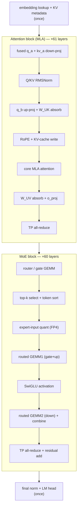

# Kimi-K2.5 MXFP4：AITER decode 一層的 kernel 流程 { .nowrap-title }

<div class="page-meta" markdown>
<span class="chip"><strong>Model:</strong> Kimi-K2.5-MXFP4</span>
<span class="chip"><strong>Backend:</strong> SGLang + AITER MoE</span>
<span class="chip"><strong>Target:</strong> gfx950 / MI355X ×4 / TP4</span>
<span class="chip"><strong>Trace:</strong> PyTorch profiler + CUDA Graph</span>
</div>

這一頁把 decode 階段的單層執行路徑拆開，逐一把 profiler 裡的 GPU kernel 對回 Kimi-K2.5 的模型結構與 AITER operator。kernel 名稱與順序都直接來自實測的 Chrome/Kineto trace；最後的「重現」一節列出解析方式。

核心對照是 **shared-expert fusion 開啟 / 關閉** 兩組 trace。兩者的 attention 路徑相同， 差異集中在 MoE：fusion 開啟時，shared expert 被併進 routed grouped GEMM；fusion 關閉時， 它是一條獨立的 shared MLP pipeline。

```text
record_function("Decode") window
  → one DeepSeek-V2 decode layer, anchored by input RMSNorm
  → ordered GPU kernels
  → SGLang AITER operators
  → tuned_fmoe.csv entries that select MoE kernels
```

---

## 1. 模型組態與 `moe_tp_size`

後面的 shape、FLOPs 與 bandwidth 推導都依賴這些維度。數值來自 runtime log 與模型 config，而不是從 trace 反推。

| 參數                             | 值                              | 來源 / 備註                                         |
| -------------------------------- | ------------------------------- | --------------------------------------------------- |
| Transformer 層數                 | 61（layer 0 dense + 1–60 MoE）  | `num_hidden_layers=61`、`first_k_dense_replace=1`   |
| hidden size $H$                  | 7168                            | `hidden_size=7168`                                  |
| MoE intermediate（全域）         | 2048                            | `moe_intermediate_size=2048`                        |
| MoE intermediate（每 partition） | $I=256$                         | `intermediate_size_per_partition=256`（= 2048 / 8） |
| routed experts                   | 384                             | `n_routed_experts=384`                              |
| fused shared expert              | 1                               | `n_shared_experts=1`、`num_fused_shared_experts=1`  |
| top-k                            | 9（8 routed + 1 shared）        | `num_experts_per_tok=8`、runtime `top_k=9`          |
| 權重格式                         | MXFP4（`per_1x32` block scale） | `w13/w2 = float4_e2m1fn_x2`，scale `uint8`          |
| 每專家 W13（gate+up）            | `[512, 7168]` FP4               | `w13_up_dim=512`（= 2×256）                         |
| 每專家 W2（down）                | `[7168, 256]` FP4               | `w2_down_dim=128`（fp4x2 packed）                   |

!!! note "`moe_tp_size=8`"

    1. **runtime log 直接印出 `moe_tp_size=8`**： `FusedMoE.__init__: ... num_experts=385, num_fused_shared_experts=1, moe_ep_size=1, moe_tp_size=8`
    2. **與 server_args 一致**：profiling 用 `--tensor-parallel-size 4`，server_args 為 `tp_size=4, moe_ep_size=1, moe_dp_size=1` （`shared_expert_fusion_on/.../server.log` 第 8 行）。
    3. **與 SGLang 推導式一致**： `moe_tp_size = tp_size // moe_ep_size // moe_dp_size` （`/sgl-workspace/sglang/python/sglang/srt/model_executor/model_runner.py:1118`）。

    關鍵是 Kimi-K2.5 對 MoE 採用 **attention DP + MoE TP** 的切法：attention 走 TP4， MoE 權重則沿 intermediate 維度切成 8 份（`2048 / 8 = 256`）。因此 `moe_tp_size=8` 與 `tp_size=4` 並不矛盾；它們描述的是不同並行軸。本頁所有 `inter_dim=256` 的 kernel shape 都直接來自這個 MoE TP 切分。

注意 **gate+up = 512 = 2 × 256**。stage-1 的輸出寬度是 stage-2 輸入寬度的兩倍， 這也是後面 MoE GEMM 推導中 stage-1 約為 stage-2 兩倍成本的結構原因。

---

## 2. Decode 算子數學對照

先把整個 decode step 的數學路徑對齊。下圖是高階 pipeline；實際 trace 會把多個數學 operation 融成同一個 kernel，或把一個 operation 拆成數個 kernel。



符號約定：$t$ 是目前 decode token，$u$ 是可被 attend 的歷史 token，$\ell$ 是 layer， $h_{\ell,t} \in \mathbb{R}^{H}$，$H=7168$。MLA 的 KV latent 記為 $c_{\ell,u} \in \mathbb{R}^{d_c}$，RoPE key 分量記為 $k^R_{\ell,u}$。MoE 的每個 expert partition intermediate size 是 $I=256$，所以 gate/up 輸出寬度是 $2I=512$。

### 2.1 序章：embedding lookup + KV metadata

decode 的新 token 先做 embedding lookup；位置、sequence 與 cache slot 則進入後續 paged-KV metadata。

$$
h_{0,t} = E[x_t], \qquad
\mu_t = \big(\operatorname{seq}(t),\operatorname{pos}(t),\operatorname{slot}(t)\big).
$$

這裡的 $\mu_t$ 不改變 hidden vector 的值，但決定 RoPE 的位置 $p_t=\operatorname{pos}(t)$ 以及 KV-cache 寫入/讀取的 slot。

### 2.2 Attention block（MLA，×61）

**fused $q_a$ + $kv_a$ down-proj**。AITER trace 裡的第一段 dense GEMM 會把 hidden 投到 query low-rank 與 KV latent。

$$
q_{a,\ell,t} = h_{\ell,t} W^{DQ}_{\ell}, \qquad
\big[c_{\ell,t}, k^R_{\ell,t}\big] = h_{\ell,t} W^{DKV}_{\ell}.
$$

**Q/KV RMSNorm**。低秩 query 與 KV latent 各自做 RMSNorm：

$$
\operatorname{RMSNorm}_{\gamma}(x)
= \gamma \odot \frac{x}{\sqrt{\frac{1}{d}\sum_{i=1}^{d} x_i^2 + \epsilon}},
\qquad
\hat q_{a,\ell,t}=\operatorname{RMSNorm}_{\gamma_q}(q_{a,\ell,t}),
\quad
\hat c_{\ell,t}=\operatorname{RMSNorm}_{\gamma_{kv}}(c_{\ell,t}).
$$

**$q_b$ up-proj + $W^{UK}$ absorb**。$q_b$ up-projection 產生每個 head 的 non-RoPE query 與 RoPE query；non-RoPE query 會先吸收 K up-projection，讓 attention logit 直接在 KV latent 維度上計算。

$$
\big(q^N_{\ell,t,r}, q^R_{\ell,t,r}\big)
= \operatorname{split}\!\left(\hat q_{a,\ell,t} W^{UQ}_{\ell,r}\right),
\qquad
\tilde q^C_{\ell,t,r} = q^N_{\ell,t,r} {W^{UK}_{\ell,r}}^{\top}.
$$

其中 $r$ 是 attention head，$\tilde q^C_{\ell,t,r} \in \mathbb{R}^{d_c}$。這一步把 原本的 $(q^N)^\top(W^{UK}c)$ 改寫成 $(\tilde q^C)^\top c$。

**RoPE + KV-cache write**。RoPE 是一個依位置旋轉的 block-diagonal 變換。對每個 2 維 pair：

$$
\operatorname{RoPE}_{p}(a_{2i},a_{2i+1})
=
\begin{bmatrix}
\cos \theta_{p,i} & -\sin \theta_{p,i} \\
\sin \theta_{p,i} & \cos \theta_{p,i}
\end{bmatrix}
\begin{bmatrix}
a_{2i} \\
a_{2i+1}
\end{bmatrix}.
$$

因此目前 token 的 RoPE query / key 與 KV-cache 寫入為：

$$
\bar q^R_{\ell,t,r}=\operatorname{RoPE}_{p_t}(q^R_{\ell,t,r}), \qquad
\bar k^R_{\ell,t}=\operatorname{RoPE}_{p_t}(k^R_{\ell,t}), \qquad
\operatorname{KVCache}_{\ell}[\operatorname{slot}(t)]
\leftarrow \big(\hat c_{\ell,t},\bar k^R_{\ell,t}\big).
$$

**core MLA attention**。decode token 對所有可見歷史 token 做 causal attention；logit 由 latent-KV dot product 與 RoPE dot product 相加：

$$
s_{\ell,t,u,r}
= \frac{
(\tilde q^C_{\ell,t,r})^{\top}\hat c_{\ell,u}
+(\bar q^R_{\ell,t,r})^{\top}\bar k^R_{\ell,u}
}{\sqrt{d_q}},
\qquad
\alpha_{\ell,t,u,r}
= \operatorname{softmax}_{u \le t}(s_{\ell,t,u,r}).
$$

MLA core attention 的低秩輸出是：

$$
z_{\ell,t,r}
= \sum_{u \le t} \alpha_{\ell,t,u,r}\,\hat c_{\ell,u}.
$$

**$W^{UV}$ absorb + $o\_proj$**。value up-projection 與 output projection 可吸收成 一個 per-head 輸出矩陣：

$$
\tilde W^O_{\ell,r}=W^{UV}_{\ell,r} W^O_{\ell,r}, \qquad
a_{\ell,t}^{(r)}
= z_{\ell,t,r}\tilde W^O_{\ell,r}.
$$

把所有 heads 與 TP rank 的 partial output 加總後，得到 attention 分支輸出：

$$
a_{\ell,t}
= \operatorname{AllReduce}_{\text{TP}}\!\left(\sum_r a_{\ell,t}^{(r)}\right),
\qquad
u_{\ell,t}=h_{\ell,t}+a_{\ell,t}.
$$

### 2.3 MoE block（×60）

MoE block 只出現在 layer 1–60；layer 0 是 dense MLP。下面的公式描述 Kimi-K2.5 的 384 routed experts 加 1 個 shared expert 的路徑。

**router / gate GEMM**。router logits 由 hidden state 做一次 GEMM 得到；Kimi 系列使用 sigmoid-style independent expert scores，再加上 load-balancing correction bias 做 top-k。

$$
\rho_{\ell,t}=u_{\ell,t} W^{G}_{\ell}, \qquad
s_{\ell,t,e}=\sigma(\rho_{\ell,t,e}), \qquad
\tilde s_{\ell,t,e}=s_{\ell,t,e}+b_{\ell,e}.
$$

**top-k select + token sort**。先選出 routed experts，再對選中分數重新歸一化。token sort 只是改變執行順序，方便 grouped GEMM 以 expert 為單位連續處理 row。

$$
\mathcal{R}_{\ell,t}
= \operatorname{TopK}_{e}\big(\tilde s_{\ell,t,e}, k=8\big), \qquad
g_{\ell,t,e}
= \frac{s_{\ell,t,e}}{\sum_{j\in\mathcal{R}_{\ell,t}} s_{\ell,t,j}}
\quad (e\in\mathcal{R}_{\ell,t}).
$$

令每個 assignment row 為 $(t,e,g_{\ell,t,e})$。sort kernel 建立一個 permutation：

$$
\pi_{\ell}=\operatorname{argsort}_{(t,e)}(e), \qquad
\operatorname{rows}_{\ell,e}
=\{(t,e,g_{\ell,t,e}) : e\in\mathcal{R}_{\ell,t}\}.
$$

**expert-input quant（FP4）**。AITER 對 expert activation 做 per-1x32 block 的 MXFP4 動態量化。對 block $B_b$：

$$
\Delta_{\ell,t,b}
= \frac{\max_{i\in B_b}|u_{\ell,t,i}|}{x_{\max}^{\mathrm{FP4}}}, \qquad
\hat u^{\mathrm{FP4}}_{\ell,t,i}
= Q_{\mathrm{FP4}}\!\left(\frac{u_{\ell,t,i}}{\Delta_{\ell,t,b}}\right),
\quad i\in B_b.
$$

**routed GEMM1（gate+up）**。每個被選中的 expert 用自己的 $W_{13}^{(e)}$ 做 gate/up 合併 GEMM：

$$
y_{\ell,t,e}
= \hat u^{\mathrm{FP4}}_{\ell,t} W^{(e)}_{13,\ell}, \qquad
y_{\ell,t,e}
= \big[y^g_{\ell,t,e}, y^u_{\ell,t,e}\big],
\quad
y^g,y^u \in \mathbb{R}^{I}.
$$

**SwiGLU activation**。

$$
m_{\ell,t,e}
= \operatorname{SwiGLU}(y_{\ell,t,e})
= \operatorname{SiLU}(y^g_{\ell,t,e})\odot y^u_{\ell,t,e},
\qquad
\operatorname{SiLU}(x)=x\,\sigma(x).
$$

**routed GEMM2（down）+ combine**。down projection 回到 hidden size，並用 router weight 做 combine：

$$
d_{\ell,t,e}=m_{\ell,t,e} W^{(e)}_{2,\ell}, \qquad
o^{\mathrm{routed}}_{\ell,t}
= \sum_{e\in\mathcal{R}_{\ell,t}} g_{\ell,t,e}\,d_{\ell,t,e}.
$$

若 shared-expert fusion 開啟，shared expert $s$ 被附加成固定權重 $g_{\ell,t,s}=1$ 的 第 9 個 assignment：

$$
\mathcal{R}^{+}_{\ell,t}=\mathcal{R}_{\ell,t}\cup\{s\}, \qquad
o^{\mathrm{MoE}}_{\ell,t}
= \sum_{e\in\mathcal{R}^{+}_{\ell,t}} g_{\ell,t,e}\,E_{\ell,e}(u_{\ell,t}),
\quad g_{\ell,t,s}=1.
$$

fusion 關閉時，shared expert 是獨立分支：

$$
o^{\mathrm{MoE}}_{\ell,t}
= o^{\mathrm{routed}}_{\ell,t}+E_{\ell,s}(u_{\ell,t}).
$$

**TP all-reduce + residual add**。MoE output 先跨 TP rank 加總，再回加 residual：

$$
\bar o^{\mathrm{MoE}}_{\ell,t}
= \operatorname{AllReduce}_{\text{TP}}\!\left(o^{\mathrm{MoE}}_{\ell,t}\right),
\qquad
h_{\ell+1,t}=u_{\ell,t}+\bar o^{\mathrm{MoE}}_{\ell,t}.
$$

### 2.4 尾聲：final norm + LM head

最後一層 hidden state 做 final RMSNorm，再投到 vocabulary logits：

$$
\hat h_{L,t}=\operatorname{RMSNorm}_{\gamma_f}(h_{L,t}), \qquad
\ell_t=\hat h_{L,t} W_{\mathrm{LM}}^{\top}, \qquad
P(x_{t+1}=v\mid x_{\le t})
= \operatorname{softmax}(\ell_t)_v.
$$

---

## 3. 怎麼從 trace 框出 decode 一層

SGLang 已經用 `record_function("Decode")` 包住 decode 路徑，因此 trace 內會出現一段 名為 **`Decode`** 的 `user_annotation`。解析時以這段 annotation 作為外框：

1. 選出 GPU kernel 數最多的 `Decode` 視窗，通常這也是 warmup 後最乾淨的一段。
2. 在視窗內以「每層第一個 kernel」`fused_qk_rmsnorm`（input / QK RMSNorm）為界， 取相鄰兩個 anchor 之間的 kernel，得到**完整的一個 decode layer**。

以 conc4 / ISL1024 的 trace（rank 0）為例，`Decode` 視窗裡剛好有 **61 個 `fused_qk_rmsnorm`**，正好對應 61 層。fusion 開啟時，一層包含 **17 個 kernel**； fusion 關閉時，一層變成 **24 個 kernel**。多出的 7 個 kernel 來自 standalone shared expert pipeline。

---

## 4. Shared-expert fusion 開啟

baseline 啟動參數如下；此時 shared expert 被放進 routed path，成為固定的第 9 個 assignment：

```bash
python3 -m sglang.launch_server --host 0.0.0.0 --port 31999 \
  --model-path /models/Kimi-K2.5-MXFP4 --tensor-parallel-size 4 \
  --mem-fraction-static 0.9 --kv-cache-dtype fp8_e4m3 --disable-radix-cache \
  --enable-aiter-allreduce-fusion --trust-remote-code \
  --moe-runner-backend aiter --numa-node 1 1 1 1
```

以下是從 trace 切出的單層 kernel 順序。節點名稱保留 profiler 中可辨識的短名：


下表保留 profiler 中的完整 kernel 名稱。數字是 fusion ON、conc4 單層中各 kernel 的單次耗時：

<div class="aiter-stage-table" markdown>

|   # | 完整 kernel 名稱（trace 原樣）                                                                                                             | 功能                            |   µs |
| --: | ------------------------------------------------------------------------------------------------------------------------------------------ | ------------------------------- | ---: |
|   1 | `_ZN5aiter23fused_qk_rmsnorm_kernelIDF16bLi256ELi8ELb1ELi1EEEvPT_S2_PKS1_S4_S4_S4_ffiiiiiii`                                               | input / QK RMSNorm + quant      |  4.1 |
|   2 | `hgemm_bf16_16x64x64x8_SPK3_W1x2x1_BLDS1_TN_AS1_0`                                                                                         | QKV-A downproj / Q_b upproj     |  4.8 |
|   3 | `_batched_gemm_a16wfp4_kernel_BLOCK_SIZE_M_16_BLOCK_SIZE_N_64_BLOCK_SIZE_K_128_..._GRID_MN_8_PRE_QUANT_1_..._CG`                           | K-absorb BMM                    |  4.5 |
|   4 | `_fused_qk_rope_cat_and_cache_mla_kernel`                                                                                                  | RoPE + KV-cache write           |  4.2 |
|   5 | `aiter::mla_a8w8_qh16_qseqlen1_gqaratio16_ps`                                                                                              | MLA core attention（FP8 KV）    |  9.4 |
|   6 | `_Z19kn_mla_reduce_v1_psI23MlaReduceKernelV1TraitsILi512ELi16ELi1EEfDF16bEv23MlaReduceKernelV1Params`                                      | split-KV reduce                 |  4.6 |
|   7 | `_batched_gemm_a16wfp4_kernel_BLOCK_SIZE_M_16_BLOCK_SIZE_N_64_BLOCK_SIZE_K_256_..._GRID_MN_2_PRE_QUANT_1_..._CG`                           | V-absorb BMM                    |  5.5 |
|   8 | `hgemm_bf16_16x64x64x8_SPK2_W1x2x1_BLDS1_TN_AS1_0`                                                                                         | o_proj                          |  8.9 |
|   9 | `_ZN5aiter30allreduce_fusion_kernel_1stageIDF16bDF16bLi4EEE...`                                                                            | TP all-reduce ①（attention 後） |  7.8 |
|  10 | `hgemm_bf16_16x64x128x7_SPK8_W1x1x2_BLDS1_TN_AS1_0`                                                                                        | router gate GEMM                |  5.5 |
|  11 | `void aiter::grouped_topk_kernel<c10::BFloat16, float __vector(4), 1, true, true, false>(...)`                                             | biased grouped top-k            |  6.8 |
|  12 | `void aiter::opus_moe_sorting_entry<aiter::MoeSortingKernel<aiter::MoeSortingProblemEx<int, float, 1, true, false, false, true, 0>>>(...)` | MoE sort（385 experts）         | 11.2 |
|  13 | `_ZN5aiter30fused_mx_quant_moe_sort_kernelIDF16bN4opus5fp4_tELi256ELi32EEE...`                                                             | routed+shared input MXFP4 quant |  4.2 |
|  14 | `mfma_moe1_silu_mul_afp4_wfp4_fp4_t32x128x256_pm1_fp4q_sort_async_v32`                                                                     | MoE GEMM1 gate/up + SwiGLU      | 26.0 |
|  15 | `mfma_moe2_afp4_wfp4_bf16_cshuffle_t32x256x256_vscale_fix3_pm1`                                                                            | MoE GEMM2 down + combine        | 16.3 |
|  16 | `_ZN5aiter30allreduce_fusion_kernel_1stageIDF16bDF16bLi4EEE...`                                                                            | TP all-reduce ②（MoE 後）       |  9.1 |
|  17 | `hgemm_bf16_16x64x64x7_SPK7_W1x2x1_BLDS1_TN_AS1_0`                                                                                         | （下一層的 input projection）   |  8.7 |

</div>

關鍵觀察：fusion 開啟後，**MoE 段只剩 4 個 kernel**（sort → quant → GEMM1 → GEMM2）。 shared expert 不再以獨立 kernel 出現；它被 append 成第 385 個 expert，也就是 top-k 的 第 9 個 assignment，並與 384 個 routed experts 一起在 `mfma_moe1/2` 中完成。單層中最重的 兩個 kernel 是 `mfma_moe1`（26 µs）與 `mfma_moe2`（16 µs）。

---

## 5. Shared-expert fusion 關閉

關閉 fusion 只需要多加一個 `--disable-shared-experts-fusion`：

```bash
python3 -m sglang.launch_server --host 0.0.0.0 --port 31999 \
  --model-path /models/Kimi-K2.5-MXFP4 --tensor-parallel-size 4 \
  --mem-fraction-static 0.9 --kv-cache-dtype fp8_e4m3 --disable-radix-cache \
  --enable-aiter-allreduce-fusion --trust-remote-code \
  --disable-shared-experts-fusion \
  --moe-runner-backend aiter --numa-node 1 1 1 1
```

關閉後，attention 段（kernel 1–9）不變；MoE 段會多出一條 **standalone shared expert** 鏈。在 routed GEMM 開始之前，shared expert 先自行執行 quant → GEMM → split-K reduce → SiLU → 第二段 GEMM：

```mermaid
flowchart TB
  B0["hidden h · M×7168 · BF16（attention 後）"] --> B9["9 · allreduce_fusion_kernel_1stage<br/>TP all-reduce ①"]
  B9 --> B10["10 · _dynamic_mxfp4_quant<br/>shared expert input quant"]
  B10 --> B11["11 · _gemm_afp4wfp4 (KSPLIT_2)<br/>shared MLP GEMM（gate/up）"]
  B11 --> B12["12 · _gemm_afp4wfp4_reduce<br/>shared split-K reduce"]
  B12 --> B13["13 · act_and_mul (SiLU)<br/>shared SwiGLU"]
  B13 --> B14["14 · _dynamic_mxfp4_quant<br/>shared down-input quant"]
  B14 --> B15["15 · _gemm_afp4wfp4 (KSPLIT_1)<br/>shared MLP GEMM（down）"]
  B15 --> B16["16 · hgemm_bf16_16x64x128x7_SPK8<br/>router gate GEMM"]
  B16 --> B17["17 · grouped_topk_kernel<br/>routed top-k（8 experts）"]
  B17 --> B18["18 · opus_moe_sorting_entry<br/>routed MoE sort"]
  B18 --> B19["19 · fused_mx_quant_moe_sort<br/>routed input MXFP4 quant"]
  B19 --> B20["20 · mfma_moe1_silu_mul_afp4_wfp4_fp4<br/>routed GEMM1 gate/up + SwiGLU"]
  B20 --> B21["21 · mfma_moe2_afp4_wfp4_bf16_cshuffle<br/>routed GEMM2 down + combine"]
  B21 --> B22["22 · vectorized_elementwise (add)<br/>routed + shared 相加"]
  B22 --> B23["23 · allreduce_fusion_kernel_1stage<br/>TP all-reduce ②"]
  B23 --> B24["24 · hgemm_bf16_16x64x64x7_SPK7<br/>下一層 input proj 起點"]
  B24 --> BOUT["next layer"]
  class B0,BOUT accBlue;
  class B9,B23 accAmber;
  class B10,B11,B12,B13,B14,B15 accGreen;
  class B20,B21 flagship;
```



下表只列 fusion OFF 相對 fusion ON 多出或改變的 MoE 段，也就是 kernel 10–22：

<div class="aiter-stage-table" markdown>

|   # | 完整 kernel 名稱（trace 原樣）                                                                                               | 功能                                |   µs |
| --: | ---------------------------------------------------------------------------------------------------------------------------- | ----------------------------------- | ---: |
|  10 | `_dynamic_mxfp4_quant_kernel`                                                                                                | shared expert input MXFP4 quant     |  4.7 |
|  11 | `_gemm_afp4wfp4_kernel_BLOCK_SIZE_M_8_BLOCK_SIZE_N_64_BLOCK_SIZE_K_512_..._NUM_KSPLIT_2`                                     | shared MLP GEMM（gate/up，split-K） | 11.6 |
|  12 | `_gemm_afp4wfp4_reduce_kernel_BLOCK_SIZE_M_16_BLOCK_SIZE_N_64_ACTUAL_KSPLIT_2_..._activation_NONE`                           | shared split-K reduce               |  4.3 |
|  13 | `_ZN7sgl_hip10activation18act_and_mul_kernelI14__hip_bfloat16...silu...EEEvPS3_PS4_i`                                        | shared SwiGLU（act_and_mul）        |  4.4 |
|  14 | `_dynamic_mxfp4_quant_kernel`                                                                                                | shared down-input MXFP4 quant       |  4.4 |
|  15 | `_gemm_afp4wfp4_kernel_BLOCK_SIZE_M_8_BLOCK_SIZE_N_64_BLOCK_SIZE_K_512_..._NUM_KSPLIT_1`                                     | shared MLP GEMM（down）             |  4.2 |
|  16 | `hgemm_bf16_16x64x128x7_SPK8_W1x1x2_BLDS1_TN_AS1_0`                                                                          | router gate GEMM                    |  5.7 |
|  17 | `void aiter::grouped_topk_kernel<...>(...)`                                                                                  | routed top-k（8 experts）           |  6.8 |
|  18 | `void aiter::opus_moe_sorting_entry<...MoeSortingProblemEx<int, float, 1, true, false, false, true, 0>>>(...)`               | routed MoE sort                     | 10.9 |
|  19 | `_ZN5aiter30fused_mx_quant_moe_sort_kernelIDF16bN4opus5fp4_tELi256ELi32EEE...`                                               | routed input MXFP4 quant            |  4.0 |
|  20 | `mfma_moe1_silu_mul_afp4_wfp4_fp4_t32x64x256_pm1_fp4q_sort_async_v32`                                                        | routed GEMM1 gate/up + SwiGLU       | 28.2 |
|  21 | `mfma_moe2_afp4_wfp4_bf16_cshuffle_t32x128x256_vscale_fix3_pm1`                                                              | routed GEMM2 down + combine         | 13.8 |
|  22 | `void at::native::vectorized_elementwise_kernel<8, at::native::CUDAFunctor_add<c10::BFloat16>, std::array<char*, 3ul>>(...)` | routed + shared 相加                |  4.4 |

</div>

**Fusion 開 / 關的數學等價**。令 routed experts 集合為 $\mathcal{R}$（$|\mathcal{R}|=8$），routing 權重為 $g_i$，shared expert 為 $E_s$。 fusion 關閉時，shared expert 是一條獨立加法分支：

$$
o_{\text{off}}
  = \sum_{i \in \mathcal{R}} g_i\, E_i(h)
  + E_s(h),
$$

其中 $\sum_{i \in \mathcal{R}} g_i\, E_i(h)$ 對應 routed grouped GEMM（kernel 16–21）， $E_s(h)$ 對應 standalone shared stage（kernel 10–15）。fusion 開啟時，shared expert 被設為固定權重 $g_s=1$ 的「第 9 名」，併入同一個集合 $\mathcal{R}^{+}=\mathcal{R}\cup\{s\}$：

$$
o_{\text{on}} = \sum_{j \in \mathcal{R}^{+}} g_j\, E_j(h),
\qquad g_s = 1,\;\; |\mathcal{R}^{+}| = 9.
$$

兩者數值等價（$o_{\text{on}}=o_{\text{off}}$），但 launch 結構不同。fusion 把 6 個 standalone shared kernel（quant ×2、GEMM ×2、reduce、SiLU）以及 1 個 routed+shared add kernel 移除；代價只是讓 grouped GEMM 的 expert 數從 384 變 385，並讓每個 token 的 assignment row 從 8 變 9。

**端到端效果（本機實測，conc4..64，ISL/OSL 1024）。** fusion ON 在所有 concurrency 都比 fusion OFF 快；launch overhead 佔比較高時，差距尤其明顯：

| concurrency | fusion ON output tok/s/GPU | fusion OFF output tok/s/GPU | ON 提升 |
| ----------: | -------------------------: | --------------------------: | ------: |
|           4 |                      16.00 |                       15.03 |   +6.5% |
|           8 |                      44.77 |                       31.13 |  +43.8% |
|          16 |                      62.71 |                       59.21 |   +5.9% |
|          32 |                     214.46 |                      191.39 |  +12.1% |
|          64 |                     281.27 |                      241.91 |  +16.3% |

---

## 6. MoE GEMM 的數學：為什麼 stage-1 ≈ 2× stage-2

先看 **單一被選中的 token-expert row**。如果某個 expert 實際處理 $M$ 個 row， stage-1 與 stage-2 都乘上同一個 $M$，所以兩者的比例不變。

1. Stage-1

$$
\text{stage-1 (gate+up): } y = a\, W_{13}, \quad
a \in \mathbb{R}^{1 \times 7168}, \;
W_{13} \in \mathbb{R}^{7168 \times 512}, \;
y \in \mathbb{R}^{1 \times 512}.
$$

$$
\mathrm{FLOPs}_1 = 2 \cdot M \cdot N \cdot K = 2 \cdot 1 \cdot 512 \cdot 7168
= 7.34 \times 10^{6}\ \text{FLOP}.
$$

$$
\text{SwiGLU: } x = \operatorname{SiLU}(y_{:256}) \odot y_{256:}, \quad
x \in \mathbb{R}^{1 \times 256}, \quad 512 = 2 \times 256.
$$

2. Stage-2

$$
\text{stage-2 (down): } o = x\, W_{2}, \quad
x \in \mathbb{R}^{1 \times 256}, \;
W_{2} \in \mathbb{R}^{256 \times 7168}, \;
o \in \mathbb{R}^{1 \times 7168}.
$$

$$
\mathrm{FLOPs}_2 = 2 \cdot M \cdot N \cdot K = 2 \cdot 1 \cdot 7168 \cdot 256
= 3.67 \times 10^{6}\ \text{FLOP}.
$$

$$
\frac{\mathrm{FLOPs}_1}{\mathrm{FLOPs}_2} = \frac{512}{256} = 2.0.
$$

**Decode 時 MoE GEMM 主要受權重頻寬限制，而不是受 compute peak 限制。** FP4 權重 每個元素 0.5 byte；即使只算少量 token，每個被命中的 expert 仍要 stream 權重：

$$
\text{bytes}(W_{13}) = 512 \cdot 7168 \cdot 0.5 = 1.84\ \text{MB}, \quad
\text{bytes}(W_{2}) = 7168 \cdot 256 \cdot 0.5 = 0.92\ \text{MB}.
$$

stage-1 的 arithmetic intensity 可以用每個 expert 的 row 數 $m$ 表示：

$$
\mathrm{AI}_{\text{stage-1}}
= \frac{2 \cdot 7168 \cdot 512 \cdot m}{512 \cdot 7168 \cdot 0.5}
= 4m\ \ \text{FLOP/byte}.
$$

$m=1$ 時只有 **4 FLOP/byte**，$m=8$ 也只有 32。MI355X 的 FP4 compute / HBM bandwidth ridge point 遠高於此，因此 decode MoE GEMM 落在 roofline 的 bandwidth slope 上，離 compute roof 很遠。這也是 `mfma_moe1` / `mfma_moe2` 成為單層最重 kernel、且 stage-1 （gate/up）是 tuning 首要槓桿的原因。

---

## 7. 吸收式（absorption）BMM

MLA（Multi-head Latent Attention）把 KV cache 存成低秩 latent；decode 時只讀 壓縮後的 cache。trace 中的 `_batched_gemm_a16wfp4`（kernel 3 與 7）就是這裡的 「吸收式 BMM」。

吸收（absorption）的意思是：原本 attention 會把 latent $c$ 透過 up-projection $W^{UK}, W^{UV}$ 還原成 per-head K/V 再計算；MLA 則把這些 up-projection 併進 query / output 側。結果是 decode 不需要展開完整 KV，只在 latent 維度上做 batched matmul。

令 $d_c$ 為 KV latent 維度，$d_n$ 為 non-RoPE key/query 維度，$W^{UK}\in \mathbb{R}^{d_c\times d_n}$ 為 K up-projection。未吸收的單 head logit 可寫成：

$$
s = q^{\top}(c W^{UK})
  = \big(q {W^{UK}}^{\top}\big)c^{\top}.
$$

先把 K up-projection 吸收到 query 側：

$$
\tilde q \equiv q {W^{UK}}^{\top} \in \mathbb{R}^{d_c},
\qquad
s = \tilde q\,c^{\top}.
$$

因此 K 側只需要在 $d_c$ 維度做 BMM（kernel 3），不必展開完整 K。輸出側同理把 $W^{UV}$ 吸收進 o-projection（kernel 7 的 V-absorb BMM）：

$$
o = \Big(\sum_u \alpha_u\, c_u\Big) W^{UV} W^{O},
\qquad
\widetilde{W}^{O} \equiv W^{UV} W^{O},
$$

其中 $\alpha_u$ 是 attention 權重。吸收的好處是 FLOPs 與 KV-cache 讀取量都從完整 per-head KV 的 $O(n_h d_h)$ 降到 latent cache 的 $O(d_c)$：

$$
\text{未吸收每步 KV 讀取} = 2\, n_h\, d_h\, L, \qquad
\text{吸收後} = d_c\, L \quad (d_c \ll n_h\, d_h),
$$

$L$ 是 context length。decode 時 MLA 的主要成本因此變成「讀低秩 KV cache 的頻寬」； `_batched_gemm_a16wfp4` 則用 FP4 權重與小 batch GEMM 來執行吸收後的投影。

---

## 8. tuned_fmoe.csv 裡的完整 stage-1 / stage-2 kernel 名稱

trace 中的 `mfma_moe1/2` 是執行期實際選到的 kernel；選擇邏輯由 `get_2stage_cfgs()` 依 lookup key 從 `tuned_fmoe.csv` 查出。以下針對 `model_dim=7168`、`expert=385`、`topk=9`、FP4 這組 shape，列出 tuned csv 內各個 padded-M tier 的完整 `kernelName1` / `kernelName2`。decode 的小 M 會被 `get_padded_M` 補到 power-of-two，因此實際命中的是 `token` 欄對應的 tier。

來源：`kimik2_fp4_tp4_tuned_fmoe.csv`，篩 `inter_dim=256`、 `expert=385`、`topk=9`（即 `moe_tp_size=8` 的 routed+shared 9-way）。

<div class="aiter-stage-table" markdown>

| token（padded M） | kernelName1（stage-1 gate/up+SwiGLU）                      | kernelName2（stage-2 down+combine）                                                                                        |
| ----------------: | ---------------------------------------------------------- | -------------------------------------------------------------------------------------------------------------------------- |
|                 1 | `flydsl_moe1_afp4_wfp4_bf16_t32x128x256_w3_kb14_fp4`       | `moe_ck2stages_gemm2_64x32x32x128_1x1_MulABScaleExpertWeightShuffled_v1_Nswizzle0_Quant3_MulRoutedWeight1_FP4X2_FP4X2_B16` |
|                 2 | `flydsl_moe1_afp4_wfp4_bf16_t32x64x256_w3_kb4_bnt0_go_fp4` | `moe_ck2stages_gemm2_64x32x32x128_1x1_MulABScaleExpertWeightShuffled_v1_Nswizzle0_Quant3_MulRoutedWeight1_FP4X2_FP4X2_B16` |
|                 4 | `flydsl_moe1_afp4_wfp4_bf16_t32x128x256_w3_kb7_bnt0_fp4`   | `flydsl_moe2_afp4_wfp4_bf16_t32x256x256_atomic`                                                                            |
|                 8 | `flydsl_moe1_afp4_wfp4_bf16_t32x128x256_w2_fp4`            | `flydsl_moe2_afp4_wfp4_bf16_t32x128x256_atomic`                                                                            |
|                16 | `flydsl_moe1_afp4_wfp4_bf16_t32x128x256_w2_fp4`            | `flydsl_moe2_afp4_wfp4_bf16_t32x256x256_atomic`                                                                            |
|                32 | `flydsl_moe1_afp4_wfp4_bf16_t32x128x256_w4_fp4`            | `flydsl_moe2_afp4_wfp4_bf16_t16x256x256_atomic_bnt2_sbm32`                                                                 |
|                64 | `flydsl_moe1_afp4_wfp4_bf16_t32x64x256_w3_fp4`             | `flydsl_moe2_afp4_wfp4_bf16_t16x256x256_atomic_bnt2_persist_sbm32`                                                         |
|               128 | `flydsl_moe1_afp4_wfp4_bf16_t32x128x256_w3_fp4`            | `flydsl_moe2_afp4_wfp4_bf16_t32x256x256_atomic_bnt2_persist`                                                               |
|               256 | `flydsl_moe1_afp4_wfp4_bf16_t32x128x256_w3_fp4`            | `flydsl_moe2_afp4_wfp4_bf16_t16x256x256_atomic_bnt2_persist_sbm32`                                                         |
|               512 | `flydsl_moe1_afp4_wfp4_bf16_t32x128x256_w3_fp4`            | `flydsl_moe2_afp4_wfp4_bf16_t32x128x256_atomic_bnt2_persist`                                                               |
|              1024 | `flydsl_moe1_afp4_wfp4_bf16_t64x128x256_w4_fp4`            | `flydsl_moe2_afp4_wfp4_bf16_t32x128x256_atomic_persist_sbm64`                                                              |

</div>

這張表可以直接讀出幾個行為：

- **小 M（1–2）的 stage-2 走 CK**（`moe_ck2stages_gemm2_*`），M ≥ 4 才換成 FlyDSL `flydsl_moe2_*_atomic`。這跟 §4 / §5 trace 看到的 `mfma_moe2`（FlyDSL，conc4 對應 padded M=8）一致。
- **stage-2 大多是 `atomic` combine**（直接 atomic accumulate 到 `[M, 7168]`）；只有 更大的 prefill tier（M ≥ 2048）才改用 `reduce`。decode 全程在 atomic 範圍。
- runtime log（`kimi_k25_rocm_path.md` 第 267–292 行）顯示 conc 較高時 padded M=8 命中 `flydsl_moe1_..._t64x128x256_w4_fp4` + `flydsl_moe2_..._t64x128x256_atomic`，M=1 命中 `t32x128x256_w3_kb14_fp4` + CK stage2，與上表 token=8 / token=1 列吻合，表示 runtime 確實命中 tuned config，而不是 fallback。

---

## 9. TP communication（all-reduce）

每層有 **2 次 all-reduce**：一次在 attention o_proj 後，一次在 MoE down + combine 後。 trace 中對應兩個 `allreduce_fusion_kernel_1stage`。decode 的 hidden-state 訊息很小：

$$
\text{每次 all-reduce bytes} = \text{bs} \cdot 7168 \cdot 2
= \begin{cases} 448\,\text{KB} & (\text{bs}=32) \\ 896\,\text{KB} & (\text{bs}=64) \end{cases}
$$

訊息小代表 collective 主要受 latency 限制，不容易被 batch 攤平，因此它是 MoE GEMM 後面 固定存在的尾巴。concurrency 很高時，fused all-reduce 會從 1-stage 切到 2-stage reduce-scatter + load-RMSNorm （`reduce_scatter_cross_device_store` / `local_device_load_rmsnorm`，見 §4 同 trace 的 其他 rank）。tuning 入口：`aiter/ops/custom_all_reduce.py`、`aiter/dist/communication_op.py`。

---

## 10. 從 trace 回到原始碼的查表

| trace pattern                                       | 功能                                      | 優先看的檔案                                                             |
| --------------------------------------------------- | ----------------------------------------- | ------------------------------------------------------------------------ |
| `fused_qk_rmsnorm`                                  | input / QK RMSNorm + quant                | `aiter/ops/fused_qk_norm_rope_cache_quant.py`、`aiter/ops/rmsnorm.py`    |
| `hgemm_bf16_*`                                      | QKV / o_proj / router GEMM                | `aiter/tuned_gemm.py`、`aiter/ops/gemm_op_a16w16.py`                     |
| `_batched_gemm_a16wfp4_*`                           | K-absorb / V-absorb BMM                   | `aiter/ops/batched_gemm_op_bf16.py`、`aiter/ops/gemm_op_a4w4.py`         |
| `_fused_qk_rope_cat_and_cache_mla`                  | RoPE + KV cache write                     | `aiter/ops/rope.py`、`aiter/ops/cache.py`                                |
| `mla_a8w8_*`                                        | MLA core attention                        | `aiter/mla.py`、`aiter/aot/asm_mla_decode_fwd.py`、`csrc/cpp_itfs/mla/*` |
| `kn_mla_reduce_v1_ps`                               | split-KV reduce                           | `aiter/ops/attention.py`                                                 |
| `allreduce_fusion_kernel_1stage`                    | TP all-reduce fusion                      | `aiter/ops/custom_all_reduce.py`、`aiter/dist/communication_op.py`       |
| `grouped_topk_kernel`                               | biased grouped top-k                      | `aiter/ops/topk.py`、`aiter/ops/moe_op.py`                               |
| `opus_moe_sorting_entry`                            | MoE sort（token→expert 分桶）             | `aiter/ops/moe_sorting_opus.py`                                          |
| `fused_mx_quant_moe_sort` / `mxfp4_moe_sort`        | routed input MXFP4 quant + sort           | `aiter/ops/quant.py`、`aiter/utility/fp4_utils.py`                       |
| `mfma_moe1` / `flydsl_moe1`                         | MoE GEMM1 gate/up + SwiGLU                | `aiter/fused_moe.py`、`aiter/ops/flydsl/kernels/moe_gemm_2stage.py`      |
| `mfma_moe2` / `flydsl_moe2` / `moe_ck2stages_gemm2` | MoE GEMM2 down + combine                  | `aiter/fused_moe.py`、`csrc/ck_gemm_moe_2stages_codegen/*`               |
| `_dynamic_mxfp4_quant` / `_gemm_afp4wfp4*`          | standalone shared expert（fusion 關閉時） | `aiter/ops/quant.py`、`aiter/ops/gemm_op_a4w4.py`                        |
| `add_rmsnorm_quant`                                 | residual add + norm + quant               | `aiter/ops/rmsnorm.py`                                                   |

---

## 11. 重現

兩組 trace 由 `run_multistream_profile_comparison.sh` 產生。A/B 列表分別設成 baseline （fusion 開）與 `--disable-shared-experts-fusion`（fusion 關）：

```bash
# 在 run_multistream_profile_comparison.sh 的 RUN_LIST 內保留：
#   "1k shared experts fusion|"                 -> shared_expert_fusion_on
#   "1k nofuse|--disable-shared-experts-fusion" -> shared_expert_fusion_off
./run_multistream_profile_comparison.sh --platform amd --moe-runner-backend aiter
```

輸出是 PyTorch profiler 的 CUDA Graph trace：

```text
shared_expert_fusion_on/amd_isl1024_osl1024_cuda_graph_profile_logs/traces/conc_4_isl_1024_osl_1024/*/<ts>-TP-0.trace.json.gz
shared_expert_fusion_off/amd_isl1024_osl1024_cuda_graph_profile_logs/traces/conc_4_isl_1024_osl_1024/*/<ts>-TP-0.trace.json.gz
```

解析單層 decode kernel 流程時使用自寫 parser；它只讀 Chrome trace，並以 `record_function("Decode")` 與 `fused_qk_rmsnorm` 作為 anchor：

```bash
python3 decode_analysis/parse_decode_layer.py --full shared_expert_fusion_on/.../conc_4_isl_1024_osl_1024/*/<ts>-TP-0.trace.json.gz
python3 decode_analysis/parse_decode_layer.py --full shared_expert_fusion_off/.../conc_4_isl_1024_osl_1024/*/<ts>-TP-0.trace.json.gz
```

!!! note "判讀邊界"
這裡的 kernel 名稱與順序對應 Kimi-K2.5-MXFP4、gfx950、TP4（attention）/ moe_tp_size=8（MoE）、KV cache fp8_e4m3、conc4 / ISL1024。架構結論可遷移，但具體 tile、kernel 名稱與比例會隨 hidden / intermediate size、top-k、context length、batch 與 tuned config 改變。若要把這條 decode 路徑放回更一般的脈絡，回頭看 [MoE decode 剖析](../moe/decode-anatomy.md) 與 [Profiling 與方法論](../performance/profiling.md)。
