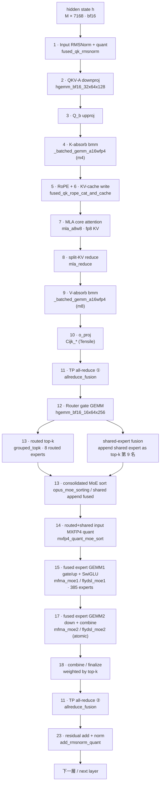
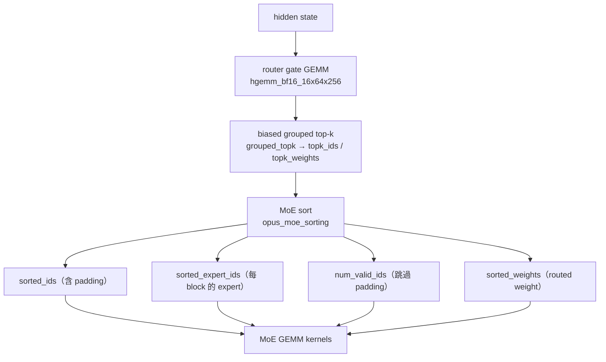

# AITER decode 深入解析：Kimi-K2.5 MXFP4 的 MoE 執行路徑

<div class="page-meta" markdown>
<span class="chip"><strong>Trace:</strong> `prof_sweep/*/…/traces`（torch profiler / CUDA graph）</span>
<span class="chip"><strong>Model:</strong> Kimi-K2.5-MXFP4</span>
<span class="chip"><strong>Backend:</strong> SGLang + AITER MoE</span>
<span class="chip"><strong>Target:</strong> gfx950 / MI355X ×4 / TP4</span>
</div>

本章把 profiling traces 對回 Kimi-K2.5 的 decode 架構與 AITER 原始碼。所有比例、
µs 數字與 kernel 名稱都來自實際採到的 trace（見「資料來源」），不是估計值。核心
目標不是背 kernel 名稱，而是建立一條可操作的對照鏈：

```text
Chrome/Kineto trace bucket
  → Kimi-K2.5 decode stage（25-stage taxonomy）
  → SGLang 呼叫的 AITER operator
  → AITER Python dispatcher
  → HIP / CK / FlyDSL / HSACO kernel
  → 可 tune 的 config 或實作檔案
```

!!! note "資料來源（皆為 repo 相對路徑）"
    - 量測組態與端到端數據：`docs/kimi_k25_decode_profile_breakdown.md`
    - 25-stage 分類規則：`scripts/profiling/analyze_decode_trace.py`
    - 每 stage 的 µs / 次數：`prof_sweep/ana/<sweep>/semantic_decode.json`
    - SGLang→AITER 呼叫路徑（runtime log）：`docs/kimi_k25_rocm_path.md`

    量測平台：Kimi-K2.5-MXFP4、gfx950（MI355X）×4、TP4、SGLang + AITER MoE、
    bf16 tuned GEMM、`--enable-aiter-allreduce-fusion`、shared-expert fusion 開啟、
    KV cache fp8_e4m3。Sweep：ISL ∈ {1024, 8192}、OSL 1024、concurrency ∈ {4,8,16,32,64}。

!!! tip "這章接在哪裡"
    本章是前三部觀念的真實落地。建議的銜接：
    [作為系統的 Transformer](../foundations/transformer-systems.md) 的 roofline、
    [Attention 效率](../foundations/attention-efficiency.md) 的 MLA/KV cache、
    [數值與精度](../foundations/numerics-precision.md) 的 MXFP4/fp8，再到第二部的
    [從零實作 MoE layer](../moe/moe-from-scratch.md)、[系統與 expert parallelism](../moe/systems-ep.md)、
    [MoE kernels](../moe/kernels.md) 與 [MoE decode 剖析](../moe/decode-anatomy.md)。本章把這些觀念
    對到一條*具名、可量測*的執行路徑上；§9 的 roofline 推導與 [MoE kernels](../moe/kernels.md) 的
    grouped GEMM 數學是同一套，只是換成真實的 Kimi-K2.5 shape。

---

## 1. Kimi-K2.5 的模型組態（trace 實測）

Kimi-K2.5 走 DeepSeek-V3 語言模型實作（runtime log：
`architectures=['DeepseekV3ForCausalLM'], model_type=kimi_k2`）。decode 相關的
關鍵維度，全部取自 AITER dispatch metadata 與 `create_weights` log：

| 參數                | 值                          | 來源 / 備註                                          |
| ------------------- | --------------------------- | ---------------------------------------------------- |
| Transformer 層數    | 61（layer 0 dense + 1–60 MoE） | trace kernel 次數反推（見 §3）                       |
| hidden size $H$     | 7168                        | `hidden_size=7168`                                   |
| MoE intermediate    | 每 partition $I=256$        | `intermediate_size_per_partition=256`，`moe_tp_size=8` |
| routed experts      | 384                         | `num_experts=385` − 1 fused shared                   |
| fused shared expert | 1                           | `num_fused_shared_experts=1`（折進 routed path）     |
| top-k               | 9（8 routed + 1 shared）    | `num_routed_topk=8, top_k=9`                         |
| 權重格式            | MXFP4（`per_1x32` block scale） | `w13/w2 = float4_e2m1fn_x2`，scale `uint8`           |
| 每專家 W13（gate+up）| `[512, 7168]` fp4           | `w13_up_dim=512`（= 2×256）                          |
| 每專家 W2（down）   | `[7168, 256]` fp4           | `w2_down_dim=128`（fp4x2 packed）                    |
| Attention           | MLA + 吸收式 bmm            | `mla_a8w8` core、fp8 KV cache                        |
| Router              | grouped top-k + correction bias | `biased_grouped_topk`，`num_expert_group=1`         |

這些維度後面所有 FLOPs / bytes 估算都會用到。注意 **gate+up = 512 = 2×256**，
所以 stage-1 的輸出維度天生是 stage-2 輸入維度的 2 倍——這正是後面量到「stage-1 ≈
2× stage-2」的結構原因（§9）。

---

## 2. decode 一層在做什麼

在 decode 階段，每一步每個 sequence 只進一個新 token，但每一層仍要走完整的
attention、MoE 與 tensor-parallel communication。`analyze_decode_trace.py` 把一層
拆成 **25 個 canonical stage**，其中 **stage 16 保留未使用**，因此 trace 中會看到
`15 → 17`。下面用縱向流程圖呈現一條 decode 的執行路徑（每個節點標出對應的實際
kernel 名稱）：



!!! info "兩個容易誤會的點"
    - **stage 16 不存在**：它在 taxonomy 中刻意保留空號，所以 trace 是 `15 → 17`。
    - **stage 19–22（獨立 shared expert）在本組態下幾乎消失**：因為
      `num_fused_shared_experts=1`，shared expert 被折成「第 385 個專家 / top-k 第 9 名」，
      跟著 routed experts 一起在 stage 15/17 算完，不再有獨立的 shared GEMM/SiLU kernel。

---

## 3. trace 怎麼確認層數與步數

semantic 分類後的 kernel **次數**可以反推結構，這也是「比例不是猜的」的佐證。以
8k / concurrency 32 的 decode 視窗為例（`semantic_decode.json`）：

| group                          | 次數 cnt | 推論                              |
| ------------------------------ | -------: | --------------------------------- |
| MoE stage1 GEMM                |      120 | 60 MoE 層 × 2 decode step         |
| MoE stage2 GEMM                |      120 | 同上，stage1:stage2 = 1:1（每層各一次）|
| Dense proj GEMM（q/kv/o）      |      488 | 4 GEMM × 61 層 × 2 step           |
| Attention MLA core             |      244 | 2 × 61 × 2                        |
| Communication（allreduce）     |      248 | ≈ 2/層（每層兩次 all-reduce）     |

$488 / (4 \times 61) = 2$、$120 / 60 = 2$ 完全一致，因此這個視窗剛好抓到 **2 個
decode step、61 層（1 dense + 60 MoE）**。後面所有百分比都是在這種「乾淨 decode 視窗」
下算出來的。

---

## 4. 時間都花在哪：8k 權威 breakdown

8k 全 sweep 是用 `--profile-by-stage` 分開抓 prefill / decode，保證每個 concurrency
都有乾淨的 decode trace，是本章最權威的 decode 組成（佔 decode GPU-busy time 的 %）：

<div class="aiter-stage-table" markdown>

| Bucket                              |    c4 |    c8 |   c16 |   c32 |   c64 | 主要 kernel                                           |
| ----------------------------------- | ----: | ----: | ----: | ----: | ----: | ----------------------------------------------------- |
| MoE expert GEMM（fp4 stage1+stage2）| 26.3% | 32.9% | 42.6% | 52.6% | 52.0% | `mfma_moe1`, `mfma_moe2`, `flydsl_moe1/2`            |
| Attention（MLA + RoPE/KV + QK-norm）| 18.3% | 18.2% | 15.8% | 14.5% | 16.9% | `mla_a8w8`, `mla_reduce`, `fused_qk_*`                |
| Dense proj GEMM（bf16: q/kv/o）     | 18.6% | 16.5% | 13.3% | 10.3% |  9.7% | `hgemm_bf16_32x64x128`, `Cijk_*`                      |
| MoE route + sort + quant            | 14.5% | 13.1% | 11.5% |  7.1% |  5.6% | `grouped_topk`, `opus_moe_sorting`, `mxfp4_quant_moe_sort` |
| Communication（allreduce）          | 14.8% | 12.7% | 11.5% | 11.1% | 11.5% | `allreduce_fusion`, `cross_device_reduce`            |
| MoE/shared-expert fp4 GEMM（a16wfp4）|  6.8% |  5.9% |  4.6% |  4.0% |  4.0% | `_batched_gemm_a16wfp4`, shared MLP                   |
| Norm / quant / misc                 |  0.8% |  0.7% |  0.6% |  0.5% |  0.4% | `add_rmsnorm_quant` 等                                |

</div>

把 conc32 的絕對 µs 攤開（`semantic_decode.json`，視窗總計 38,135 µs / 2 step）更直觀：

| group                       |       µs |    pct | 次數 |
| --------------------------- | -------: | -----: | ---: |
| MoE stage1 GEMM（gate/up+SwiGLU）| 13,467.8 | 35.3% |  120 |
| MoE stage2 GEMM（down）     |  6,580.1 | 17.3% |  120 |
| Attention MLA core          |  4,492.1 | 11.8% |  244 |
| Communication               |  4,226.8 | 11.1% |  248 |
| Dense proj GEMM             |  3,939.9 | 10.3% |  488 |
| MoE/shared fp4 GEMM         |  1,519.1 |  4.0% |  248 |
| MoE sort + fused quant-sort |  1,857.6 |  4.9% |  364 |
| MoE routing（grouped_topk） |    842.7 |  2.2% |  120 |
| RoPE + KV cache             |    519.2 |  1.4% |  122 |
| QK RMSNorm                  |    518.2 |  1.4% |  122 |

**解讀重點：**

- **MoE expert GEMM 隨 batch 變主瓶頸，conc32 後在 ~52% 飽和。** 不是每個 token 變慢，
  而是 routed GEMM 的「每層讀完整專家權重」這件固定成本支配整步（§9 會用
  [roofline](../foundations/transformer-systems.md) 解釋）。
- **stage-1 實測 13,467.8 / 6,580.1 = 2.05× stage-2**，跟 §1 的結構推論（512 vs 256）一致。
- **Attention 在 8k 比 1k 重很多。** conc4 比較乾淨的兩組顯示 MLA core 從 1k 的 6.8% 漲到
  8k 的 12.0%（≈1.8×），因為 MLA 要讀長 KV cache，而且**不隨 batch 攤平**（conc64 還回升到 16.9%）。
- **route/sort/quant 在低 concurrency 更重要**（c4 14.5% → c64 5.6%）：小 batch 時 GEMM
  沒攤平 kernel launch 與排序成本。
- **TP all-reduce 不被 batch 攤平**（穩在 ~11–15%）：它是 latency-bound 的固定尾巴，conc64
  時還會從 1-stage 切到 2-stage reduce-scatter 路徑。

1k sweep 的趨勢相同、只是更早觸頂：MoE expert GEMM 16.9%（c4）→ 42.2%（c16）→ 53.5%（c32）；
per-call overhead（route/sort/quant、dense GEMM、attention）則從 ~20% 一路攤平到個位數。

---

## 5. SGLang → AITER 的呼叫路徑（runtime log 實證）

下面的鏈每一步都有 runtime log 對應（`docs/kimi_k25_rocm_path.md`），不是推測：

```text
DeepseekV2MoE.forward                      branch=forward_normal（非 mega/A2A/dual-stream）
  └─ TopK.forward_cuda                      use_grouped_topk=True, correction_bias=True
       └─ select_experts                    branch=grouped_topk, num_routed_topk=8, top_k=9
  └─ FusedMoE.forward_impl → run_moe_core   dispatcher=StandardDispatcher（moe_ep_size=1）
       └─ QuarkW4A4MXFp4MoE.apply_weights   w13=(385,512,3584ᵇ), w2=(385,7168,128ᵇ) fp4
            └─ AiterRunnerCore.run          → AITER fused_moe(...)
                 └─ fused_moe_              dispatcher：決定 dtype / 1-stage vs 2-stage
                      └─ get_2stage_cfgs    查 tuned_fmoe.csv → kernelName1/2, block_m, ksplit
                      └─ moe_sorting        sorted_ids / expert_ids / num_valid / weights
                      └─ fused_moe_2stages
                           ├─ stage1 wrapper  flydsl_moe1_…_t64x128x256_w4_fp4
                           └─ stage2 wrapper  flydsl_moe2_…_atomic（大 M）或 ck_moe_stage2（M=1）
```

幾個關鍵分支（皆由 log 確認）：

- **走 `forward_normal`**：`should_use_mega_moe` 否、`_enable_a2a_moe=False`、dual-stream
  guard 要求 `num_fused_shared_experts==0` 但此處為 1，所以不走雙流。
- **shared expert 被 fuse**：`num_fused_shared_experts=1`，`_forward_shared_experts` 回傳
  `None`，shared expert 變成 routed path 的第 9 名。
- **走 AITER MXFP4**：`moe_runner_backend=auto` 被 Quark scheme 解析成 AITER；不是 CUDA、
  FlashInfer TRT-LLM 或 Triton MoE。

### config lookup 怎麼決定 kernel

`get_2stage_cfgs(...)` 的 lookup key（決定 `kernelName1/2`、`block_m`、`ksplit`、
`run_1stage`、`flat`）包含：

```text
gfx, cu_num, token, model_dim, inter_dim, expert, topk,
act_type, dtype, q_dtype_a, q_dtype_w, q_type, use_g1u1, doweight_stage1
```

其中 `token` 不是原始 batch，而是 `get_padded_M(M)` 後的 tier（decode 的小 M 會補到
power-of-two）。實測 decode 在 `M=1` 時走 `flydsl_moe1_…_t32x128x256_w3_kb14` + **CK**
stage2；`M=8` 時走 `flydsl_moe1_…_t64x128x256_w4` + **FlyDSL atomic** stage2。tuning
要檢查 `aiter/configs/tuned_fmoe.csv`、`untuned_fmoe.csv` 與 `AITER_CONFIG_FMOE`。

---

## 6. Attention：MLA 區塊（stage 1–10）

MLA（Multi-head Latent Attention）把 KV 壓到低秩 latent，再用「吸收式」bmm 展開，
decode 時只需讀壓縮後的 KV cache。trace 對應：

| stage | 意義                | kernel                              |
| ----: | ------------------- | ----------------------------------- |
|     1 | input / QK RMSNorm + quant | `fused_qk_rmsnorm`           |
|   2/3 | QKV-A downproj、Q_b upproj  | `hgemm_bf16_32x64x128`       |
|     4 | K-absorb bmm        | `_batched_gemm_a16wfp4 …m_4`        |
|   5/6 | RoPE + KV-cache write | `fused_qk_rope_cat_and_cache`     |
|     7 | MLA core attention  | `mla_a8w8`（a8w8 → fp8 KV）         |
|     8 | split-KV reduce     | `mla_reduce`                        |
|     9 | V-absorb bmm        | `_batched_gemm_a16wfp4 …m_8`        |
|    10 | o_proj              | `Cijk_*`（Tensile GEMM）            |

decode 時 attention 的主要成本是 **MLA core 讀 KV cache 的頻寬**，而不是 FLOPs：每步只有
一個新 query，但要對整段 KV 做 attention。所以它**隨 context length 變重、卻不隨 batch
攤平**——8k 時 MLA core 升到 ~12%（conc4）甚至 ~17%（conc64），是長 context decode 的
穩定第二大成本。要 tune 的方向是 `aiter/mla.py` / `csrc/cpp_itfs/mla/*` 的 MLA kernel 與
fp8 KV/attention 路徑（`kimi-k25-fp8-attn-proj` 實驗）。

---

## 7. Router、top-k 與 MoE sort（stage 12–13）

進 MoE 後第一步是從 router logits 選每個 token 的 top-k experts，再把 token 依 expert
分桶，讓後續 grouped GEMM 能按 expert 連續讀取。



| 部件                 | 入口                                       | 低層實作                                                       |
| -------------------- | ------------------------------------------ | -------------------------------------------------------------- |
| grouped top-k        | `aiter/ops/topk.py`、`aiter/ops/moe_op.py` | `csrc/include/moe_op.h`、`csrc/pybind/moe_topk_pybind.cu`      |
| Opus MoE sort        | `aiter/ops/moe_sorting_opus.py`            | `csrc/include/moe_sorting_opus.h`                              |
| CK MoE sort fallback | `aiter/fused_moe.py::_moe_sorting_impl`    | `csrc/py_itfs_ck/moe_sorting_kernels.cu`                       |
| shared expert append | `fused_append_shared_experts` bucket       | `aiter-shared-expert-topk` patch（見 §11）                     |

`grouped_topk` 在 conc32 約 2.2%、sort + fused quant-sort 約 4.9%；低 concurrency 時這群
是 latency-sensitive path 的主要目標。

---

## 8. Routed input MXFP4 quant（stage 14）

MXFP4 routed GEMM 不直接吃 bf16 activation：stage-1 前要把 activation quantize 成
MXFP4（`per_1x32` block scale，每 32 個元素共享一個 `uint8` scale），並把 scale 排成
GEMM kernel 期望的 tile layout。邏輯集中在 `aiter/ops/quant.py::fused_dynamic_mx_quant_moe_sort`，
有兩條 path：

| path           | 何時用            | 做什麼                                                       | 代價                                   |
| -------------- | ----------------- | ------------------------------------------------------------ | -------------------------------------- |
| fused HIP path | 小 M / 非預設 group | 一個 kernel 完成 quant + sort + scale swizzle                | 少一次 launch，但同 token 可能被 top-k 重複 quant |
| split path     | 較大 M            | `per_1x32_mx_quant_hip` 先逐 token quant，再 `mxfp4_moe_sort_hip` 排 scale | 每個 row 只讀一次，較適合大 batch    |

cutoff 判斷式（`quant.py`）：

$$
M \le \frac{8 \times 256}{\text{topk}} \;\;(\text{stage-1}), \qquad
M \le \frac{8 \times 1024}{\text{topk}} \times \text{eff\_topk} \;\;(\text{stage-2})
$$

這也是為什麼「把 quant fuse 到 GEMM critical path」不一定變快：低 M 省 launch，大 M 反而
可能因重複讀 row 而退化。實測上 quantize-on-load 在 decode **退化 +16% TPOT**，所以 decode
預設關閉、改用 `decode-sort-consolidated` 與 `aiter-shared-expert-topk` 來省 standalone
sort/quant kernel。

---

## 9. MoE GEMM 1 / 2 的數學：為什麼是 decode 的主瓶頸

這是本章最關鍵的量化分析。先看 **每一個被選中的 token-expert row**；實際每層總量還要
再乘上該層的 selected rows（decode batch × top-k），但 stage-1 / stage-2 會同乘同一個 row
數，所以比值不變：

$$
\begin{aligned}
\text{stage-1:}\quad
&\mathbf{a}_{1\times 7168} W_{13,\,7168\times 512}
  \to \mathbf{y}_{1\times 512},
&\operatorname{FLOPs}_1
  &= 2 \cdot 7168 \cdot 512
   = 7.34\,\text{MFLOP},\\
\text{SwiGLU:}\quad
&\mathbf{y}_{1\times 512}
  \to \mathbf{x}_{1\times 256},
&\text{其中 }512 &= 2 \times 256,\\
\text{stage-2:}\quad
&\mathbf{x}_{1\times 256} W_{2,\,256\times 7168}
  \to \mathbf{o}_{1\times 7168},
&\operatorname{FLOPs}_2
  &= 2 \cdot 256 \cdot 7168
   = 3.67\,\text{MFLOP}.
\end{aligned}
$$

因此 $\operatorname{FLOPs}_1 / \operatorname{FLOPs}_2 = 512 / 256 = 2.0$。這就是 trace
量到 stage-1 ≈ 2.05× stage-2 的根本原因：gate+up GEMM 先算出兩份中間向量，再由
SwiGLU 壓回 down GEMM 的 $256$ 維輸入。

**關鍵：decode 時 MoE GEMM 是 weight-bandwidth-bound，不是 compute-bound。** 每個專家
的 fp4 權重（0.5 byte/元素）要讀進來才能算：

$$
W_{13}: 512 \times 7168 \times 0.5 = 1.84\,\text{MB}, \quad
W_{2}: 7168 \times 256 \times 0.5 = 0.92\,\text{MB}
$$

每個專家 2.75 MB，384 個 routed experts 全打到的話，**一層要讀約 1.06 GB 權重**。而
decode 每步分到每個專家的 token 數極少：

$$
\text{平均 rows/expert} = \frac{\text{conc}\times\text{topk}}{384}
= \begin{cases} 0.08 & (\text{conc4}) \\ 0.67 & (\text{conc32}) \\ 1.33 & (\text{conc64}) \end{cases}
$$

把 stage-1 的 arithmetic intensity 寫出來（權重每層只讀一次，$m$ = 該專家處理的 row 數）：

$$
\text{AI}_{\text{stage-1}} = \frac{2\cdot 7168 \cdot 512 \cdot m}{512 \cdot 7168 \cdot 0.5}
= 4m \;\;\text{FLOP/byte}
$$

也就是 $m=1$ 時只有 **4 FLOP/byte**，$m=8$ 也才 32。MI355X 的 fp4 算力 / HBM 頻寬 ridge
point 高達數千 FLOP/byte，所以 decode 的 MoE GEMM 落在 roofline 的**記憶體頻寬斜坡**上，
離 compute roof 很遠。這解釋了所有觀察：

- **為什麼 MoE GEMM 支配 decode**：你為了 ~1 個 token 付出整個專家權重的讀取成本。
- **為什麼 batch 有幫助但會飽和**：$m$ 變大→AI 變大→每 byte 攤更多 FLOP，但在 $m$ 還很小時
  仍是頻寬主導，所以 conc32 後曲線就壓平在 ~52%。
- **P0 tuning 先攻 stage-1**：它是最大的 kernel family，10% 的 stage-1 改善 ≈ conc32 下
  ~4–5% 端到端 TPOT。

### stage-1 / stage-2 在 AITER 哪裡實作

| 層級              | 檔案 / 函式                                                  | 角色                                  |
| ----------------- | ----------------------------------------------------------- | ------------------------------------- |
| stage-1 dispatcher | `aiter/fused_moe.py::_flydsl_stage1_wrapper`               | 解析 `kernelName1` → FlyDSL 參數      |
| stage-1（CK 路）  | `aiter/fused_moe.py::ck_moe_stage1` / `cktile_moe_stage1`   | 非 FlyDSL path                        |
| stage-2 dispatcher | `aiter/fused_moe.py::_flydsl_stage2_wrapper`               | 傳入 atomic/reduce、scale、topk meta  |
| kernel registry    | `aiter/ops/flydsl/moe_kernels.py`                          | 產生 `flydsl_moe1/2_*` 名稱與 tile    |
| FlyDSL kernel      | `aiter/ops/flydsl/kernels/moe_gemm_2stage.py`              | 2-stage MoE GEMM 主實作               |
| CK low-level       | `csrc/py_itfs_ck/moe_ck_2stages_kernel.cu`                | CK stage-1/2 launch glue              |
| ASM / HSACO        | `csrc/py_itfs_cu/asm_moe_2stage.cu`、`hsa/gfx950/fmoe_2stages/*` | prebuilt assembly kernel        |

**stage-2 的 combine：** down projection 後要把 top-k 個專家輸出依 `topk_weight` 合回
原 token。實測大 M 走 **atomic mode**（`flydsl_moe2_…_atomic`，直接 atomic accumulate 到
`[M, 7168]`）；`M=1` 走 **CK stage2**（`moe_ck2stages_gemm2_…`）。tuning stage-2 要同時看
GEMM tile 與 combine 方式（小 M atomic 固定成本可接受，大 M / EP 可考慮 reduce mode）。

stage-1 的 P0 tuning checklist：`kernelName1` 是否命中 tuned config；`tile_m/tile_n/tile_k`
是否覆蓋 decode M range（$M=\text{conc}\times\text{topk}$ 展開後約 32–512）；`q_dtype_a`
是 `fp4x2`；`gate_mode`（實測 `separated`）；以及 `ksplit`、`b_nt`、`xcd_swizzle`。

---

## 10. TP communication（stage 11）

每層有 **2 次 all-reduce**（attention o_proj 後、MoE down + combine 後）。decode 的 hidden
state 訊息很小：

$$
\text{每次 all-reduce} = \text{bs} \times 7168 \times 2\,\text{byte}
= \begin{cases} 448\,\text{KB} & (\text{conc32}) \\ 896\,\text{KB} & (\text{conc64}) \end{cases}
$$

訊息小 → latency-bound → **不隨 batch 攤平**，所以穩在 ~11–15%，是 MoE GEMM 之後的固定
尾巴。這正是 [系統與 expert parallelism](../moe/systems-ep.md) 講的「latency-bound 的 TP all-reduce
不會被 batch 攤平」，只是這裡是 TP（非 EP）路徑、訊息更小。實測 conc64 時 fused all-reduce 會從
1-stage（`allreduce_fusion_1stage`）切到
**2-stage reduce-scatter + load-rmsnorm**（`cross_device_reduce` / `reduce_scatter_*`）。
tuning 方向（`kimi-k25-fused-ar-rms-stage-tuning`）：驗證小訊息選 1-stage、確認 1↔2 stage
crossover 與 AR+RMSNorm 融合最佳；原始碼在 `aiter/ops/custom_all_reduce.py`、
`aiter/dist/communication_op.py`。

---

## 11. Shared expert：fusion 後在 trace 裡怎麼看

本組態 shared-expert fusion 開啟，所以 shared expert 不再是獨立 kernel，而是 routed path
的第 9 名（`top_k=9 = 8 + 1`）。若關閉 fusion，taxonomy 會出現獨立的 stage 19–22：

| stage | 名稱                      | kernel                          |
| ----: | ------------------------- | ------------------------------- |
|    19 | Shared expert-input quant | `dynamic_mxfp4_quant`           |
|    20 | Shared MLP GEMMs          | `_gemm_afp4wfp4` / `hgemm_bf16_16x64x256` |
|    21 | Shared split-K reduce     | `_gemm_afp4wfp4_reduce`         |
|    22 | Shared SiLU               | `act_and_mul`                   |

`aiter-shared-expert-topk` patch 的重點就是把 shared expert append 併進 routing/sort，
減少獨立 sort/append kernel 的 overhead（低 M 時 standalone launch 佔比更高）。可追：

```text
patch/aiter-shared-expert-topk/aiter-shared-expert-topk.patch
patch/aiter-shared-expert-topk/aiter/op_tests/test_biased_grouped_topk_shared_append.py
patch/aiter-shared-expert-topk/aiter/aiter/fused_moe_dp_shared_expert.py
```

trace 上 `a16wfp4` 這群（含吸收 bmm 與 shared MLP）在 8k decode 約 4–7%。

---

## 12. 從 trace 回到原始碼的查表

| trace pattern                                 | stage | 意義                            | 優先看的檔案                                                        |
| --------------------------------------------- | ----: | ------------------------------- | ------------------------------------------------------------------- |
| `fused_qk_rmsnorm`                            |     1 | input / QK RMSNorm + quant      | `aiter/ops/fused_qk_norm_rope_cache_quant.py`、`aiter/ops/rmsnorm.py` |
| `hgemm_bf16_32x64x128`                        |   2/3 | QKV-A / Q_b projection          | `aiter/tuned_gemm.py`、`aiter/ops/gemm_op_a16w16.py`                 |
| `_batched_gemm_a16wfp4_…m_4` / `…m_8`         |   4/9 | K-absorb / V-absorb bmm         | `aiter/ops/batched_gemm_op_bf16.py`、`aiter/ops/gemm_op_a4w4.py`     |
| `fused_qk_rope_cat_and_cache`                 |   5/6 | RoPE + KV cache write           | `aiter/ops/rope.py`、`aiter/ops/cache.py`                           |
| `mla_a8w8`                                    |     7 | MLA core attention              | `aiter/mla.py`、`aiter/aot/asm_mla_decode_fwd.py`、`csrc/cpp_itfs/mla/*` |
| `mla_reduce`                                  |     8 | split-KV reduce                 | `aiter/ops/attention.py`                                            |
| `Cijk_*`                                      |    10 | o_proj（Tensile）               | `aiter/tuned_gemm.py`                                               |
| `allreduce_fusion`, `cross_device_reduce`     |    11 | TP all-reduce fusion            | `aiter/ops/custom_all_reduce.py`、`aiter/dist/communication_op.py`   |
| `hgemm_bf16_16x64x256`                        |    12 | router gate GEMM                | `aiter/tuned_gemm.py`                                               |
| `grouped_topk`, `opus_moe_sorting`            |    13 | top-k 選擇 + token 排序         | `aiter/ops/topk.py`、`aiter/ops/moe_sorting_opus.py`                 |
| `mxfp4_quant_moe_sort`                        |    14 | routed input quant + scale sort | `aiter/ops/quant.py`                                               |
| `mfma_moe1` / `flydsl_moe1`                   |    15 | MoE GEMM 1 gate/up + SwiGLU     | `aiter/fused_moe.py`、`aiter/ops/flydsl/kernels/moe_gemm_2stage.py`  |
| `mfma_moe2` / `flydsl_moe2`                   |    17 | MoE GEMM 2 down + combine       | `aiter/fused_moe.py`、`aiter/ops/flydsl/kernels/moe_gemm_2stage.py`  |
| `add_rmsnorm_quant`                           |    23 | residual add + norm + quant     | `aiter/ops/rmsnorm.py`                                              |

---

## 13. 實作與 tuning 檢查清單（依槓桿排序）

1. **先確認 trace 是 decode window。** 長 ISL + 高 concurrency 時預設 profile 視窗會被
   chunked prefill 填滿；8k sweep 要用 `--profile-by-stage` 的 decode trace。
2. **P0：MoE fp4 expert GEMM（最大槓桿）。** 占 40–54%+ 且隨 batch 上升。先 tune **stage-1**
   （gate/up，~2× stage-2），針對 decode 的 $(E,N,K)$ 與 $M=$ conc×topk 範圍持久化
   tuned_fmoe，比照 bf16 GEMM asset 的 `AITER_CONFIG_FMOE` 接線。
3. **P0：TP communication。** ~11–18% 且不攤平。tune 1-stage / 2-stage all-reduce crossover
   與 fused AR+RMSNorm；驗證小訊息選 1-stage、all-reduce 數為 2/層。
4. **P1：dense bf16 projection GEMM。** 10–14%，確認 bf16 tuned asset 覆蓋 q_a/q_b/kv_a/
   kv_b/o_proj 的 decode shape；可評估 `kimi-k25-fp8-attn-proj`。
5. **P1：低 concurrency 的 route/sort/quant。** decode 保持 quantize-on-load **關閉**
   （實測 +16% TPOT），改走 `decode-sort-consolidated` 與 `aiter-shared-expert-topk`。
6. **P2：長 context attention。** 8k 下 MLA ~17% 且隨 KV 長度上升，考慮 fp8 KV/attention。
7. **不建議 decode dual-stream overlap：** decode ~100% GPU-busy、幾乎沒有 idle，compute/comm
   重疊沒什麼可回收，把力氣放在 kernel 效率（P0）。

---

## 14. 重現分析

```bash
# 1k / 8k full sweep（concurrency 4..64）
./run_profile_suite.sh --platform amd --moe-runner-backend aiter \
  --isl 1024 --osl 1024 --log-root "$PWD/prof_sweep/isl1k"
./run_profile_suite.sh --platform amd --moe-runner-backend aiter \
  --isl 8192 --osl 1024 --log-root "$PWD/prof_sweep/isl8k"

# stage-separated profile（長 context 的乾淨 decode trace）
./run_profile_suite.sh --platform amd --moe-runner-backend aiter \
  --isl 8192 --osl 1024 --profile-by-stage \
  --log-root "$PWD/prof_sweep/isl8k_bystage"

# 分析 trace（先看 rank 0）
python3 scripts/profiling/analyze_profile_trace.py <view_dir> --ranks 0 \
  --out-dir <view_dir>/analysis
python3 scripts/profiling/analyze_decode_trace.py \
  -d <decode_trace_dir> -o decode_breakdown.xlsx
```

!!! note "本章的判讀邊界"
    這裡的比例是 Kimi-K2.5-MXFP4、gfx950、TP4、SGLang + AITER MoE、KV cache fp8_e4m3
    與特定 concurrency sweep 下的結果。架構結論可遷移，但具體比例會隨模型 hidden /
    intermediate size、top-k、context length、batch、TP/EP 切法與 tuned config 而變。

!!! tip "想自己量一遍"
    本章的量測紀律——先用 roofline 算目標、再對齊 trace bucket——就是
    [Profiling 與方法論](../performance/profiling.md) 那一套的實戰版。若要把這條 decode 路徑放回
    更一般的脈絡，回頭看 [MoE decode 剖析](../moe/decode-anatomy.md)（同一類 MLA + 細粒度 MoE 模型，
    但與供應商無關）。
