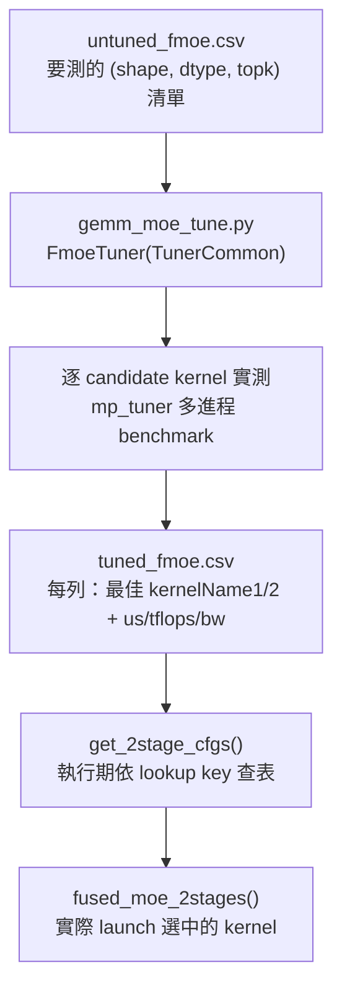

# AITER 原始碼 breakdown

本章對照 `/sgl-workspace/aiter` 的實際原始碼，完整拆解 AITER 這個 repo：整體架構、
內建 tuning 機制、對 MoE 的優化，以及「要改 MoE 該動哪裡」的切入點。每個主張都標出
對應檔案路徑（必要時行號）。

AITER（AI Tensor Engine for ROCm）是 AMD 的 GPU 運算元函式庫：上層是 PyTorch 可呼叫
的 Python operator，下層是 HIP / Composable Kernel (CK) / FlyDSL / 預編譯 HSACO
assembly 多種 kernel 後端，再加上一套把「shape → 最佳 kernel」持久化的 tuning 系統。

---

## 1. 整體原始碼架構

頂層目錄（`/sgl-workspace/aiter`）職責：

| 目錄 / 檔案            | 職責                                                                    |
| --------------------- | ----------------------------------------------------------------------- |
| `aiter/`              | Python 套件主體：operator wrapper、dispatcher、tuned config 查表         |
| `aiter/ops/`          | 各類 operator 的 Python 入口（GEMM、attention、moe、quant、norm、rope…） |
| `aiter/ops/flydsl/`   | FlyDSL kernel 產生器與 registry（MoE GEMM、linear attention 等）         |
| `aiter/configs/`      | tuned / untuned config CSV（GEMM、batched GEMM、`tuned_fmoe.csv` 等）    |
| `aiter/jit/`          | JIT 編譯、kernel 載入、環境變數與 config 路徑解析（`jit/core.py`）       |
| `aiter/aot/`          | ahead-of-time 編譯入口（含 `aot/flydsl/moe.py`、MLA decode）             |
| `aiter/dist/`         | 分散式 / collective（`communication_op.py`）                            |
| `csrc/`               | C++/HIP/CK kernel 原始碼，依 operator 家族分子目錄                       |
| `hsa/`                | 預編譯 assembly kernel（`hsa/gfx950/...`）與 codegen                     |
| `op_tests/`           | 單元測試與 micro-benchmark                                               |
| `gradlib/`            | Tensile / rocBLAS GEMM 調校輔助                                          |
| `scripts/`            | 工具腳本                                                                 |

核心檔案：

- `aiter/fused_moe.py`：MoE 的主 dispatcher（見 §3）。
- `aiter/tuned_gemm.py`：dense GEMM 的 tuned 查表（trace 上 `hgemm_bf16_*` / `Cijk_*`）。
- `aiter/mla.py`：MLA attention（decode `mla_a8w8_*`、prefill）。
- `aiter/ops/quant.py`：MXFP4 / fp8 量化（`_dynamic_mxfp4_quant`、`fused_mx_quant_moe_sort`）。
- `aiter/jit/core.py`：所有 `AITER_*` 環境變數與 config 檔路徑的定義來源。

C++ kernel 家族（`csrc/`，與 MoE 最相關的）：

| 子目錄                              | 內容                                          |
| ----------------------------------- | --------------------------------------------- |
| `csrc/ck_gemm_moe_2stages_codegen/` | CK 2-stage MoE GEMM 與 **MoE tuning 入口**    |
| `csrc/cktile_gemm_*`                | CK-tile GEMM 後端                             |
| `csrc/py_itfs_ck/`                  | CK kernel 的 pybind glue                       |
| `csrc/py_itfs_cu/`                  | HIP / assembly kernel 的 pybind glue           |
| `csrc/cpp_itfs/mla/`                | MLA decode kernel                              |

---

## 2. 內建 tuning 機制

AITER 的效能來自「離線 tune 出每個 shape 的最佳 kernel，存進 CSV，執行期查表」。

### 2.1 架構與資料流



### 2.2 觸發方式（env 與入口檔）

- **離線 tuning 入口**：`csrc/ck_gemm_moe_2stages_codegen/gemm_moe_tune.py`，其中
  `class FmoeTuner(TunerCommon)`（定義在第 132 行）。CLI 預設讀
  `aiter/configs/untuned_fmoe.csv`、寫 `aiter/configs/tuned_fmoe.csv`：

  ```bash
  python3 csrc/ck_gemm_moe_2stages_codegen/gemm_moe_tune.py \
    -i aiter/configs/untuned_fmoe.csv \
    -o aiter/configs/tuned_fmoe.csv \
    -o2 aiter/configs/profile_fmoe.csv --last
  ```

  通用 tuning 骨架在 `aiter/utility/base_tuner.py::TunerCommon`（`tune()`、
  `calculate()`、`result_to_csv()`、`run()`），多進程 benchmark 在
  `aiter/utility/mp_tuner.py`。

- **執行期查表**：`aiter/fused_moe.py::get_2stage_cfgs`（第 961 行）讀 CSV，建立兩個
  dict（primary：精確比對 `act_type`；fallback：忽略 `act_type`）。lookup key 是
  `_INDEX_COLS`：`cu_num, token, model_dim, inter_dim, expert, topk, act_type, dtype,
  q_dtype_a, q_dtype_w, q_type, use_g1u1, doweight_stage1`。其中 `token` 是
  `get_padded_M(M)`（第 791 行）後的 power-of-two tier，不是原始 batch。

- **相關環境變數**（`aiter/jit/core.py`）：
  - `AITER_CONFIG_FMOE`（第 102 行）：覆蓋 tuned_fmoe.csv 路徑，指向自己 tune 出的檔。
  - `AITER_ONLINE_TUNE=1`（`fused_moe.py:1147`）：查不到時即時 tune。
  - `AITER_BYPASS_TUNE_CONFIG=1`（`fused_moe.py:1176`）：略過 tuned config。
  - `AITER_LOG_TUNED_CONFIG=1`（`jit/core.py:78`）：印出實際命中的 config。
  - `AITER_REBUILD`、`ENABLE_CK`（`jit/core.py:28-29`）：JIT rebuild / 是否啟用 CK。

### 2.3 產出：tuned_fmoe.csv 欄位意義

`tuned_fmoe.csv` 每列代表「某個 shape 的最佳解」。重要欄位：

| 欄位                          | 意義                                                         |
| ----------------------------- | ------------------------------------------------------------ |
| `cu_num`                      | tune 當下的 CU 數（綁 GPU 型號）                              |
| `token`                       | padded-M tier（`get_padded_M` 後的值）                       |
| `model_dim` / `inter_dim`     | hidden / per-partition intermediate（本模型 7168 / 256）     |
| `expert` / `topk`             | 專家數 / top-k（385 / 9，含 fused shared）                   |
| `act_type` / `dtype`          | 激活函數 / 計算 dtype                                         |
| `q_dtype_a` / `q_dtype_w`     | activation / weight 量化 dtype（fp4x2）                      |
| `q_type`                      | 量化粒度（`QuantType.per_1x32`）                             |
| `use_g1u1` / `doweight_stage1`| gate+up 合一 / stage-1 是否乘 routed weight                  |
| `block_m` / `ksplit`          | tile M / split-K 設定                                        |
| `kernelName1` / `kernelName2` | **stage-1 / stage-2 實際選中的 kernel 完整名稱**            |
| `us1` / `us2` / `us`          | stage-1 / stage-2 / 合計實測耗時                            |
| `tflops` / `bw`               | 達到的算力 / 頻寬                                            |
| `run_1stage`                  | 是否走 1-stage 路徑                                          |

（其他 GEMM 家族的 CSV 結構類似：`aiter/configs/bf16_tuned_gemm.csv`、
`a4w4_blockscale_tuned_gemm.csv` 等，由各自的 `*_tune.py` 產生。）

---

## 3. AITER 對 MoE 的優化

MoE 的主路徑在 `aiter/fused_moe.py`，從入口到 kernel 的呼叫鏈：

```text
fused_moe()                 # 第 242 行，公開 API
  └─ fused_moe_()           # 第 336 行，dispatcher：算 M/topk/shape，查 config
       └─ get_2stage_cfgs() # 第 961 行，tuned_fmoe.csv 查表
       └─ moe_sorting()     # 第 155 行，token→expert 分桶（sorted_ids/expert_ids/weights）
       └─ fused_moe_2stages()  # 第 1639 行，實際 launch stage-1/2
            ├─ _flydsl_stage1_wrapper()  # 第 839 行 → FlyDSL kernel
            └─ _flydsl_stage2_wrapper()  # 第 903 行 → FlyDSL/CK stage-2
```

AITER 在 MoE 上做的主要優化：

1. **2-stage fused grouped GEMM**：把「gate/up GEMM + SwiGLU」融成 stage-1
   （`mfma_moe1` / `flydsl_moe1`），「down GEMM + combine」融成 stage-2
   （`mfma_moe2` / `flydsl_moe2`），省掉中間 activation 的來回。實作：
   `aiter/ops/flydsl/kernels/moe_gemm_2stage.py`（`compile_moe_gemm1` 第 93 行內含
   `silu` 融合）、CK 版 `csrc/ck_gemm_moe_2stages_codegen/`。

2. **MXFP4 量化 grouped GEMM**：權重 fp4（0.5 byte/元素），activation 動態量化成
   `per_1x32` MXFP4。decode 是 weight-bandwidth-bound，fp4 直接把權重讀取量砍半。
   入口 `aiter/ops/quant.py`、`aiter/utility/fp4_utils.py`。

3. **融合的 token sort / quant**：`opus_moe_sorting`（`aiter/ops/moe_sorting_opus.py`）
   把 token 依 expert 分桶並產生 `sorted_ids / expert_ids / num_valid / weights`；
   `fused_mx_quant_moe_sort`（`aiter/ops/quant.py`）把 MXFP4 quant 與 scale swizzle
   併進一個 kernel，低 M 時少一次 launch。

4. **biased grouped top-k**：`grouped_topk`（`aiter/ops/topk.py`、`aiter/ops/moe_op.py`）
   一個 kernel 完成 router 選擇 + correction bias。

5. **shared-expert fusion**：把 shared expert append 成 routed path 的「第 9 名」，
   讓 384 routed + 1 shared 共用同一組 grouped GEMM（見
   [AITER decode 一層的 kernel 流程](index.md) §4 的 trace 對照）。相關實作
   `aiter/fused_moe_dp_shared_expert.py`。

6. **per-shape tuned kernel 選擇**：同一個 MoE layer，不同 batch（padded M）會選不同
   tile / split-K / combine（atomic vs reduce）的 kernel——全部由 §2 的 tuning 系統決定。

---

## 4. 修改指南：要改 MoE 該動哪裡

依「改什麼」對應切入點：

| 想改的東西                              | 切入檔案 / 函式                                                    |
| --------------------------------------- | ------------------------------------------------------------------ |
| MoE dispatch 邏輯（何時走 1-stage / 2-stage、shape 計算） | `aiter/fused_moe.py::fused_moe_`（第 336 行） |
| tuned config 查表 / lookup key          | `aiter/fused_moe.py::get_2stage_cfgs`（第 961 行）、`get_padded_M`（第 791 行） |
| stage-1（gate/up + SwiGLU）kernel       | `aiter/fused_moe.py::_flydsl_stage1_wrapper`（第 839 行）、`aiter/ops/flydsl/kernels/moe_gemm_2stage.py::compile_moe_gemm1`（第 93 行） |
| stage-2（down + combine）kernel         | `aiter/fused_moe.py::_flydsl_stage2_wrapper`（第 903 行）；CK 版 `csrc/ck_gemm_moe_2stages_codegen/gemm_moe_ck2stages.cu` |
| FlyDSL kernel 名稱 / tile registry      | `aiter/ops/flydsl/moe_kernels.py`（`flydsl_kernel_name` 第 26 行、`get_flydsl_stage1_kernels` 第 70 行） |
| token sort（分桶）                      | `aiter/fused_moe.py::moe_sorting`（第 155 行）、`aiter/ops/moe_sorting_opus.py` |
| input 量化（MXFP4）                     | `aiter/ops/quant.py`（`fused_mx_quant_moe_sort`）、`aiter/utility/fp4_utils.py` |
| router top-k                            | `aiter/ops/topk.py`、`aiter/ops/moe_op.py`、`csrc/include/moe_op.h` |
| shared expert 融合                      | `aiter/fused_moe_dp_shared_expert.py`                              |
| 新增 / 重 tune 一組 shape               | 在 `aiter/configs/untuned_fmoe.csv` 加列 → 跑 §2.2 的 `gemm_moe_tune.py` |

實務建議：

1. **只想換 decode 用的 kernel**：先 `AITER_LOG_TUNED_CONFIG=1` 確認目前命中哪一列，
   再在 `untuned_fmoe.csv` 補上你的 `(token, model_dim, inter_dim, expert, topk, dtype)`
   組合，重跑 tuning，最後用 `AITER_CONFIG_FMOE` 指向新的 CSV 驗證。
2. **想改 kernel 本身（tile / 演算法）**：FlyDSL 路徑改
   `aiter/ops/flydsl/kernels/moe_gemm_2stage.py` 與 `moe_kernels.py` 的 registry；
   CK 路徑改 `csrc/ck_gemm_moe_2stages_codegen/` 後重新 codegen。
3. **改 dispatch（例如強制某條 path）**：`aiter/fused_moe.py::fused_moe_`，注意
   `AITER_BYPASS_TUNE_CONFIG`、`AITER_FLYDSL_FORCE`（第 1421 行）等 env 的影響。
