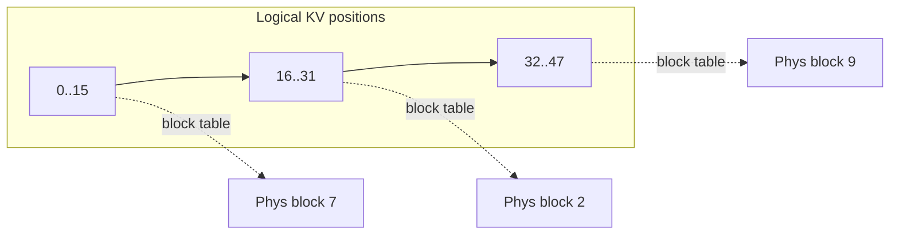

# Attention efficiency

  <strong>Level:</strong> beginner → intermediate
  <strong>Prereqs:</strong> <a href="../transformer-systems/">transformer as a system</a>, attention
  <strong>Hardware:</strong> none

Attention is where the systems story gets interesting, because **the same op is
compute-bound in training and memory-bound at inference**. This page covers the
KV cache (why it exists and what it costs), why decoding hits a memory wall, and
how paged attention manages the cache without wasting memory.

## Recap: scaled dot-product attention

For queries $Q\in\mathbb{R}^{N\times d}$, keys $K$, values $V$:

$$ \text{Attn}(Q,K,V) = \text{softmax}\!\left(\frac{QK^\top}{\sqrt{d}} + M\right) V $$

with causal mask $M$ (upper triangle $=-\infty$). Two matmuls and a row-softmax.
In training we compute this for all $N$ query positions at once.

## The KV cache: trading memory for FLOPs

At inference we generate one token at a time. Naively, to produce token $t$ we'd
recompute attention over the whole prefix — re-projecting all previous tokens'
keys and values every step, an $O(N^2)$ waste. Instead we **cache** the keys and
values of every position we've already seen. Step $t$ then:

1. Projects only the *new* token to get $q_t, k_t, v_t$.
2. Appends $k_t, v_t$ to the cache.
3. Attends $q_t$ against the *cached* $K_{1:t}, V_{1:t}$.

This is the single most important inference optimization. But it moves the
bottleneck: the cache must be **read in full every single step**.

### What the cache costs

Per token, per layer, the cache stores $K$ and $V$: $2 \cdot n_{kv} \cdot d_h$
values, where $n_{kv}$ is the number of **KV heads** and $d_h$ the head dim. In
bytes (2 for bf16):

$$ \text{cache bytes} = 2 \cdot L \cdot n_{kv} \cdot d_h \cdot 2 \cdot N \cdot B. $$

For a Llama-2-13B-shaped model ($L=40$, $n_{kv}=40$ heads, $d_h=128$) at
$N=4096$, $B=1$: $2\cdot40\cdot40\cdot128\cdot2\cdot4096 \approx 3.4$ GB — for a
*single sequence*. Push $B$ or $N$ and the KV cache, not the weights, becomes
your memory limit. This single equation motivates:

- **Multi-Query Attention (MQA)** — one KV head shared by all query heads ($n_{kv}=1$).
- **Grouped-Query Attention (GQA)** — a few KV heads, each shared by a group (the modern default).
- **Multi-head Latent Attention (MLA)** — DeepSeek's low-rank compression of the KV cache (see [case studies](../moe/case-studies.md)).

GQA with $n_{kv}=8$ instead of 40 cuts the cache 5× with negligible quality
loss — a pure systems win baked into the architecture.

## Why decoding is memory-bound

Apply the roofline. At decode step $t$, batch $B=1$, attention does
$O(t\cdot d_h\cdot n_{heads})$ FLOPs but must **read** the entire KV cache,
$O(t\cdot n_{kv}\cdot d_h)$ values. Arithmetic intensity is $O(1)$ — independent
of $t$ and tiny. The attention step, and indeed the whole decode step (which
also re-reads all model weights to produce one token), is **bandwidth-bound**.

The consequences drive all of LLM serving:

- **Per-token latency is set by bytes read, not FLOPs.** Halving weight bytes
  (e.g. int8/fp8 weights) ~halves decode latency at batch 1.
- **Throughput comes from batching.** Run $B$ requests together and the weight
  read amortizes over $B$ tokens, raising intensity toward the ridge —
  the basis of [continuous batching](../performance/inference-optimization.md).
- **Prefill ≠ decode.** Prefill processes the whole prompt at once (many tokens,
  compute-bound); decode is one token (memory-bound). Good serving systems
  schedule them differently and even
  [disaggregate](../performance/inference-optimization.md) them onto separate
  hardware.

## Paged attention: stop wasting the cache

A naive server pre-allocates a contiguous KV buffer per request sized to the
*maximum* sequence length. Two problems: **internal fragmentation** (a request
that stops at 200 tokens still holds a 4096-token buffer) and inability to share
memory between requests with a common prefix.

**PagedAttention** (from vLLM) borrows virtual memory's idea: chop the KV cache
into fixed-size **blocks** (e.g. 16 tokens) and keep a per-request **block
table** mapping logical positions to physical blocks. Now:

- Blocks are allocated on demand → near-zero internal fragmentation (only the
  last partial block of each sequence is wasted).
- Beam search / parallel samples / shared system prompts **share** physical
  blocks copy-on-write.
- The attention kernel gathers K/V through the block table instead of assuming
  contiguity.

This routinely doubles serving throughput by letting you fit more concurrent
sequences in the same HBM. We return to it in
[inference & serving](../moe/inference-serving.md), where MoE adds *expert*
memory pressure on top of KV pressure.

## Where FlashAttention fits

The above is about *inference* memory. **FlashAttention** attacks a different
cost: in *training/prefill* the $N\times N$ score matrix is huge and writing it
to HBM is the bottleneck. The next page derives FlashAttention from scratch —
it never materializes the score matrix, using **online softmax** and **tiling**
to keep everything in on-chip SRAM. It's the canonical example of "raise
arithmetic intensity by fusing," straight from the roofline playbook.

## Key takeaways

- The **KV cache** turns $O(N^2)$ recompute into $O(N)$ compute + an
  ever-growing memory read. Its size, $2 L n_{kv} d_h \cdot 2 N B$ bytes, often
  dominates inference memory.
- GQA/MQA/MLA are *architectural* attacks on KV-cache size.
- **Decoding is memory-bandwidth-bound**; latency tracks bytes moved, throughput
  comes from batching. Prefill is compute-bound.
- **PagedAttention** eliminates KV fragmentation and enables sharing, the way
  paging does for virtual memory.

## Exercises

!!! tip "Solutions"
    Worked answers are on the [Part solutions page](../solutions/foundations.md). Try each exercise before expanding.

1. Compute the KV-cache size for a GQA model with $L=32$, $n_{kv}=8$, $d_h=128$
   at $N=8192$, $B=16$, bf16. Compare to the model weights (~7B params).
2. Derive the arithmetic intensity of a single decode attention step as a
   function of $t$. Confirm it's $O(1)$.
3. With 16-token blocks, what fraction of KV memory is wasted (last-block
   fragmentation) for sequences uniformly distributed in $[1, 4096]$?
4. MLA compresses K/V to a latent of dim $d_c \ll n_{kv}d_h$. Write the
   cache-size ratio vs GQA and explain the compute/memory trade it makes at
   decode time.

## References

- Shazeer. *Fast Transformer Decoding: One Write-Head is All You Need* (MQA). 2019.
- Ainslie et al. *GQA: Training Generalized Multi-Query Transformer Models.* 2023.
- Dao et al. *FlashAttention.* 2022. (derived next page)
- Kwon et al. *Efficient Memory Management for LLM Serving with PagedAttention* (vLLM). 2023.
- DeepSeek-AI. *DeepSeek-V2 / V3 Technical Reports* (MLA). 2024.
