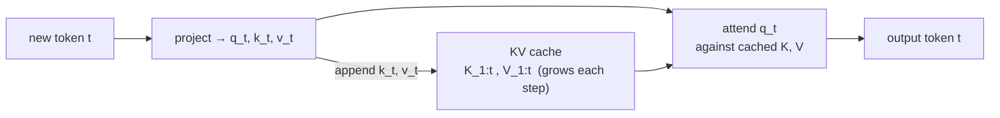
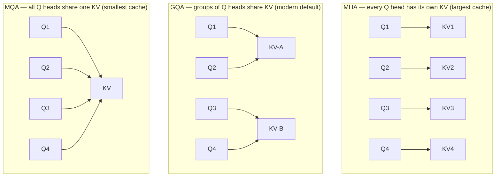
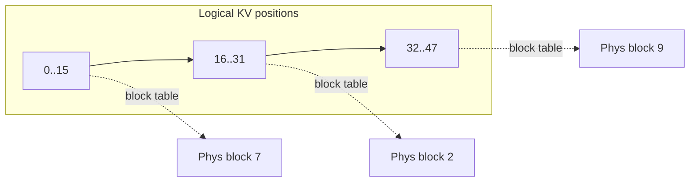

# attention 效率

  <strong>等級：</strong>初級→中階
  <strong>先備知識：</strong> <a href="../transformer-systems/">作為系統的 Transformer</a>、attention
  <strong>硬體：</strong> 無

attention 是系統故事開始變得有趣的地方，因為**同一個操作在 training 時 compute-bound、在
inference 時 memory-bound**。這一頁談 KV cache（為什麼存在、成本多少）、為什麼 decode 會
撞上記憶體牆，以及 PagedAttention 如何在不浪費記憶體的前提下管理快取。

## 回顧：縮放點積 attention

對於查詢 $Q\in\mathbb{R}^{N\times d}$、鍵 $K$、值 $V$：

$$ \text{Attn}(Q,K,V) = \text{softmax}\!\left(\frac{QK^\top}{\sqrt{d}} + M\right) V $$

其中 $M$ 是因果遮罩（上三角為 $-\infty$）。兩個 matmul 夾一個 row-softmax。training 時，
我們一次算出全部 $N$ 個 query 位置。

## KV 快取：用記憶體換取 FLOP

inference 時，我們一次生成一個 token。最笨的做法是：要產生 token $t$，就在整段前綴上重算
attention——每一步都把先前所有 token 的 key 和 value 重新投影一遍，這是 $O(N^2)$ 的浪費。
取而代之，我們**快取**已經看過的每個位置的 key 與 value。於是 step $t$ 變成：

1. 只投影*新* token，得到 $q_t, k_t, v_t$。
2. 把 $k_t, v_t$ 接到快取尾端。
3. 讓 $q_t$ 對*快取中的* $K_{1:t}, V_{1:t}$ 做 attention。

這是 inference 最重要的一個優化。但它把瓶頸搬了個位置：現在**每一步都得把整個快取完整
讀一遍**。

### 快取的成本是多少

每個 token、每層，快取存下 $K$ 和 $V$ 共 $2 \cdot n_{kv} \cdot d_h$ 個值，其中 $n_{kv}$ 是
**KV 頭**數、$d_h$ 是頭維度。換算成 bytes（bf16 為 2）：

$$ \text{cache bytes} = 2 \cdot L \cdot n_{kv} \cdot d_h \cdot 2 \cdot N \cdot B. $$

以 Llama-2-13B 級的模型（$L=40$、$n_{kv}=40$ 頭、$d_h=128$）為例，在 $N=4096$、$B=1$ 時：
$2\cdot40\cdot40\cdot128\cdot2\cdot4096 \approx 3.4$ GB——而且這只是*單一序列*。一旦 $B$ 或
$N$ 往上推，限制你記憶體的就會是 KV cache 而非權重。這條式子催生了：

- **Multi-Query Attention（MQA）**——所有 query 頭共用一個 KV 頭（$n_{kv}=1$）。
- **Grouped-Query Attention（GQA）**——少數幾個 KV 頭，各由一組 query 頭共用（現代預設）。
- **Multi-head Latent Attention（MLA）**——DeepSeek 對 KV cache 的低秩壓縮（見 [case studies](../moe/case-studies.md)）。

更少的 KV 頭 → 更小的快取 → 每個 decode 步驟搬移的頻寬更少，代價是少許品質。GQA 是大多數
量產模型的折衷點；MLA 更進一步，把 KV 壓成低秩 latent。

用 $n_{kv}=8$ 取代 40，GQA 把快取砍掉 5 倍、品質幾乎沒損失——這是純粹寫在架構裡的系統
勝利。

## 為什麼 decoding 受記憶體限制

套用 roofline。在 decode step $t$、batch $B=1$ 時，attention 執行
$O(t\cdot d_h\cdot n_{heads})$ FLOP，卻必須**讀進**整個 KV cache，即
$O(t\cdot n_{kv}\cdot d_h)$ 個值。算術強度是 $O(1)$——與 $t$ 無關而且很小。所以 attention
步驟（其實是整個 decode step，因為它還要把所有模型權重重讀一遍才能生出一個 token）是
**bandwidth-bound**。

由此推出的結論驅動了整個 LLM serving：

- **每 token latency 由讀進的 bytes 決定，而非 FLOP。** 把權重 bytes 減半（例如 int8/fp8
  權重），在 batch 1 時大約把 decode latency 也減半。
- **throughput 來自批次。** 把 $B$ 個請求一起跑，讀權重的成本攤到 $B$ 個 token 上，強度
  往脊點方向提升——這就是 [continuous batching](../performance/inference-optimization.md)
  的基礎。
- **prefill ≠ decode。** prefill 一次處理整段 prompt（很多 token、compute-bound）；decode
  一次一個 token（memory-bound）。好的 serving 系統會分別排程它們，甚至把兩者
  [拆到不同硬體](../performance/inference-optimization.md)上跑。

## 分頁 attention：停止浪費緩存

早期的 server 會替每個請求預先配置一塊連續的 KV 緩衝區，大小取*最大*序列長度。這有兩個
問題：**內部碎片**（一個請求只停在 200 個 token，卻仍佔著 4096-token 的緩衝區），以及
無法在有共同前綴的請求之間共享記憶體。

**PagedAttention**（出自 vLLM）借用了虛擬記憶體的點子：把 KV cache 切成固定大小的
**區塊（block）**（例如 16 個 token），並為每個請求維護一張**區塊表（block table）**，
把邏輯位置映射到實體區塊。於是：

- 區塊按需配置 → 內部碎片趨近於零（只浪費每個序列最後一個沒填滿的區塊）。
- beam search／平行取樣／共享系統提示可以用 copy-on-write **共享**實體區塊。
- attention kernel 透過 block table 去 gather K/V，而不是假設它們連續。

這常常能讓 serving throughput 翻倍，在同樣的 HBM 裡塞進更多並發序列。我們會在
[inference & serving](../moe/inference-serving.md) 再回到這裡——在 MoE 上，*expert* 的記憶體
壓力會疊加在 KV 壓力之上。

## Flashattention 適合的地方

上面講的都是 *inference* 的記憶體。**FlashAttention** 攻打的是另一種成本：在
*training/prefill* 時，$N\times N$ 的分數矩陣很大，把它寫進 HBM 才是瓶頸。下一頁會從零
推導 FlashAttention——它用 **online softmax** 和 **tiling**，把所有東西留在晶片上的 SRAM、
從不具現化分數矩陣。這是「靠融合提高算術強度」的教科書案例，直接出自 roofline 劇本。

## 要點

- **KV cache** 把 $O(N^2)$ 的重算換成 $O(N)$ 的計算加上一筆持續變大的記憶體讀取。它的大小
  $2 L n_{kv} d_h \cdot 2 N B$ bytes 常常主導 inference 的記憶體用量。
- GQA/MQA/MLA 是針對 KV cache 大小的**架構層級**攻擊。
- **decode 受記憶體頻寬限制**：latency 追著搬移的 bytes 走，throughput 來自批次；prefill 則
  是 compute-bound。
- **PagedAttention** 消除 KV 碎片並啟用共享，做法正如虛擬記憶體裡的分頁。

## 練習

!!! tip "解決方案"
    參考解答位於 [解答頁](../solutions/foundations.md) 上。請先嘗試每個練習，再展開解答。

1. 用 $L=32$、$n_{kv}=8$、$d_h=128$，在 $N=8192$、$B=16$、bf16 下計算一個 GQA 模型的 KV
   cache 大小，並與模型權重（約 7B 參數）相比。
2. 把單一 decode attention 步驟的算術強度寫成 $t$ 的函數，確認它是 $O(1)$。
3. 對於 16-token 區塊，當序列長度在 $[1, 4096]$ 均勻分佈時，最後一個區塊的碎片平均浪費多少
   KV 記憶體？
4. MLA 把 K/V 壓成維度 $d_c \ll n_{kv}d_h$ 的 latent。寫出它相對 GQA 的快取大小比，並說明它在
   decode 時的計算／記憶體取捨。

## 參考文獻

- Shazeer. _Fast Transformer Decoding: One Write-Head Is All You Need（MQA）._ 2019。
- Ainslie et al. _GQA: Training Generalized Multi-Query Transformer Models._ 2023。
- Dao et al. _FlashAttention._ 2022（下一頁會推導）。
- Kwon et al. _Efficient Memory Management for LLM Serving with PagedAttention（vLLM）._ 2023。
- DeepSeek-AI. _DeepSeek-V2 / V3 Technical Report（MLA）._ 2024。
