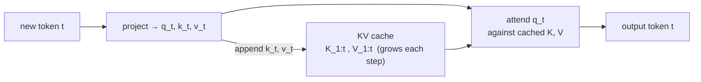
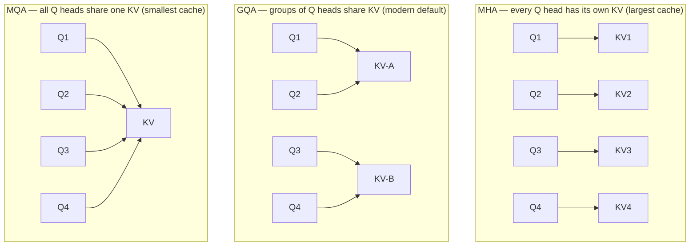
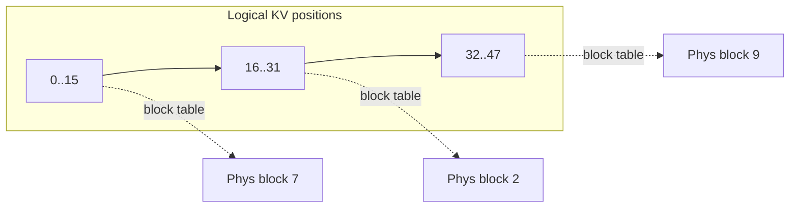

# attention 效率

  <strong>等級：</strong>初級→中階
  <strong>先備知識：</strong> <a href="../transformer-systems/">Transformer作為系統</a>、attention
  <strong>硬體：</strong> 無

attention 是系統故事變得有趣的地方，因為**相同的操作是
training 中受計算限制，inference**中受記憶體限制。此頁面涵蓋
KV 快取（為什麼存在以及它的成本），為什麼 decoding 會遇到記憶體牆，以及
分頁 attention 如何在不浪費記憶體的情況下管理快取。

## 回顧：縮放點積 attention

對於查詢 $Q\in\mathbb{R}^{N\times d}$、鍵 $K$、值 $V$：

$$ \text{Attn}(Q,K,V) = \text{softmax}\!\left(\frac{QK^\top}{\sqrt{d}} + M\right) V $$

帶有因果掩碼 $M$（上三角形 $=-\infty$）。兩個 matmul 和一個 row-softmax。
在 training 中，我們一次計算所有 $N$ 查詢位置的值。

## KV 快取：用記憶體換取 FLOP

在 inference，我們一次產生一個 token。天真地，要生產 token $t$，我們會
在整個前綴上重新計算 attention — 重新投影所有先前的 tokens'
每一步的鍵和值，都是 $O(N^2)$ 的浪費。相反，我們**緩存**密鑰並且
我們已經看到的每個職位的價值觀。步驟 $t$ 然後：

1. 僅投影*新* token 以獲得 $q_t, k_t, v_t$。
2. 將 $k_t, v_t$ 附加到快取。
3. 針對*快取的*$K_{1:t}, V_{1:t}$ 參加 $q_t$。

這是 inference 最重要的一項最佳化。但它移動了
瓶頸：必須**每一步都完整讀取快取**。

### 快取的成本是多少

每個 token，每層，快取儲存 $K$ 和 $V$：$2 \cdot n_{kv} \cdot d_h$
值，其中 $n_{kv}$ 是**KV 磁頭**的數量，$d_h$ 是磁頭暗度。在
位元組（bf16 為 2）：

$$ \text{cache bytes} = 2 \cdot L \cdot n\_{kv} \cdot d_h \cdot 2 \cdot N \cdot B. $$

對於 Llama-2-13B 型模型（$L=40$、$n_{kv}=40$ 頭、$d_h=128$），位於
$N=4096$、$B=1$：$2\cdot40\cdot40\cdot128\cdot2\cdot4096 \approx 3.4$ GB — 用於
_單一序列_。推送 $B$ 或 $N$ 並且 KV 快取（而不是權重）變成
你的記憶體限制。這個單一方程式激發了：

-**多重查詢 attention (MQA)**— 所有查詢頭共用一個 KV 頭 ($n_{kv}=1$)。 -**分組查詢 attention (GQA)**— 幾個 KV 頭，每個頭由一個群組共用（現代預設設定）。 -**多頭潛在 attention (MLA)**— DeepSeek 的 KV 快取低階壓縮（請參閱 [case studies](../moe/case-studies.md)）。

更少的 KV 頭 → 更小的快取 → 每個 decode 步驟的頻寬更少，在一定品質下
成本。 GQA 是大多數量產車型的最佳選擇； MLA 進一步推動
將 KV 壓縮到低秩潛在變數。

GQA 使用 $n_{kv}=8$ 而不是 40 將快取削減 5 倍，品質可以忽略不計
損失——架構中的純粹系統勝利。

## 為什麼 decoding 受記憶體限制

應用 roofline。在 decode 步驟$t$，批次$B=1$，attention 執行
$O(t\cdot d_h\cdot n_{heads})$ FLOP，但必須**讀取**整個 KV 緩存，
$O(t\cdot n_{kv}\cdot d_h)$ 值。 算術強度 是 $O(1)$ — 獨立
$t$ 且很小。 attention 步驟，實際上是整個 decode 步驟（其中
也重新讀取所有模型權重以產生一個 token），是**頻寬限制**。

後果驅動所有 LLM serving：

-**Per-token latency 由讀取的位元組設置，而不是 FLOP。**將權重位元組減半
（例如 int8/fp8 權重）〜在第 1 批中將 decode latency 減半。 -**throughput 來自批次。**一起運行 $B$ 請求和權重
讀取攤銷於 $B$ tokens，向山脊方向提高強度 —
[continuous batching](../performance/inference-optimization.md) 的基礎。 -**prefill ≠ decode。**prefill 一次處理整個提示（許多 tokens，
計算限制）； decode 是 token 之一（受記憶體限制）。良好的 serving 系統
以不同的方式安排它們，甚至
[disaggregate](../performance/inference-optimization.md) 將它們分開
硬體。

## 分頁 attention：停止浪費緩存

初始伺服器為每個請求預先分配一個連續的 KV 緩衝區，大小為
*最大*序列長度。兩個問題：**內部碎片**（一個請求
停止於 200 tokens 仍保留 4096-token 緩衝區）並且無法共享
具有公共前綴的請求之間的記憶體。

**Pagedattention**（來自 vLLM）借用了虛擬記憶體的想法：砍掉 KV 緩存
分成固定大小的**塊**（例如 16 tokens）並保留每個請求的**塊
表**將邏輯位置對應到物理區塊。現在：

- 按需分配區塊 → 內部碎片接近零（僅
  每個序列的最後部分區塊被浪費）。
- 束搜尋/平行樣本/共享系統提示**共享**物理
  阻止寫入時複製。
- attention kernel 透過塊表收集 K/V，而不是假設
  連續性。

這通常會使 serving throughput 增加一倍，讓你適應更多並發
相同 HBM 中的序列。我們回到它
[inference & serving](../moe/inference-serving.md)，其中 MoE 加 _expert_
記憶體壓力高於 KV 壓力。

## Flashattention 適合的地方

以上是關於*inference*記憶體的內容。**Flashattention**攻擊方式不同
成本：在 _training/prefill_ 中，$N\times N$ 分數矩陣很大並且寫入它
HBM 是瓶頸。下一頁從頭開始衍生 Flashattention——
它永遠不會使用**在線 softmax**和**平鋪**來具體化分數矩陣
將所有內容儲存在片上 SRAM 中。這是「提高
算術強度 透過融合”，直接來自 roofline 劇本。

## 要點

-**KV 快取**將 $O(N^2)$ 重新計算變成 $O(N)$ 計算 +
不斷增長的記憶體讀取。它的大小，$2 L n_{kv} d_h \cdot 2 N B$字節，經常
支配 inference 記憶體。

- GQA/MQA/MLA 是對 KV 快取大小的「架構」攻擊。 -**decoding 受記憶體頻寬限制**；latency 追蹤移動的字節，throughput
  來自批次處理。 prefill 受計算限制。 -**Pagedattention**消除了 KV 碎片並啟用共享，這樣
  分頁用於虛擬記憶體。

## 練習

!!! tip "解決方案"
    參考解答位於 [解答頁](../solutions/foundations.md) 上。請先嘗試每個練習，再展開解答。

1. 使用 $L=32$、$n_{kv}=8$、$d_h=128$ 計算 GQA 模型的 KV 快取大小
   在 $N=8192$、$B=16$、bf16。與模型權重（~7B 參數）進行比較。
2. 匯出單一 decode attention 步驟的 算術強度 作為
   $t$的功能。確認它是$O(1)$。
3. 對於 16-token 區塊，浪費了多少 KV 記憶體（最後一個區塊
   碎片）對於均勻分佈在 $[1, 4096]$ 中的序列？
4. MLA 將 K/V 壓縮為暗淡 $d_c \ll n_{kv}d_h$ 的潛在值。寫下
   快取大小比率與 GQA 的比較，並解釋其在計算/記憶體方面的權衡
   decode 時間。

## 參考文獻

- 沙澤爾。 _快速 Transformer decoding：你只需要一個寫頭_ (MQA)。 2019.
- 安斯利等人。 _GQA：training 通用多查詢 Transformer 模型。 _ 2023 年。
- 道等人。 _Flashattention._ 2022。 （源自下一頁）
- 權等人。 _使用 Pagedattention_ (vLLM) 實現 LLM serving 的高效能記憶體管理。 2023 年。
- DeepSeek-AI。 _DeepSeek-V2 / V3 技術報告_ (MLA)。 2024 年。
