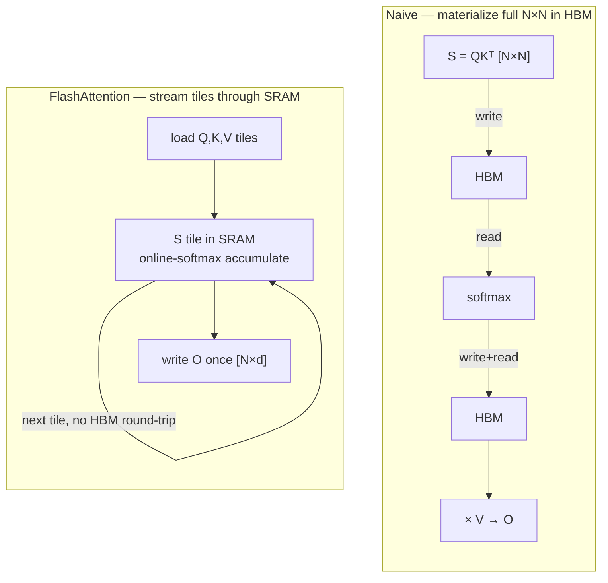

# 從零實作 FlashAttention

<div class="page-meta">
  <span class="chip"><strong>等級：</strong>中階</span>
  <span class="chip"><strong>先備知識：</strong> <a href="../attention-efficiency/">attention 效率</a>、softmax、roofline</span>
  <span class="chip"><strong>程式碼：</strong> <code>code/attention/</code>（在 CPU 上可跑）</span>
</div>

FlashAttention 是 roofline 劇本的教科書範例：它算出*完全相同*的 attention 輸出，卻
**從不把 $N\times N$ 分數矩陣寫進 HBM**，於是把一個 memory-bound 的操作變成 compute-bound。
訣竅是 **online softmax**——用單次串流傳遞算出數值穩定的 softmax——再搭配 **tiling（分塊）**。
本頁會把兩者都推導出來，並給一份可執行、可對照 PyTorch 驗證的 numpy 參考實作。

## naive attention 的問題

單一 query 區塊的標準 attention：

```python
S = Q @ K.T / sqrt(d)      # [N, N]  <- materialized in HBM
P = softmax(S, axis=-1)    # [N, N]  <- read + write again
O = P @ V                  # [N, d]
```

分數矩陣 $S$ 是 $N\times N$。在 $N=8192$ 時就有 6700 萬個元素——要寫進 HBM、為了 softmax 再
讀回、又寫出、再讀進來算 $PV$。相比之下 matmul 本身很便宜；我們是被這個二次大小的張量
**memory-bound** 住了。我們想算出 $O$，卻只在晶片上的 SRAM 裡放 $S$ 的小*分塊*。

障礙在於：**softmax 需要對整列做歸一化**（$\sum_j e^{s_j}$），這看起來得拿到整個 $S$ 才行。
online softmax 正是用來消除這個障礙。

## 線上 softmax：running-max 技巧

我們要算 $\text{softmax}(x)_i = e^{x_i - m} / \sum_j e^{x_j - m}$，其中 $m=\max_j x_j$
（減掉最大值可維持數值穩定——見 [數值與精度](numerics-precision.md)）。假設我們把 $x$ 分成
兩塊 $x^{(1)}, x^{(2)}$ 看到，想把部分結果合併起來。

維護一個 running max $m$ 與 running 分母 $\ell$。處理完區塊 1 之後：

$$ m_1 = \max(x^{(1)}), \qquad \ell_1 = \sum_{j} e^{x^{(1)}_j - m_1}. $$

當區塊 2 帶著局部最大值 $m_2' = \max(x^{(2)})$ 到來，**新的全域最大值**是
$m_2 = \max(m_1, m_2')$。舊分母是用*舊*最大值算的，所以在加入新區塊的貢獻之前，先把它
乘上 $e^{m_1 - m_2}$ **重新縮放**：

$$ \ell_2 = e^{m_1 - m_2}\,\ell_1 + \sum_j e^{x^{(2)}_j - m_2}. $$

校正因子 $e^{m_{\text{old}} - m_{\text{new}}}$ 就是整個點子。它讓我們一次摺疊一個區塊，最後
得到*精確的* softmax 分母——而且從不需要同時持有整個 $x$。

### 擴展到加權和$O = PV$

attention 要的不只是分母，還要 $O = \sum_j p_j v_j$，其中 $p_j = e^{s_j - m}/\ell$。我們維護
一個**未歸一化**的 running 輸出 $\tilde{O} = \sum_j e^{s_j - m} v_j$，並在每次更新最大值時用
「同一個」因子重新縮放它：

$$ \tilde{O} \leftarrow e^{m_{\text{old}} - m_{\text{new}}}\,\tilde{O} + \sum_{j \in \text{block}} e^{s_j - m_{\text{new}}}\, v_j. $$

最後 $O = \tilde{O} / \ell$。現在我們有了一個串流演算法，每個 key/value 區塊只碰一次。

## 平鋪演算法

把 $K, V$ 切成每塊 $B_c$ 列的區塊，把 $Q$ 切成每塊 $B_r$ 列的區塊。對每個 query 區塊，
迴圈走過所有 key/value 區塊，為每一個 query 列維護 $(m, \ell, \tilde O)$：

```text
for each query block Qi:                      # outer (rows of output)
    m = -inf;  l = 0;  O_acc = 0              # per-row running state
    for each key/value block (Kj, Vj):        # inner (streaming)
        S = Qi @ Kj.T / sqrt(d)               # [Br, Bc]  small tile, stays in SRAM
        apply causal mask to S if needed
        m_new = max(m, rowmax(S))             # update running max
        P = exp(S - m_new)                     # [Br, Bc]
        alpha = exp(m - m_new)                 # correction for old state
        l = alpha * l + rowsum(P)
        O_acc = alpha * O_acc + P @ Vj
        m = m_new
    Oi = O_acc / l                            # normalize once at the end
    write Oi to HBM                            # the ONLY N×d write
```



現在 HBM 記憶體流量是 $O(N d)$（$Q,K,V$ 各讀一次、$O$ 寫一次），而不是 $O(N^2)$。分數區塊
在 SRAM 裡生成又消失。FLOP 完全沒變——所以在 roofline 上，我們大幅往**右**移（強度更高），
kernel 變成 compute-bound。整個勝利就在這裡。

!!! note "反向傳播"
    反向傳播會即時重算 $S$ 的分塊（很便宜），而不是把它們存起來——用一點額外計算換大量
    記憶體。FlashAttention-2 改良了工作切分（更少重新縮放、沿序列維度平行化）；
    FlashAttention-3 用上 Hopper 的非同步複製（TMA）與 fp8。*上面這套數學在所有版本中都一樣*。

## 參考實作（可運行）

一份忠於原意、易讀的 numpy 實作放在
[`code/attention/flash_attention_numpy.py`](https://github.com/youyun8/deep-kernel-handbook/blob/main/code/attention/flash_attention_numpy.py)。
核心迴圈如下：

```python
import numpy as np

def flash_attention(Q, K, V, block=64, causal=True):
    """Tiled, online-softmax attention. Matches softmax(QK^T/sqrt(d))V exactly."""
    N, d = Q.shape
    scale = 1.0 / np.sqrt(d)
    O = np.zeros((N, d), dtype=np.float32)
    for i in range(0, N, block):                      # query tile
        qi = Q[i:i+block] * scale
        m = np.full((qi.shape[0], 1), -np.inf)        # running max
        l = np.zeros((qi.shape[0], 1))                # running denom
        acc = np.zeros((qi.shape[0], d))              # unnormalized output
        for j in range(0, N, block):                  # key/value tile
            if causal and j > i + block - 1:
                break                                 # skip fully-masked tiles
            kj, vj = K[j:j+block], V[j:j+block]
            s = qi @ kj.T                             # [Br, Bc] in "SRAM"
            if causal:                                # mask within the diagonal tile
                qpos = (i + np.arange(qi.shape[0]))[:, None]
                kpos = (j + np.arange(kj.shape[0]))[None, :]
                s = np.where(kpos <= qpos, s, -np.inf)
            m_new = np.maximum(m, s.max(axis=1, keepdims=True))
            p = np.exp(s - m_new)                      # [Br, Bc]
            alpha = np.exp(m - m_new)                  # rescale old state
            l = alpha * l + p.sum(axis=1, keepdims=True)
            acc = alpha * acc + p @ vj
            m = m_new
        O[i:i+block] = acc / l                         # normalize once
    return O
```

測試 [`code/attention/test_attention.py`](https://github.com/youyun8/deep-kernel-handbook/blob/main/code/attention/test_attention.py)
會在隨機輸入（含與不含因果遮罩）下，用 `torch.allclose`（atol 1e-5）對照密集的 PyTorch
參考實作驗證。執行：

```bash
pip install -r code/requirements.txt
pytest code/attention -q
```

獨立的 [`online_softmax.py`](https://github.com/youyun8/deep-kernel-handbook/blob/main/code/attention/online_softmax.py)
把 running-max 組合器單獨拎出來示範，並證明它等於一次到位的 softmax——如果你覺得那個重新
縮放像在變魔術，先看這份。

GPU 版本（真正分塊的 Triton kernel）在 [Triton 路線](../performance/triton-track.md)；同一套
online softmax 數學會再次出現，只是換成在 SRAM 分塊上的 `tl.load`/`tl.dot`。

## 要點

- softmax 的列歸一化看似擋住了串流，但 **online softmax** 靠 running max $m$、running 分母
  $\ell$ 與校正因子 $e^{m_{\text{old}}-m_{\text{new}}}$，一次傳遞就算出精確結果。
- FlashAttention 把 $Q,K,V$ 分塊、分數分塊只留在 SRAM，於是 HBM 流量從 $O(N^2)$ 降到
  $O(Nd)$——這是 roofline 上由 memory-bound 轉成 compute-bound 的轉變。
- 輸出與樸素 attention **數值相同**（差在 fp 捨入）；這是系統優化，不是近似。
- FA-2/FA-3 以及每一個融合的 attention kernel（包括 MoE 友善版本）用的都是同一套演算法。

## 練習

!!! tip "解決方案"
    參考解答位於 [解答頁](../solutions/foundations.md) 上。請先嘗試每個練習，再展開解答。

1. 證明 online-softmax 組合器是精確的：說明按區塊摺疊會得到與在整列上計算 softmax 相同的
   $\ell$ 與 $\tilde O$。
2. 為什麼要減掉 running max？構造一組輸入（例如 +100 的分數），讓略過這步會在 fp16 溢位，
   再確認穩定版本不會。
3. 修改參考實作，跳過在因果遮罩下「完全」被遮蔽的 key 分塊（範例已部分做到），並量測
   $N=4096$ 時 FLOP 的減少量。
4. 估計 $N=8192, d=128$ 時樸素 attention 與 FlashAttention 各自搬移的 HBM bytes，並把兩者
   放到 H100 roofline 上。

## 參考文獻

- Milakov & Gimelshein. _Online Normalizer Calculation for Softmax._ 2018。
- Dao, Fu, Ermon, Rudra, Ré. _FlashAttention: Fast and Memory-Efficient Exact Attention with IO-Awareness._ 2022。
- Dao. _FlashAttention-2._ 2023。
- Shah et al. _FlashAttention-3._ 2024。
- Rabe & Staats. _Self-attention Does Not Need $O(n^2)$ Memory._ 2021。
