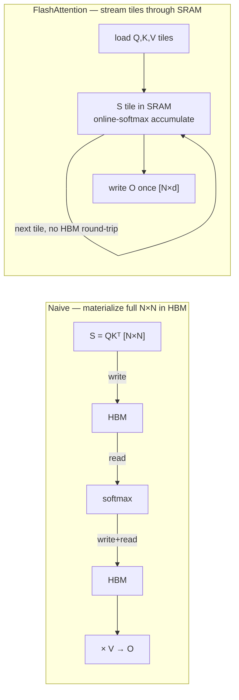

# Flashattention 從頭開始

<div class="page-meta">
  <span class="chip"><strong>等級：</strong>中階</span>
  <span class="chip"><strong>先備知識：</strong> <a href="../attention-efficiency/">attention 效率</a>、softmax、roofline</span>
  <span class="chip"><strong>代碼：</strong> <code>code/attention/</code>（在CPU上運行）</span>
</div>

Flashattention 是 roofline 劇本的教科書範例：它計算
_完全相同_ attention 輸出，但**從不寫入 $N\times N$ 分數
矩陣到 HBM**，將受記憶體限制的操作轉變為受計算限制的操作。竅門
是**online softmax**— 在一次計算中計算數值穩定的 softmax
流傳遞－與**平鋪**結合。我們在這裡推導出兩者並給出一個 numpy
你可以運行並檢查 PyTorch 的參考。

## naive attention 的問題

一個查詢區塊的標準 attention：

```python
S = Q @ K.T / sqrt(d)      # [N, N]  <- materialized in HBM
P = softmax(S, axis=-1)    # [N, N]  <- read + write again
O = P @ V                  # [N, d]
```

得分矩陣 $S$ 為 $N\times N$。在 $N=8192$ 中，有 67M 個條目 — 寫入
HBM，讀回 softmax，再寫入，再讀取$PV$。馬特穆爾斯
相對於該流量來說便宜；我們在二次方上受**內存限制
張量**。我們想要生產 $O$，同時只持有 $S$ 的小*磁磚*
片上 SRAM。

障礙：**softmax 需要對整行進行歸一化器**($\sum_j
立即 e^{s_j}$), which seems to require all of $S$。在線 softmax 刪除了這一點
障礙。

## 線上 softmax：running-max 技巧

我們想要 $\text{softmax}(x)_i = e^{x_i - m} / \sum_j e^{x_j - m}$ 在哪裡
$m=\max_j x_j$（減去最大值可以保持數值穩定 - 請參閱
[numerics](numerics-precision.md)）。假設我們看到 $x$ 分成兩個區塊
$x^{(1)}, x^{(2)}$ 並且想要合併部分結果。

保持運行最大值 $m$ 和運行分母 $\ell$。在區塊 1 之後：

$$ m*1 = \max(x^{(1)}), \qquad \ell_1 = \sum*{j} e^{x^{(1)}\_j - m_1}. $$

當區塊 2 以本地最大值 $m_2' = \max(x^{(2)})$ 到達時，**新的全域
最大**為$m_2 = \max(m_1, m_2')$。舊分母是根據
*舊*最大值，所以我們在新增區塊之前透過 $e^{m_1 - m_2}$**重新調整**它
貢獻：

$$ \ell_2 = e^{m_1 - m_2}\,\ell_1 + \sum_j e^{x^{(2)}\_j - m_2}. $$

校正因子 $e^{m_{\text{old}} - m_{\text{new}}}$ 就是整個想法。
它讓我們一次折疊一個區塊並得到*精確的*softmax 分母
最後 — 永遠不需要同時使用所有 $x$。

### 擴展到加權和$O = PV$

attention 不僅需要分母，還需要分母。它需要 $O = \sum_j p_j v_j$
$p_j = e^{s_j - m}/\ell$。保持**非標準化**運行輸出
$\tilde{O} = \sum_j e^{s_j - m} v_j$ 並在任何時候透過「相同」因子重新調整它
最大更新次數：

$$ \tilde{O} \leftarrow e^{m*{\text{old}} - m*{\text{new}}}\,\tilde{O} + \sum*{j \in \text{block}} e^{s_j - m*{\text{new}}}\, v_j. $$

最後，$O = \tilde{O} / \ell$。我們現在有一個流演算法
每個鍵/值區塊恰好接觸一次。

## 平鋪演算法

將 $K, V$ 拆分為 $B_c$ 行區塊，將 $Q$ 拆分為 $B_r$ 行區塊。對於
每個查詢區塊，循環鍵/值區塊，維護 $(m, \ell, \tilde O)$
每個查詢行：

```text
for each query block Qi:                      # outer (rows of output)
    m = -inf;  l = 0;  O_acc = 0              # per-row running state
    for each key/value block (Kj, Vj):        # inner (streaming)
        S = Qi @ Kj.T / sqrt(d)               # [Br, Bc]  small tile, stays in SRAM
        apply causal mask to S if needed
        m_new = max(m, rowmax(S))             # update running max
        P = exp(S - m_new)                     # [Br, Bc]
        alpha = exp(m - m_new)                 # correction for old state
        l = alpha * l + rowsum(P)
        O_acc = alpha * O_acc + P @ Vj
        m = m_new
    Oi = O_acc / l                            # normalize once at the end
    write Oi to HBM                            # the ONLY N×d write
```



HBM 的記憶體流量現在為 $O(N d)$（讀取 $Q,K,V$ 一次，寫入 $O$ 一次）
$O(N^2)$。分數區塊在 SRAM 中存在和消失。 FLOP 沒有改變——所以
在 roofline 上，我們急劇**右**（更高強度）和 kernel
變得受計算限制。這就是全部勝利。

!!! note "向後傳遞"
    向後傳遞會動態重新計算 $S$ 的圖塊（便宜），而不是
    儲存它們——用一點額外的計算來節省大量的記憶體。
    Flashattention-2 改進了工作分區（更少的重新縮放、並行化
    在序列上變暗）； Flashattention-3 利用 Hopper 的非同步複製
    （TMA）和 fp8。 _以上數學在所有版本中都是相同的_。

## 參考實作（可運行）

一個忠實的、可讀的 numpy 實作位於
[`code/attention/flash_attention_numpy.py`](https://github.com/youyun8/ml-perf-handbook/blob/main/code/attention/flash_attention_numpy.py)。
核心循環：

```python
import numpy as np

def flash_attention(Q, K, V, block=64, causal=True):
    """Tiled, online-softmax attention. Matches softmax(QK^T/sqrt(d))V exactly."""
    N, d = Q.shape
    scale = 1.0 / np.sqrt(d)
    O = np.zeros((N, d), dtype=np.float32)
    for i in range(0, N, block):                      # query tile
        qi = Q[i:i+block] * scale
        m = np.full((qi.shape[0], 1), -np.inf)        # running max
        l = np.zeros((qi.shape[0], 1))                # running denom
        acc = np.zeros((qi.shape[0], d))              # unnormalized output
        for j in range(0, N, block):                  # key/value tile
            if causal and j > i + block - 1:
                break                                 # skip fully-masked tiles
            kj, vj = K[j:j+block], V[j:j+block]
            s = qi @ kj.T                             # [Br, Bc] in "SRAM"
            if causal:                                # mask within the diagonal tile
                qpos = (i + np.arange(qi.shape[0]))[:, None]
                kpos = (j + np.arange(kj.shape[0]))[None, :]
                s = np.where(kpos <= qpos, s, -np.inf)
            m_new = np.maximum(m, s.max(axis=1, keepdims=True))
            p = np.exp(s - m_new)                      # [Br, Bc]
            alpha = np.exp(m - m_new)                  # rescale old state
            l = alpha * l + p.sum(axis=1, keepdims=True)
            acc = alpha * acc + p @ vj
            m = m_new
        O[i:i+block] = acc / l                         # normalize once
    return O
```

測試[`code/attention/test_attention.py`](https://github.com/youyun8/ml-perf-handbook/blob/main/code/attention/test_attention.py)
使用 `torch.allclose` (atol 1e-5) 對照密集的 PyTorch 參考進行檢查
隨機輸入，帶或不帶因果掩碼。運行它：

```bash
pip install -r code/requirements.txt
pytest code/attention -q
```

獨立的 [`online_softmax.py`](https://github.com/youyun8/ml-perf-handbook/blob/main/code/attention/online_softmax.py)
孤立地展示了 running-max 組合器並證明它等於一次性
softmax－如果重新縮放感覺像魔法一樣，請先閱讀這篇文章。

GPU 版本（真正的平鋪 Triton kernel）位於
[Triton track](../performance/triton-track.md)；相同的線上 softmax 數學
再次出現，只是 `tl.load`/`tl.dot` 位於 SRAM 區塊上。

## 要點

- Softmax 的行歸一化器似乎會阻止串流傳輸，但**線上 softmax**
  透過運行最大值 $m$ 一次計算精確結果，運行
  分母 $\ell$ 和校正因子 $e^{m_{\text{old}}-m_{\text{new}}}$。
- Flashattention 平鋪 $Q,K,V$ 並將得分平鋪保留在 SRAM 中，從而減少 HBM 流量
  從 $O(N^2)$ 到 $O(Nd)$ — roofline 從記憶體綁定到計算綁定的轉變。
- 輸出與簡單的 attention**數字相同**（最高 fp 舍入）；
  這是系統最佳化，而不是近似值。
- FA-2/FA-3 和每個融合的 attention kernel 的演算法相同，
  包括 MoE 友善的。

## 練習

!!! tip "解決方案"
    參考解答位於 [解答頁](../solutions/foundations.md) 上。請先嘗試每個練習，再展開解答。

1. 證明 online-softmax 組合器是精確的：表示按塊折疊給出
   與在整行上計算 softmax 相同的 $\ell$ 和 $\tilde O$。
2. 為什麼要減去跑步最大值？建構輸入（例如 +100 的分數）
   跳過它會溢出 fp16，並確認穩定版本仍然存在。
3. 修改參考以跳過在因果關係下「完全」掩蓋的關鍵圖塊
   （已經部分完成）並測量 $N=4096$ 的 FLOP 減少量。
4. 估計 $N=8192, d=128$ 處 naive 與閃存 attention 移動的 HBM 位元組，以及
   將兩者都放置在 H100 roofline 上。

## 參考文獻

- 米拉科夫和吉梅爾謝因。 _softmax 的線上標準化器計算。 _ 2018。
- Dao、Fu、Ermon、Rudra、Ré。 _Flashattention：快速且記憶體高效的精確 attention，具有 IO 感知功能。 _ 2022 年。
- 道。 _Flashattention-2。 _ 2023 年。
- 沙阿等人。 _Flashattention-3。 _ 2024 年。
- 拉貝和斯塔茨。 _自製 attention 不需要$O(n^2)$記憶體。 _ 2021。
