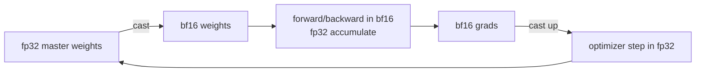

# Numerics & precision

<div class="page-meta">
  <span class="chip"><strong>Level:</strong> beginner → intermediate</span>
  <span class="chip"><strong>Prereqs:</strong> floating point basics helpful</span>
  <span class="chip"><strong>Hardware:</strong> none</span>
</div>

Low precision is the cheapest speedup in ML: halving the bits ~halves memory
traffic and (with tensor cores) multiplies throughput. But precision is where
silent correctness bugs live. This page explains the formats, **why bf16 beat
fp16 for training**, mixed precision and loss scaling, and the stability rules
that keep low-precision models from quietly diverging.

## Floating point in one picture

A float is $(-1)^{s} \cdot 1.m \cdot 2^{e-\text{bias}}$: a sign bit, $E$ exponent
bits (dynamic **range**), $M$ mantissa bits (**precision**). The split is the
whole story.

| Format | Bits | Exp | Mantissa | Max | Smallest normal | ~Decimal digits |
|---|---|---|---|---|---|---|
| fp32 | 32 | 8 | 23 | 3.4e38 | 1.2e-38 | ~7 |
| tf32 (NVIDIA) | 19* | 8 | 10 | 3.4e38 | 1.2e-38 | ~3 |
| fp16 | 16 | 5 | 10 | 65504 | 6.1e-5 | ~3 |
| bf16 | 16 | **8** | 7 | 3.4e38 | 1.2e-38 | ~2 |
| fp8 E4M3 | 8 | 4 | 3 | 448 | ~2e-3 | ~1 |
| fp8 E5M2 | 8 | 5 | 2 | 57344 | ~6e-5 | <1 |

<small>*tf32 is stored in 32 bits but multiplies with a 10-bit mantissa.</small>

The key trade: **bf16 keeps fp32's 8 exponent bits** (same range, ~3e38) but
spends only 7 bits on the mantissa. fp16 keeps 10 mantissa bits but only 5
exponent bits → it **overflows at 65504** and underflows around 6e-5.

## Why bf16 won training

Gradients and activations in large models span a huge dynamic range and
occasionally spike. fp16's narrow exponent means those spikes **overflow to
`inf`** (then `NaN` propagates everywhere) and tiny gradients **underflow to
zero**. Training in pure fp16 required *loss scaling* — multiply the loss by a
large factor $S$ so gradients land in fp16's representable window, then divide it
back out — plus dynamic adjustment of $S$ when overflow is detected. It works,
but it's fragile.

bf16 has fp32's range, so it almost never overflows; you trade away mantissa bits
(coarser rounding) which the accumulation strategy below hides. Result: **bf16
mixed precision usually needs no loss scaling** and "just works." This is why
every modern accelerator (and PyTorch AMP's recommended path) defaults to bf16.

!!! warning "Range vs precision are not interchangeable"
    bf16's 7-bit mantissa means $1 + x = 1$ for $x \lesssim 2^{-8}\approx 0.004$.
    Summing many small numbers into a bf16 accumulator loses them — which is
    exactly why you never accumulate in bf16 (next section).

## Mixed precision: the accumulation rule

"Mixed precision" doesn't mean *everything* is 16-bit. The rule:

- **Store and multiply** in low precision (bf16/fp16) — this is where the memory
  and tensor-core speedups come from.
- **Accumulate in fp32.** Tensor cores read bf16 inputs but accumulate the dot
  products in an fp32 register. Reductions (softmax sums, LayerNorm statistics,
  the optimizer's running moments, the loss) stay fp32.
- **Keep an fp32 master copy of the weights.** The optimizer updates the fp32
  master; a bf16 copy is cast for the forward/backward. Without this, tiny
  updates ($\text{lr}\cdot\text{grad}$) vanish under bf16 rounding and training
  stalls.



In PyTorch this is `torch.autocast` (chooses per-op precision) + `GradScaler`
(loss scaling, only needed for fp16):

```python
scaler = torch.cuda.amp.GradScaler(enabled=use_fp16)  # no-op for bf16
for x, y in loader:
    with torch.autocast("cuda", dtype=torch.bfloat16):
        loss = model(x, y)            # matmuls in bf16, softmax/norm in fp32
    scaler.scale(loss).backward()     # scale only matters for fp16
    scaler.step(opt); scaler.update()
    opt.zero_grad(set_to_none=True)
```

## fp8: the frontier

fp8 doubles tensor-core throughput again and halves activation/weight bytes, and
is now used in frontier *training* (DeepSeek-V3 trained its GEMMs largely in
fp8). Two formats, used for different tensors:

- **E4M3** (more mantissa, max 448): forward activations and weights, where
  precision matters more than range.
- **E5M2** (more range): gradients, which need the wider exponent.

fp8's representable range is tiny, so it needs **per-tensor or per-block
scaling factors** (a.k.a. "delayed scaling" or microscaling/MXFP8): track each
tensor's max, scale it into fp8's window, and keep the scale alongside the data.
Get the scaling wrong and you saturate to 448 or flush to zero. DeepSeek-V3's
recipe keeps fp8 GEMMs but **accumulates in higher precision** and keeps the
sensitive parts (router logits, norms, the optimizer) in bf16/fp32 — the same
"low precision for the matmul, high precision for the reduction" rule, pushed to
the limit. We cover this more in [quantization](../performance/quantization.md)
(which targets *inference*) and the [DeepSeek-V3 case study](../moe/case-studies.md).

## Stability rules that actually bite

- **Always subtract the max before `exp`** in softmax/cross-entropy
  (see [FlashAttention](flashattention.md)). Skipping it overflows fp16 and even
  bf16 for logits in the hundreds.
- **LayerNorm/RMSNorm statistics in fp32.** Variance of bf16 activations
  computed in bf16 is garbage.
- **Don't accumulate long reductions in 16-bit.** Use fp32 (or Kahan/pairwise).
- **Router/gating logits and the aux-loss in fp32** for MoE — routing decisions
  are discrete and a tie broken by rounding noise destabilizes load balancing
  (see [training stability](../moe/training-stability.md)).
- **Watch `bf16` weight-update underflow**: keep the fp32 master copy.

!!! tip "A 30-second self-check"
    If a model trains fine in fp32 but `NaN`s in 16-bit, the culprit is almost
    always (a) fp16 overflow → switch to bf16 or add loss scaling, or (b) a
    reduction/normalization left in 16-bit → force it to fp32.

## Key takeaways

- Exponent bits = range, mantissa bits = precision. **bf16 trades mantissa for
  fp32-equal range**, which is why it beat fp16 for training (no loss-scaling
  fragility).
- Mixed precision = low-precision **storage/matmul** + fp32 **accumulation** +
  fp32 **master weights**.
- fp8 is real for training but demands careful per-tensor/block scaling and
  high-precision accumulation.
- Most "low precision diverged" bugs are an overflow (fp16) or a reduction left
  in 16-bit; subtract-the-max and accumulate-in-fp32 fix the majority.

## Exercises

!!! tip "Solutions"
    Worked answers are on the [Part solutions page](../solutions/foundations.md). Try each exercise before expanding.

1. Find the largest logit value for which `exp` is finite in fp16 vs bf16.
   Relate it to the exponent-bit counts.
2. Show numerically that summing $10^6$ copies of `1e-3` in bf16 loses accuracy,
   and that an fp32 accumulator recovers it.
3. Implement dynamic loss scaling: double $S$ every $N$ clean steps, halve it on
   overflow. Why does bf16 rarely trigger the halving branch?
4. For fp8 E4M3 with a per-tensor scale, write the quantize/dequantize and find
   the relative error on a tensor whose max is 1000.

## References

- Micikevicius et al. *Mixed Precision Training.* 2017.
- Kalamkar et al. *A Study of BFLOAT16 for Deep Learning Training.* 2019.
- Micikevicius et al. *FP8 Formats for Deep Learning.* 2022.
- NVIDIA Transformer Engine docs (fp8 delayed scaling).
- DeepSeek-AI. *DeepSeek-V3 Technical Report* (fp8 training recipe). 2024.
