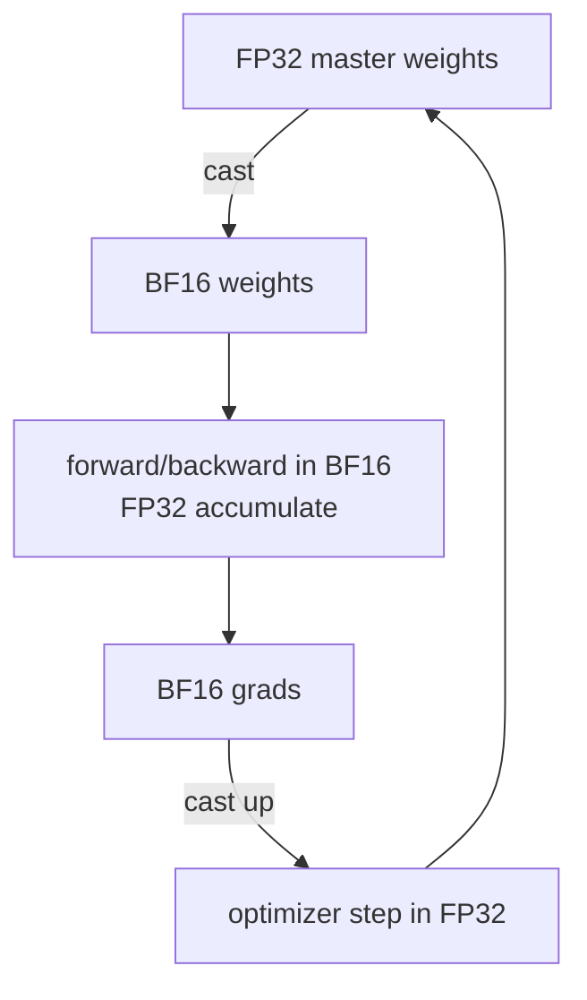

# 數值與精度

<div class="page-meta">
  <span class="chip"><strong>等級：</strong>初級→中階</span>
  <span class="chip"><strong>先備知識：</strong> 浮點基礎有助於</span>
  <span class="chip"><strong>硬體：</strong> 無</span>
</div>

低精度是機器學習中最便宜的加速：位數減半即記憶體與頻寬減半，並（透過 Tensor Core / Matrix Core）讓 throughput 倍增。但精度問題會以靜默的正確性錯誤潛伏其中。本頁解釋各種格式、**為什麼 BF16 在 training 上勝出**、FP16 的 mixed precision 與損失縮放，以及防止低精度模型悄悄發散的穩定性規則。

## 浮點數的數值模型

對於一個 normal number，給定符號位 $s$、指數欄位 $e$（bias 為 $b$），以及小數欄位 $f$（含隱含前導 1 共 $p$ 個 mantissa bits），其值為：

$$ x = (-1)^s \,(1 + f)\, 2^{\,e-b}, \qquad f=\sum_{i=1}^{p-1} d_i 2^{-i} $$

其中 $d_i \in \{0,1\}$ 為小數位元。對於 subnormal（指數欄位為全零）則去除隱含前導 1：

$$ x = (-1)^s\, f\, 2^{\,1-b} $$

直覺：**指數位元決定動態範圍，mantissa bits 決定精度**。這個分割就是整個故事。

各格式以 (sign, exponent, mantissa) 位元數呈現如下表：

| 格式          | (s, e, m)  | 位元 | 最大值 | 最小 normal | ~十進位有效位數 |
| ------------- | ---------- | ---- | ------ | ----------- | --------------- |
| FP32          | (1, 8, 23) | 32   | 3.4e38 | 1.2e-38     | ~7              |
| TF32 (NVIDIA) | (1, 8, 10) | 19\* | 3.4e38 | 1.2e-38     | ~3              |
| FP16          | (1, 5, 10) | 16   | 65504  | 6.1e-5      | ~3              |
| BF16          | (1, 8, 7)  | 16   | 3.4e38 | 1.2e-38     | ~2              |
| FP8 E4M3      | (1, 4, 3)  | 8    | 448    | ~2e-3       | ~1              |
| FP8 E5M2      | (1, 5, 2)  | 8    | 57344  | ~6e-5       | <1              |
| FP4 E2M1      | (1, 2, 1)  | 4    | 6.0    | 1.0         | <1              |

<small>\*TF32 以 32 位儲存，但乘法時僅取 10 位 mantissa。此處 mantissa 欄位皆指顯式儲存位元（不含隱含前導 1），故有效 $p = m + 1$。</small>

<figure>
<svg viewBox="0 0 760 500" role="img" aria-labelledby="fp-layout-title" xmlns="http://www.w3.org/2000/svg">
  <title id="fp-layout-title">各浮點格式位元佈局</title>
  <rect class="roofline-panel" x="10" y="10" width="740" height="480" rx="10"/>

  <!-- FP32 (1,8,23): 32 bits × 20px = 640px, x=100..740, rect y=50 -->
  <text class="fmt-label" x="92" y="68" text-anchor="end" font-size="12" font-weight="700">FP32</text>
  <text class="fmt-label-s" x="110" y="46" text-anchor="middle" font-size="10">s</text>
  <text class="fmt-label-e" x="200" y="46" text-anchor="middle" font-size="10">exponent (8 bit)</text>
  <text class="fmt-label-m" x="510" y="46" text-anchor="middle" font-size="10">fraction (23 bit)</text>
  <rect class="fmt-sign" x="100" y="50" width="20"  height="28"/>
  <rect class="fmt-exp"  x="120" y="50" width="160" height="28"/>
  <line class="fmt-grid" x1="140" y1="50" x2="140" y2="78"/><line class="fmt-grid" x1="160" y1="50" x2="160" y2="78"/>
  <line class="fmt-grid" x1="180" y1="50" x2="180" y2="78"/><line class="fmt-grid" x1="200" y1="50" x2="200" y2="78"/>
  <line class="fmt-grid" x1="220" y1="50" x2="220" y2="78"/><line class="fmt-grid" x1="240" y1="50" x2="240" y2="78"/>
  <line class="fmt-grid" x1="260" y1="50" x2="260" y2="78"/>
  <rect class="fmt-mant" x="280" y="50" width="460" height="28"/>
  <line class="fmt-grid" x1="300" y1="50" x2="300" y2="78"/><line class="fmt-grid" x1="320" y1="50" x2="320" y2="78"/>
  <line class="fmt-grid" x1="340" y1="50" x2="340" y2="78"/><line class="fmt-grid" x1="360" y1="50" x2="360" y2="78"/>
  <line class="fmt-grid" x1="380" y1="50" x2="380" y2="78"/><line class="fmt-grid" x1="400" y1="50" x2="400" y2="78"/>
  <line class="fmt-grid" x1="420" y1="50" x2="420" y2="78"/><line class="fmt-grid" x1="440" y1="50" x2="440" y2="78"/>
  <line class="fmt-grid" x1="460" y1="50" x2="460" y2="78"/><line class="fmt-grid" x1="480" y1="50" x2="480" y2="78"/>
  <line class="fmt-grid" x1="500" y1="50" x2="500" y2="78"/><line class="fmt-grid" x1="520" y1="50" x2="520" y2="78"/>
  <line class="fmt-grid" x1="540" y1="50" x2="540" y2="78"/><line class="fmt-grid" x1="560" y1="50" x2="560" y2="78"/>
  <line class="fmt-grid" x1="580" y1="50" x2="580" y2="78"/><line class="fmt-grid" x1="600" y1="50" x2="600" y2="78"/>
  <line class="fmt-grid" x1="620" y1="50" x2="620" y2="78"/><line class="fmt-grid" x1="640" y1="50" x2="640" y2="78"/>
  <line class="fmt-grid" x1="660" y1="50" x2="660" y2="78"/><line class="fmt-grid" x1="680" y1="50" x2="680" y2="78"/>
  <line class="fmt-grid" x1="700" y1="50" x2="700" y2="78"/><line class="fmt-grid" x1="720" y1="50" x2="720" y2="78"/>
  <text class="fmt-idx" x="110" y="92" text-anchor="middle" font-size="9">31</text>
  <text class="fmt-idx" x="130" y="92" text-anchor="middle" font-size="9">30</text>
  <text class="fmt-idx" x="270" y="92" text-anchor="middle" font-size="9">23</text>
  <text class="fmt-idx" x="290" y="92" text-anchor="middle" font-size="9">22</text>
  <text class="fmt-idx" x="730" y="92" text-anchor="middle" font-size="9">0</text>

  <!-- BF16 (1,8,7): 16 bits × 40px = 640px, x=100..740, rect y=120 -->
  <text class="fmt-label" x="92" y="138" text-anchor="end" font-size="12" font-weight="700">BF16</text>
  <text class="fmt-label-s" x="120" y="116" text-anchor="middle" font-size="10">s</text>
  <text class="fmt-label-e" x="300" y="116" text-anchor="middle" font-size="10">exponent (8 bit)</text>
  <text class="fmt-label-m" x="600" y="116" text-anchor="middle" font-size="10">fraction (7 bit)</text>
  <rect class="fmt-sign" x="100" y="120" width="40"  height="28"/>
  <rect class="fmt-exp"  x="140" y="120" width="320" height="28"/>
  <line class="fmt-grid" x1="180" y1="120" x2="180" y2="148"/><line class="fmt-grid" x1="220" y1="120" x2="220" y2="148"/>
  <line class="fmt-grid" x1="260" y1="120" x2="260" y2="148"/><line class="fmt-grid" x1="300" y1="120" x2="300" y2="148"/>
  <line class="fmt-grid" x1="340" y1="120" x2="340" y2="148"/><line class="fmt-grid" x1="380" y1="120" x2="380" y2="148"/>
  <line class="fmt-grid" x1="420" y1="120" x2="420" y2="148"/>
  <rect class="fmt-mant" x="460" y="120" width="280" height="28"/>
  <line class="fmt-grid" x1="500" y1="120" x2="500" y2="148"/><line class="fmt-grid" x1="540" y1="120" x2="540" y2="148"/>
  <line class="fmt-grid" x1="580" y1="120" x2="580" y2="148"/><line class="fmt-grid" x1="620" y1="120" x2="620" y2="148"/>
  <line class="fmt-grid" x1="660" y1="120" x2="660" y2="148"/><line class="fmt-grid" x1="700" y1="120" x2="700" y2="148"/>
  <text class="fmt-idx" x="120" y="162" text-anchor="middle" font-size="9">15</text>
  <text class="fmt-idx" x="160" y="162" text-anchor="middle" font-size="9">14</text>
  <text class="fmt-idx" x="440" y="162" text-anchor="middle" font-size="9">7</text>
  <text class="fmt-idx" x="480" y="162" text-anchor="middle" font-size="9">6</text>
  <text class="fmt-idx" x="720" y="162" text-anchor="middle" font-size="9">0</text>

  <!-- FP16 (1,5,10): 16 bits × 40px = 640px, x=100..740, rect y=192 -->
  <text class="fmt-label" x="92" y="210" text-anchor="end" font-size="12" font-weight="700">FP16</text>
  <text class="fmt-label-s" x="120" y="188" text-anchor="middle" font-size="10">s</text>
  <text class="fmt-label-e" x="240" y="188" text-anchor="middle" font-size="10">exponent (5 bit)</text>
  <text class="fmt-label-m" x="540" y="188" text-anchor="middle" font-size="10">fraction (10 bit)</text>
  <rect class="fmt-sign" x="100" y="192" width="40"  height="28"/>
  <rect class="fmt-exp"  x="140" y="192" width="200" height="28"/>
  <line class="fmt-grid" x1="180" y1="192" x2="180" y2="220"/><line class="fmt-grid" x1="220" y1="192" x2="220" y2="220"/>
  <line class="fmt-grid" x1="260" y1="192" x2="260" y2="220"/><line class="fmt-grid" x1="300" y1="192" x2="300" y2="220"/>
  <rect class="fmt-mant" x="340" y="192" width="400" height="28"/>
  <line class="fmt-grid" x1="380" y1="192" x2="380" y2="220"/><line class="fmt-grid" x1="420" y1="192" x2="420" y2="220"/>
  <line class="fmt-grid" x1="460" y1="192" x2="460" y2="220"/><line class="fmt-grid" x1="500" y1="192" x2="500" y2="220"/>
  <line class="fmt-grid" x1="540" y1="192" x2="540" y2="220"/><line class="fmt-grid" x1="580" y1="192" x2="580" y2="220"/>
  <line class="fmt-grid" x1="620" y1="192" x2="620" y2="220"/><line class="fmt-grid" x1="660" y1="192" x2="660" y2="220"/>
  <line class="fmt-grid" x1="700" y1="192" x2="700" y2="220"/>
  <text class="fmt-idx" x="120" y="234" text-anchor="middle" font-size="9">15</text>
  <text class="fmt-idx" x="160" y="234" text-anchor="middle" font-size="9">14</text>
  <text class="fmt-idx" x="320" y="234" text-anchor="middle" font-size="9">10</text>
  <text class="fmt-idx" x="360" y="234" text-anchor="middle" font-size="9">9</text>
  <text class="fmt-idx" x="720" y="234" text-anchor="middle" font-size="9">0</text>

  <!-- FP8 E4M3 (1,4,3): 8 bits × 80px = 640px, x=100..740, rect y=262 -->
  <!-- sign x=100 w=80; exp x=180 w=320; mant x=500 w=240 -->
  <text class="fmt-label" x="92" y="280" text-anchor="end" font-size="11" font-weight="700">FP8 E4M3</text>
  <text class="fmt-label-s" x="140" y="258" text-anchor="middle" font-size="10">s</text>
  <text class="fmt-label-e" x="340" y="258" text-anchor="middle" font-size="10">exponent (4 bit)</text>
  <text class="fmt-label-m" x="620" y="258" text-anchor="middle" font-size="10">fraction (3 bit)</text>
  <rect class="fmt-sign" x="100" y="262" width="80"  height="28"/>
  <rect class="fmt-exp"  x="180" y="262" width="320" height="28"/>
  <line class="fmt-grid" x1="260" y1="262" x2="260" y2="290"/>
  <line class="fmt-grid" x1="340" y1="262" x2="340" y2="290"/>
  <line class="fmt-grid" x1="420" y1="262" x2="420" y2="290"/>
  <rect class="fmt-mant" x="500" y="262" width="240" height="28"/>
  <line class="fmt-grid" x1="580" y1="262" x2="580" y2="290"/>
  <line class="fmt-grid" x1="660" y1="262" x2="660" y2="290"/>
  <text class="fmt-idx" x="140" y="304" text-anchor="middle" font-size="9">7</text>
  <text class="fmt-idx" x="220" y="304" text-anchor="middle" font-size="9">6</text>
  <text class="fmt-idx" x="460" y="304" text-anchor="middle" font-size="9">3</text>
  <text class="fmt-idx" x="540" y="304" text-anchor="middle" font-size="9">2</text>
  <text class="fmt-idx" x="700" y="304" text-anchor="middle" font-size="9">0</text>

  <!-- FP8 E5M2 (1,5,2): 8 bits × 80px = 640px, x=100..740, rect y=332 -->
  <!-- sign x=100 w=80; exp x=180 w=400; mant x=580 w=160 -->
  <text class="fmt-label" x="92" y="350" text-anchor="end" font-size="11" font-weight="700">FP8 E5M2</text>
  <text class="fmt-label-s" x="140" y="328" text-anchor="middle" font-size="10">s</text>
  <text class="fmt-label-e" x="380" y="328" text-anchor="middle" font-size="10">exponent (5 bit)</text>
  <text class="fmt-label-m" x="660" y="328" text-anchor="middle" font-size="10">fraction (2 bit)</text>
  <rect class="fmt-sign" x="100" y="332" width="80"  height="28"/>
  <rect class="fmt-exp"  x="180" y="332" width="400" height="28"/>
  <line class="fmt-grid" x1="260" y1="332" x2="260" y2="360"/>
  <line class="fmt-grid" x1="340" y1="332" x2="340" y2="360"/>
  <line class="fmt-grid" x1="420" y1="332" x2="420" y2="360"/>
  <line class="fmt-grid" x1="500" y1="332" x2="500" y2="360"/>
  <rect class="fmt-mant" x="580" y="332" width="160" height="28"/>
  <line class="fmt-grid" x1="660" y1="332" x2="660" y2="360"/>
  <text class="fmt-idx" x="140" y="374" text-anchor="middle" font-size="9">7</text>
  <text class="fmt-idx" x="220" y="374" text-anchor="middle" font-size="9">6</text>
  <text class="fmt-idx" x="540" y="374" text-anchor="middle" font-size="9">2</text>
  <text class="fmt-idx" x="620" y="374" text-anchor="middle" font-size="9">1</text>
  <text class="fmt-idx" x="700" y="374" text-anchor="middle" font-size="9">0</text>

  <!-- FP4 E2M1 (1,2,1): 4 bits × 160px = 640px, x=100..740, rect y=402 -->
  <!-- sign x=100 w=160; exp x=260 w=320; mant x=580 w=160 -->
  <text class="fmt-label" x="92" y="420" text-anchor="end" font-size="11" font-weight="700">FP4 E2M1</text>
  <text class="fmt-label-s" x="180" y="398" text-anchor="middle" font-size="10">s</text>
  <text class="fmt-label-e" x="420" y="398" text-anchor="middle" font-size="10">exponent (2 bit)</text>
  <text class="fmt-label-m" x="660" y="398" text-anchor="middle" font-size="10">fraction (1 bit)</text>
  <rect class="fmt-sign" x="100" y="402" width="160" height="28"/>
  <rect class="fmt-exp"  x="260" y="402" width="320" height="28"/>
  <line class="fmt-grid" x1="420" y1="402" x2="420" y2="430"/>
  <rect class="fmt-mant" x="580" y="402" width="160" height="28"/>
  <text class="fmt-idx" x="180" y="444" text-anchor="middle" font-size="9">3</text>
  <text class="fmt-idx" x="340" y="444" text-anchor="middle" font-size="9">2</text>
  <text class="fmt-idx" x="500" y="444" text-anchor="middle" font-size="9">1</text>
  <text class="fmt-idx" x="660" y="444" text-anchor="middle" font-size="9">0</text>

  <!-- Legend -->
  <rect class="fmt-sign" x="30"  y="464" width="12" height="12"/>
  <text class="fmt-idx"  x="46"  y="475" font-size="10">符號 sign</text>
  <rect class="fmt-exp"  x="160" y="464" width="12" height="12"/>
  <text class="fmt-idx"  x="176" y="475" font-size="10">指數 exponent</text>
  <rect class="fmt-mant" x="320" y="464" width="12" height="12"/>
  <text class="fmt-idx"  x="336" y="475" font-size="10">小數 fraction / mantissa</text>
</svg>
<figcaption>各浮點格式位元佈局（x=100 至 x=740，固定可視寬度）。每位元的視覺像素寬隨位元總數縮放：FP32 為 20px/位元、BF16/FP16 為 40px/位元、FP8 為 80px/位元、FP4 為 160px/位元，因此各欄位比例即反映格式內部分配。BF16 與 FP32 共用 8 個指數位（相同動態範圍）；FP8 E4M3 以精度換範圍（最大 448），E5M2 以範圍換精度；FP4 E2M1 為 MXFP4 的資料元素格式。</figcaption>
</figure>

關鍵的取捨：**BF16 保留 FP32 的 8 個指數位**（相同範圍，~3e38），但 mantissa 只剩 7 位 —— 它以 FP16 的 mantissa 換取了 FP32 的指數範圍。FP16 保留 10 個 mantissa bits，但只有 5 個指數位 → 在 **65504** 溢位，並在 6e-5 附近下溢。

### Unit roundoff 與 machine epsilon

精度可量化。設有效位數（significand bits，含隱含前導 1）為 $p$，則 machine epsilon（相鄰可表示數的相對間距）為

$$ \varepsilon_m = 2^{-(p-1)} $$

在 round-to-nearest 模式下，將實數 $x$ 捨入為其浮點表示 $\mathrm{fl}(x)$ 的相對誤差受 unit roundoff $u$ 所界：

$$ \frac{|\mathrm{fl}(x)-x|}{|x|} \le u = \tfrac12 \varepsilon_m = 2^{-p} $$

代入各格式：FP32（$p=24$）有 $u\approx 6\times10^{-8}$；BF16（$p=8$）有 $u\approx 4\times10^{-3}$，這正是其僅 ~2 位十進位有效位數的來源。

!!! Example "數值例子：BF16 為何會吃掉小增量"
    BF16 的 $\varepsilon_m=2^{-7}\approx0.0078$。在 1.0 附近，相鄰可表示數大約差 0.0078；round-to-nearest 的半格是 $u=0.0039$。因此把 $1.0 + 0.001$ 存成 BF16 時，$0.001<u$，結果仍會捨入回 **1.0**。這就是為什麼殘差、LayerNorm 統計、loss scaling 檢查不能用 BF16 來累加。

## 為什麼 BF16 在 training 上勝出

大型模型中的梯度與 activation 跨越巨大的動態範圍，並偶爾出現峰值。FP16 狹窄的指數範圍意味著那些尖峰會**溢位到 `inf`**（隨後 `NaN` 傳播到各處），而微小梯度則**下溢到零**。純 FP16 的 training 需要 _損失縮放_ —— 把損失乘以一個大因子 $S$，使梯度落入 FP16 的可表示視窗，反向傳播後再除以 $S$ 還原，並在偵測到溢位時動態調整 $S$。它能運作，但很脆弱。

BF16 擁有 FP32 的範圍，因此幾乎不會溢位；代價是換掉 mantissa bits（較粗的捨入），而下一節的累積策略可掩蓋這一點。結果：**BF16 mixed precision 通常不需要損失縮放**便能「正常運作」。這正是為什麼每個現代加速器（以及 PyTorch AMP 的建議路徑）都預設使用 BF16。

!!! Warning "範圍與精度不可互換"
    BF16 的 7 位 mantissa（$p=8$）意味著對 $x \lesssim \varepsilon_m = 2^{-7}\approx 0.008$ 而言 $1 + x = 1$（被捨入吸收）。把許多小數字逐一加進 BF16 累加器會讓它們消失 —— 這正是為什麼你絕不以 BF16 累積（見下一節）。

## Mixed precision：累加規則

「mixed precision」並不表示*一切*都是 16 位元。規則：

- **以低精度儲存與乘法**（BF16/FP16） —— 這是記憶體與 Tensor Core / Matrix Core 加速的來源。
- **在 FP32 中累積。** Tensor Core / Matrix Core 讀取 BF16 輸入，但把點積累積在 FP32 暫存器中。各種 reduction（softmax 求和、LayerNorm 統計量、optimizer 動量、損失）都保持在 FP32。
- **保留權重的 FP32 主副本（master copy）。** optimizer 更新作用於 FP32 主權重；BF16 副本僅用於前向/反向時的 cast。沒有它，微小更新（$\text{lr}\cdot\text{grad}$）會被 BF16 捨入吞掉，training 停滯。

**為什麼累積必須是 FP32。** 考慮長度為 $K$ 的點積 $\sum_{k=1}^{K} a_k b_k$。以 naive 順序求和、unit roundoff 為 $u$ 時，其最壞情況相對誤差界約為

$$ \frac{|\hat{s}-s|}{|s|} \lesssim (K-1)\,u $$

其中 $s$ 為精確值、$\hat{s}$ 為浮點計算結果。誤差隨 $K$ 線性增長：以 BF16 累積（$u\approx 4\times10^{-3}$）時，$K$ 達數千的 reduction 會徹底崩壞；以 FP32 累積（$u\approx 6\times10^{-8}$）則仍精確。這就是為什麼低精度 matmul 的輸入是 FP16/BF16/FP8、而累加器是 FP32。Kahan summation（補償求和）追蹤捨入殘差並回補，可把誤差界降到 $O(u)$（與 $K$ 無關），代價是每步額外幾個運算。

!!! Example "數值例子：長度 4096 的 dot product"
    若用 BF16 直接累加，粗略誤差界是 $(4096-1)\cdot0.0039\approx16$，界限已經大到失去意義；也就是說最壞情況下 reduction 完全不可信。FP32 累加則是 $(4095)\cdot6\times10^{-8}\approx2.5\times10^{-4}$，仍在可控範圍。實際硬體的 Tensor Core/Matrix Core 正是低精度乘法、FP32 累積。



在 PyTorch 中，這是 `torch.autocast`（選擇每個操作精度）+ `GradScaler` （損失縮放，僅 FP16 需要）：

```python
scaler = torch.cuda.amp.GradScaler(enabled=use_fp16)  # no-op for bf16
for x, y in loader:
    with torch.autocast("cuda", dtype=torch.bfloat16):
        loss = model(x, y)            # matmuls in bf16, softmax/norm in fp32
    scaler.scale(loss).backward()     # scale only matters for fp16
    scaler.step(opt); scaler.update()
    opt.zero_grad(set_to_none=True)
```

## FP8：前沿

FP8 再次把 Tensor Core / Matrix Core throughput 翻倍、並把 activation/權重位元組減半，如今已用於前沿 _training_（DeepSeek-V3 的 GEMM 主要以 FP8 訓練）。兩種格式分別用於不同張量：

- **E4M3**（更多 mantissa，最大 448）：前向 activation 與權重，此處精度比範圍重要。
- **E5M2**（更多範圍）：梯度，需要更寬的指數。

FP8 的可表示範圍很小，因此需要 **per-tensor 或 per-block 縮放因子**（即「延遲縮放」或 microscaling / MXFP8）：追蹤每個張量（或區塊）的最大值，將其縮放進 FP8 的視窗，並把縮放比例存放在資料旁。若縮放比例錯誤，數值就會飽和到 448 或被刷新為零。DeepSeek-V3 的配方保留 FP8 GEMM，但**以更高精度累積**，並把敏感部分（router logits、norm、optimizer）留在 BF16/FP32 —— 同樣是「低精度 matmul、高精度 reduction」規則，推到極限。更多內容見 [quantization](../performance/quantization.md)（目標為 _inference_）與 [DeepSeek-V3 case study](../moe/case-studies.md)。

### MXFP4 block scaling

微縮放（microscaling）格式把縮放粒度降到區塊層級。在 MXFP4 中，一個 $g=32$ 個元素的區塊共享單一個 E8M0 的縮放值 $S$ —— E8M0 是 8 位、純指數（power-of-two）、以 `uint8` 編碼的格式；每個元素本身則以 FP4（E2M1）儲存。重建值為

$$ x = S \cdot \text{FP4}_{\text{element}} $$

實際儲存成本為每元素的 4 個 FP4 位元，加上每區塊 8 位縮放分攤到 $g$ 個元素：

$$ \text{bits/element} = 4 + \frac{8}{g} = 4 + \frac{8}{32} = 4.25 $$

亦即 4 位的記憶體足跡，卻保有近似 per-block 的動態範圍適配。
<figure>
<svg viewBox="0 0 760 120" role="img" aria-labelledby="mxfp4-block-title" xmlns="http://www.w3.org/2000/svg">
  <title id="mxfp4-block-title">MXFP4 區塊結構</title>
  <rect class="roofline-panel" x="10" y="8" width="740" height="107" rx="8"/>
  <text class="fmt-idx" x="380" y="26" text-anchor="middle" font-size="11" font-weight="600">MXFP4 Block (g = 32 elements per shared scale)</text>
  <!-- Scale cell: E8M0 (green) x=100..220 -->
  <text class="fmt-label-e" x="160" y="39" text-anchor="middle" font-size="9">E8M0 scale</text>
  <rect class="fmt-exp" x="100" y="43" width="120" height="40"/>
  <text class="fmt-label" x="160" y="60" text-anchor="middle" font-size="14" font-weight="700">S</text>
  <text class="fmt-label-e" x="160" y="75" text-anchor="middle" font-size="8">8 bit, uint8</text>
  <!-- Data elements: 32 × FP4 (purple) x=220..740, 4 groups of 8 -->
  <text class="fmt-label-m" x="480" y="39" text-anchor="middle" font-size="9">32 × FP4 data elements (E2M1, 4 bit each)</text>
  <rect class="fmt-mant" x="220" y="43" width="520" height="40"/>
  <line class="fmt-grid" x1="350" y1="43" x2="350" y2="83"/>
  <line class="fmt-grid" x1="480" y1="43" x2="480" y2="83"/>
  <line class="fmt-grid" x1="610" y1="43" x2="610" y2="83"/>
  <text class="fmt-label" x="285" y="67" text-anchor="middle" font-size="9">d₀–d₇</text>
  <text class="fmt-label" x="415" y="67" text-anchor="middle" font-size="9">d₈–d₁₅</text>
  <text class="fmt-label" x="545" y="67" text-anchor="middle" font-size="9">d₁₆–d₂₃</text>
  <text class="fmt-label" x="675" y="67" text-anchor="middle" font-size="9">d₂₄–d₃₁</text>
  <!-- Annotation -->
  <text class="fmt-idx" x="270" y="102" text-anchor="middle" font-size="10">value: x = S · dᵢ</text>
  <text class="fmt-idx" x="560" y="102" text-anchor="middle" font-size="10">bits/element = 4 + 8/32 = 4.25</text>
</svg>
<figcaption>MXFP4 區塊結構：每 32 個 FP4（E2M1）資料元素共享一個 E8M0 縮放值（power-of-two，uint8）。重建值 x = S · d<sub>i</sub>，儲存成本每元素 4.25 位元。</figcaption>
</figure>


!!! Example "數值例子：MXFP4 權重大小"
    一個 $7168\times512$ 的 expert gate/up 權重若用 BF16，需要 $7168\cdot512\cdot2\approx7.34$ MB。MXFP4 的有效位元是 4.25 bits/element，也就是 $0.53125$ byte/element，因此約 $7168\cdot512\cdot0.53125\approx1.95$ MB。這跟理想 FP4 的 1.84 MB 很接近，但多出的 scale 成本保留了每 32 個元素的動態範圍。

### 量化 SNR 的經驗法則

對於 $n$-bit 均勻量化（uniform quantization），訊號量化雜訊比（signal-to-quantization-noise ratio）的經驗法則為

$$ \mathrm{SQNR} \approx 6.02\,n + 1.76\ \text{dB} $$

每增加 1 位約增益 ~6 dB。這給出粗略的精度預算：例如從 8 位降到 4 位約損失 ~24 dB SQNR，因此低位元格式高度依賴 per-block 縮放與離群值處理來彌補。

## 真正有效的穩定性規則

- **在 softmax / cross-entropy 的 `exp` 前永遠先減去最大值**（見 [FlashAttention](flashattention.md)）。略過它，數百個 logits 就會溢位 FP16 甚至 BF16。
- **LayerNorm / RMSNorm 統計量以 FP32 計算。** 以 BF16 計算 BF16 activation 的變異數會得到垃圾結果。
- **不要在 16 位元中累積長 reduction。** 使用 FP32（或 Kahan / pairwise summation）。
- **MoE 的 router/gating logits 與 auxiliary loss 以 FP32 計算** —— Routing 決策是離散的，捨入雜訊打破平手會破壞 load balancing 的穩定性（見 [training stability](../moe/training-stability.md)）。
- **留意 `bf16` 權重更新的下溢**：保留 FP32 主副本。

!!! Tip "30 秒自我檢測"
    如果模型在 FP32 下訓練良好、但在 16 位元下產生 `NaN`，罪魁禍首幾乎總是 (a) FP16 溢位 → 切換到 BF16 或加入損失縮放，或 (b) 某個留在 16 位元的 reduction / normalization → 強制其改為 FP32。

## 要點

- 指數位 = 範圍，mantissa bits = 精度。**BF16 以 mantissa 換取與 FP32 相等的範圍**，這就是為什麼它在 training 上勝過 FP16（沒有損失縮放的脆弱性）。
- Mixed precision = 低精度**儲存 / matmul** + FP32**累積** + FP32**主權重**。
- FP8 對 training 而言已是真實可行，但需要仔細的 per-tensor / per-block 縮放與高精度累積。
- 多數「低精度發散」錯誤源自溢位（FP16）或某個殘留在 16 位元的 reduction；minus-the-max 與 accumulate-in-FP32 可修復大部分。

## 練習

!!! Tip "解決方案"
    參考解答位於 [解答頁](../solutions/foundations.md) 上。請先嘗試每個練習，再展開解答。

1. 求 FP16 與 BF16 中 `exp` 有限的最大 logit 值。 將其與指數位計數相關聯。
2. 以數位方式表明，對 BF16 中的 `1e-3` 副本進行求和會失去準確性， 並且 FP32 累加器可以恢復它。
3. 實現動態損失縮放：每 $N$ 清理步驟加倍 $S$，減半 溢出。為什麼 BF16 很少觸發減半分支？
4. 對於每個張量尺度的 FP8 E4M3，編寫量化/反量化並找到 最大值為 1000 的張量的相對誤差。

## 參考文獻

[1] P. Micikevicius *et al.*, "Mixed precision training," in *Proc. ICLR*, 2018.

[2] D. Kalamkar *et al.*, "A study of BFLOAT16 for deep learning training," *arXiv:1905.12322*, 2019.

[3] P. Micikevicius *et al.*, "FP8 formats for deep learning," *arXiv:2209.05433*, 2022.

[4] Open Compute Project, "OCP microscaling formats (MX) specification," Specification, 2023.

[5] NVIDIA, "NVIDIA Transformer Engine: FP8 training," Documentation, 2024.

[6] DeepSeek-AI, "DeepSeek-V3 technical report," *arXiv:2412.19437*, 2024.
