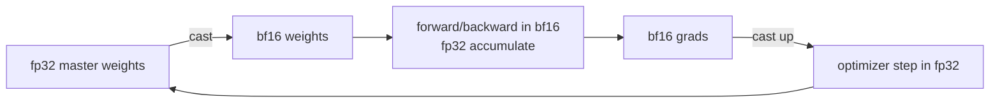

# 數字和精度

<div class="page-meta">
  <span class="chip"><strong>等級：</strong>初級→中階</span>
  <span class="chip"><strong>先備知識：</strong> 浮點基礎有助於</span>
  <span class="chip"><strong>硬體：</strong> 無</span>
</div>

低精度是機器學習中最便宜的加速：將位數減半~將記憶體減半
流量和（使用張量核心）乘以 throughput。但精確度就在那裡
沉默的正確性錯誤仍然存在。本頁解釋了格式，**為什麼 bf16 擊敗
training**、mixed precision 的 fp16 和損失縮放以及穩定性規則
防止低精度模型悄悄出現分歧。

## 一張圖片中的浮點數

浮點數為$(-1)^{s} \cdot 1.m \cdot 2^{e-\text{bias}}$：符號位，$E$指數
位元（動態**範圍**），$M$ 尾數位（**精度**）。分裂是
整個故事。

| 格式          | 位元          | 經驗    | 尾數   | 最大      | 最小正常       | ~十進位數字    |
| ------------- | ------------- | ------- | ------ | --------- | -------------- | -------------- | --- |
| FP32          | 32            | 32 8    | 23     | 23 3.4e38 | 3.4e38 1.2e-38 | 〜7            |
| tf32 (NVIDIA) | tf32 (NVIDIA) | 19\*    | 19\* 8 | 10        | 10 3.4e38      | 3.4e38 1.2e-38 | 〜3 |
| FP16          | 16            | 16 5    | 10     | 10 65504  | 65504 6.1e-5   | 6.1e-5 〜3     |
| BF16          | 16            | 16**8** | 7      | 3.4e38    | 3.4e38 1.2e-38 | 〜2            |
| fp8 E4M3      | 8             | 4       | 3      | 448       | 448 ~2e-3      | 〜1            |
| fp8 E5M2      | 8             | 5       | 2      | 57344     | ~6e-5          | <1             |

<small>\*tf32 以 32 位存儲，但與 10 位尾數相乘。 </small>

關鍵的交易：**bf16 保留了 fp32 的 8 個指數位**（相同範圍，~3e38）但是
尾數只花費 7 位。 fp16 保留 10 個尾數位，但只保留 5 個
指數位 →**在 65504**溢位並在 6e-5 附近下溢。

## 為什麼 bf16 贏得 training

大型模型中的梯度和活化跨越了巨大的動態範圍
偶爾會出現峰值。 fp16 的窄指數意味著那些尖峰**溢出到
`inf`**（然後 `NaN` 傳播到各處）和微小梯度**下溢到
零**。純 fp16 中的 training 需要 _損失縮放_ — 將損失乘以
大因子 $S$ 因此梯度落在 fp16 的可表示視窗中，然後將其除以
退出 — 加上偵測到溢位時 $S$ 的動態調整。它有效，
但它很脆弱。

bf16 具有 fp32 的範圍，因此幾乎不會溢出；你交換尾數位
（粗略捨去）下面的累積策略隱藏了這一點。結果：**bf16
mixed precision 通常不需要損失縮放**並且「正常工作」。這就是為什麼
每個現代加速器（以及 PyTorch AMP 的建議路徑）都預設為 bf16。

!!! warning "範圍與精度不可互換"
    bf16 的 7 位元尾數對於$x \lesssim 2^{-8}\approx 0.004$來說意味著$1 + x = 1$。
    將許多小數字求和到 bf16 累加器中會失去它們 - 這就是
    到底為什麼你從不累積 bf16（下一節）。

## mixed precision：累加規則

「mixed precision」並不表示*一切*都是 16 位元。規則：

-**以低精度儲存和乘法**(bf16/fp16) — 這是記憶體的位置
張量核心加速來自。 -**在 fp32 中累積。**張量核心讀取 bf16 輸入但累積點
FP32 暫存器中的產品。縮減（softmax 總和、LayerNorm 統計量、
優化器的運作時刻（損失）保持在 fp32。 -**保留權重的 fp32 主副本。**優化器更新 fp32
大師； bf16 副本被投射用於向前/向後。沒有這個，小
更新（$\text{lr}\cdot\text{grad}$）在 bf16 舍入和 training 下消失
攤位。



在 PyTorch 中，這是 `torch.autocast`（選擇每個操作精度）+ `GradScaler`
（損失縮放，僅 fp16 需要）：

```python
scaler = torch.cuda.amp.GradScaler(enabled=use_fp16)  # no-op for bf16
for x, y in loader:
    with torch.autocast("cuda", dtype=torch.bfloat16):
        loss = model(x, y)            # matmuls in bf16, softmax/norm in fp32
    scaler.scale(loss).backward()     # scale only matters for fp16
    scaler.step(opt); scaler.update()
    opt.zero_grad(set_to_none=True)
```

## fp8：前沿

fp8 再次將張量核心 throughput 加倍並將啟動/權重位元組減半，並且
現在用於前沿 _training_（DeepSeek-V3 主要在以下方面訓練其 GEMM）
FP8）。兩種格式，用於不同的張量：

-**E4M3**（更多尾數，最大 448）：前向激活和權重，其中
精度比範圍更重要。 -**E5M2**（更多範圍）：梯度，需要更寬的指數。

fp8 的可表示範圍很小，因此需要**per-tensor 或 per-block
縮放因子**（又稱「延遲縮放」或微縮放/MXFP8）：追蹤每個
張量的最大值，將其縮放到 fp8 的視窗中，並將縮放比例保持在資料旁邊。
如果縮放比例錯誤，你就會飽和到 448 或刷新到零。 DeepSeek-V3 的
配方保留了 fp8 GEMM，但**以更高的精度累積**並保持
bf16/fp32 中的敏感部分（router logits、規範、優化器） — 相同
「低精度的 matmul，高精度的歸約」規則，推到
極限。我們在 [quantization](../performance/quantization.md) 中對此進行了更多介紹
（目標為*inference*）和[DeepSeek-V3 case study](../moe/case-studies.md)。

## 真正有效的穩定性規則

-**總是減去 Softmax/交叉熵中 `exp`**之前的最大值
（參見 [Flashattention](flashattention.md)）。跳過它會溢出 fp16 甚至
bf16 代表數百個 logits。 -**fp32 中的 LayerNorm/RMSNorm 統計。**bf16 活化的方差
BF16 計算的內容是垃圾。 -**不要在 16 位元中累積長縮減。**使用 fp32（或 Kahan/pairwise）。 -**router/閘控 logits 和 fp32**中的輔助損耗，用於 MoE — routing 決策
是離散的，並且舍入噪音打破平局會破壞 負載平衡 的穩定性
（參見 [training stability](../moe/training-stability.md)）。 -**觀看 `bf16` 權重更新下溢**：保留 fp32 主副本。

!!! tip "30 秒自我檢測"
    如果模型在 fp32 中訓練良好，但在 16 位元中訓練 `NaN`，那麼罪魁禍首幾乎是
    總是 (a) fp16 溢位 → 切換到 bf16 或新增損失縮放，或 (b) a
    保留 16 位元的縮減/歸一化 → 強制其為 fp32。

## 要點

- 指數位 = 範圍，尾數位 = 精度。**bf16 將尾數換成
  fp32-相等範圍**，這就是為什麼它在 training 上擊敗了 fp16（無損失縮放）
  脆弱性）。
- mixed precision = 低精度**儲存/matmul**+ fp32**累積**+
  fp32**主權重**。
- fp8 對於 training 來說是真實的，但需要仔細的每個張量/塊縮放和
  高精度累積。
- 大多數「低精度發散」錯誤是溢出（fp16）或剩餘減少
  16 位元； minus-the-max 和 accumulate-in-fp32 修復了大多數。

## 練習

!!! tip "解決方案"
    參考解答位於 [解答頁](../solutions/foundations.md) 上。請先嘗試每個練習，再展開解答。

1. 求 fp16 與 bf16 中 `exp` 有限的最大 logit 值。
   將其與指數位計數相關聯。
2. 以數位方式表明，對 bf16 中的 `1e-3` 副本進行求和會失去準確性，
   並且 fp32 累加器可以恢復它。
3. 實現動態損失縮放：每 $N$ 清理步驟加倍 $S$，減半
   溢出。為什麼 bf16 很少觸發減半分支？
4. 對於每個張量尺度的 fp8 E4M3，編寫量化/反量化並找到
   最大值為 1000 的張量的相對誤差。

## 參考文獻

- Micikevicius 等人。 _mixed precision training。 _ 2017 年。
- 卡拉姆卡爾等。 _用於深度學習 training 的 BFLOAT16 研究。 _ 2019。
- Micikevicius 等人。 _用於深度學習的 FP8 格式。 _ 2022 年。
- NVIDIA Transformer Engine 文件（fp8 延遲縮放）。
- DeepSeek-AI。 _DeepSeek-V3 技術報告_（fp8 training 配方）。 2024 年。
