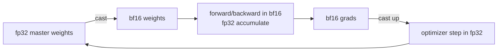

# 數值與精度

<div class="page-meta">
  <span class="chip"><strong>等級：</strong>初級→中階</span>
  <span class="chip"><strong>先備知識：</strong> 浮點基礎有助於</span>
  <span class="chip"><strong>硬體：</strong> 無</span>
</div>

低精度是機器學習中最便宜的加速：位數減半即記憶體與頻寬減半，並（透過 Tensor Core / Matrix Core）讓 throughput 倍增。但精度問題會以靜默的正確性錯誤潛伏其中。本頁解釋各種格式、**為什麼 bf16 在 training 上勝出**、fp16 的 mixed precision 與損失縮放，以及防止低精度模型悄悄發散的穩定性規則。

## 浮點數的數值模型

對於一個 normal number，給定符號位 $s$、指數欄位 $e$（bias 為 $b$），以及小數欄位 $f$（含隱含前導 1 共 $p$ 個 mantissa bits），其值為：

$$ x = (-1)^s \,(1 + f)\, 2^{\,e-b}, \qquad f=\sum_{i=1}^{p-1} d_i 2^{-i} $$

其中 $d_i \in \{0,1\}$ 為小數位元。對於 subnormal（指數欄位為全零）則去除隱含前導 1：

$$ x = (-1)^s\, f\, 2^{\,1-b} $$

直覺：**指數位元決定動態範圍，mantissa bits 決定精度**。這個分割就是整個故事。

各格式以 (sign, exponent, mantissa) 位元數呈現如下表：

| 格式          | (s, e, m)   | 位元 | 最大值    | 最小 normal | ~十進位有效位數 |
| ------------- | ----------- | ---- | --------- | ----------- | --------------- |
| fp32          | (1, 8, 23)  | 32   | 3.4e38    | 1.2e-38     | ~7              |
| TF32 (NVIDIA) | (1, 8, 10)  | 19\* | 3.4e38    | 1.2e-38     | ~3              |
| fp16          | (1, 5, 10)  | 16   | 65504     | 6.1e-5      | ~3              |
| bf16          | (1, 8, 7)   | 16   | 3.4e38    | 1.2e-38     | ~2              |
| fp8 E4M3      | (1, 4, 3)   | 8    | 448       | ~2e-3       | ~1              |
| fp8 E5M2      | (1, 5, 2)   | 8    | 57344     | ~6e-5       | <1              |
| fp4 E2M1      | (1, 2, 1)   | 4    | 6.0       | 1.0         | <1              |

<small>\*TF32 以 32 位儲存，但乘法時僅取 10 位 mantissa。此處 mantissa 欄位皆指顯式儲存位元（不含隱含前導 1），故有效 $p = m + 1$。</small>

關鍵的取捨：**bf16 保留 fp32 的 8 個指數位**（相同範圍，~3e38），但 mantissa 只剩 7 位——它以 fp16 的 mantissa 換取了 fp32 的指數範圍。fp16 保留 10 個 mantissa bits，但只有 5 個指數位 → 在 **65504** 溢位，並在 6e-5 附近下溢。

### Unit roundoff 與 machine epsilon

精度可量化。設有效位數（significand bits，含隱含前導 1）為 $p$，則 machine epsilon（相鄰可表示數的相對間距）為

$$ \varepsilon_m = 2^{-(p-1)} $$

在 round-to-nearest 模式下，將實數 $x$ 捨入為其浮點表示 $\mathrm{fl}(x)$ 的相對誤差受 unit roundoff $u$ 所界：

$$ \frac{|\mathrm{fl}(x)-x|}{|x|} \le u = \tfrac12 \varepsilon_m = 2^{-p} $$

代入各格式：fp32（$p=24$）有 $u\approx 6\times10^{-8}$；bf16（$p=8$）有 $u\approx 4\times10^{-3}$，這正是其僅 ~2 位十進位有效位數的來源。

## 為什麼 bf16 在 training 上勝出

大型模型中的梯度與 activation 跨越巨大的動態範圍，並偶爾出現峰值。fp16 狹窄的指數範圍意味著那些尖峰會**溢位到 `inf`**（隨後 `NaN` 傳播到各處），而微小梯度則**下溢到零**。純 fp16 的 training 需要 _損失縮放_——把損失乘以一個大因子 $S$，使梯度落入 fp16 的可表示視窗，反向傳播後再除以 $S$ 還原，並在偵測到溢位時動態調整 $S$。它能運作，但很脆弱。

bf16 擁有 fp32 的範圍，因此幾乎不會溢位；代價是換掉 mantissa bits（較粗的捨入），而下一節的累積策略可掩蓋這一點。結果：**bf16 mixed precision 通常不需要損失縮放**便能「正常運作」。這正是為什麼每個現代加速器（以及 PyTorch AMP 的建議路徑）都預設使用 bf16。

!!! warning "範圍與精度不可互換"
    bf16 的 7 位 mantissa（$p=8$）意味著對 $x \lesssim \varepsilon_m = 2^{-7}\approx 0.008$ 而言 $1 + x = 1$（被捨入吸收）。把許多小數字逐一加進 bf16 累加器會讓它們消失——這正是為什麼你絕不以 bf16 累積（見下一節）。

## mixed precision：累加規則

「mixed precision」並不表示*一切*都是 16 位元。規則：

- **以低精度儲存與乘法**（bf16/fp16）——這是記憶體與 Tensor Core / Matrix Core 加速的來源。
- **在 fp32 中累積。** Tensor Core / Matrix Core 讀取 bf16 輸入，但把點積累積在 fp32 暫存器中。各種 reduction（softmax 求和、LayerNorm 統計量、optimizer 動量、損失）都保持在 fp32。
- **保留權重的 fp32 主副本（master copy）。** optimizer 更新作用於 fp32 主權重；bf16 副本僅用於前向/反向時的 cast。沒有它，微小更新（$\text{lr}\cdot\text{grad}$）會被 bf16 捨入吞掉，training 停滯。

**為什麼累積必須是 fp32。** 考慮長度為 $K$ 的點積 $\sum_{k=1}^{K} a_k b_k$。以 naive 順序求和、unit roundoff 為 $u$ 時，其最壞情況相對誤差界約為

$$ \frac{|\hat{s}-s|}{|s|} \lesssim (K-1)\,u $$

其中 $s$ 為精確值、$\hat{s}$ 為浮點計算結果。誤差隨 $K$ 線性增長：以 bf16 累積（$u\approx 4\times10^{-3}$）時，$K$ 達數千的 reduction 會徹底崩壞；以 fp32 累積（$u\approx 6\times10^{-8}$）則仍精確。這就是為什麼低精度 matmul 的輸入是 fp16/bf16/fp8、而累加器是 fp32。Kahan summation（補償求和）追蹤捨入殘差並回補，可把誤差界降到 $O(u)$（與 $K$ 無關），代價是每步額外幾個運算。



在 PyTorch 中，這是 `torch.autocast`（選擇每個操作精度）+ `GradScaler`
（損失縮放，僅 fp16 需要）：

```python
scaler = torch.cuda.amp.GradScaler(enabled=use_fp16)  # no-op for bf16
for x, y in loader:
    with torch.autocast("cuda", dtype=torch.bfloat16):
        loss = model(x, y)            # matmuls in bf16, softmax/norm in fp32
    scaler.scale(loss).backward()     # scale only matters for fp16
    scaler.step(opt); scaler.update()
    opt.zero_grad(set_to_none=True)
```

## fp8：前沿

fp8 再次把 Tensor Core / Matrix Core throughput 翻倍、並把 activation/權重位元組減半，如今已用於前沿 _training_（DeepSeek-V3 的 GEMM 主要以 fp8 訓練）。兩種格式分別用於不同張量：

- **E4M3**（更多 mantissa，最大 448）：前向 activation 與權重，此處精度比範圍重要。
- **E5M2**（更多範圍）：梯度，需要更寬的指數。

fp8 的可表示範圍很小，因此需要 **per-tensor 或 per-block 縮放因子**（即「延遲縮放」或 microscaling / MXFP8）：追蹤每個張量（或區塊）的最大值，將其縮放進 fp8 的視窗，並把縮放比例存放在資料旁。若縮放比例錯誤，數值就會飽和到 448 或被刷新為零。DeepSeek-V3 的配方保留 fp8 GEMM，但**以更高精度累積**，並把敏感部分（router logits、norm、optimizer）留在 bf16/fp32——同樣是「低精度 matmul、高精度 reduction」規則，推到極限。更多內容見 [quantization](../performance/quantization.md)（目標為 *inference*）與 [DeepSeek-V3 case study](../moe/case-studies.md)。

### MXFP4 block scaling

微縮放（microscaling）格式把縮放粒度降到區塊層級。在 MXFP4 中，一個 $g=32$ 個元素的區塊共享單一個 E8M0 的縮放值 $S$——E8M0 是 8 位、純指數（power-of-two）、以 `uint8` 編碼的格式；每個元素本身則以 fp4（E2M1）儲存。重建值為

$$ x = S \cdot \text{fp4}_{\text{element}} $$

實際儲存成本為每元素的 4 個 fp4 位元，加上每區塊 8 位縮放分攤到 $g$ 個元素：

$$ \text{bits/element} = 4 + \frac{8}{g} = 4 + \frac{8}{32} = 4.25 $$

亦即 4 位的記憶體足跡，卻保有近似 per-block 的動態範圍適配。

### 量化 SNR 的經驗法則

對於 $n$-bit 均勻量化（uniform quantization），訊號量化雜訊比（signal-to-quantization-noise ratio）的經驗法則為

$$ \mathrm{SQNR} \approx 6.02\,n + 1.76\ \text{dB} $$

每增加 1 位約增益 ~6 dB。這給出粗略的精度預算：例如從 8 位降到 4 位約損失 ~24 dB SQNR，因此低位元格式高度依賴 per-block 縮放與離群值處理來彌補。

## 真正有效的穩定性規則

- **在 softmax / cross-entropy 的 `exp` 前永遠先減去最大值**（見 [FlashAttention](flashattention.md)）。略過它，數百個 logits 就會溢位 fp16 甚至 bf16。
- **LayerNorm / RMSNorm 統計量以 fp32 計算。** 以 bf16 計算 bf16 activation 的變異數會得到垃圾結果。
- **不要在 16 位元中累積長 reduction。** 使用 fp32（或 Kahan / pairwise summation）。
- **MoE 的 router/gating logits 與 auxiliary loss 以 fp32 計算** —— routing 決策是離散的，捨入雜訊打破平手會破壞 load balancing 的穩定性（見 [training stability](../moe/training-stability.md)）。
- **留意 `bf16` 權重更新的下溢**：保留 fp32 主副本。

!!! tip "30 秒自我檢測"
    如果模型在 fp32 下訓練良好、但在 16 位元下產生 `NaN`，罪魁禍首幾乎總是 (a) fp16 溢位 → 切換到 bf16 或加入損失縮放，或 (b) 某個留在 16 位元的 reduction / normalization → 強制其改為 fp32。

## 要點

- 指數位 = 範圍，mantissa bits = 精度。**bf16 以 mantissa 換取與 fp32 相等的範圍**，這就是為什麼它在 training 上勝過 fp16（沒有損失縮放的脆弱性）。
- mixed precision = 低精度**儲存 / matmul** + fp32**累積** + fp32**主權重**。
- fp8 對 training 而言已是真實可行，但需要仔細的 per-tensor / per-block 縮放與高精度累積。
- 多數「低精度發散」錯誤源自溢位（fp16）或某個殘留在 16 位元的 reduction；minus-the-max 與 accumulate-in-fp32 可修復大部分。

## 練習

!!! tip "解決方案"
    參考解答位於 [解答頁](../solutions/foundations.md) 上。請先嘗試每個練習，再展開解答。

1. 求 fp16 與 bf16 中 `exp` 有限的最大 logit 值。
   將其與指數位計數相關聯。
2. 以數位方式表明，對 bf16 中的 `1e-3` 副本進行求和會失去準確性，
   並且 fp32 累加器可以恢復它。
3. 實現動態損失縮放：每 $N$ 清理步驟加倍 $S$，減半
   溢出。為什麼 bf16 很少觸發減半分支？
4. 對於每個張量尺度的 fp8 E4M3，編寫量化/反量化並找到
   最大值為 1000 的張量的相對誤差。

## 參考文獻

- Micikevicius 等人。 _Mixed Precision Training。_ 2017。
- Kalamkar 等人。 _A Study of BFLOAT16 for Deep Learning Training。_ 2019。
- Micikevicius 等人。 _FP8 Formats for Deep Learning。_ 2022。
- Open Compute Project。 _OCP Microscaling Formats (MX) Specification_（MXFP8 / MXFP4、E8M0 block scale）。 2023。
- NVIDIA Transformer Engine 文件（fp8 delayed scaling）。
- DeepSeek-AI。 _DeepSeek-V3 Technical Report_（fp8 training 配方）。 2024。
