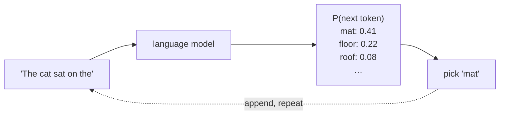
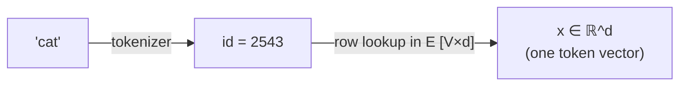
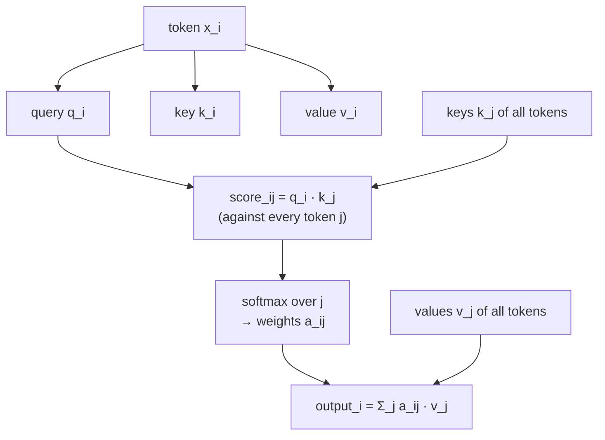
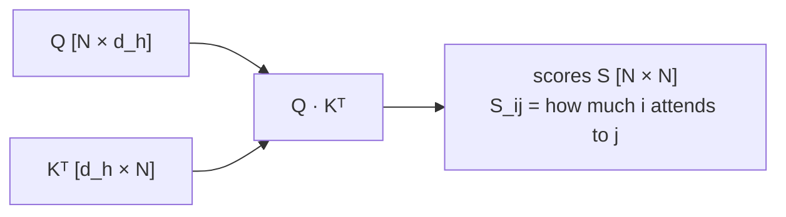
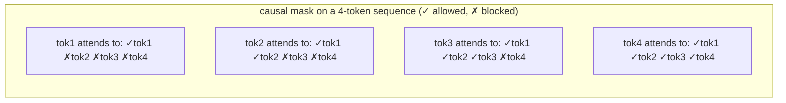
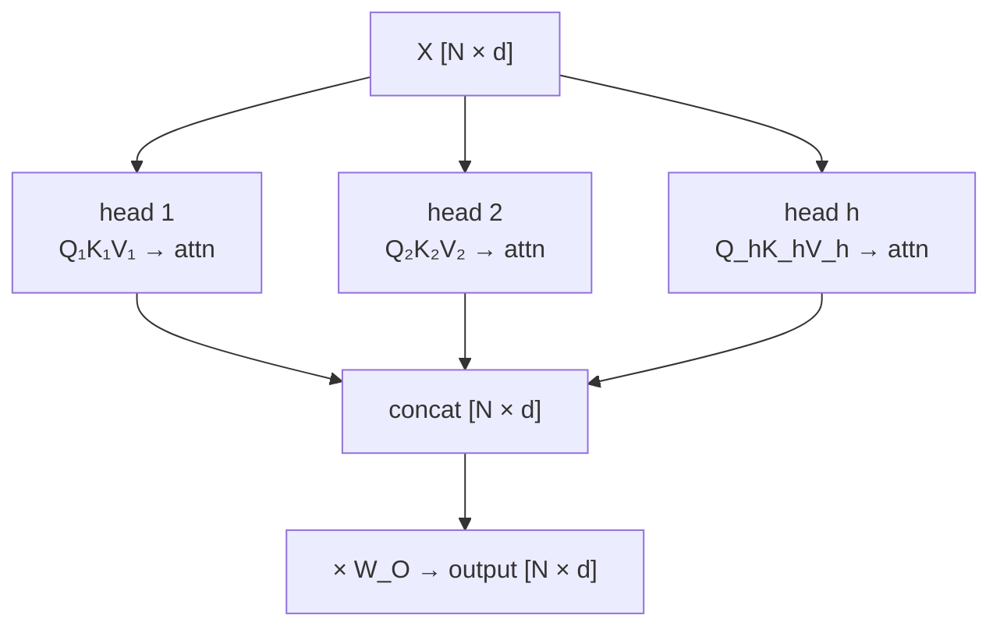
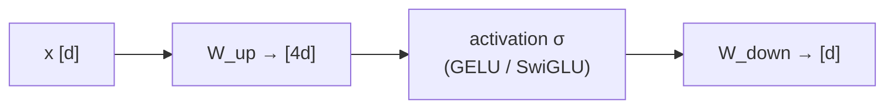
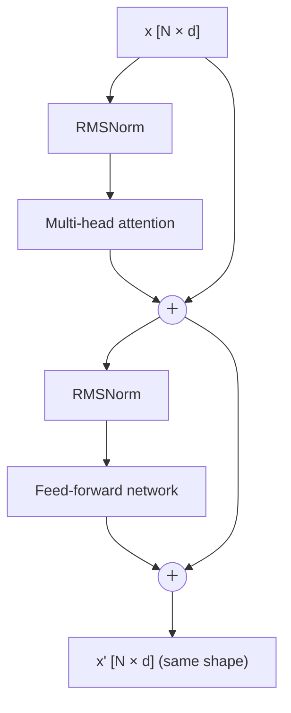
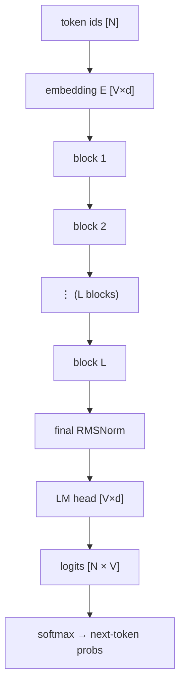
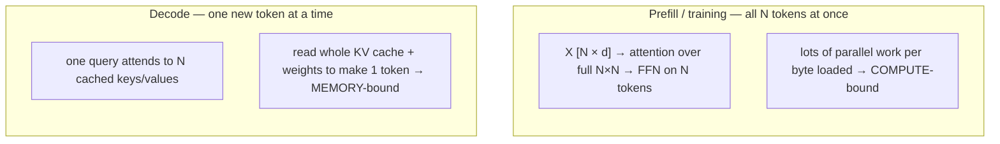

# 從頭開始的 Transformer

  <strong>等級：</strong> 初學者
  <strong>先備知識：</strong>矩陣乘法，基礎微積分
  <strong>硬體：</strong>無（筆和紙）

本手冊的其餘部分使 Transformer**快速**。此頁面可確保你
首先確切地知道 Transformer 是什麼－一次建造一個 Transformer，
每一步都有一張圖片。最後，你將能夠從原始資料中追蹤 token
文字到下一個 token 預測，命名每個權重矩陣，並了解為什麼 attention
是大家優化的部分。無需事先了解 Transformer 知識；如果你
可以將兩個矩陣相乘，你可以遵循這個。

!!! tip "如何閱讀此頁"
    每個部分都向運行畫面添加**一個**機制。讀圖，
    然後是方程式，然後是“為什麼它是這樣形成的”註釋。形狀
    （維度）與數學一樣重要 ── 它們才是後面幾頁的內容
    失敗次數和位元組數超過。

## 工作：預測下一個 token

語言模型只做一件事：給定 tokens 序列，輸出
**下一個**token 的機率分佈。其他一切——
聊天、編碼、翻譯——就是重複應用的單一操作。

此回饋循環 - 附加預測的 token 並再次運行 - 是
**自回歸生成**。這就是為什麼「寫」的模型實際上只是
一次預測一個 token，以及為什麼 [decoding is the memory-bound regime](attention-efficiency.md)
我們花了很多精力在後面。

## 步驟 1 — tokens 和嵌入

文本首先被 tokenizer 分割成**tokens**（子詞塊）；每個 token
是大小為 $V$（通常為 32k–256k）的固定**詞彙表**中的整數 id。
該模型無法對整數進行數學運算，因此每個 id 都對學習到的行進行索引
**嵌入矩陣**$E \in \mathbb{R}^{V \times d}$，將其轉換為向量
尺寸 $d$（**模型寬度**，例如 4096）。

$N$ tokens 的序列變成矩陣 $X \in \mathbb{R}^{N \times d}$ — 一個
每個 token 的行。**這個$[N, d]$矩陣是流經整個
網路**；每層讀取一個$[N,d]$並寫入一個相同形狀的$[N,d]$。

!!! note "位置必須單獨添加"
    無論「cat」出現在何處，「cat」的嵌入都是相同的，但詞序不同
    很重要（「貓坐」≠「坐貓」）。因此模型加入了**位置資訊**—
    傳統上，$X$ 中添加了位置嵌入，在現代模型中，**旋轉
    嵌入 (RoPE)**應用在 attention 內部。無論哪種方式，網路都被告知
    每個 token 位於*何處*，而不僅僅是它*是什麼*。

## 步驟 2 — 核心思想：attention 作為軟查找

這裡是 Transformer 的心臟。要理解一個單詞，你需要**上下文**：
「it」指較早的事物； 「銀行」在「河流」與「河流」附近的意義不同
「錢」。 attention 讓每個 token**從其他 tokens 收集資訊**，
根據它們的相關程度進行加權。

機制是**軟字典查找**。每個 token 產生三個向量
將其嵌入 $x$ 乘以三個學習矩陣：

| 向量               | 矩陣                               | 直覺                       |
| ------------------ | ---------------------------------- | -------------------------- |
| **查詢**$q = xW_Q$ | $W_Q \in \mathbb{R}^{d\times d_h}$ | 「我在找什麼？」           |
| **鑰匙**$k = xW_K$ | $W_K \in \mathbb{R}^{d\times d_h}$ | 「我能提供什麼？」         |
| **價值**$v = xW_V$ | $W_V \in \mathbb{R}^{d\times d_h}$ | “如果匹配的話我會傳遞什麼” |

token 的查詢與**每個**token 的金鑰進行比較（點積 =
相關性得分）；分數透過 softmax 變成權重；輸出是
**值**的加權和。

一次為整個序列編寫（你隨處可見的形式）：

$$ \text{Attn}(Q,K,V) = \underbrace{\text{softmax}\!\left(\frac{QK^\top}{\sqrt{d*h}}\right)}*{\text{attention weights } A\ [N\times N]} V. $$

兩個 matmul 之間有一個 softmax。讓我們從視覺上拆開這兩個部分。

### 2a — 分數矩陣 $QK^\top$

$Q$ 是 $[N, d_h]$，$K^\top$ 是 $[d_h, N]$，因此 $QK^\top$ 是 $[N, N]$ 矩陣：
條目 $(i,j)$ 是 token $i$ 參與 token $j$ 的程度。**此$N\times N$
矩陣是 attention 二次成本**的來源 - 它隨著*平方*而增長
序列長度，[Flashattention](flashattention.md) 背後的單一事實
和長背景研究。

$\sqrt{d_h}$ 除數可防止點積隨維度成長
（大分數會使 softmax 飽和為沒有梯度的硬 argmax —
同樣的 [numerics](numerics-precision.md) 問題也會導致 router z 損失
在 MoE）。

### 2b — 因果面具

對於語言模型，token $i$ 可能僅在**時或之前**處理 tokens —
它無法窺視它試圖預測的未來。我們透過設定來強制執行此操作
Softmax 之前 $S$ 到 $-\infty$ 的上三角（因此這些權重變成 0）：

這種下三角結構就是為什麼生成時我們可以**快取**過去
鍵和值並且永遠不會重新計算它們 - 的基礎
[KV cache](attention-efficiency.md)。

## 步驟 3 — 多頭 attention

attention 的一個「頭」學習一種關係。真正的 Transformer 運作很多
頭**平行**，每個頭都有自己的小$W_Q, W_K, W_V$（尺寸
$d_h = d / h$ 對於 $h$ 頭），然後連接輸出並將它們與
輸出投影 $W_O$。一個頭可能跟踪語法，另一個頭可能跟踪語法，
另一個本地位置－模型同時獲得多個關係「管道」。

!!! note "頭部是 MQA / GQA / MLA 行動的地方"
    每個頭通常保留自己的鍵和值，因此 KV 快取可以隨
    人數。 attention 變體全系列 —
    [MQA, GQA, MLA](attention-efficiency.md) — 是關於**共享或壓縮
    跨頭的鍵/值**以縮小快取。你將在以下時間與他們見面
    下一頁；只知道槓桿住在這裡。

## 步驟 4 — 前饋網路 (FFN)

attention 在 tokens 上混合訊息**。Transformer 的另一半
塊通過小型兩層 MLP**獨立**處理每個 token — 這
是大多數模型參數（和原始 FLOP）所在的位置。它擴大了寬度
~4×，施加非線性，並投影回來：

$$ \text{FFN}(x) = W*{\text{down}}\,\sigma(W*{\text{up}}\,x), \qquad W*{\text{up}}\in\mathbb{R}^{d*{ff}\times d},\; d\_{ff}\approx 4d. $$

!!! tip "這正是 MoE 所做的稀疏"
    FFN 是 token 中最昂貴的零件。一個
    [Mixture-of-experts](../moe/index.md) 層將這個單一 FFN 替換為
    _許多_ FFN（“experts”）並將每個 token 路由到幾個 — 總體解耦
    來自每個 token 計算的參數。第二部分中的所有內容都是以下內容的變體
    *這個*盒子。

## 步驟 5 — 組裝 Transformer 塊

塊將 attention 和 FFN 與兩個黏合機構連接在一起，使
可訓練的深度網路：

-**剩餘連接**- 將每個子層的輸入加回其輸出
($x + \text{sublayer}(x)$)，為漸層提供直接路徑並讓圖層
改進而不是取代。 -**層歸一化**- 將活化重新調整為先前的穩定分佈
每個子層（現代模型使用**RMSNorm**，一種更便宜的變體）。

關鍵不變量：**一個區塊採用 $[N,d]$ 並傳回 $[N,d]$**。這就是讓
我們像樂高一樣堆砌積木。

## 步驟 6 — 完整模型

完整的模型是：嵌入 → $L$ 相同區塊的堆疊 → 最終規格 → 投影到
詞彙 Logits → softmax。最終的**LM 頭**（$W_{\text{LM}}\in\mathbb{R}^{V\times d}$）
將最後一個 token 的向量轉換為詞彙表中每個單字的分數。

模型由幾個數字指定：寬度 $d$、層數 $L$、
頭數 $h$、FFN 寬度 $d_{ff}$、詞彙 $V$ 和最大上下文 $N$。
「7B」模型只是其中的一個選擇，乘以約 70 億
參數 — [next page](transformer-systems.md) 向你展示如何計算這些參數。

## 兩種模式：training (prefill) 與一代 (decode)

同一個網路在兩種截然不同的製度下運行，並且**整個**
本手冊的效能故事取決於差異：

-**prefill / training**一起處理許多 tokens：矩陣乘法很大且
硬體的數學單元保持忙碌 →**受計算限制**。 -**decode**產生 token-by-token：每個步驟幾乎不需要數學運算，但必須重新讀取
模型權重和記憶體中不斷增長的 KV 快取 →**記憶體限制**。

單一分割 - 以及將其形式化的 [roofline](transformer-systems.md) -
是接下來一切的鏡頭。現在你可以看到整個物體；
第一部分的其餘部分學習如何「測量」它。

## 要點

- Transformer 將 token 向量的 $[N,d]$ 矩陣對應到 $[N,d]$ 矩陣，
  $L$ 次，然後投影到詞彙 logits 來預測下一個 token。 -**attention**是軟體查找：針對鍵的查詢 → softmax 權重 →
  值的加權和。 $QK^\top$ 分數形成一個 $[N,N]$ 矩陣 —
  每個人都優化的二次成本。 -**多頭**並行運行許多小型 attention；**FFN**進程
  每個 token 獨立並保存大部分參數；**殘差+範數**
  堆疊可訓練。
- 此模型在 prefill/training 中運行**計算限制**，在**記憶體限制中運行
  decode**— 本手冊的其餘部分都是圍繞著這一區別而建造的。

## 練習

!!! tip "解決方案"
    參考解答位於 [解答頁](../solutions/foundations.md) 上。請先嘗試每個練習，再展開解答。

1. 追蹤形狀：從 token ids $[N]$開始，列出張量的形狀
   嵌入後、$QK^\top$ 後、softmax 後、$\times V$ 後、
   $W_O$、後 LM 頭。 $N$ 中哪一個是二次的？
2. 型號有$d=4096$、$h=32$頭。 $d_h$是什麼？如果換成 8KV 頭
   （GQA），每個 token KV 快取與完整多頭相比要小多少？
3. 用一句話解釋為什麼**殘差連結**和**層範數**
   需要訓練深層籌碼。如果沒有每個，什麼會破壞？
4. 為什麼 decode 可以重複使用快取的鍵/值，但*不能*快取的查詢？係好你的
   因果掩模的三角形結構的答案。
5. FFN 為 ~$8d^2$ 參數，attention 的投影為每層 ~$4d^2$。
   對於主導的 $d=4096$，MoE 層如何改變局面？

## 參考文獻

- 瓦斯瓦尼等人。 _attention 就是你所需要的。 _ 2017 年（原廠 Transformer）。
- 芳和哈特。 _變形金剛的正式演算法。 _ 2022（精確的偽代碼）。 -埃爾哈格等。 _Transformer 電路的數學框架。 _ 2021（attention 作為資訊運動）。
- 蘇等人。 _RoFormer：旋轉位置嵌入。 _ 2021。
- 張和森里奇。 _均方根層歸一化 (RMSNorm)。 _ 2019。
