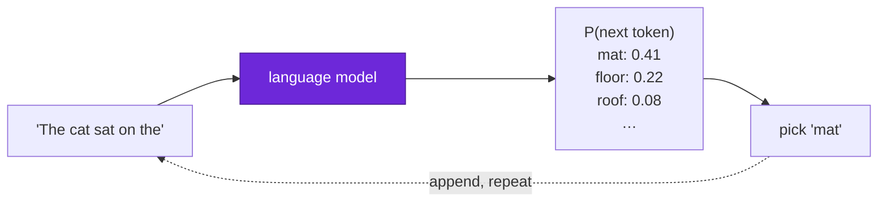
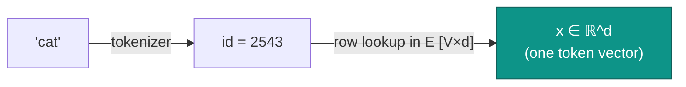
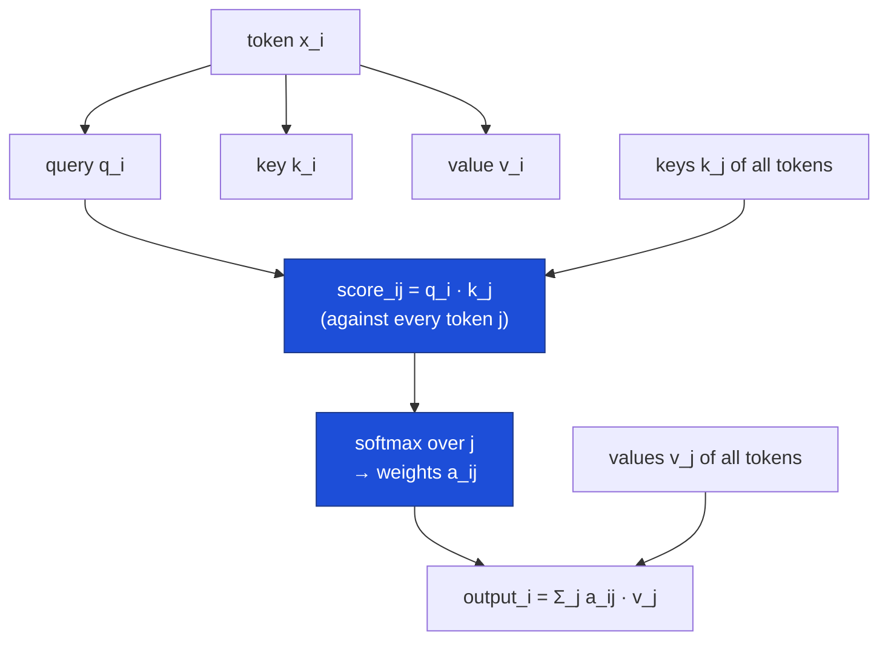
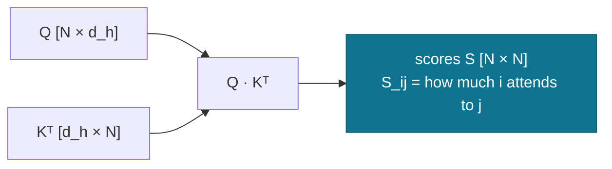
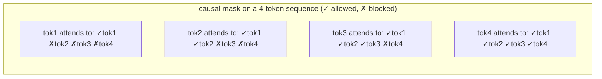
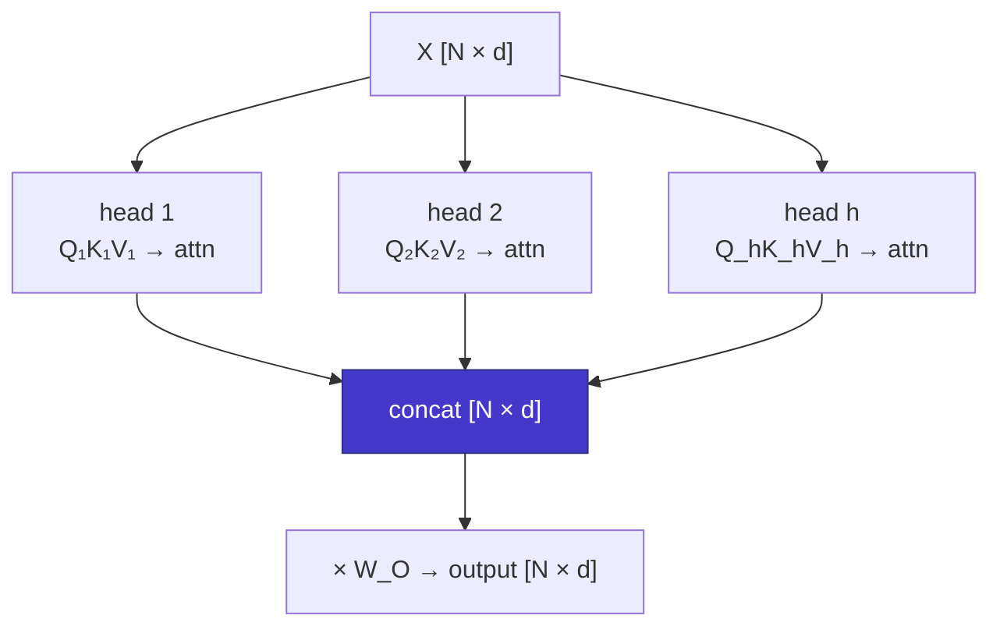
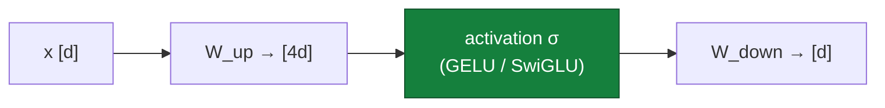
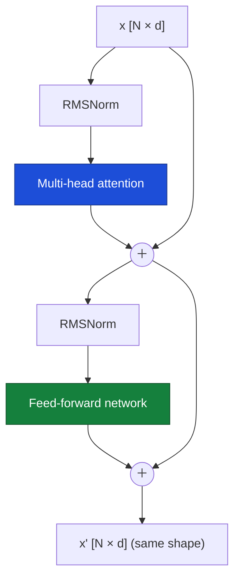
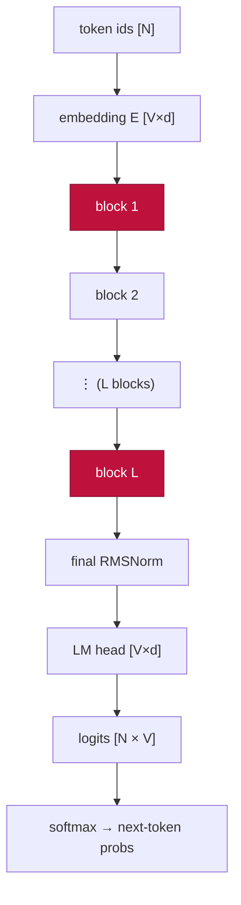
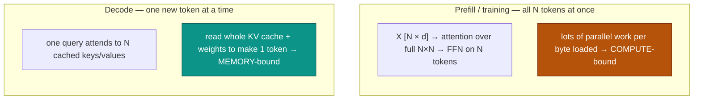

# The transformer from scratch

  <strong>Level:</strong> beginner
  <strong>Prereqs:</strong> matrix multiply, basic calculus
  <strong>Hardware:</strong> none (pen &amp; paper)

The rest of this handbook makes transformers **fast**. This page makes sure you
know exactly **what** a transformer is first — built up one piece at a time, with
a picture for every step. By the end you'll be able to trace a token from raw
text to a next-token prediction, name every weight matrix, and see why attention
is the part everyone optimizes. No prior transformer knowledge assumed; if you
can multiply two matrices, you can follow this.

!!! tip "How to read this page"
    Each section adds **one** mechanism to a running picture. Read the diagram,
    then the equation, then the "why it's shaped this way" note. The shapes
    (dimensions) matter as much as the math — they're what later pages count
    FLOPs and bytes over.

## The job: predict the next token

A language model does exactly one thing: given a sequence of tokens, output a
probability distribution over what the **next** token is. Everything else —
chat, code, translation — is that single operation applied over and over.

That feedback loop — append the predicted token and run again — is
**autoregressive generation**. It's why a model that "writes" is really just
predicting one token at a time, and why [decoding is the memory-bound regime](attention-efficiency.md)
we spend so much effort on later.

## Step 1 — tokens and embeddings

Text is first chopped into **tokens** (subword chunks) by a tokenizer; each token
is an integer id into a fixed **vocabulary** of size $V$ (typically 32k–256k).
The model can't do math on integers, so each id indexes a row of a learned
**embedding matrix** $E \in \mathbb{R}^{V \times d}$, turning it into a vector of
dimension $d$ (the **model width**, e.g. 4096).

A sequence of $N$ tokens becomes a matrix $X \in \mathbb{R}^{N \times d}$ — one
row per token. **This $[N, d]$ matrix is the object that flows through the entire
network**; every layer reads an $[N,d]$ and writes an $[N,d]$ of the same shape.

!!! note "Position has to be added separately"
    The embedding for "cat" is the same wherever "cat" appears, but word order
    matters ("cat sat" ≠ "sat cat"). So the model adds **positional information** —
    classically a position embedding added to $X$, in modern models a **rotary
    embedding (RoPE)** applied inside attention. Either way, the network is told
    *where* each token sits, not just *what* it is.

## Step 2 — the core idea: attention as soft lookup

Here is the heart of the transformer. To understand a word, you need **context**:
"it" refers to something earlier; "bank" means different things near "river" vs
"money". Attention lets each token **gather information from other tokens**,
weighted by how relevant they are.

The mechanism is a **soft dictionary lookup**. Every token produces three vectors
by multiplying its embedding $x$ by three learned matrices:

| Vector | Matrix | Intuition |
|---|---|---|
| **Query** $q = xW_Q$ | $W_Q \in \mathbb{R}^{d\times d_h}$ | "what am I looking for?" |
| **Key** $k = xW_K$ | $W_K \in \mathbb{R}^{d\times d_h}$ | "what do I offer?" |
| **Value** $v = xW_V$ | $W_V \in \mathbb{R}^{d\times d_h}$ | "what I'll pass on if matched" |

A token's query is compared against **every** token's key (dot product = a
relevance score); the scores become weights via softmax; the output is the
weighted sum of **values**.

Written for the whole sequence at once (the form you'll see everywhere):

$$ \text{Attn}(Q,K,V) = \underbrace{\text{softmax}\!\left(\frac{QK^\top}{\sqrt{d_h}}\right)}_{\text{attention weights } A\ [N\times N]} V. $$

Two matmuls with a softmax between them. Let's unpack the two pieces visually.

### 2a — the score matrix $QK^\top$

$Q$ is $[N, d_h]$ and $K^\top$ is $[d_h, N]$, so $QK^\top$ is an $[N, N]$ matrix:
entry $(i,j)$ is how much token $i$ attends to token $j$. **This $N\times N$
matrix is the source of attention's quadratic cost** — it grows with the *square*
of sequence length, the single fact behind [FlashAttention](flashattention.md)
and long-context research.

The $\sqrt{d_h}$ divisor keeps the dot products from growing with dimension
(large scores would saturate the softmax into a hard argmax with no gradient —
the same [numerics](numerics-precision.md) concern that drives the router z-loss
in MoE).

### 2b — the causal mask

For a language model, token $i$ may only attend to tokens **at or before** it —
it can't peek at the future it's trying to predict. We enforce this by setting the
upper triangle of $S$ to $-\infty$ before the softmax (so those weights become 0):

This lower-triangular structure is why, at generation time, we can **cache** past
keys and values and never recompute them — the basis of the
[KV cache](attention-efficiency.md).

## Step 3 — multi-head attention

One attention "head" learns one kind of relationship. Real transformers run many
heads **in parallel**, each with its own small $W_Q, W_K, W_V$ (dimension
$d_h = d / h$ for $h$ heads), then concatenate the outputs and mix them with an
output projection $W_O$. One head might track syntax, another coreference,
another local position — the model gets several relationship "channels" at once.

!!! note "Heads are where MQA / GQA / MLA act"
    Every head normally keeps its own keys and values, so the KV cache scales with
    head count. The whole family of attention variants —
    [MQA, GQA, MLA](attention-efficiency.md) — is about **sharing or compressing
    keys/values across heads** to shrink that cache. You'll meet them properly on
    the next page; just know the lever lives here.

## Step 4 — the feed-forward network (FFN)

Attention mixes information **across tokens**. The other half of a transformer
block processes each token **independently**, through a small two-layer MLP — this
is where most of the model's parameters (and raw FLOPs) live. It expands the width
by ~4×, applies a nonlinearity, and projects back:

$$ \text{FFN}(x) = W_{\text{down}}\,\sigma(W_{\text{up}}\,x), \qquad W_{\text{up}}\in\mathbb{R}^{d_{ff}\times d},\; d_{ff}\approx 4d. $$

!!! tip "This is exactly what MoE makes sparse"
    The FFN is the most expensive part per token. A
    [Mixture-of-Experts](../moe/index.md) layer replaces this single FFN with
    *many* FFNs ("experts") and routes each token to just a few — decoupling total
    parameters from per-token compute. Everything in Part II is a variation on
    *this* box.

## Step 5 — assembling a transformer block

A block wires attention and the FFN together with two glue mechanisms that make
deep networks trainable:

- **Residual connections** — add each sublayer's input back to its output
  ($x + \text{sublayer}(x)$), giving gradients a direct path and letting layers
  refine rather than replace.
- **Layer normalization** — rescale activations to a stable distribution before
  each sublayer (modern models use **RMSNorm**, a cheaper variant).

The key invariant: **a block takes $[N,d]$ and returns $[N,d]$**. That's what lets
us stack blocks like Lego.

## Step 6 — the full model

The full model is: embed → stack of $L$ identical blocks → final norm → project to
vocabulary logits → softmax. The final **LM head** ($W_{\text{LM}}\in\mathbb{R}^{V\times d}$)
turns the last token's vector into a score for every word in the vocabulary.

A model is specified by a handful of numbers: width $d$, number of layers $L$,
number of heads $h$, FFN width $d_{ff}$, vocabulary $V$, and max context $N$.
A "7B" model is just a choice of these that multiplies out to ~7 billion
parameters — which the [next page](transformer-systems.md) shows you how to count.

## Two modes: training (prefill) vs generation (decode)

The same network runs in two very different regimes, and the **entire**
performance story of this handbook hinges on the difference:

- **Prefill / training** processes many tokens together: the matmuls are large and
  the hardware's math units stay busy → **compute-bound**.
- **Decode** generates token-by-token: each step does little math but must re-read
  the model weights and the growing KV cache from memory → **memory-bound**.

That single split — and the [roofline](transformer-systems.md) that formalizes it —
is the lens for everything that follows. You now have the whole object in view;
the rest of Part I learns to *measure* it.

## Key takeaways

- A transformer maps an $[N,d]$ matrix of token vectors to an $[N,d]$ matrix,
  $L$ times, then projects to vocabulary logits to predict the next token.
- **Attention** is a soft lookup: queries dotted against keys → softmax weights →
  weighted sum of values. The $QK^\top$ scores form an $[N,N]$ matrix — the
  quadratic cost everyone optimizes.
- **Multi-head** runs many small attentions in parallel; the **FFN** processes
  each token independently and holds most parameters; **residuals + norm** make
  the stack trainable.
- The model runs **compute-bound in prefill/training** and **memory-bound in
  decode** — the distinction the rest of the handbook is built around.

## Exercises

!!! tip "Solutions"
    Worked answers are on the [Part solutions page](../solutions/foundations.md). Try each exercise before expanding.

1. Trace the shapes: starting from token ids $[N]$, list the shape of the tensor
   after embedding, after $QK^\top$, after the softmax, after $\times V$, after
   $W_O$, and after the LM head. Which one is quadratic in $N$?
2. A model has $d=4096$, $h=32$ heads. What is $d_h$? If it switches to 8 KV heads
   (GQA), how much smaller is the per-token KV cache vs full multi-head?
3. Explain in one sentence each why **residual connections** and **layer norm**
   are needed to train a deep stack. What breaks without each?
4. Why can decode reuse cached keys/values but *not* cached queries? Tie your
   answer to the causal mask's triangular structure.
5. The FFN is ~$8d^2$ params and attention's projections are ~$4d^2$ per layer.
   For $d=4096$, which dominates, and how does an MoE layer change the picture?

## References

- Vaswani et al. *Attention Is All You Need.* 2017 (the original transformer).
- Phuong & Hutter. *Formal Algorithms for Transformers.* 2022 (precise pseudo-code).
- Elhage et al. *A Mathematical Framework for Transformer Circuits.* 2021 (attention as information movement).
- Su et al. *RoFormer: Rotary Position Embedding.* 2021.
- Zhang & Sennrich. *Root Mean Square Layer Normalization (RMSNorm).* 2019.
