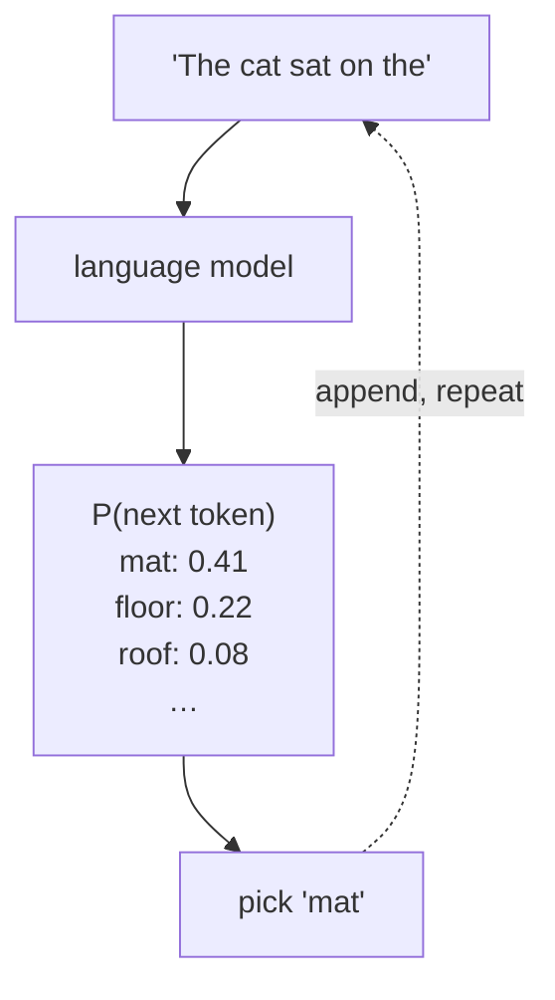
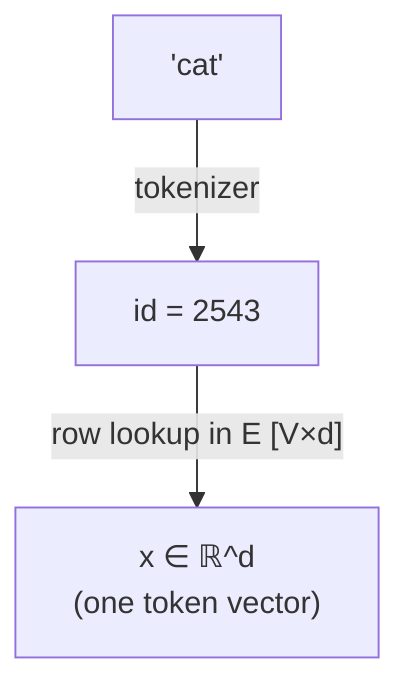
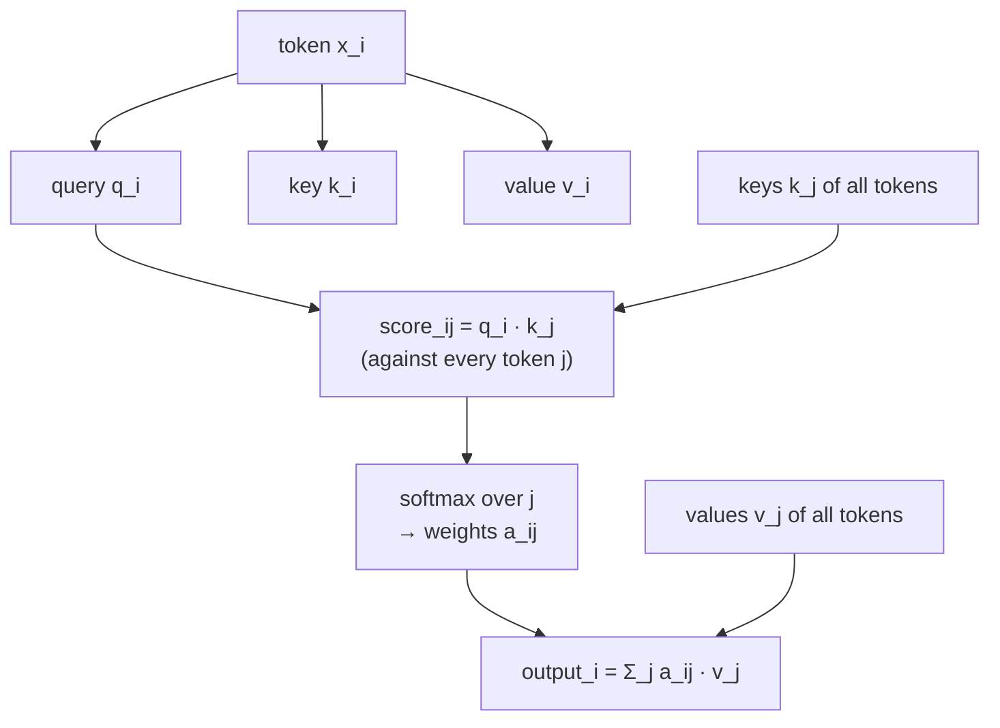
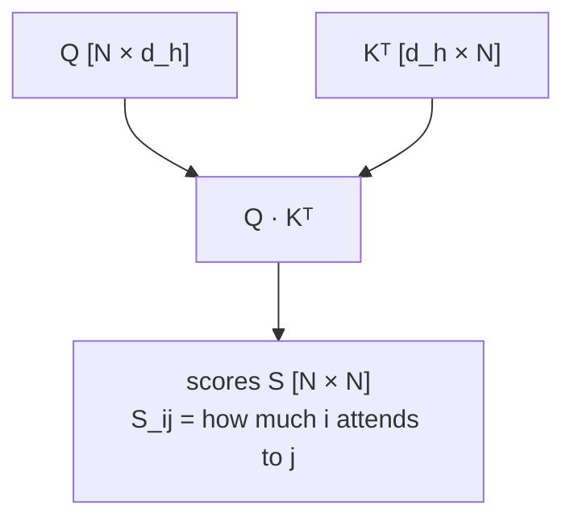
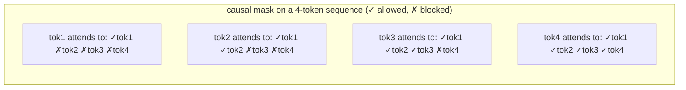
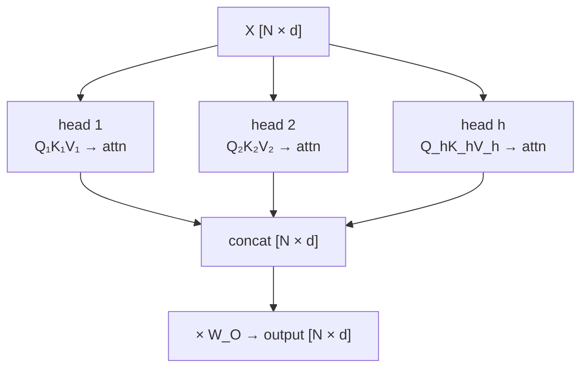
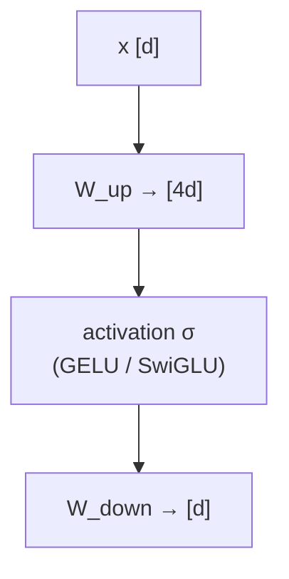
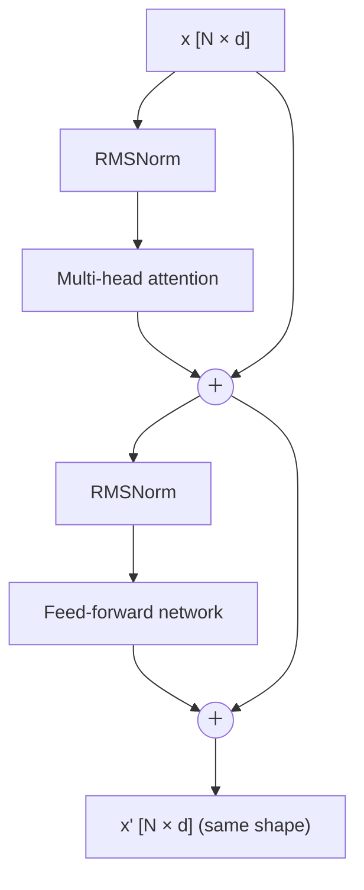
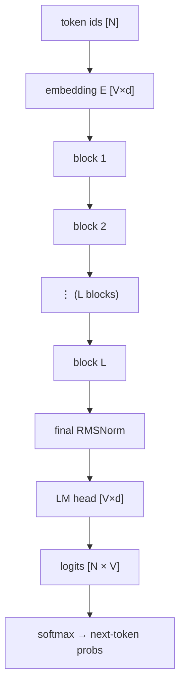
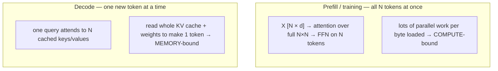

# 從零實作 Transformer

  <strong>等級：</strong> 初學者
  <strong>先備知識：</strong>矩陣乘法，基礎微積分
  <strong>硬體：</strong>無（筆和紙）

本手冊其餘部分談的是怎麼讓 Transformer **跑得快**。這一頁先確保你清楚知道 Transformer **到底是什麼** —— 一次加一個機制，每步配一張圖。讀完之後，你能從原始文字一路追到下一個 token 預測，叫得出每個權重矩陣的名字，並理解為什麼大家都在優化 attention。不需要任何 Transformer 先備知識；只要你會把兩個矩陣相乘，就跟得上。

!!! Tip "怎麼讀這一頁"
    每一節只往這張流動的畫面上**加一個**機制。先看圖，再看式子，最後讀「它為什麼長這樣」的 註解。**形狀（維度）和數學一樣重要** —— 後面幾頁數 FLOPs 和 bytes，數的就是這些形狀。

## 工作：預測下一個 token

語言模型只做一件事：給定一段 token 序列，輸出**下一個** token 的機率分佈。其他所有功能 —— 聊天、寫程式、翻譯 —— 都只是把這個單一操作反覆套用而已。

這個回饋迴圈 —— 把預測出的 token 接到尾端、再跑一次 —— 就是 **autoregressive 生成（自回歸 生成）**。這也解釋了為什麼會「寫作」的模型其實只是一次預測一個 token，以及為什麼 [decode 是記憶體受限的階段](attention-efficiency.md)，那是後面我們花最多力氣的地方。

## 步驟 1 — tokens 和 embedding

文字先被 tokenizer 切成 **tokens（子詞片段）**；每個 token 是一個整數 id，取自固定大小為 $V$ （通常 32k–256k）的**詞彙表**。模型沒辦法直接對整數做運算，所以每個 id 會去索引**embedding 矩陣** $E \in \mathbb{R}^{V \times d}$ 的某一列，把它轉成一個維度為 $d$ 的向量（$d$ 是**隱藏維度（hidden size）**， 例如 4096）。

一段 $N$ 個 token 的序列就變成矩陣 $X \in \mathbb{R}^{N \times d}$ —— 每個 token 一列。**這個 $[N, d]$ 矩陣就是流經整個網路的東西**：每一層讀進一個 $[N,d]$，再寫出一個形狀完全相同的 $[N,d]$。

!!! Note "位置資訊必須另外加進去"
    不管「cat」出現在句子哪裡，它的 embedding 都一樣，但詞序是有意義的（「貓坐」≠「坐貓」）。所以 模型要額外注入**位置資訊** —— 傳統做法是在 $X$ 上加 positional embedding，現代模型則多半用 **Rotary Position Embedding（RoPE）**，在 attention 內部施加。無論哪種，目的都是告訴網路每個 token 在*哪裡*， 而不只是它*是什麼*。

## 步驟 2 — 核心思想：把 attention 看成軟性查表

這是 Transformer 的核心。要理解一個詞，你需要**上下文**：「it」指的是前面提過的某樣東西； 「bank」在「river」旁邊和在「money」旁邊意思不同。attention 讓每個 token **從其他 token 蒐集 資訊**，並依彼此的相關程度加權。

機制是一種**軟性字典查表**。每個 token 把自己的 embedding $x$ 乘上三個可學習矩陣，產生三個向量：

| 向量 | 矩陣 | 直覺 |
| --- | --- | --- |
| **query** $q = xW_Q$ | $W_Q \in \mathbb{R}^{d\times d_h}$ | 「我在找什麼？」 |
| **key** $k = xW_K$ | $W_K \in \mathbb{R}^{d\times d_h}$ | 「我能提供什麼？」 |
| **value** $v = xW_V$ | $W_V \in \mathbb{R}^{d\times d_h}$ | 「若匹配，我傳出什麼」 |

某個 token 的 query 會和**每一個** token 的 key 做比較（點積 = 相關性分數）；這些分數經過 softmax 變成權重；輸出則是各 token **value** 的加權和。

寫成整個序列一次到位的形式（也就是你到處會看到的那個式子）：

$$ \text{Attn}(Q,K,V) = \underbrace{\text{softmax}\!\left(\frac{QK^\top}{\sqrt{d_h}}\right)}_{\text{attention weights } A\ [N\times N]} V. $$

兩個 matmul 中間夾一個 softmax。我們把這兩段拆開來看。

### 2a — 分數矩陣 QKᵀ

$Q$ 是 $[N, d_h]$，$K^\top$ 是 $[d_h, N]$，所以 $QK^\top$ 是一個 $[N, N]$ 矩陣：第 $(i,j)$ 項 表示 token $i$ 對 token $j$ 的關注程度。**這個 $N\times N$ 矩陣正是 attention 二次成本的來源** —— 它隨序列長度的*平方*增長，也是 [FlashAttention](flashattention.md) 與整個長上下文研究背後的 那一個關鍵事實。

除以 $\sqrt{d_h}$ 是為了避免點積隨維度變大而失控（過大的分數會讓 softmax 飽和成幾乎是硬 argmax、沒有梯度 —— 這跟 MoE 裡 router z-loss 要處理的是同一類[數值](numerics-precision.md) 問題）。

### 2b — 因果遮罩

在語言模型裡，token $i$ 只能關注**它自己以及更早**的 token —— 它不能偷看自己正要預測的未來。 我們在 softmax 之前把 $S$ 的上三角設成 $-\infty$ 來強制這件事（於是那些權重變成 0）：

正是這個下三角結構，讓我們在生成時可以**快取**過去的 key 與 value、永遠不必重算 —— 這就是 [KV cache](attention-efficiency.md) 的基礎。

## 步驟 3 — 多頭 attention

Attention 的一個「頭（head）」學一種關係。真正的 Transformer 會**並行**跑很多個頭，每個頭有 自己的小 $W_Q, W_K, W_V$（$h$ 個頭時維度 $d_h = d / h$），再把各頭輸出接起來、乘上輸出投影 $W_O$。一個頭可能在追語法、另一個在追指代、再一個在追局部位置 —— 模型因此同時擁有多條關係 「通道」。

!!! Note "頭，就是 MQA / GQA / MLA 動手腳的地方"
    每個頭通常各自保留自己的 key 與 value，所以 KV cache 會隨頭數成長。整個 attention 變體 家族 —— [MQA、GQA、MLA](attention-efficiency.md) —— 做的事就是**跨頭共享或壓縮 key/value**， 把快取縮小。下一頁會正式介紹它們；現在只要知道這個槓桿就在這裡。

## 步驟 4 — 前饋網路 (FFN)

Attention 負責在 token 之間**混合**資訊。Transformer block 的另一半則用一個小型的兩層 MLP **獨立**處理每個 token —— 這裡放著模型大部分的參數（與原始 FLOP）。它先把寬度放大約 4 倍， 施加一個非線性，再投影回來：

$$ \text{FFN}(x) = W_{\text{down}}\,\sigma(W_{\text{up}}\,x), \qquad W_{\text{up}}\in\mathbb{R}^{d_{ff}\times d},\; d_{ff}\approx 4d. $$

!!! Tip "這正是 MoE 要稀疏化的對象"
    FFN 是每個 token 上最貴的零件。一個 [Mixture-of-Experts](../moe/index.md) 層把這個單一 FFN 換成*許多個* FFN（「experts」），並把每個 token 只路由到其中幾個 —— 藉此把總參數量和每個 token 的計算量解耦。MoE 篇講的一切，都是這個方塊的變形。

## 步驟 5 — 組裝 Transformer block

一個 block 用兩個「黏合」機制把 attention 和 FFN 接起來，讓深層網路得以訓練：

- **殘差連接（residual connection）**：把每個子層的輸入加回它的輸出（$x + \text{sublayer}(x)$）， 給梯度一條直達路徑，讓每一層做的是「改良」而非「取代」。
- **layer norm**：在每個子層前把 activation 重新縮放成穩定的分佈（現代模型用 **RMSNorm**， 一種更便宜的變體）。

關鍵不變量：**一個 block 吃進 $[N,d]$、吐出 $[N,d]$**。正因如此，我們才能像疊樂高一樣把 block 一層層堆起來。

## 步驟 6 — 完整模型

完整模型就是：embedding → $L$ 個相同 block 的堆疊 → 最終 norm → 投影到詞彙 logits → softmax。最後的 **LM head**（$W_{\text{LM}}\in\mathbb{R}^{V\times d}$）把最後一個 token 的向量轉成詞彙表裡每個 字的分數。

一個模型由幾個數字決定：寬度 $d$、層數 $L$、頭數 $h$、FFN 寬度 $d_{ff}$、詞彙量 $V$ 與最大 上下文長度 $N$。所謂「7B」模型，只是其中一組選擇剛好乘出約 70 億個參數 —— [下一頁](transformer-systems.md)會教你怎麼算這些參數量。

## 兩種模式：training（prefill）與生成（decode）

同一個網路會在兩種截然不同的模式下運作，而**整本手冊的效能故事都建立在兩者的差異上**：

- **Prefill / training** 一次處理很多 token：矩陣乘法很大、能讓硬體的數學單元持續忙碌 → **compute-bound（計算受限）**。- **Decode** 一個一個 token 地生成：每步幾乎沒什麼數學量，卻必須重新讀進模型權重和不斷變大的 KV cache → **memory-bound（記憶體受限）**。
這一道分界 —— 以及把它形式化的 [roofline](transformer-systems.md) —— 就是看待後面一切的鏡頭。現在 你已經能看見整個物件了；基礎篇接下來要學的，是怎麼「量測」它。

## 要點

- Transformer 把一個 $[N,d]$ 的 token 向量矩陣反覆映射成 $[N,d]$ 共 $L$ 次，最後投影到 詞彙 logits 來預測下一個 token。
- **Attention** 是軟性查表：query 對 key → softmax 權重 → value 的加權和。$QK^\top$ 分數 構成一個 $[N,N]$ 矩陣 —— 也就是大家都在優化的那個二次成本。- **多頭**並行跑許多個小 attention；**FFN** 獨立處理每個 token、握有大部分參數； **殘差 + norm** 讓深層堆疊得以訓練。
- 模型在 prefill/training 時 **compute-bound**、在 decode 時 **memory-bound** —— 本手冊 其餘內容都圍繞這道區別展開。

## 練習

!!! Tip "解決方案"
    參考解答位於 [解答頁](../solutions/foundations.md) 上。請先嘗試每個練習，再展開解答。

1. 追蹤形狀：從 token id $[N]$ 開始，列出張量在這些步驟後的形狀 —— embedding 後、$QK^\top$ 後、 softmax 後、$\times V$ 後、乘 $W_O$ 後、LM head 後。其中哪一個對 $N$ 是二次的？
2. 一個模型有 $d=4096$、$h=32$ 個頭。$d_h$ 是多少？若改用 8 個 KV 頭（GQA），每個 token 的 KV cache 比完整多頭小多少？
3. 用一句話說明為什麼訓練深層網路需要**殘差連接**和**層 norm**。少了其中任一個，分別會 壞在哪裡？
4. 為什麼 decode 可以重用快取的 key/value，卻*不能*快取 query？把答案扣回因果遮罩的 三角形結構。
5. FFN 約佔 $8d^2$ 參數，attention 的投影每層約 $4d^2$。在 $d=4096$ 由 FFN 主導的情況下， 一個 MoE 層如何改變這個版圖？

## 參考文獻

[1] A. Vaswani *et al.*, "Attention is all you need," in *Proc. NeurIPS*, 2017.

[2] M. Phuong and M. Hutter, "Formal algorithms for transformers," *arXiv:2207.09238*, 2022.

[3] N. Elhage *et al.*, "A mathematical framework for transformer circuits," Transformer Circuits Thread, 2021.

[4] J. Su *et al.*, "RoFormer: Enhanced transformer with rotary position embedding," *arXiv:2104.09864*, 2021.

[5] B. Zhang and R. Sennrich, "Root mean square layer normalization," in *Proc. NeurIPS*, 2019.
