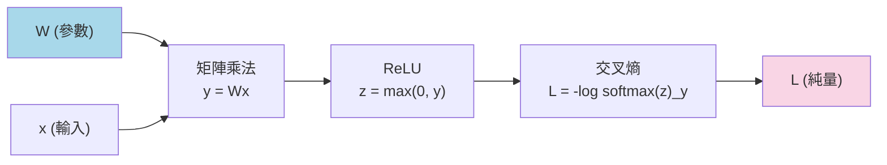
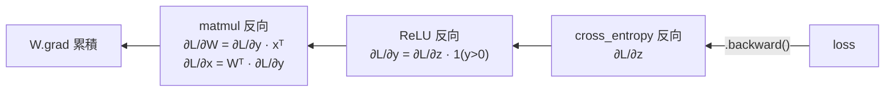

# 梯度、反向傳播與自動微分

  <strong>等級：</strong> 初中級
  <strong>先備知識：</strong><a href="linear-algebra.md">向量與矩陣</a>、<a href="probability.md">交叉熵損失</a>
  <strong>相關章節：</strong><a href="../moe/training-stability.md">MoE 訓練穩定性</a>、<a href="../foundations/numerics-precision.md">數值與精度</a>

訓練深度學習模型的本質是：對損失函數 $\mathcal{L}$ 求關於每個參數的偏微分，然後往梯度的反方向走一小步。本頁從偏微分的定義出發，推到鏈式法則，再說明 autograd（自動微分）如何把這件事自動化——以及為什麼在 GPU 上跑反向傳播會比前向更耗記憶體。

## 偏微分：只動一個變數

給定函數 $f(x_1, x_2, \ldots, x_n)$，對 $x_i$ 的**偏微分**定義為：

$$
\frac{\partial f}{\partial x_i} = \lim_{\epsilon \to 0} \frac{f(x_1, \ldots, x_i + \epsilon, \ldots, x_n) - f(x_1, \ldots, x_i, \ldots, x_n)}{\epsilon}.
$$

直覺：把 $x_i$ 增加一點點 $\epsilon$，$f$ 增加了多少？偏微分就是這個「斜率」，其他變數全部視為常數。

### 梯度向量

把所有偏微分收集成向量，就是**梯度（gradient）**：

$$
\nabla_x \mathcal{L} = \begin{bmatrix} \dfrac{\partial \mathcal{L}}{\partial x_1} \\[6pt] \dfrac{\partial \mathcal{L}}{\partial x_2} \\ \vdots \\ \dfrac{\partial \mathcal{L}}{\partial x_n} \end{bmatrix} \in \mathbb{R}^n.
$$

梯度指向 $\mathcal{L}$ 上升最快的方向；**梯度下降**就是往反方向走：

$$
\theta \leftarrow \theta - \eta \cdot \nabla_\theta \mathcal{L},
$$

其中 $\eta > 0$ 是學習率（learning rate）。

## 鏈式法則：複合函數的微分

若 $y = g(x)$，$z = f(y) = f(g(x))$，則：

$$
\frac{\partial z}{\partial x} = \frac{\partial z}{\partial y} \cdot \frac{\partial y}{\partial x}.
$$

鏈式法則說：複合函數的微分 = 外層函數的微分 × 內層函數的微分。若有更多層，就繼續相乘：

$$
\frac{\partial \mathcal{L}}{\partial x} = \frac{\partial \mathcal{L}}{\partial z_n} \cdot \frac{\partial z_n}{\partial z_{n-1}} \cdots \frac{\partial z_2}{\partial z_1} \cdot \frac{\partial z_1}{\partial x}.
$$

**反向傳播（backpropagation）就是這條鏈從輸出端往輸入端依序計算的演算法。**

## 計算圖：把前向計算可視化

把前向計算寫成有向無環圖（DAG）：節點是操作，邊是資料流動方向。

前向傳播從左到右，計算並儲存中間值；反向傳播從右到左，用鏈式法則累積梯度。

## 矩陣乘法的梯度

設 $y = Wx$，$\mathcal{L}$ 是後續某個純量損失，已知 $\partial\mathcal{L}/\partial y$（從後面傳來的梯度），則：

$$
\frac{\partial \mathcal{L}}{\partial W} = \frac{\partial \mathcal{L}}{\partial y} \cdot x^\top, \qquad
\frac{\partial \mathcal{L}}{\partial x} = W^\top \cdot \frac{\partial \mathcal{L}}{\partial y}.
$$

!!! Note "維度檢查"
    - $y \in \mathbb{R}^m$，$W \in \mathbb{R}^{m \times n}$，$x \in \mathbb{R}^n$
    - $\partial\mathcal{L}/\partial y \in \mathbb{R}^m$（行向量寫成列向量）
    - $\partial\mathcal{L}/\partial W = (\partial\mathcal{L}/\partial y)\, x^\top \in \mathbb{R}^{m \times n}$（與 $W$ 同形）✓
    - $\partial\mathcal{L}/\partial x = W^\top\, (\partial\mathcal{L}/\partial y) \in \mathbb{R}^n$（與 $x$ 同形）✓

    反向傳播的梯度乘法剛好和前向傳播的矩陣轉置對稱，這不是巧合，而是線性映射伴隨的必然結果。

## Autograd：自動微分的實作

手動寫梯度公式既費時又容易出錯。**Autograd** 系統讓框架自動記錄前向計算的每一步，並在反向時自動套用鏈式法則。

PyTorch 的 autograd 核心概念：

- 每個 `Tensor` 可以帶 `grad_fn`，記錄是哪個操作產生了它。
- 呼叫 `loss.backward()` 時，框架從 `loss` 沿 `grad_fn` 鏈往回走，每一步把局部梯度乘進來。
- 葉節點（leaf node，即直接建立的參數 tensor）的梯度累積到 `.grad`。

### 反向為什麼比前向更耗記憶體？

前向傳播計算中間值（activations），然後就可以繼續往前走；但反向傳播需要重新存取這些中間值來計算梯度。因此訓練時需要把整個前向路徑的 activation **全部保存在記憶體裡**，直到反向傳播用完為止。

這就是為什麼訓練一個 batch 的記憶體需求通常是推論的 3–5 倍，也是 **activation checkpointing**（梯度檢查點）技術的動機：以重算部分 activation 換取記憶體節省。

## 常見的梯度消失與爆炸

深層網路的反向傳播連乘多個局部梯度。若每個因子都 $< 1$，乘積指數衰減 → **梯度消失（vanishing gradients）**；若每個因子都 $> 1$ → **梯度爆炸（exploding gradients）**。

| 問題 | 症狀 | 常用緩解方法 |
|---|---|---|
| 梯度消失 | 淺層幾乎不更新，訓練停滯 | Residual connections、normalization、良好初始化 |
| 梯度爆炸 | Loss 突然 NaN，參數無窮大 | Gradient clipping（`torch.nn.utils.clip_grad_norm_`）、loss scaling（FP16） |

MoE 的 **router z-loss** 也是應對梯度問題的一個機制：它懲罰 logit 的 L2 norm 過大，防止 router 的分佈在訓練早期就過度銳利化（見 [訓練穩定性](../moe/training-stability.md)）。

## Softmax 的梯度

Softmax 的 Jacobian（$n \times n$ 矩陣，$i,j$ 項為 $\partial p_i/\partial z_j$）為：

$$
\frac{\partial p_i}{\partial z_j} = p_i(\delta_{ij} - p_j),
$$

其中 $\delta_{ij}$ 是 Kronecker delta（$i=j$ 時為 1，否則為 0）。

結合交叉熵損失 $\mathcal{L} = -\log p_y$，對 logit 的梯度化簡得：

$$
\frac{\partial \mathcal{L}}{\partial z_i} = p_i - \mathbf{1}[i = y].
$$

直覺漂亮：**梯度 = 預測機率 $-$ 真實機率**（one-hot）。若模型在正確答案上的機率已接近 1，梯度就接近 0，更新量自然縮小。

## 快速小結

| 概念 | 公式 | 意義 |
|---|---|---|
| 偏微分 | $\partial f/\partial x_i$ | $x_i$ 對 $f$ 的局部影響 |
| 梯度 | $\nabla_x \mathcal{L} \in \mathbb{R}^n$ | 所有偏微分的向量，指向上升最快的方向 |
| 鏈式法則 | $\partial z/\partial x = (\partial z/\partial y)(\partial y/\partial x)$ | 複合函數微分 = 依序連乘 |
| 矩陣乘法梯度 | $\partial\mathcal{L}/\partial W = (\partial\mathcal{L}/\partial y) x^\top$ | 「外積」形式 |
| Autograd | 框架自動記錄 `grad_fn`，`.backward()` 觸發反向 | 不用手寫梯度 |
| Softmax 梯度 | $\partial\mathcal{L}/\partial z_i = p_i - \mathbf{1}[i=y]$ | 預測 $-$ 真實 |
