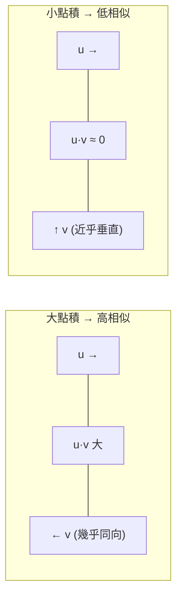
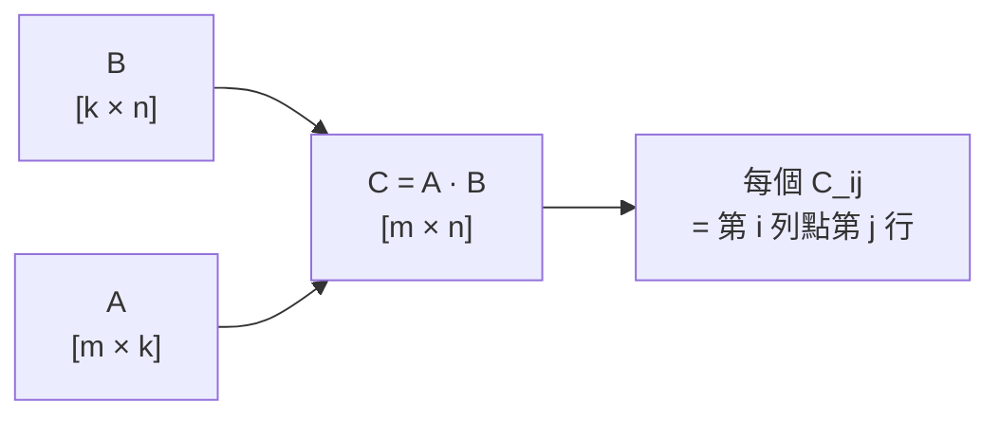

# 向量、矩陣與線性映射

  <strong>等級：</strong> 入門
  <strong>先備知識：</strong>高中數學
  <strong>硬體：</strong>無（筆和紙）

深度學習的骨子裡全是線性代數。Transformer 的每一步 —— embedding lookup、attention、FFN —— 都是矩陣乘法加上少量非線性。本頁把這些操作的**幾何意義**說清楚，這樣往後遇到「這個矩陣是幹什麼的？」就有直覺可以依靠。

## 向量：帶方向的量

**向量**是 $n$ 個數的有序排列，記作 $v \in \mathbb{R}^n$：

$$
v = \begin{bmatrix} v_1 \\ v_2 \\ \vdots \\ v_n \end{bmatrix}.
$$

幾何上，你可以把它想成 $n$ 維空間裡從原點出發的一支箭頭。在 ML 語境裡，一個 token embedding 就是 $\mathbb{R}^d$ 裡的一個向量，$d$ 稱為**隱藏維度（hidden size）**，GPT-4 量級的模型通常在 $d = 8192$ 上下。

### 長度（L2 範數）

$$
\|v\|_2 = \sqrt{v_1^2 + v_2^2 + \cdots + v_n^2} = \sqrt{v^\top v}.
$$

如果我們要求 $\|v\|_2 = 1$，就說 $v$ 是**單位向量**。RMSNorm 把每個 hidden state 正規化到接近單位長度，原因正是要穩定後續的乘積規模。

### 點積與相似度

兩個向量 $u, v \in \mathbb{R}^n$ 的**點積（inner product）**定義為：

$$
u \cdot v = u^\top v = \sum_{i=1}^{n} u_i v_i = \|u\|_2 \|v\|_2 \cos\theta,
$$

其中 $\theta$ 是兩個向量之間的夾角。這個等式說明了點積有多大取決於兩件事：向量有多長，以及它們指向多接近同一個方向。

Attention 的核心 $q_i \cdot k_j$ 就是在問「query token $i$ 和 key token $j$ 有多相似？」

!!! Note "為什麼除以 $\sqrt{d_h}$？"
    如果 $q$ 和 $k$ 的每個分量都是獨立的標準常態變數，那麼 $q \cdot k$ 的**變異數**是 $d_h$（標準差 $\sqrt{d_h}$）。不除的話，點積會隨維度一起變大，使 softmax 飽和。除以 $\sqrt{d_h}$ 把它縮回 $O(1)$ 的範圍。

## 矩陣：線性映射的具體化

**矩陣** $A \in \mathbb{R}^{m \times n}$ 代表一個**線性映射**：它把 $\mathbb{R}^n$ 裡的向量送到 $\mathbb{R}^m$：

$$
y = Ax, \quad y \in \mathbb{R}^m, \quad x \in \mathbb{R}^n.
$$

「線性」的意思是：$A(u + v) = Au + Av$，且 $A(\alpha u) = \alpha Au$。矩陣不只是一張數字表，它是一個**空間變換**。

### 矩陣乘法

若 $A \in \mathbb{R}^{m \times k}$，$B \in \mathbb{R}^{k \times n}$，則乘積 $C = AB \in \mathbb{R}^{m \times n}$，其中：

$$
C_{ij} = \sum_{p=1}^{k} A_{ip} B_{pj} = \text{(row } i \text{ of } A) \cdot \text{(column } j \text{ of } B).
$$

這個操作有個極其重要的特性：**先做 $B$ 再做 $A$，等同於做一個組合變換 $AB$**。Transformer 裡把多個線性層融合（fuse）成一個 GEMM，數學依據就在這裡。

!!! Tip "維度追蹤是最重要的習慣"
    每次看到矩陣乘法，先確認兩個維度對齊：左矩陣的列數 = 右矩陣的行數。輸出的形狀是 (左的行數) × (右的列數)。在 PyTorch 裡這叫做 `(m, k) @ (k, n) → (m, n)`。養成這個習慣，80% 的維度 bug 都會在腦子裡就被抓到。

### 轉置

矩陣 $A \in \mathbb{R}^{m \times n}$ 的**轉置** $A^\top \in \mathbb{R}^{n \times m}$，定義為 $(A^\top)_{ij} = A_{ji}$。幾何上，若 $A$ 是把 $\mathbb{R}^n \to \mathbb{R}^m$ 的映射，$A^\top$ 大致上是它的「反方向」——正式說是它的**伴隨（adjoint）**。

關鍵性質：$(AB)^\top = B^\top A^\top$。梯度計算中到處都用到這個。

## 秩：一個映射有幾個「獨立方向」

矩陣 $A \in \mathbb{R}^{m \times n}$ 的**秩（rank）**，定義為 $A$ 的行（columns）所能張出的子空間的維度：

$$
\operatorname{rank}(A) = \dim(\operatorname{col}(A)) \leq \min(m, n).
$$

直覺：秩 = 這個映射真正使用了幾個「獨立的方向」。

| 秩 | 幾何意義 | 例子 |
|---|---|---|
| $r = \min(m,n)$ | **滿秩（full rank）**，映射盡量展開空間 | 隨機初始化的 weight matrix |
| $r \ll \min(m,n)$ | **低秩（low rank）**，輸出被壓縮到少數幾個方向 | LoRA $\Delta W = BA$；MLA 的 KV latent |
| $r = 1$ | **秩一（rank-one）**，所有輸出都是同一個向量的倍數 | $uv^\top$，外積 |

### 秩一矩陣的例子

若 $u \in \mathbb{R}^m$，$v \in \mathbb{R}^n$，則**外積** $uv^\top \in \mathbb{R}^{m \times n}$ 是秩一矩陣：

$$
(uv^\top)_{ij} = u_i v_j.
$$

它的每一列都是 $u$ 的倍數，每一行都是 $v^\top$ 的倍數，整個矩陣的資訊被「壓縮」進兩個向量。一般的**低秩矩陣**就是幾個秩一矩陣的和。

## 矩陣乘法的 FLOP 計數

$m \times k$ 矩陣乘以 $k \times n$ 矩陣：

$$
\text{FLOPs} = 2 \cdot m \cdot k \cdot n
$$

（每個輸出元素 = $k$ 次乘法 + $k-1$ 次加法 $\approx 2k$ ops，共 $mn$ 個元素。）

這個公式在手冊各處反覆出現：Transformer 的 attention FLOP 是 $2 \cdot N \cdot N \cdot d_h$（$N$ 是序列長度），FFN 的 FLOP 是 $2 \cdot N \cdot d \cdot 4d$ ……。秩越低，矩陣越能被分解成兩個小矩陣之積，FLOPs 與參數量就都下降。

!!! Tip "接下來"
    如果你已經清楚「秩」是什麼，就可以進入 [低秩矩陣與矩陣分解](low-rank.md)，看 SVD 怎麼找到矩陣裡最重要的那幾個方向，以及 MLA 和 LoRA 怎麼利用低秩結構。
