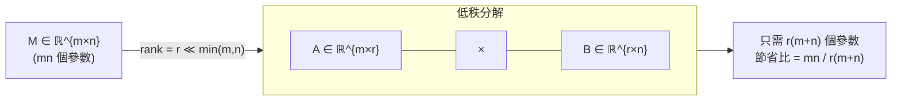
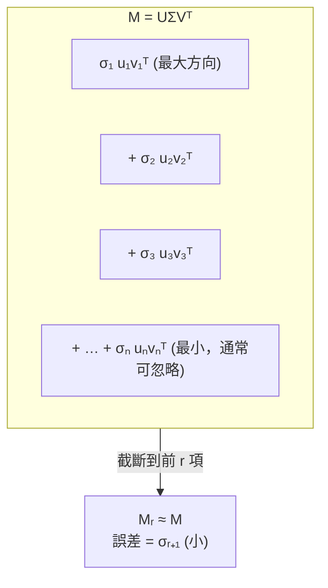
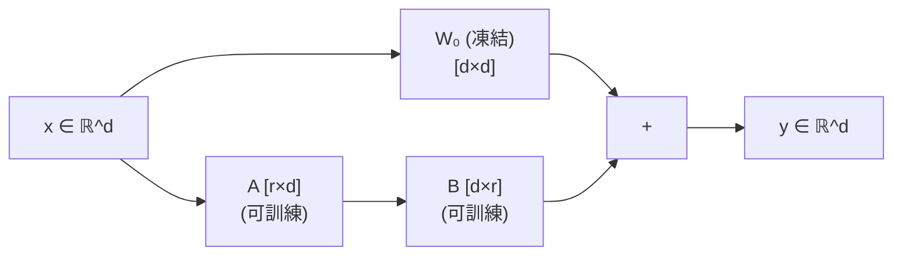
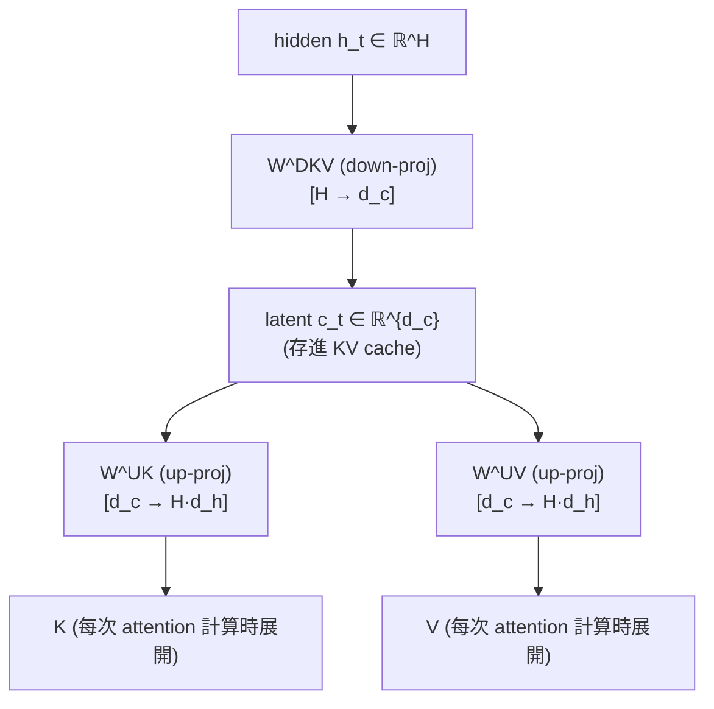

# 低秩矩陣與矩陣分解

  <strong>等級：</strong> 初中級
  <strong>先備知識：</strong><a href="linear-algebra.md">向量、矩陣與線性映射</a>
  <strong>相關章節：</strong><a href="../aiter/decode-math.md">MLA Decode 數學</a>、<a href="../foundations/attention-efficiency.md">Attention 效率</a>

MLA（Multi-head Latent Attention）把 KV cache 存成「低秩 latent」；LoRA 用兩個小矩陣的積來近似大型 weight update；量化理論裡也常見低秩假設。這些想法背後都有同一套數學：**一個高維矩陣如果只有少數幾個「真正獨立的方向」，就能用遠比原來小的資料結構表示**。

本頁從「秩」的定義出發，帶你推導 SVD，再直接對應到 MLA 的 KV latent 是什麼、它為什麼省記憶體。

## 低秩的直覺

考慮一個矩陣 $M \in \mathbb{R}^{1000 \times 1000}$，裡面有 10⁶ 個數字。如果 $\operatorname{rank}(M) = 5$，這代表雖然它有 10⁶ 個元素，但整個矩陣的資訊其實只被「壓縮」在 5 個獨立方向上。

最直接的表示方式：任何秩 $r$ 矩陣都能寫成 $r$ 個秩一矩陣的和：

$$
M = \sum_{i=1}^{r} \sigma_i \, u_i v_i^\top, \qquad
u_i \in \mathbb{R}^m,\; v_i \in \mathbb{R}^n,\; \sigma_i > 0.
$$

存這個只需要 $r(m + n)$ 個數，而不是 $mn$ 個。當 $r \ll \min(m,n)$ 時，節省量非常可觀。

## 奇異值分解（SVD）

**SVD（Singular Value Decomposition）** 是找出矩陣「最重要的幾個方向」的標準工具。

!!! Note "定理（SVD）"
    任意矩陣 $M \in \mathbb{R}^{m \times n}$（不需要是方陣）都可以分解為：

    $$
    M = U \Sigma V^\top,
    $$

    其中：
    - $U \in \mathbb{R}^{m \times m}$：正交矩陣（$U^\top U = I$），行向量稱為**左奇異向量（left singular vectors）**
    - $\Sigma \in \mathbb{R}^{m \times n}$：對角矩陣，對角線上的非負值 $\sigma_1 \geq \sigma_2 \geq \cdots \geq 0$ 稱為**奇異值（singular values）**
    - $V \in \mathbb{R}^{n \times n}$：正交矩陣（$V^\top V = I$），行向量稱為**右奇異向量（right singular vectors）**

奇異值 $\sigma_i$ 衡量矩陣在第 $i$ 個方向上的「伸展程度」。若 $\sigma_i$ 很小，代表那個方向對輸出的貢獻微乎其微。

### SVD 展開成秩一矩陣

把 SVD 展開，就得到我們之前提到的分解形式：

$$
M = \sum_{i=1}^{\min(m,n)} \sigma_i \, u_i v_i^\top,
$$

其中 $u_i$ 是 $U$ 的第 $i$ 個行向量，$v_i$ 是 $V$ 的第 $i$ 個行向量。

**關鍵觀察**：奇異值是由大到小排列的。如果只保留前 $r$ 項：

$$
M_r = \sum_{i=1}^{r} \sigma_i \, u_i v_i^\top = U_r \Sigma_r V_r^\top,
$$

這就是 $M$ 的**最佳秩 $r$ 近似**（在 Frobenius 範數或算子範數下都成立，這是 Eckart–Young 定理）。

### 近似誤差

$$
\|M - M_r\|_F^2 = \sum_{i=r+1}^{\min(m,n)} \sigma_i^2.
$$

如果奇異值快速衰減（很多 $\sigma_i \approx 0$），低秩近似的誤差就很小。這正是「矩陣具有低秩結構」的意思。

## LoRA：用低秩 $\Delta W$ 做微調

LoRA（Low-Rank Adaptation）觀察到：在大型語言模型微調時，weight 的**更新量** $\Delta W$ 往往具有低秩結構。既然如此，不用存一個完整的 $\Delta W \in \mathbb{R}^{d \times d}$，只要存兩個小矩陣：

$$
\Delta W = BA, \qquad B \in \mathbb{R}^{d \times r},\; A \in \mathbb{R}^{r \times d},\; r \ll d.
$$

前向傳播時：

$$
y = (W_0 + \Delta W)\,x = W_0 x + B(Ax).
$$

$W_0$ 凍結不動，只訓練 $A$ 和 $B$。可訓練參數量從 $d^2$ 降到 $2dr$，對 $d=4096$、$r=8$ 來說，是 $16\text{M}$ vs $8192$ —— 壓縮超過 2000 倍。

!!! Note "為什麼假設低秩是合理的？"
    直覺是：大模型本身已經「見過」大量分佈；微調只是把行為稍微偏移，所需要的方向改變很少。實驗上，LoRA 在許多任務上的表現與全量微調相當，但記憶體開銷低了幾十倍。

## MLA：把 KV cache 存成低秩 latent

Multi-head Latent Attention（DeepSeek-V2/V3 提出）把低秩思想直接用在 **KV cache** 的壓縮上。

傳統 MHA 每層每個 token 要快取 $K$ 和 $V$ 兩個矩陣，大小各是 $[N_{\text{heads}}, d_h]$，總共是 $2 H d_h$ 個元素（$H$ 是 head 數，$N$ 是 token 數）。當 $N$ 很長時，KV cache 會吃掉大量 GPU HBM。

MLA 的做法：**不直接快取 $K$ 和 $V$，而是快取它們共同的低秩 latent $c$**，再在 attention 前用矩陣把它「升維」回去。

$$
\underbrace{c_{\ell,t}}_{\in \mathbb{R}^{d_c}} = h_{\ell,t}\, W^{DKV}_\ell, \qquad d_c \ll H d_h.
$$

Attention 計算時：

$$
k_{\ell,t} = c_{\ell,t}\, W^{UK}_\ell, \quad
v_{\ell,t} = c_{\ell,t}\, W^{UV}_\ell.
$$

KV cache 的大小從 $O(N \cdot 2Hd_h)$ 降到 $O(N \cdot d_c)$。DeepSeek-V2 的數字：$H=128$，$d_h=128$，$d_c=512$，壓縮比約 $128 \times 128 \times 2 / 512 \approx 64\times$。

### W^UK 的「吸收」技巧

注意 attention logit 的計算：

$$
\text{score}_{t,u} = q_{\ell,t} \cdot k_{\ell,u} = q_{\ell,t} \cdot (c_{\ell,u}\, W^{UK}_\ell).
$$

如果預先計算 $\tilde{q}^C_{\ell,t} = q_{\ell,t}\, (W^{UK}_\ell)^\top$，那麼：

$$
\text{score}_{t,u} = \tilde{q}^C_{\ell,t} \cdot c_{\ell,u}.
$$

這樣 attention 就直接在低秩 latent 維度 $d_c$ 上計算，$W^{UK}$ 被「吸收」進 query 端，不需要在每個 decode step 都把整個 KV cache 展開。這是 [decode-math.md](../aiter/decode-math.md) 裡 $q_b$ up-proj + $W^{UK}$ absorb 那一步的數學基礎。

## 快速小結

| 概念 | 定義 | ML 應用 |
|---|---|---|
| 秩 $r$ | 矩陣真正獨立的方向數 | 衡量參數冗餘度 |
| SVD | $M = U\Sigma V^\top$，按重要性排列方向 | PCA、低秩近似、壓縮 |
| 低秩近似 $M_r$ | 保留前 $r$ 個奇異值/向量 | 最佳壓縮；誤差 $= \sigma_{r+1}$ |
| LoRA $\Delta W = BA$ | 用 $r$ 個方向做 fine-tune | 減少可訓練參數 |
| MLA KV latent $c$ | 把 KV 的「公共子空間」快取 | 壓縮 KV cache 達 64× |

!!! Tip "延伸閱讀"
    - [Attention 效率](../foundations/attention-efficiency.md)：KV cache 對 decode 延遲的影響
    - [Decode 算子數學對照](../aiter/decode-math.md)：MLA 的完整推導，現在這些符號應該都不陌生了
