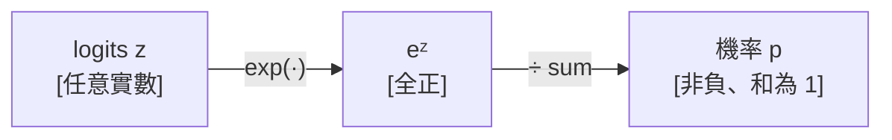

# 機率、Softmax 與 Entropy

  <strong>等級：</strong> 入門
  <strong>先備知識：</strong><a href="linear-algebra.md">向量、矩陣</a>；指數函數
  <strong>相關章節：</strong><a href="../foundations/transformer-from-scratch.md">Transformer 從零實作</a>、<a href="../moe/load-balancing.md">MoE 負載平衡</a>

機率在 Transformer 裡至少出現三次：attention weights、語言模型的最後輸出、MoE router 的 dispatch 分佈。每次的核心操作都是同一個：**softmax**。本頁把 softmax 的來源、數值問題、以及伴隨而來的 entropy 與 KL 散度說清楚。

## 離散機率分佈

$n$ 個事件的**離散機率分佈**是一個向量 $p \in \mathbb{R}^n$，滿足：

$$
p_i \geq 0 \;\text{ for all } i, \qquad \sum_{i=1}^{n} p_i = 1.
$$

語言模型的最後一步輸出的就是這樣的向量，長度 = 詞彙表大小 $V$（幾萬到幾十萬），$p_i$ 是下一個 token 是第 $i$ 個詞的機率。

## Softmax：把任意分數轉成機率

模型計算出的原始分數（**logits**）是任意實數向量 $z \in \mathbb{R}^n$，沒有非負且加總為一的保證。**Softmax** 把它們轉成合法的機率分佈：

$$
\operatorname{softmax}(z)_i = \frac{e^{z_i}}{\sum_{j=1}^{n} e^{z_j}}.
$$

### 為什麼用指數？

指數有三個好性質：

1. **總是正的**：$e^{z_i} > 0$ 恆成立，保證 $p_i > 0$。
2. **放大差異**：若 $z_i - z_j = 2$，則 $e^{z_i}/e^{z_j} = e^2 \approx 7.4$；差距被指數放大，讓分佈更「銳利」。
3. **可微**：整個函數是平滑的，梯度可以反向傳播。

### Temperature：控制銳利程度

很多場合（生成時的採樣、router softmax）會引入**溫度 $\tau > 0$**：

$$
\operatorname{softmax}(z/\tau)_i = \frac{e^{z_i/\tau}}{\sum_j e^{z_j/\tau}}.
$$

| $\tau$ | 效果 |
|---|---|
| $\tau \to 0$ | 幾乎全部機率集中在最大 logit（近似 argmax） |
| $\tau = 1$ | 標準 softmax |
| $\tau \to \infty$ | 趨向均勻分佈 |

MoE router 在訓練初期有時用較大的 $\tau$ 避免路由過早塌縮到少數 expert；推論時常用 $\tau < 1$ 讓輸出更確定。

## 數值穩定的 Softmax

直接計算 $e^{z_i}$ 有溢位風險：若 $z_i = 1000$，則 $e^{1000}$ 超出 float32 的上限（約 $3.4 \times 10^{38}$）直接變成 `inf`。

標準解法：利用 softmax 對常數平移不變，先減去最大值：

$$
\operatorname{softmax}(z)_i
= \frac{e^{z_i - m}}{\sum_j e^{z_j - m}}, \qquad m = \max_j z_j.
$$

減去 $m$ 後，最大的指數項變成 $e^0 = 1$，其餘全部 $\leq 1$，完全避免上溢。

!!! Note "FlashAttention 的 online softmax"
    [FlashAttention](../foundations/flashattention.md) 在 tiling 時需要在「還沒看到所有分數」的情況下計算 softmax。它用**online softmax** 一邊讀 tile 一邊更新最大值 $m$ 和分母 $\ell$，最後補一個修正因子。數值穩定性的原理與上面完全相同，只是延遲到最後才做除法。

## 交叉熵損失

訓練時，我們讓模型輸出的分佈 $q$（預測）盡量接近真實分佈 $p$（one-hot 標籤）。最常用的損失是**交叉熵（cross-entropy）**：

$$
\mathcal{L} = -\sum_{i=1}^{n} p_i \log q_i.
$$

當 $p$ 是 one-hot（即第 $y$ 個分量為 1，其餘為 0）時，化簡為：

$$
\mathcal{L} = -\log q_y.
$$

直覺：若模型在正確答案 $y$ 上給了高機率 $q_y$，損失就小；若 $q_y \approx 0$，損失趨向 $+\infty$。

### 結合 softmax：log-sum-exp 技巧

把 $q = \operatorname{softmax}(z)$ 代入：

$$
\mathcal{L} = -z_y + \log\sum_j e^{z_j} = -z_y + \operatorname{LSE}(z),
$$

其中 $\operatorname{LSE}(z) = \log\sum_j e^{z_j}$ 稱為 **log-sum-exp**。PyTorch 的 `F.cross_entropy` 直接在 logit 上計算這個，不需要先過 softmax，既數值穩定又省一次 kernel。

## Entropy：分佈的「不確定程度」

分佈 $p$ 的**Shannon entropy** 定義為：

$$
H(p) = -\sum_{i=1}^{n} p_i \log p_i, \qquad \text{（約定 } 0 \log 0 = 0 \text{）}.
$$

| 分佈形狀 | Entropy |
|---|---|
| Uniform：$p_i = 1/n$ | $H = \log n$（最大） |
| One-hot：全部集中在一個 | $H = 0$（最小） |

### MoE 負載均衡中的 Entropy

MoE router 理想上應讓 token **均勻分配**給各個 expert，讓所有 expert 都有事做（高 entropy）。若 router 塌縮，99% 的 token 都去同一個 expert（低 entropy），其餘 expert 閒置，浪費算力。[負載平衡損失](../moe/load-balancing.md) 的設計目標之一就是最大化 routing 分佈的 entropy。

## KL 散度：量化兩個分佈的差距

**KL 散度（Kullback–Leibler divergence）**衡量分佈 $q$ 與 $p$ 的差異：

$$
D_{\mathrm{KL}}(p \,\|\, q) = \sum_{i} p_i \log \frac{p_i}{q_i}.
$$

性質：

- $D_{\mathrm{KL}}(p \,\|\, q) \geq 0$，且等號成立若且唯若 $p = q$（非負性）。
- **不對稱**：$D_{\mathrm{KL}}(p \| q) \neq D_{\mathrm{KL}}(q \| p)$。
- 等於交叉熵減去 entropy：$D_{\mathrm{KL}}(p \| q) = H(p,q) - H(p)$，其中 $H(p,q) = -\sum_i p_i \log q_i$ 是交叉熵。

因此訓練時最小化交叉熵損失，等同於最小化預測分佈 $q$ 相對於真實分佈 $p$ 的 KL 散度（當 $p$ 是固定 one-hot 時，$H(p) = 0$，兩者完全等價）。

## 快速小結

| 概念 | 公式 | 用途 |
|---|---|---|
| Softmax | $p_i = e^{z_i}/\sum_j e^{z_j}$ | Attention weights、LM head、MoE router |
| 數值穩定 softmax | 先減 $\max_j z_j$ | 避免 float 溢位 |
| Temperature | $\operatorname{softmax}(z/\tau)$ | 控制分佈銳利度 |
| Cross-entropy | $-\log q_y$ | 語言模型訓練損失 |
| Log-sum-exp | $\log\sum_j e^{z_j}$ | 數值穩定的 softmax 分母 |
| Entropy | $-\sum_i p_i \log p_i$ | 衡量分佈的均勻程度 |
| KL 散度 | $\sum_i p_i \log(p_i/q_i)$ | 衡量兩分佈的差距 |

!!! Tip "接下來"
    [梯度、反向傳播與自動微分](calculus.md) 會說明這些損失函數如何對模型參數求微分，讓梯度下降得以運作。
