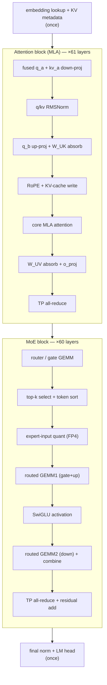
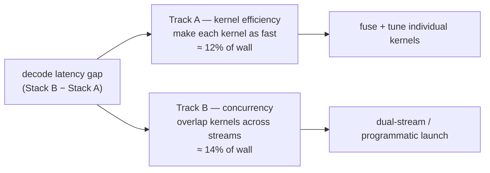
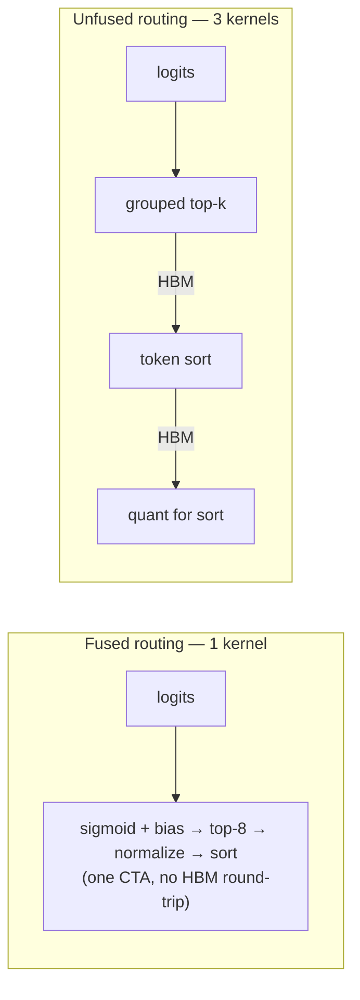
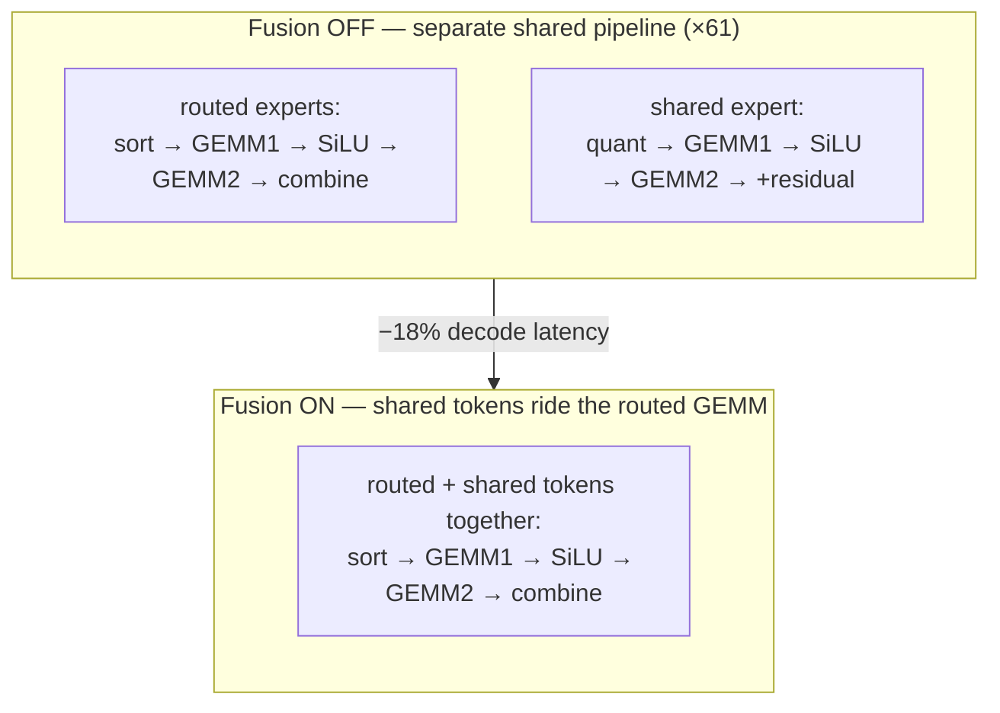

# Anatomy of an MoE decode

  <strong>Level:</strong> advanced
  <strong>Prereqs:</strong> <a href="../systems-ep/">systems &amp; EP</a>, <a href="../kernels/">kernels</a>, <a href="../inference-serving/">serving</a>, <a href="../../foundations/attention-efficiency/">attention efficiency</a>
  <strong>Hardware:</strong> none (reads a real profile)

Every prior Part II page built one component. This page puts them on a clock. We
take a **real per-token decode profile** of a trillion-parameter MLA + MoE model
(DeepSeek-V3-class: MLA attention, 1 dense layer + 60 fine-grained MoE layers,
384 routed + 1 shared expert, top-8, sigmoid gate, FP4 expert weights, tensor
parallel = 4) and walk the GPU kernel-by-kernel through a single decode step.
Then we use the same trace to make three systems lessons concrete: **what the
decode critical path actually is**, **how kernel fusion changes it**, and **how
the same math runs at very different speeds on two accelerator stacks**.

!!! note "Vendor-neutral by design"
    The numbers come from two real accelerator stacks. We call them **Stack A**
    and **Stack B** rather than naming hardware — the point here is the
    *structure* of the decode and the *mechanism* of each optimization, which is
    portable. Stack A overlaps kernels aggressively and fuses the routing
    pipeline; Stack B runs more serially and fuses elsewhere. Neither is "the
    fast one" everywhere — that's the lesson.

## The decode step, stage by stage

One decoded token runs the whole model once. Because every layer is identical,
the per-layer kernels repeat — the profile's key column is **calls/iter**, the
number of layers a stage runs in (61 for attention, 60 for the MoE block, 1 for
the dense layer-0 MLP). Per-stage cost = calls × cost-per-call, so high-frequency
stages dominate even when each call is cheap. The pipeline, in execution order:

Where the time goes (single-stream profile, the two big GEMM-heavy stages
highlighted):

| Stage | Calls/iter | Share of decode | Notes |
|---|---|---|---|
| Routed GEMM1 (gate+up) | 60 | ~15% | grouped expert GEMM, FP4 weights |
| Top-$k$ select + token sort | 60 | ~5–12% | routing + permutation; **most fusion-sensitive** |
| Core MLA attention | 61 | ~8% | paged MLA decode |
| Routed GEMM2 (down) + combine | 60 | ~6–13% | grouped GEMM + weighted combine |
| Shared-expert / dense MLP GEMMs | 61 | ~8–10% | always-on dense path |
| TP all-reduce (attn + MoE) | 121 | ~10% | two per layer, communication |
| Router/gate GEMM | 60 | ~4–6% | 384-way logits |
| everything else (norms, RoPE, quant, absorb, residual) | — | remainder | many cheap, high-frequency kernels |

Two things jump out, and both are pure Part II material:

- **The MoE block is the decode.** Routing + the two grouped expert GEMMs +
  shared expert together are roughly half the step. This is the
  [memory-bound decode](../foundations/attention-efficiency.md) regime: at batch
  1 each expert GEMM reads FP4 weights to emit one token, so the
  [quantization](../performance/quantization.md) that shrinks those weights is
  what makes the step affordable.
- **Communication is a first-class line item.** Two TP all-reduces per layer
  (~120 calls) cost about as much as the single most expensive GEMM — the
  [collectives](../performance/distributed-training.md) tax, paid every layer.

## Lesson 1 — the critical path is two separate tracks

A naive read of "stage X is 12% of the step" assumes the step is the sum of its
kernels. It isn't, because a good stack **overlaps** kernels. The profile splits
the decode wall-clock cleanly:

$$ \underbrace{\text{wall}}_{\text{latency users feel}} = \underbrace{\text{busy}}_{\text{GPU running ≥1 kernel}} + \underbrace{\text{idle}}_{\text{launch/sync gaps}}, \qquad \underbrace{\text{overlap}}_{\text{time hidden}} = \text{self-time} - \text{busy}. $$

On the two stacks for the same step:

| | Stack A (overlapping) | Stack B (serial) |
|---|---|---|
| Decode wall-clock | **1.00×** (baseline) | **1.33×** |
| Kernel self-time / wall | 111% (sums past 100%) | 96% |
| Overlap (time hidden) | large | ~0 |

Stack A's self-time *exceeds* its wall-clock — it runs kernels concurrently
(e.g. the always-on shared expert on a second stream while the router and routed
experts run on the first). Stack B runs the same kernels back-to-back. So the
33% gap decomposes into **two orthogonal, additive tracks**:

The identity holds exactly: `wall gap = TrackA(net) + TrackB + idle`. The
practical consequence is a planning trap avoided — **roughly half the gap is not
a slow-kernel problem at all**, it's a scheduling problem. Optimizing kernels
(Track A) and enabling overlap (Track B) are *different work* and their savings
*add* because they're disjoint by construction. Chasing only one leaves the other
on the table.

!!! tip "Why Amdahl's law makes call-count the right lens"
    A stage's share of the wall-clock is the **upper bound** on the speedup from
    optimizing only that stage (Amdahl). Because the per-call cost is similar
    across stages, the stages with the most *calls* (the per-layer MoE and
    attention kernels, ×60–61) carry the most total time — so they're where
    Track-A effort pays off, not the once-per-decode prologue/epilogue.

## Lesson 2 — fusion decides the kernel count

The two stacks compute **identical math** but **package it into different
kernels**. Each fusion removes a kernel launch and an HBM round-trip of the
intermediate (the [operator-fusion](../foundations/flashattention.md) win, applied
to the MoE pipeline). The trace shows fusion is a wash *in aggregate* — each
stack fuses different things — but one fusion dominates:

| Operation | Stack A | Stack B | Who fuses |
|---|---|---|---|
| **Routing: top-$k$ select + normalize + sort** | **1 fused kernel** | **3 kernels** | **A (biggest gap, ~3×)** |
| q/kv RMSNorm | 2 kernels | 1 fused | B |
| RoPE + KV-cache write | 2 kernels | 1 fused | B |
| Core MLA attention | 1 fused (attn+reduce) | 2 kernels (split-KV + reduce) | A |
| Routed GEMM2 + combine | 2 kernels | 1 fused | B |
| Shared-expert FP4 GEMM | in-kernel K-accum | GEMM + separate split-K reduce | A |

The standout is **routing**. One stack does sigmoid-bias → top-8 select →
normalize → token sort in a *single* kernel; the other spreads it across three
launches (select, sort, quant-for-sort). That one stage is the single biggest
kernel-efficiency gap in the whole decode — a direct, measured argument for the
"[fuse the routing](kernels.md)" advice from the kernels page.

!!! note "Split-K is the same trick on both stacks"
    A subtle one the trace clears up: both stacks use **split-K GEMMs** (partition
    the contraction dim across blocks, then a separate reduce kernel sums the
    partials — see [GPU programming](../performance/gpu-programming.md)). The
    difference is *frequency*: one stack split-Ks only the once-per-decode LM head;
    the other split-Ks its shared-expert FP4 GEMM **every layer**, so its reduce
    kernel fires ~60× instead of once. Same function, very different cost — a
    reminder to always weight a kernel by its call count.

## Lesson 3 — shared-experts fusion (a controlled before/after)

The cleanest experiment in the dataset: on one stack, toggle **shared-experts
fusion** on and off and re-profile. Recall the [shared expert](routing-variants.md)
is an always-on FFN every token passes through, *in addition* to its routed
experts. Naively it's a separate dense MLP per layer — its own GEMMs, activation,
quant, and residual add, all ×61. Fusion folds the shared expert's tokens into the
**routed grouped GEMM** so they ride along with the expert tokens:

The measured result is unambiguous because (on this stack) the kernels run
serially, so the wall-clock change is *entirely* a kernel-self-time change —
no overlap confound:

| Stage removed by fusion | Latency recovered (% of decode) |
|---|---|
| Separate shared-expert / dense-MLP GEMMs | ~10.8% |
| Its standalone activation-quant kernels | ~4.5% |
| Its residual add | ~2.3% |
| Its SiLU activation | ~2.2% |
| (small added routed cost: bigger sort + GEMM) | −0.7% net |
| **Total decode speedup** | **~18%** |

The lesson generalizes past this one model: an always-on dense path next to a
grouped sparse path is an invitation to fuse. The separate pipeline's GEMM,
activation, quant, and residual are all redundant launches once the shared
tokens are simply appended to the routed batch. Almost a fifth of decode latency
was structural overhead, not math.

## What to carry away

- **A decode step is mostly its MoE block** — routing + two grouped expert GEMMs
  + the shared expert — running once per token in the
  [memory-bound](../foundations/attention-efficiency.md) regime, with a
  per-layer [all-reduce](../performance/distributed-training.md) tax on top.
- **Latency is two additive tracks**: kernel efficiency (fuse + tune) and
  concurrency (overlap across streams). They're disjoint; measure and attack them
  separately or you'll mis-budget the work.
- **Fusion is the kernel-count lever.** The biggest single cross-stack gap is
  *unfused routing*; the biggest single optimization is *shared-experts fusion*
  (~18%). Both are the [kernels](kernels.md) page made quantitative.
- **Always weight a kernel by its call count.** Per-call cost lies; a cheap
  kernel that fires 60× (split-K reduce, residual add, quant) can outweigh an
  expensive one that fires once.

## Exercises

!!! tip "Solutions"
    Worked answers are on the [Part solutions page](../solutions/moe.md). Try each exercise before expanding.

1. A stage is 12% of the decode wall-clock but its kernels fully overlap with
   another stream. What is the maximum end-to-end speedup from making it
   *infinitely* fast? Relate your answer to the Track A / Track B split.
2. The routed GEMM1 is ~15% of the step and runs 60×; the LM head is ~1% and runs
   once. You can halve the per-call cost of exactly one. Which wins, and what does
   that say about optimizing by per-call cost vs total cost?
3. Shared-experts fusion removed a separate GEMM, activation, quant, and residual
   add (each ×61) for an ~18% win, at the cost of a slightly larger routed sort +
   GEMM. Write the inequality (in kernels-saved vs added-work terms) under which
   such a fusion is profitable.
4. One stack's self-time is 111% of its wall-clock; the other's is 96%. Explain
   how self-time can exceed wall-clock, and what a value *below* 100% implies
   about idle gaps.
5. Split-K turns one GEMM into a compute kernel + a reduce kernel. Given that the
   reduce fires once per layer (×60) on one stack and once per decode on the
   other, estimate the call-count penalty and argue whether avoiding split-K (via
   in-kernel K-accumulation) is worth it for a per-layer GEMM.

## References

- DeepSeek-AI. *DeepSeek-V3 Technical Report* (MLA, fine-grained + shared experts, FP8). 2024.
- Dao et al. *FlashAttention* (operator fusion / IO-awareness). 2022.
- Gale et al. *MegaBlocks: Efficient Sparse Training with Mixture-of-Experts.* 2022.
- Amdahl. *Validity of the single processor approach to achieving large scale computing capabilities.* 1967.
- NVIDIA CUTLASS and the SGLang serving framework documentation (grouped GEMM, dual-stream shared-expert overlap). 2024–2025.
