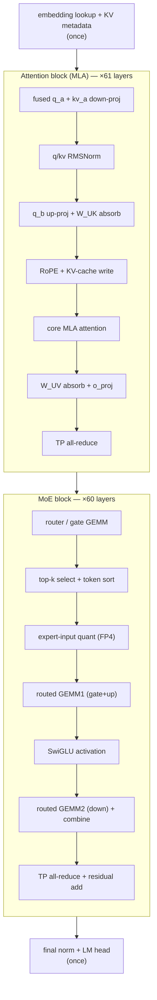
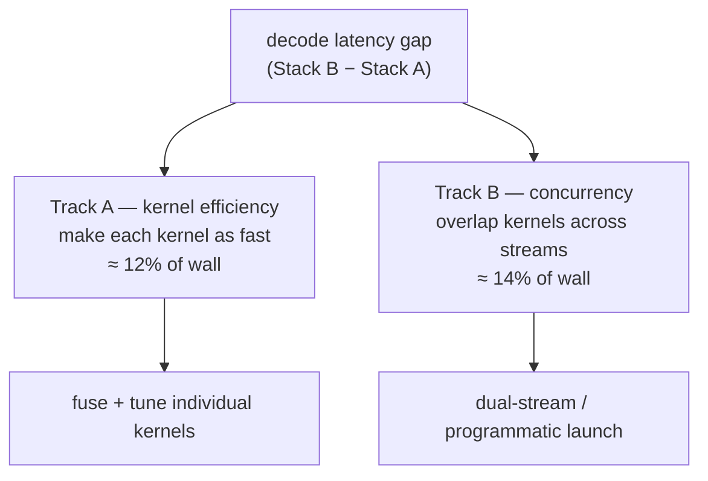
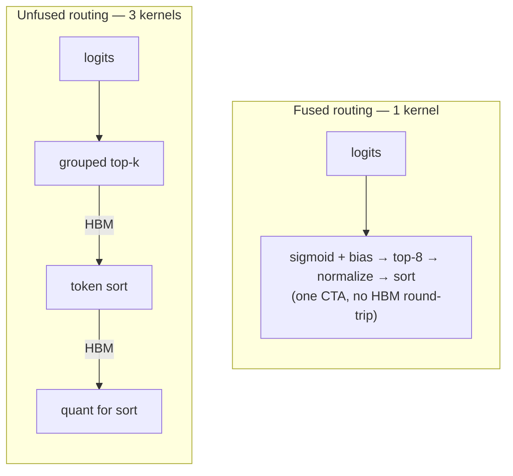
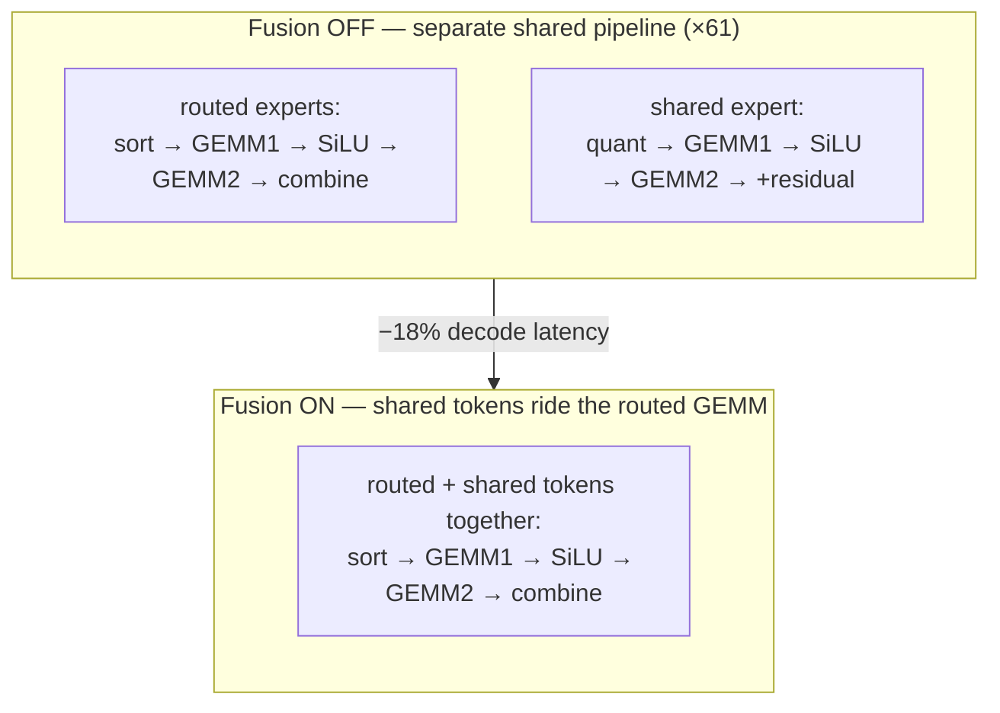

# MoE decode 剖析

  <strong>等級：</strong> 高階
  <strong>先備知識：</strong> <a href="../systems-ep/">系統與 EP</a>、<a href="../kernels/">kernels</a>、<a href="../../foundations/attention-efficiency/">attention 效率</a>
  <strong>硬體：</strong> 無（讀取真實 profile）

MoE 篇前面的頁面各自建好一個元件；這一頁把它們放上時鐘來量。我們取一個
兆參數級 MLA + MoE 模型的**真實逐 token decode profile**（DeepSeek-V3 級：MLA
attention、1 個 dense 層 + 60 個 fine-grained MoE 層、384 routed + 1 shared expert、
top-8、sigmoid gate、FP4 expert 權重、tensor parallel = 4），讓 GPU 一個 kernel 接
一個 kernel 走完單一 decode step。再用同一份 trace 帶出三個系統課題：**decode 的
critical path 實際長什麼樣**、**kernel fusion 如何改變它**，以及**同一組數學在兩個
不同加速器堆疊上為何跑出截然不同的速度**。

!!! note "刻意與供應商無關"
    這些數字來自兩個真實的加速器堆疊，我們稱為 **Stack A** 與 **Stack B** 而不指名
    硬體——重點是 decode 的*結構*與各項最佳化的*機制*（這些是可移植的）。Stack A
    積極重疊 kernel 並融合 routing pipeline；Stack B 較為循序、在別處做融合。重點不是
    「誰到處都快」——那正是這裡要打破的迷思。

## Decode step，逐一 kernel

一個 decoded token 會把整個模型跑一遍。因為每層結構相同，每層的 kernel 會重複，所以
profile 最關鍵的一欄是 **calls/iter**——某個 stage 在一步裡被呼叫的層數（attention
為 61，MoE block 為 60，dense 第 0 層 MLP 為 1）。每個 stage 的成本可寫成

$$ t_{\text{stage}} = (\text{calls/iter}) \times \bar t_{\text{call}}, \qquad
t_{\text{decode}} = \sum_{\text{stages}} t_{\text{stage}}, $$

其中 $\bar t_{\text{call}}$ 是該 stage 單次呼叫的平均時間。關鍵推論：**即使每次呼叫
很便宜，高 calls/iter 的 stage 仍可能支配整步**。pipeline 依執行順序如下：

時間都去哪了（單流 profile、低 batch decode；兩個大型 GEMM stage 標為重點）：

| stage                              | calls/iter | decode 佔比 | 備註                               |
| ---------------------------------- | ---------: | ----------- | ---------------------------------- |
| routed GEMM1（gate+up）            |         60 | ~15%        | grouped expert GEMM、FP4 權重      |
| top-$k$ select + token sort        |         60 | ~5–12%      | routing + permute；**對 fusion 最敏感** |
| core MLA attention                 |         61 | ~8%         | paged MLA decode                   |
| routed GEMM2（down）+ combine      |         60 | ~6–13%      | grouped GEMM + 加權 combine        |
| shared-expert / dense MLP GEMM     |         61 | ~8–10%      | 永遠在線的 dense 路徑              |
| TP all-reduce（attention + MoE）   |        121 | ~10%        | 每層兩次，communication            |
| router / gate GEMM                 |         60 | ~4–6%       | 384-way 邏輯                       |
| 其他（norm、RoPE、quant、absorb、residual） |    — | 餘額        | 許多便宜的高頻 kernel              |

兩件事浮現出來，且都是純粹的MoE 篇系統觀念：

**MoE block 就是 decode 的主體。** routing + 兩個 grouped expert GEMM + shared expert
合計約佔一步的一半。這是 [memory-bound decode](../foundations/attention-efficiency.md)
狀態：在 batch 1 時，每個 expert GEMM 為了輸出**一個** token 仍要把整份 FP4 權重讀進
來。把單一 expert 的權重位元組寫出來（每元素 fp4 = 0.5 byte、hidden $H=7168$、
intermediate $I=256$、gate+up $=2I$）：

$$ \text{bytes}_{\text{expert}} = \underbrace{2I\,H\cdot 0.5}_{W_{13}=1.84\,\text{MB}}
+ \underbrace{H\,I\cdot 0.5}_{W_{2}=0.92\,\text{MB}} \approx 2.75\ \text{MB}. $$

stage-1 的 arithmetic intensity 在每個 expert 處理 $m$ 列時是 $I_{\text{AI}} = 4m$
FLOP/byte（推導見 [kernels](kernels.md)）。decode 平均每 expert 的列數
$= \dfrac{\text{batch}\times k}{E}$，batch 1 時 $\ll 1$，所以 $I_{\text{AI}}\approx 4$，
遠低於 ridge point ⇒ 徹底 memory-bound。這就是為什麼用 [quantization](../performance/quantization.md)
把權重縮小（fp4 對 bf16 是 $1/4$ 位元組 ⇒ 最高 $4\times$ 權重頻寬）是讓這一步划算的關鍵。

**Communication 是頭等的 line item。** 每層兩次 TP all-reduce（約 120 次呼叫）的總成本
大約等於單一最貴的 GEMM——這是每層都要繳的 [collective](../performance/distributed-training.md)
稅。對 decode 的小訊息（$\approx b\,H\,c$ 位元組）它是 latency-bound，不隨 batch 攤平。

## 第 1 課 — critical path 是兩條獨立的軌道

天真地讀「stage X 佔一步的 12%」，預設了一步等於其 kernel 的時間總和。事實並非如此，
因為好的堆疊會**重疊**（overlap）kernel。把 decode 的 wall-clock 乾淨地拆開：

$$ \underbrace{\text{wall}}_{\text{使用者感受到的 latency}} = \underbrace{\text{busy}}_{\text{GPU 至少跑 1 個 kernel}} + \underbrace{\text{idle}}_{\text{launch/sync 空檔}}, \qquad \underbrace{\text{overlap}}_{\text{被藏起來的時間}} = \text{self-time} - \text{busy}. $$

其中 self-time 是所有 kernel 各自耗時的總和。同一個 step 在兩個堆疊上：

|                       | Stack A（重疊）       | Stack B（循序） |
| --------------------- | --------------------- | --------------- |
| decode wall-clock     | **1.00×**（基準）     | **1.33×**       |
| kernel self-time / wall | 111%（總和超過 100%）| 96%             |
| overlap（被藏起的時間）| 大                    | ~0              |

Stack A 的 self-time *超過*它的 wall-clock——它同時在跑多個 kernel（例如第二條 stream
上永遠在線的 shared expert，與第一條 stream 上的 router 及 routed experts 並行）。
Stack B 則循序跑同一批 kernel。所以這 33% 的差距可分解成**兩條正交、可相加的軌道**：

這個恆等式精確成立：$\text{wall gap} = \text{Track A (net)} + \text{Track B} + \text{idle}$。
實務結論是避開一個規劃陷阱——**差距裡大約一半根本不是「某個 kernel 慢」的問題，而是
排程（scheduling）問題**。最佳化 kernel（Track A）與啟用重疊（Track B）是*不同的工作*，
而且它們的節省可以*相加*，因為在結構上互斥。只追其中一條，就把另一條留在桌上。

!!! tip "為什麼 Amdahl 定律讓 call count 成為正確的視角"
    一個 stage 佔的 wall-clock 比例，是「只最佳化該 stage」能得到的加速比**上限**
    （Amdahl：$S = 1/((1-p) + p/s)$，$p$ 為該 stage 佔比、$s$ 為其加速倍率）。因為各
    stage 的單次呼叫成本相近，*呼叫次數最多*的 stage（每層的 MoE 與 attention kernel，
    ×60–61）累積最多總時間——Track A 的力氣花在那裡才有回報，而不是每步只跑一次的
    decode 序章/尾聲。

## 第 2 課 — fusion 決定 kernel 數量

兩個堆疊算的是**完全相同的數學**，但**打包成不同數量的 kernel**。每一次 fusion 都省掉
一次 kernel launch 與一趟中間結果的 HBM 來回（[operator fusion](../foundations/flashattention.md)
的勝利，套用到 MoE pipeline）。trace 顯示 fusion 是一場*整體*的拉鋸——每個堆疊各自融合
不同的東西——但有一項 fusion 影響最大：

| 運算                                    | Stack A             | Stack B               | 誰融合得多               |
| --------------------------------------- | ------------------- | --------------------- | ------------------------ |
| **routing：top-$k$ select + normalize + sort** | **1 個融合 kernel** | **3 個 kernel** | **A（最大差距，約 3×）** |
| q/kv RMSNorm                            | 2→1 融合            | 2 個 kernel           | A                        |
| RoPE + KV-cache write                   | 2 個 kernel         | 2→1 融合              | B                        |
| core MLA attention                      | 1 融合（attn+reduce）| 2 個 kernel（split-KV + reduce）| A          |
| routed GEMM2 + combine                  | 2 個 kernel         | 2→1 融合              | B                        |
| shared-expert FP4 GEMM                  | in-kernel K-accum   | GEMM + 獨立 split-K reduce | A                   |

最突出的是 **routing**。一個堆疊在*單一* kernel 內做完 sigmoid-bias → top-8 select →
normalize → token sort；另一個把它拆成三次 launch（select、sort、quant-for-sort）。那
一個 stage 是整個 decode 裡單一最大的效率差距——這是 [kernels](kernels.md) 頁「把 routing
融合起來」建議的一個直接、可量測的論據。

!!! note "Split-K 在兩個堆疊上是同一招"
    trace 釐清了一個微妙處：兩個堆疊都用 **split-K GEMM**（把 contraction 維度切到不同
    block，再用一個獨立的 reduce kernel 把 partial sum 加總——見 [GPU programming](../performance/gpu-programming.md)）。
    差別在*頻率*：一個堆疊只在每次 decode 的 LM head 用一次 split-K；另一個對 shared-expert
    FP4 GEMM **每層**都用，所以它的 reduce kernel 被 launch 約 60× 而不是一次。同樣的功能、
    截然不同的成本——再次提醒要*以呼叫次數加權*來衡量一個 kernel 的份量。

## 第 3 課 — shared-expert fusion（受控的前/後對照）

資料集中最乾淨的實驗：在同一個堆疊上把 **shared-experts fusion** 開、關各跑一次並
重新 profile。回想 [shared expert](routing-variants.md) 是每個 token 都會經過的永遠在線
FFN，*額外*疊在它的 routed experts 之上。天真做法是每層一個獨立的 dense MLP——自己的
GEMM、activation、quant 與 residual add，全部 ×61。fusion 把 shared expert 的 token 折進
**routed grouped GEMM**，讓它們跟 expert token 一起搭便車：

量測結果很乾淨，因為（在這個堆疊上）kernel 是循序執行的，所以 wall-clock 的變化*完全*
等於 kernel self-time 的變化，沒有 overlap 干擾：

| fusion 移除的 stage                     | latency 回收（佔 decode %） |
| --------------------------------------- | --------------------------- |
| 獨立 shared-expert / dense-MLP GEMM     | ~10.8%                      |
| 其獨立的 activation-quant kernel        | ~4.5%                       |
| 其 residual add                         | ~2.3%                       |
| 其 SiLU activation                      | ~2.2%                       |
| （略增的 routing 成本：更大的 sort + GEMM）| −0.7%（淨）              |
| **decode 總加速**                       | **~18%**                    |

這一課對整個模型一般化：一條永遠在線的 dense 路徑，旁邊接著一條 grouped sparse 路徑，
就是一張 fusion 的邀請函。獨立 pipeline 的 GEMM、activation、quant 與 residual，一旦
共享後都成了多餘的 launch——shared token 只是附加到 routed batch 上。decode latency 中
幾乎五分之一是結構性開銷，而不是數學本身。

## 重點整理

- **decode step 主要是它的 MoE block**——routing + 兩個 grouped expert GEMM + shared
  expert，每 token 跑一次，處於 [memory-bound](../foundations/attention-efficiency.md)
  狀態，外加每層的 [all-reduce](../performance/distributed-training.md) 稅。
- **latency 是兩條可相加的軌道**：kernel 效率（fuse + tune）與並發（跨 stream 重疊）。
  兩者互斥；要分開量測、分開攻擊，否則會把工作預算編錯。
- **fusion 是 kernel-count 槓桿。** 跨堆疊單一最大差距是*未融合的 routing*；單一最大
  的最佳化是 *shared-experts fusion*（~18%）。兩者都在 [kernels](kernels.md) 頁量化。
- **永遠以呼叫次數加權來衡量 kernel。** 重點在單次呼叫成本 × 次數；一個便宜但被 launch
  60× 的 kernel（split-K reduce、residual add、quant）可能勝過一個昂貴但只跑一次的。

## 練習

!!! tip "解答"
    參考解答在 [解答頁](../solutions/moe.md)。請先自己試過每題再展開解答。

1. 某 stage 佔 decode wall-clock 的 12%，但它的 kernel 與另一條 stream 完全重疊。若把它
   變成*無限*快，端到端最大加速是多少？把你的答案對應到 Track A / Track B 的拆分。
2. routed GEMM1 約佔一步 15% 且跑 60×；LM head 約 1% 且只跑一次。你能把任一者的單次呼叫
   成本減半。哪個贏？這對「以單次呼叫成本 vs 總成本來最佳化」說明了什麼？
3. shared-experts fusion 移除了獨立的 GEMM、activation、quant 與 residual add（各 ×61），
   換得約 18% 的勝利，代價是略大的 routing sort + GEMM。用「省下的 kernel vs 多做的工作」
   寫出這個 fusion 有利可圖的不等式。
4. 一個堆疊的 self-time 是其 wall-clock 的 111%，另一個是 96%。解釋 self-time 為何能超過
   wall-clock，以及*低於* 100% 的值對 idle 空檔代表什麼。
5. split-K 把一個 GEMM 變成一個 compute kernel + 一個 reduce kernel。已知一個堆疊每層
   （×60）做一次 reduce、另一個每次 decode 只做一次，估計呼叫次數的代價，並論證對每層的
   GEMM 而言，用 in-kernel K-accumulation 避開 split-K 是否值得。

## 參考文獻

- DeepSeek-AI. _DeepSeek-V3 Technical Report_（MLA、fine-grained + shared experts、FP8）. 2024.
- Dao et al. _FlashAttention_（operator fusion / IO-aware）. 2022.
- Gale et al. _MegaBlocks: Efficient Sparse Training with Mixture-of-Experts_. 2022.
- Amdahl. _Validity of the Single Processor Approach to Achieving Large-Scale Computing Capabilities_. 1967.
- NVIDIA CUTLASS 與 SGLang serving 框架文件（grouped GEMM、dual-stream shared-expert overlap）. 2024–2025.
