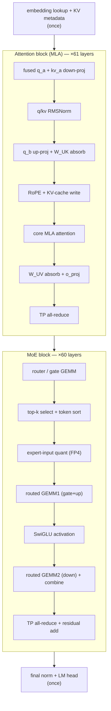
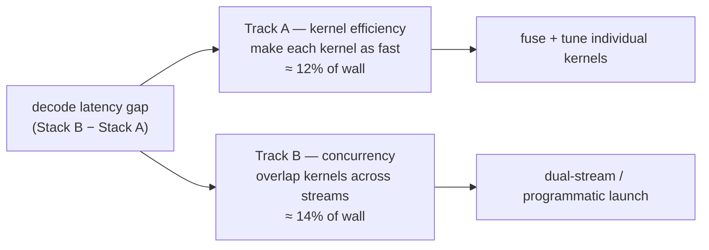
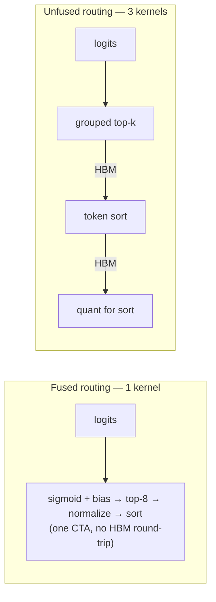
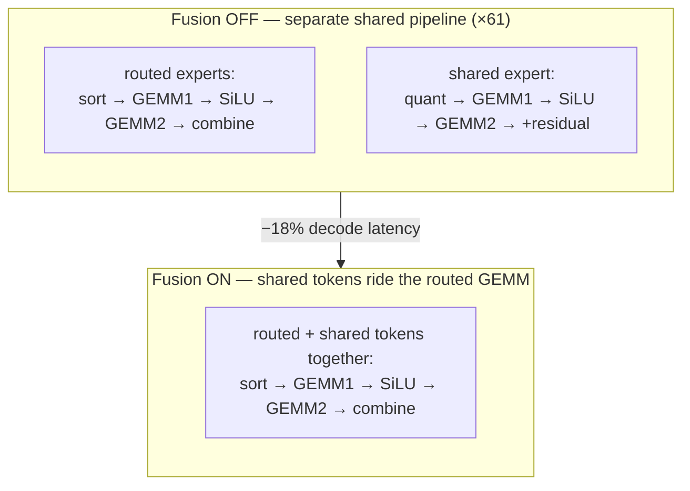

# MoE decode 剖析

  <strong>等級：</strong> 高階
  <strong>先備知識：</strong> <a href="../systems-ep/">系統與 EP</a>、<a href="../kernels/">kernels</a>、<a href="../../foundations/attention-efficiency/">attention 效率</a>
  <strong>硬體：</strong> 無（讀取真實設定檔）

前面的第二部分頁面都建構了一個元件。此頁面將它們放在時鐘上。我們
取得萬億參數 MLA + MoE 模型的**真實的每 token decode 設定檔**
（DeepSeek-V3 級：MLA attention，1 個緻密層+60 個細粒度 MoE 層，
384 路由 + 1 個共享 expert、top-8、sigmoid 閘、FP4 expert 權重、張量
並行 = 4) 並讓 GPU kernel 逐一 kernel 通過單一 decode 步驟。
然後我們使用相同的追蹤來具體化三個系統課程：**什麼是
decode 關鍵路徑實際上是**，**kernel 融合如何改變它**，以及**如何改變它
相同的數學運算在兩個加速器堆疊上以截然不同的速度運行**。

!!! note "設計上與供應商無關"
    這些數字來自兩個真實的加速器堆疊。我們稱它們為**Stack A**
    和**Stack B**而不是命名硬體 - 這裡的重點是
    decode 的*結構*以及各個最佳化的*機制*，即
    便攜式。堆疊 A 積極重疊 kernels 並融合 routing
    管道；堆疊 B 更連續地運作並在其他地方融合。也不是“
    到處都快」——這就是教訓。

## decode 步驟，一步一步

一台 decoded token 運行整個模型一次。因為每一層都是相同的，
每層 kernels 重複 — 設定檔的關鍵列是**calls/iter**，
一個階段運行的層數（attention 為 61，MoE 區塊為 60，MoE 區塊為 1）
密集第 0 層 MLP）。每階段成本=呼叫次數 × 每次呼叫成本，所以高頻
即使每次呼叫都很便宜，階段仍占主導地位。管道，依執行順序：

時間都去哪裡了（單流配置文件，兩個大型 GEMM 重型階段）
突出顯示）：

| 舞台                                     | 呼叫/iter | decode 的分享 | 筆記                             |
| ---------------------------------------- | --------- | ------------- | -------------------------------- | ---------------------- |
| 路由 GEMM1（門+上）                      | 60        | ~15%          | 分組 expert GEMM，FP4 配重       |
| 上排-$k$ 選擇 + token 排序               | 60        | ~5–12%        | routing + 排列；**對融合最敏感** |
| 核心 MLA attention                       | 61        | 61 〜8%       | 已分頁 MLA decode                |
| 路由 GEMM2（下）+聯合                    | 60        | ~6–13%        | 分組 GEMM + 加權組合             |
| 分享-expert / 密集 MLP GEMM              | 61        | 61 ~8–10%     | 總是在線的密集路徑               |
| TP all-reduce（收件人+MoE）              | 121       | 121 〜10%     | 每層兩個，通信                   |
| router/閘 GEMM                           | 60        | ~4–6%         | 384 路邏輯                       |
| 其他一切（規範、RoPE、定量、吸收、殘差） | —         | 餘數          | kernels                          | 許多便宜的高頻 kernels |

有兩件事跳出來，都是純粹的第二部分材料：

-**MoE 塊是 decode。**routing + 兩個分組的 expert GEMM +
分享 expert 在一起大約是步驟的一半。這是
[memory-bound decode](../foundations/attention-efficiency.md) 狀態：批次
1 每個 expert GEMM 讀取 FP4 權重以發出一個 token，因此
縮小這些重量的 [quantization](../performance/quantization.md) 是
是什麼讓這一步驟變得經濟實惠。 -**通訊是一流的線路項目。**每層兩個 TP all-reduce
（約 120 次呼叫）的成本大約與單一最昂貴的 GEMM 一樣多 -
[collectives](../performance/distributed-training.md) 稅，每層都繳。

## 第 1 課 — 關鍵路徑是兩條獨立的軌道

簡單地理解「階段 X 是步驟的 12%」假設步驟是其步驟的總和。
kernels。事實並非如此，因為一個好的堆疊**重疊**kernels。輪廓分裂
decode 掛鐘乾淨俐落：

$$ \underbrace{\text{wall}}_{\text{latency users feel}} = \underbrace{\text{busy}}_{\text{GPU running ≥1 kernel}} + \underbrace{\text{idle}}_{\text{launch/sync gaps}}, \qquad \underbrace{\text{overlap}}_{\text{time hidden}} = \text{self-time} - \text{busy}. $$

在同一步驟的兩個堆疊上：

|                  | 堆疊 A（重疊）        | 堆疊 B（連續） |
| ---------------- | --------------------- | -------------- |
| decode 掛鐘      | **1.00×**（基線）     | **1.33×**      |
| kernel 自拍/壁掛 | 111%（總和超過 100%） | 96%            |
| 重疊（時間隱藏） | 大                    | 〜0            |

堆疊 A 的自時間*超過*其掛鐘 — 它同時運行 kernels
（例如，第二個串流上始終開啟的共用 expert，而 router 和路由
experts 在第一個上運行）。堆疊 B 連續運行相同的 kernels。所以
33% 的間隙分解為**兩個正交的加性軌跡**：

該身份完全正確：`wall gap = TrackA(net) + TrackB + idle`。的
實際結果是避免了規劃陷阱－**大約一半的差距不是
根本就是一個緩慢的 kernel 問題**，這是一個調度問題。優化 kernels
（軌道 A）和啟用重疊（軌道 B）是*不同的工作*及其節省
*加*因為它們在構造上是不相交的。只追逐一個就留下另一個
在桌子上。

!!! tip "為什麼阿姆達爾定律使呼叫計數成為正確的鏡頭"
    階段所佔的掛鐘比重是加速比的**上限**
    僅優化該階段（Amdahl）。因為每次通話的費用都相似
    跨階段，*呼叫*最多的階段（每層 MoE 和
    attention kernels，×60–61）攜帶的總時間最多 - 所以它們在哪裡
    Track-A 的努力得到了回報，而不是每一次的 decode 序言/尾聲。

## 第 2 課 — 融合決定 kernel 數量

這兩個堆疊計算**相同的數學**，但**將其打包成不同的
kernels**。每次融合都會刪除 kernel 發射和 HBM 往返
中級（[operator-fusion](../foundations/flashattention.md) 獲勝，應用
到 MoE 管道）。痕跡顯示融合是一次*整體*的清洗－每一次
堆疊融合了不同的東西——但有一種融合占主導地位：

| 運作                                       | 堆疊 A                    | 堆疊 B                      | 誰熔斷                     |
| ------------------------------------------ | ------------------------- | --------------------------- | -------------------------- | ---- |
| **routing：頂部-$k$ 選擇 + 規範化 + 排序** | **1 個帶保險絲的 kernel** | **3 kernels**               | **A（最大差距，~3×）**     |
| q/kv RMSNorm                               | q/kv RMSNorm              | 2 kernels                   | 2 1 融合                   | 乙   |
| RoPE + KV-快取寫入                         | 2 kernels                 | 2 1 融合                    | 乙                         |
| 核心 MLA attention                         | 1 融合（attn+reduce）     | 2 kernels（分體 KV + 減少） | 一個                       |
| 路由 GEMM2 + 聯合收割機                    | 2 kernels                 | 2 1 融合                    | 乙                         |
| 共享-expert FP4 GEMM                       | in-kernel K-accum         | in-kernel K-accum           | GEMM + 單獨的 split-K 縮減 | 一個 |

其中最突出的是**routing**。一組執行 sigmoid-bias → top-8 select →
標準化 → token 在*單一* kernel 中排序；另一個將其分散到三個
啟動（選擇、排序、定量排序）。那一個階段是最大的一個階段
kernel - 整個 decode 的效率差距 - 一個直接的、經過衡量的論證
來自 kernels 頁面的「[fuse the routing](kernels.md)」建議。

!!! note "Split-K 在兩個堆疊上都是相同的技巧"
    追蹤清除了一個微妙的問題：兩個堆疊都使用**split-K GEMM**（分區
    跨區塊的收縮變暗，然後單獨減少 kernel 求和
    部分 — 請參閱 [GPU programming](../performance/gpu-programming.md)）。的
    差別在於*頻率*：一堆拆分 K 僅用於每個 decode LM 頭一次；
    另一個 split-Ks 共享 expert FP4 GEMM**每一層**，因此其減少
    kernel 發射 ~60× 而不是一次。相同的功能，截然不同的成本——
    提醒始終透過呼叫次數來衡量 kernel 的權重。

## 第 3 課 — 共用 experts 融合（受控前/後）

資料集中最乾淨的實驗：在一個堆疊上，切換**shared-experts
融合**開啟和關閉並重新配置。召回 [shared expert](routing-variants.md)
是每個 token 都經過的始終在線 FFN，*除了*其路由之外
experts。天真地說，它是每層一個單獨的密集 MLP——它自己的 GEMM、激活、
定量和殘差相加，全部 ×61。 Fusion 將共用的 expert 的 tokens 折疊到
**路由分組 GEMM**因此它們與 expert tokens 一起騎行：

測量結果是明確的，因為（在此堆疊上）kernels 運行
串列地，所以掛鐘的變化*完全*是 kernel-自時間變化 -
沒有重疊混淆：

| 透過融合移除階段                         | latency 恢復（佔 decode 的百分比） |
| ---------------------------------------- | ---------------------------------- |
| 獨立分享-expert / 密集-MLP GEMM          | 〜10.8%                            |
| 其獨立激活量子 kernels                   | ~4.5%                              |
| 其殘餘添加                               | 〜2.3%                             |
| 其 SiLU 啟動                             | 〜2.2%                             |
| （少量增加的路由成本：更大的排序+ GEMM） | −0.7% 淨值                         |
| **decode 總加速**                        | **~18%**                           |

本課程概括了這個模型：一條始終在線的密集路徑，旁邊是一條
分組稀疏路徑是融合的邀請。單獨管道的 GEMM，
一旦共享，活化、定量和殘差都是多餘的啟動
tokens 只是附加到路由批次。幾乎是 decode latency 的五分之一
是結構性開銷，不是數學。

## 拿走什麼

-**decode 步驟主要是其 MoE 區塊**— routing + 兩個分組的 expert GEMM

- 共享的 expert — 每個 token 運行一次
  [memory-bound](../foundations/attention-efficiency.md) 體制，具有
  每層 [all-reduce](../performance/distributed-training.md) 稅在頂部。 -**latency 是兩個附加軌道**：kernel 效率（保險絲 + 調諧）和
  並發（跨流重疊）。他們是脫節的；測量並攻擊它們
  分開，否則你會錯誤地制定工作預算。 -**Fusion 是 kernel 計數槓桿。**最大的單跨堆疊間隙是
  _未熔斷的 routing_；最大的單一優化是*shared-experts fusion*
  （~18%）。兩者都是在[kernels](kernels.md)頁面上進行量化的。 -**始終透過呼叫次數來衡量 kernel 的權重。**每次呼叫成本在於；便宜的
  發射 60×（split-K 減少、殘餘添加、定量）的 kernel 可以超過
  昂貴的一次發射。

## 練習

!!! tip "解決方案"
    參考解答位於 [解答頁](../solutions/moe.md) 上。請先嘗試每個練習，再展開解答。

1. 舞台佔 decode 掛鐘的 12%，但其 kernels 與 kernels 完全重疊
   另一條溪流。最大端對端加速是多少
   *無限*快？將你的答案與音軌 A/音軌 B 的分割相關聯。
2. 路由的 GEMM1 約為步長的 15%，運行 60×； LM 頭約為 1% 並運行
   一次。你可以將每次通話的費用減半。哪一個獲勝，又會帶來什麼
   那是說以每次呼叫成本與總成本進行最佳化嗎？
3. Shared-experts 融合刪除了單獨的 GEMM、活化、定量和殘差
   增加（每個 ×61）約 18% 的勝利，但代價是稍大的路由排序 +
   GEMM。寫出不等式（用 kernels 保存的與添加的工作術語），其中
   這種融合是有利可圖的。
4. 一堆自拍時間是其掛鐘的 111%；另一個是 96%。解釋一下
   自拍時間如何超過掛鐘，以及*低於* 100% 的值意味著什麼
   關於閒置間隙。
5. Split-K 將一個 GEMM 變成一個計算 kernel + 一個縮減 kernel。鑑於
   一層上每層 (×60) 減少一次火災，每層 decode 減少一次火災
   其他，估計調用計數懲罰並爭論是否避免 split-K（通過
   in-kernel K-accumulation）對於每層 GEMM 來說是值得的。

## 參考文獻

- DeepSeek-AI。 _DeepSeek-V3 技術報告_（MLA、細粒度 + 共享 experts、FP8）。 2024 年。
- 道等人。 _Flashattention_（操作員融合/IO 感知）。 2022 年。
- 大風等人。 _MegaBlocks：高效率稀疏 training 與 experts 的混合。 _ 2022 年。
- 阿姆達爾。 _實現大規模運算能力的單處理器方法的有效性。 _ 1967 年。
- NVIDIA CUTLASS 和 SGLang serving 框架文件（分組 GEMM、雙流共享 expert 重疊）。 2024–2025。
