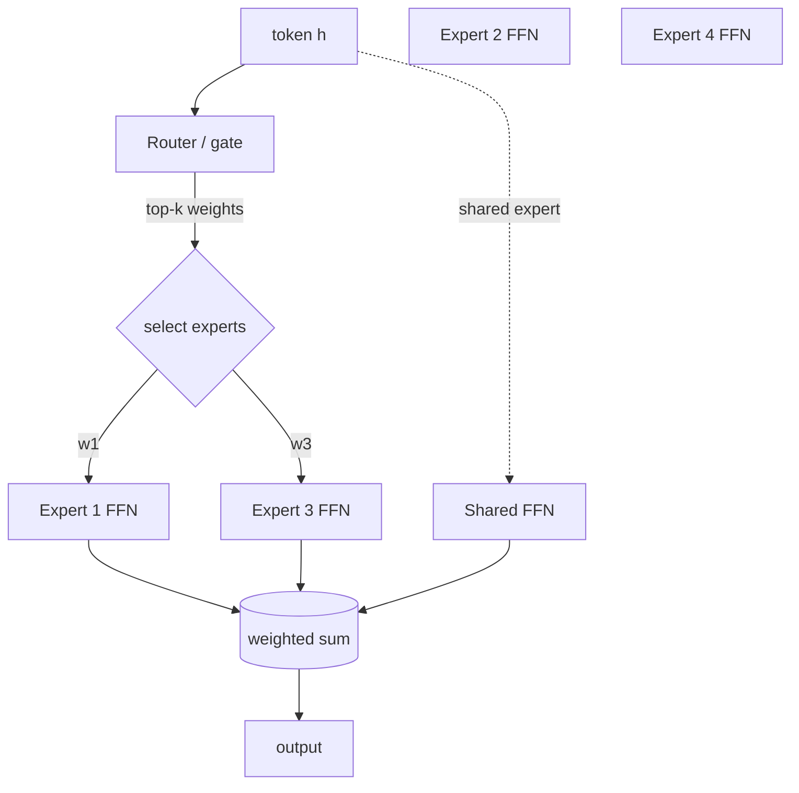

#第二部分·experts 的混合體（旗艦）

這是手冊中最深入的系列。我們建立**生產型 MoE
從頭開始堆疊**— 條件計算的數學，乾淨的參考
層，使其可訓練的負載平衡機制，系統
(expert 並行性，all-to-all)，使其規模化，kernels
快速，以及使其可部署的 serving 技巧 - 然後剖析其真實性
前沿模型（DeepSeek-V3、Mixtral、Qwen-MoE、Kimi K2.5）將其組合在一起。

## 為什麼選擇 MoE，在一段話中

密集 Transformer 將*每個*參數應用於*每個*token。一個
experts 層的混合層包含許多平行 FFN（「experts」）和一個
小型**router**，僅將每個 token 發送給其中的少數幾個。該模型的
_參數數量_（其容量/知識）隨著 experts 數量的增加而增長，
而*每個 token* 的 FLOP 保持大致固定，但以少數活躍用戶為代價
experts。透過計算，你可以獲得更大模型的質量
較小的一個 —** 如果**你可以保持 experts 平衡並支付
溝通和記憶成本。這個「如果」就是整個系統的故事。

## 頁面，依序排列

**演算法與 training**

1. [Why sparsity](why-sparsity.md) — 密集縮放與稀疏縮放；條件計算的數學。
2. [MoE layer from scratch](moe-from-scratch.md) — experts、router、top-k、softmax 與 sigmoid 閘控；可運作參考。
3. [負載平衡](load-balancing.md) — 輔助損耗、expert 容量、下降/溢出、**輔助損耗**偏壓（DeepSeek 式）。
4. [routing variants](routing-variants.md) — token-choice 與 expert-choice、共享 experts、細粒度 experts。
5. [training stability](training-stability.md) — router z 損失、初始化、routing 的梯度病理。

**系統和部署**

6. [Systems & expert parallelism](systems-ep.md) — EP、all-to-all 調度/組合、與計算重疊的通訊、分組 GEMM、MegaBlocks 區塊稀疏視圖、容量/填充權衡。
7. [MoE kernels (Triton/CUDA/HIP)](kernels.md) — 排列/分散-聚集、分組/批次 GEMM 全部三個，融合 routing。
8. [inference & serving](inference-serving.md) — expert 卸載、批次、expert 量化、記憶體管理。
9. [Case studies](case-studies.md) — DeepSeek-V3、Mixtral、Qwen-MoE、Kimi K2.5 — 他們做什麼以及*為什麼*。
10. [Anatomy of an MoE decode](decode-anatomy.md) — 真實的 per-kernel decode 設定檔：關鍵路徑、融合和兩個 latency 軌道。

!!! tip "先決條件"
    你需要 [Part I](../foundations/index.md) 中的系統詞彙
    （roofline、算術強度、記憶體限制與計算限制）。系統
    第（6-7）頁依賴 [kernel tracks](../performance/triton-track.md) 和
    第三部分的 [collectives](../performance/distributed-training.md) — 你可以
    並行閱讀這些內容。
