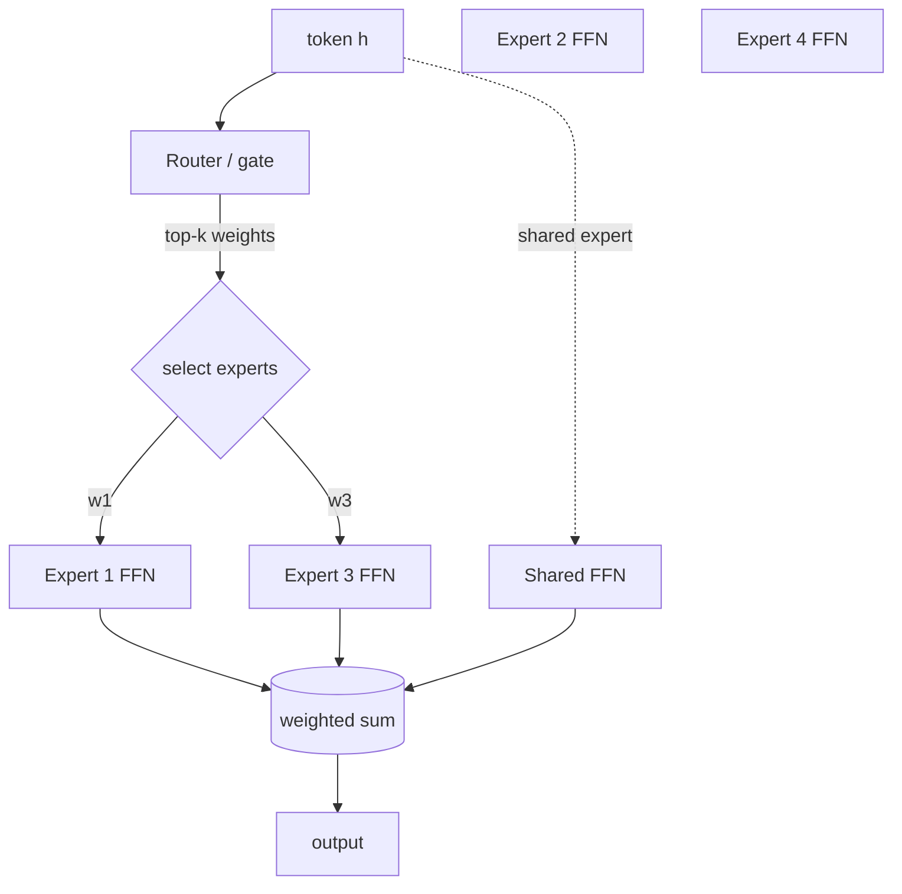

# Part II · Mixture-of-Experts (flagship)

This is the deepest series in the handbook. We build a **production-shaped MoE
stack from scratch** — the math of conditional computation, a clean reference
layer, the load-balancing machinery that makes it trainable, the systems
(expert parallelism, all-to-all) that make it scale, the kernels that make it
fast, and the serving tricks that make it deployable — then dissect how real
frontier models (DeepSeek-V3, Mixtral, Qwen-MoE, Kimi K2.5) put it together.

## Why MoE, in one paragraph

A dense transformer applies *every* parameter to *every* token. A
Mixture-of-Experts layer instead holds many parallel FFNs ("experts") and a
small **router** that sends each token to only a few of them. The model's
*parameter count* (its capacity/knowledge) grows with the number of experts,
while the *FLOPs per token* stay roughly fixed at the cost of the few active
experts. You get the quality of a much bigger model at the compute of a much
smaller one — **if** you can keep the experts balanced and pay the
communication and memory costs. That "if" is the entire systems story.

## Pages, in order

**Algorithm & training**

1. [Why sparsity](why-sparsity.md) — dense vs sparse scaling; the math of conditional computation.
2. [MoE layer from scratch](moe-from-scratch.md) — experts, router, top-k, softmax vs sigmoid gating; runnable reference.
3. [Load balancing](load-balancing.md) — auxiliary loss, expert capacity, drop/overflow, **aux-loss-free** bias (DeepSeek-style).
4. [Routing variants](routing-variants.md) — token-choice vs expert-choice, shared experts, fine-grained experts.
5. [Training stability](training-stability.md) — router z-loss, initialization, the gradient pathologies of routing.

**Systems & deployment**

6. [Systems & expert parallelism](systems-ep.md) — EP, the all-to-all dispatch/combine, overlapping comm with compute, grouped GEMM, MegaBlocks block-sparse view, capacity/padding trade-offs.
7. [MoE kernels (Triton/CUDA/HIP)](kernels.md) — permutation/scatter-gather, grouped/batched GEMM in all three, fusing routing.
8. [Inference & serving](inference-serving.md) — expert offloading, batching, expert quantization, memory management.
9. [Case studies](case-studies.md) — DeepSeek-V3, Mixtral, Qwen-MoE, Kimi K2.5 — what they do and *why*.
10. [Anatomy of an MoE decode](decode-anatomy.md) — a real per-kernel decode profile: the critical path, fusion, and the two latency tracks.

!!! tip "Prerequisites"
    You need the systems vocabulary from [Part I](../foundations/index.md)
    (roofline, arithmetic intensity, memory-bound vs compute-bound). The systems
    pages (6–7) lean on the [kernel tracks](../performance/triton-track.md) and
    [collectives](../performance/distributed-training.md) from Part III — you can
    read those in parallel.
