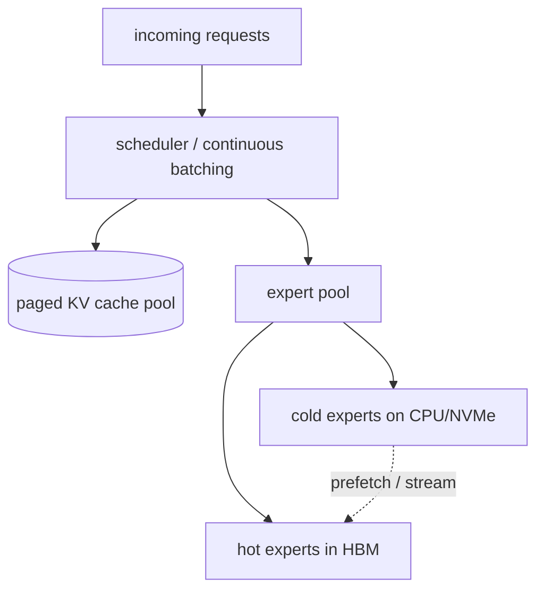

# MoE inference & serving

  <strong>Level:</strong> advanced
  <strong>Prereqs:</strong> <a href="../systems-ep/">systems & EP</a>, <a href="../../foundations/attention-efficiency/">attention efficiency</a>
  <strong>Hardware:</strong> GPU(s)

Serving an MoE is a different problem from serving a dense model of the same
*active* size, because **all the experts must be available even though only a few
run per token.** A 671B-param model that does 37B-active FLOPs still needs 671B
params *somewhere* reachable. This page covers the memory problem (offloading,
placement), batching dynamics under sparse routing, expert quantization, and how
MoE interacts with the [paged KV cache](../foundations/attention-efficiency.md).

## The memory problem

From [why sparsity](why-sparsity.md): MoE buys capacity in cheap memory. At
serving time you pay that bill. Options, fastest to cheapest:

- **All experts in HBM** (expert-parallel across enough GPUs). Lowest latency;
  needs many GPUs just to *hold* the weights. DeepSeek-V3 in bf16 is ~1.3 TB of
  weights — that's a multi-node deployment before considering KV cache.
- **Expert offloading to CPU/NVMe**, streamed into HBM on demand. Far fewer GPUs,
  but each layer may stall waiting for its experts to arrive over PCIe/CXL.
- **Quantized experts** (int8/int4/fp8) to shrink the footprint so more fits in
  HBM — usually the first lever (below).

The roofline reasserts itself: with offloading, the limiter becomes **PCIe/NVMe
bandwidth** for streaming experts, not GPU compute. Whether offloading is viable
depends on the **reuse** of each loaded expert — which depends on batch size and
routing locality.

## Batching under sparse routing

Batching is how decoding escapes the [memory wall](../foundations/attention-efficiency.md):
amortize the weight read over many tokens. MoE complicates this:

- In a dense model, a bigger batch reads each weight once for all $B$ tokens —
  clean amortization.
- In an MoE, the batch's tokens **scatter across experts**. A popular expert
  serves many tokens (good amortization); a rare expert might serve one token
  (its weight read is barely amortized). Effective amortization depends on how
  many of the batch's tokens hit each loaded expert.

Implications:

- **Larger batches help more in MoE than dense**, because they raise the expected
  tokens-per-expert, improving both GEMM efficiency and (with offloading) expert
  reuse. This is why MoE serving pushes for high concurrency.
- **Expert popularity skew** means some experts are nearly always resident and
  some rarely used — exploitable by caching hot experts in HBM and offloading
  cold ones.
- **Prefill vs decode** differ sharply: prefill has many tokens (most experts
  active, good batching); single-stream decode touches only $k$ experts per token
  (terrible reuse) — another reason to batch many concurrent decode requests.

## Expert quantization

Experts are the bulk of the parameters, so quantizing them is the highest-leverage
compression. Because each expert sees fewer tokens than a dense FFN, and because
serving is [memory-bound](../foundations/attention-efficiency.md), expert weight
quantization is usually a clean win:

- **fp8 / int8 weights**: ~2× smaller, ~2× faster weight read at decode, minimal
  quality loss with per-channel/group scales. Often the default.
- **int4 (GPTQ/AWQ-style)**: ~4× smaller; needs careful calibration but
  frequently fine for experts, which are individually less critical than
  attention or norms.
- **Mixed**: keep router, attention, norms, and the shared expert in higher
  precision (they're sensitive and small); quantize the many routed experts
  hard. This mirrors the [training precision discipline](training-stability.md):
  cheap-but-numerous gets low precision, sensitive-but-small stays high.

See [quantization](../performance/quantization.md) for PTQ/GPTQ/AWQ mechanics;
the MoE-specific point is *which* tensors to quantize and how routing skew lets
you spend your bit-budget where the tokens actually go.

## Memory management: experts + KV cache together

An MoE server juggles **two** large, dynamic memory consumers:

1. The **KV cache** (grows with concurrent sequences × context), managed by
   [paged attention](../foundations/attention-efficiency.md).
2. The **expert weights** (fixed total, but which are "hot" in HBM is dynamic
   under offloading).

They compete for the same HBM. Good serving stacks (vLLM, SGLang, TensorRT-LLM,
DeepSeek's own) treat both as paged pools and schedule against a combined budget.
A few techniques:

- **Expert cache** with an LRU/popularity policy when offloading — keep hot
  experts resident, stream cold ones, prefetch the next layer's likely experts
  while the current layer computes (overlap, as in [EP](systems-ep.md)).
- **Disaggregated prefill/decode**: run compute-bound prefill and memory-bound
  decode on separate GPU pools sized to their different rooflines; ship the KV
  cache between them.
- **Expert-parallel placement tuned to popularity**: spread hot experts across
  devices so no single GPU becomes the straggler (the inference analogue of
  [load balancing](load-balancing.md)).

## A practical serving checklist

- [ ] Quantize routed experts (fp8/int8 first; int4 if memory-constrained);
      keep router/attention/norms higher precision.
- [ ] Use continuous batching to maximize tokens-per-expert (amortize weight
      reads — see [inference optimization](../performance/inference-optimization.md)).
- [ ] Paged KV cache (GQA/MLA models shrink it further).
- [ ] If weights don't fit: offload cold experts, prefetch next-layer experts,
      cache hot ones; expect PCIe/NVMe bandwidth to become the limiter.
- [ ] Consider prefill/decode disaggregation for throughput at scale.
- [ ] Place experts across EP ranks by popularity to avoid stragglers.

## Key takeaways

- MoE serving must **hold all experts** even though few run — the central cost is
  **memory/bandwidth**, not compute.
- **Batching matters more for MoE** because tokens scatter across experts;
  bigger batches raise tokens-per-expert, improving GEMM efficiency and expert
  reuse.
- **Quantize the many routed experts** aggressively (fp8/int8/int4), keep the
  small sensitive parts precise — routing skew tells you where the bits should go.
- The server co-manages **expert weights and the paged KV cache** against one HBM
  budget; offloading shifts the limiter to PCIe/NVMe and rewards prefetch + hot-
  expert caching.

## Exercises

1. Estimate the HBM needed to hold DeepSeek-V3 weights in bf16 vs fp8 vs int4.
   How many 80 GB GPUs each, before KV cache?
2. With offloading, derive the condition (tokens-per-expert vs PCIe bandwidth vs
   GEMM time) under which streaming an expert is hidden by compute.
3. For a batch of 256 decode requests, $E{=}256$, $k{=}8$, estimate the expected
   number of distinct experts touched and the tokens-per-expert distribution.
4. Design an expert-cache eviction policy using observed popularity; what's the
   failure mode if routing distribution shifts at runtime?

## References

- Kwon et al. *PagedAttention / vLLM.* 2023.
- Eliseev & Mazur. *Fast Inference of Mixture-of-Experts via Offloading.* 2023.
- Frantar & Alistarh. *GPTQ.* 2022 · Lin et al. *AWQ.* 2023.
- DeepSeek-AI. *DeepSeek-V3 Technical Report* (serving). 2024.
- Zhong et al. *DistServe* (prefill/decode disaggregation). 2024.
