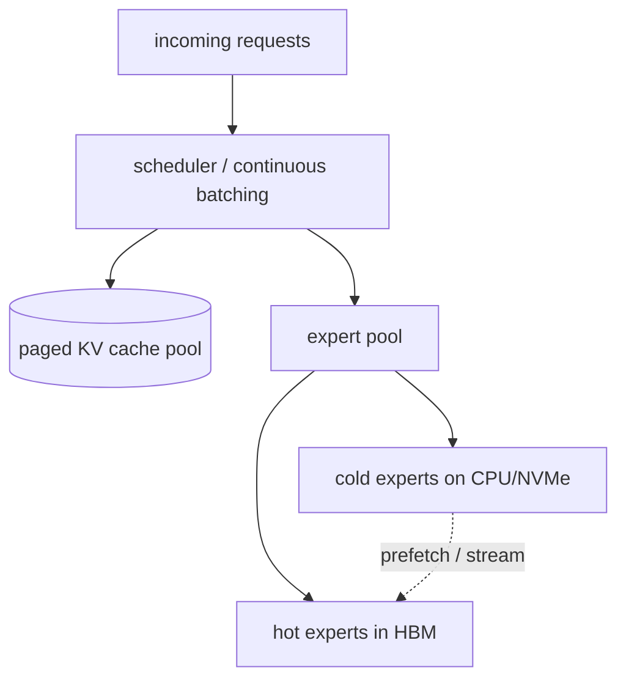

# MoE inference 和 serving

  <strong>等級：</strong> 高階
  <strong>先備知識：</strong> <a href="../systems-ep/">系統與 EP</a>、<a href="../../foundations/attention-efficiency/">attention 效率</a>
  <strong>硬體：</strong> GPU

serving MoE 與 serving 是不同的問題，serving 是同一問題的密集模型
*活動*大小，因為**所有 experts 都必須可用，即使只有少數
根據 token 運行。**執行 37B 活動 FLOP 的 671B 參數模型仍需要 671B
參數*某處*可達。本頁涵蓋記憶體問題（卸載、
放置），稀疏 routing、expert 量化下的批次動態，以及如何
MoE 與 [paged KV cache](../foundations/attention-efficiency.md) 互動。

## 記憶體問題

來自 [why sparsity](why-sparsity.md)：MoE 購買廉價記憶體的容量。在
serving 你支付帳單的時間。選項，從最快到最便宜：

-**所有 experts 均採用 HBM**（expert 在足夠多的 GPU 上並行）。最低 latency；
需要許多 GPU 來「保持」權重。 bf16 中的 DeepSeek-V3 約為 1.3 TB
權重－這是在考慮 KV 快取之前的多節點部署。 -**expert 卸載到 CPU/NVMe**，按需流入 HBM。 GPU 少得多，
但每一層可能會停止等待其 experts 通過 PCIe/CXL 到達。 -**量化 experts**(int8/int4/fp8) 以縮小佔用空間，以便更適合
HBM — 通常是第一個槓桿（如下）。

roofline 再次證明自己：透過卸載，限制器變成**PCIe/NVMe
頻寬**用於串流 experts，而不是 GPU 運算。卸載是否可行
取決於每個加載的 expert 的**重用**- 這取決於批量大小和
routing 地點。

## 稀疏 routing 下的批次

批次處理是 decoding 轉義 [memory wall](../foundations/attention-efficiency.md) 的方式：
攤銷多次讀取 tokens 的重量。MoE 讓這個問題變得複雜：

- 在密集模型中，更大的批量讀取所有 $B$ tokens 的每個重量一次 —
  乾淨的攤銷。
- 在 MoE 中，批次的 tokens**分散在 experts**。流行的 expert
  服務於許多 tokens（良好的攤銷）；一個稀有的 expert 可能服務於一個 token
  （其重量讀數幾乎不攤銷）。有效攤銷取決於如何
  該批次的許多 tokens 都命中了每個加載的 expert。

影響：

-**較大的批次比密集的批次對 MoE 的幫助更大**，因為它們提高了預期
tokens-per-expert，提高 GEMM 效率和（帶卸載）expert
重複使用。這就是 MoE serving 力推高並發的原因。 -**expert 受歡迎偏差**意味著一些 experts 幾乎總是常駐並且
一些很少使用——可透過在 HBM 中快取熱 experts 並卸載來利用
冷的。 -**prefill 與 decode**差異很大：prefill 有許多 tokens（大多數 experts
活躍，配料良好）；單流 decode 僅觸及每個 token 的 $k$ experts
（糟糕的重用）－批次許多並發 decode 請求的另一個原因。

## expert 量化

experts 是大部分參數，因此量化它們是最高槓桿
壓縮。因為每個 expert 看到的 tokens 比密集的 FFN 少，而且因為
serving 為[memory-bound](../foundations/attention-efficiency.md)、expert 重量
量化通常是一個乾淨的勝利： -**fp8 / int8 權重**：在 decode 上讀取權重約 2× 更小，約 2× 更快，最小
每個通道/組規模的質量損失。通常是預設的。 -**int4（GPTQ/AWQ 風格）**：約小 4 倍；需要仔細校準但是
對於 experts 來說通常沒問題，它們單獨而言不如
attention 或規範。 -**混合**：保持 router、attention、規範和共享 expert 處於較高水平
精確（它們敏感且小）；量化多條路由的 experts
很難。這反映了 [training precision discipline](training-stability.md)：
便宜但數量多的精度較低，敏感但小則精度較高。

有關 PTQ/GPTQ/AWQ 機制，請參閱 [quantization](../performance/quantization.md)；
MoE 特定點是要量化的*哪個*張量以及 routing 偏斜如何讓
你將預算花在 tokens 的實際用途上。

##記憶體管理：experts+KV 快取一起

MoE 伺服器同時兼顧**兩個**大型動態記憶體消耗者：

1. **KV 快取**（隨著並發序列 × 上下文增長），由
   [paged attention](../foundations/attention-efficiency.md)。
2. **expert 權重**（固定總數，但在 HBM 中「熱門」是動態的
   卸載下）。

他們爭奪相同的 HBM。良好的 serving 堆疊（vLLM、SGLang、TensorRT-LLM、
DeepSeek 自己的）將兩者視為分頁池並根據合併預算進行調度。
一些技巧：

-**expert 快取**在卸載時具有 LRU/流行度策略 — 保持熱度
experts 常駐，流冷的，預先取下一層可能的 experts
而目前層進行計算（重疊，如 [EP](systems-ep.md) 中）。 -**分解 prefill/decode**：運行計算密集型 prefill 和記憶體密集型
decode 位於單獨的 GPU 池上，其大小適合其不同的 roofline；運送 KV
它們之間的快取。 -**expert-平行放置調整流行**：傳播熱門 experts
設備，因此沒有一個 GPU 會成為落後者（inference 的類似物）
[負載平衡](load-balancing.md)）。

## 實用的 serving 清單

- [ ] 量化路由 experts（首先是 fp8/int8；若記憶體受限則為 int4）；
      保持 router/attention/norms 更高的精度。
- [ ] 使用連續配料最大化 tokens-per-expert（攤銷重量
      讀取 — 請參閱 [inference optimization](../performance/inference-optimization.md))。
- [ ] 分頁 KV 快取（GQA/MLA 模型進一步縮小它）。
- [ ] 若重量不適合：卸載冷 experts，預先取下一層 experts，
      快取熱點；預計 PCIe/NVMe 頻寬將成為限制因素。
- [ ] 考慮對 throughput 進行大規模的 prefill/decode 分解。
- [ ] 將 experts 按受歡迎程度排列在 EP 排名中，以避免掉隊。

## 要點

- MoE serving 必須**持有所有 experts**，即使很少運行 - 中心成本是
  **記憶體/頻寬**，而不是計算。 -**批次對 MoE 來說更重要**，因為 tokens 分散在 experts 中；
  大批量提高 tokens-per-expert，提升 GEMM 效率及 expert
  重複使用。 -**積極量化許多路由的 experts**(fp8/int8/int4)，保留
  小型敏感部件精確 — routing 偏斜告訴你這些位元應該去哪裡。
- 伺服器針對一個 HBM 共同管理**expert 權重和分頁 KV 快取**
  預算；卸載將限制器轉移到 PCIe/NVMe 並獎勵預取 + 熱-
  expert 快取。

## 練習

!!! tip "解決方案"
    參考解答位於 [解答頁](../solutions/moe.md) 上。請先嘗試每個練習，再展開解答。

1. 估計在 bf16、fp8 和 int4 中保存 DeepSeek-V3 權重所需的 HBM。
   在 KV 快取之前，每個有多少 80 GB GPU？
2. 透過卸載，匯出條件 (tokens-per-expert vs PCIe 頻寬 vs
   GEMM 時間），在該時間下串流 expert 被計算隱藏。
3. 一批 256 個 decode 請求，$E{=}256$，$k{=}8$，估計預期
   接觸的不同 experts 的數量以及 tokens-per-expert 分佈。
4. 使用觀察到的流行度設計 expert 快取驅逐策略；什麼是
   如果 routing 分佈在運作時發生變化，故障模式是什麼？

## 參考文獻

- 權等人。 _已分頁 attention / vLLM。 _ 2023 年。
- 埃利塞耶夫和馬祖爾。 _透過卸載實現 experts 混合的快速 inference。 _ 2023 年。
- 弗蘭塔和阿利斯塔。 _GPTQ._ 2022 · 林等人。 _AWQ。 _ 2023 年。
- DeepSeek-AI。 _DeepSeek-V3 技術報告_ (serving)。 2024 年。
- 鐘等人*DistServe*（prefill/decode 分解）。 2024 年。
