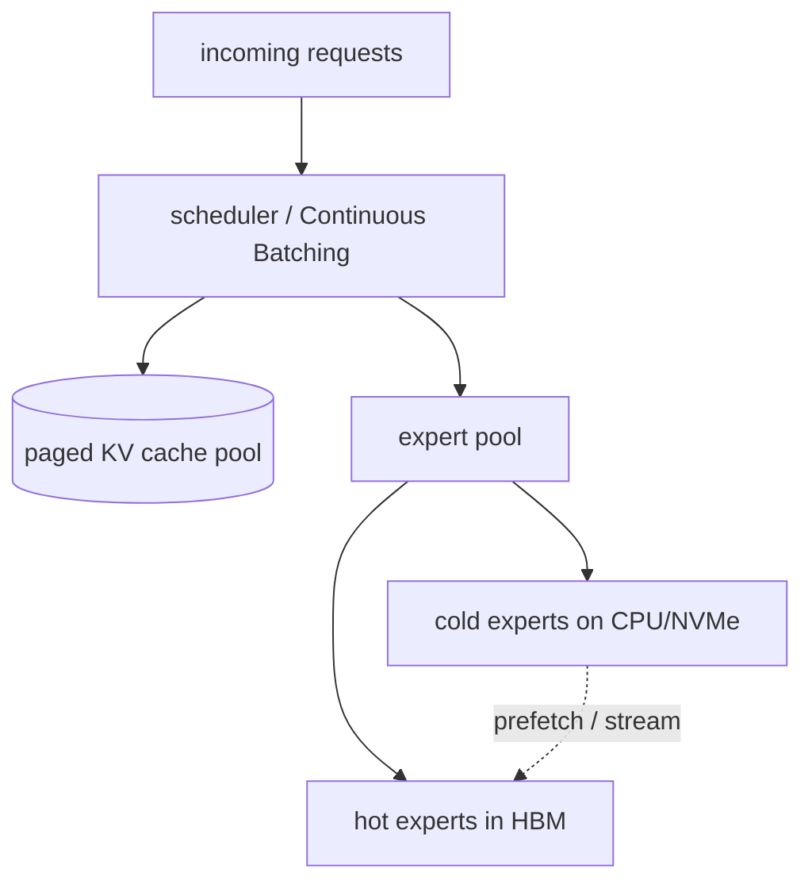

# 推論與 serving

  <strong>等級：</strong> 高階
  <strong>先備知識：</strong> <a href="../systems-ep/">系統與 EP</a>、<a href="../../foundations/attention-efficiency/">attention 效率</a>
  <strong>硬體：</strong> GPU

serving 一個 MoE，和 serving 一個與其*活躍*大小相同的密集模型，是兩個不同的問題——因為 **所有 expert 都必須隨時可用，即使每個 token 只跑其中幾個。** 一個跑 37B 活躍 FLOP 的 671B 參數模型，仍然得讓那 671B 參數*在某處*能被取用。本頁談記憶體問題（offload、放置）、稀疏 routing 下的批次動態、expert 量化，以及 MoE 如何與 [分頁 KV cache](../foundations/attention-efficiency.md) 互動。

## 記憶體問題

由 [為什麼需要稀疏化](why-sparsity.md)：MoE 用便宜的記憶體買容量。serving 時，就是你結帳的 時候。各種選項，由最快到最省：

- **所有 expert 都放 HBM**（expert 分散在足夠多的 GPU 上）。latency 最低；但需要很多 GPU 才能 「裝得下」權重。DeepSeek-V3 在 BF16 約 1.3 TB 權重——光權重就已是多節點部署，還沒算 KV cache。
- **expert offload 到 CPU/NVMe**，按需串流進 HBM。GPU 少很多，但每一層都可能卡住、等它的 expert 經由 PCIe/CXL 抵達。
- **量化 expert**（int8/int4/FP8）縮小足跡、好塞進 HBM——通常是第一個動的槓桿（見下文）。

roofline 再次應驗：一旦 offload，限制因素就從 GPU 算力變成串流 expert 的 **PCIe/NVMe 頻寬**。 offload 是否划算，取決於每個載入進來的 expert 能被**重用**多少——而這又取決於 batch 大小與 routing 的局部性。

## 稀疏 routing 下的批次

批次是 decode 繞過 [記憶體牆](../foundations/attention-efficiency.md)的方法：把讀權重的成本攤 到很多 token 上。MoE 把這件事弄複雜了：

- 密集模型裡，更大的 batch 把每個權重讀一次、服務全部 $B$ 個 token——攤銷很乾淨。
- MoE 裡，一個 batch 的 token 會**分散到各個 expert**。熱門 expert 服務很多 token（攤銷得好）； 冷門 expert 可能只服務一個 token（它的權重讀取幾乎沒被攤銷）。有效攤銷取決於這個 batch 有多少 token 打到每個被載入的 expert。

由此推論：

- **大 batch 對 MoE 的幫助比對密集模型更大**，因為它拉高了期望的 tokens-per-expert，提升 GEMM 效率，並（在 offload 下）提升 expert 重用。這正是 MoE serving 拼命推高並發的原因。
- **expert 熱門度偏斜**意味著有些 expert 幾乎總是常駐、有些極少用到——可以靠把熱 expert 快取在 HBM、把冷的 offload 出去來利用。
- **prefill 與 decode 差很多**：prefill 有很多 token（大多數 expert 都活躍、批次效果好）；單流 decode 每個 token 只碰 $k$ 個 expert（重用很差）——這是把許多並發 decode 請求批在一起的另一 個理由。

## Expert 量化

expert 佔了大部分參數，所以量化它們是壓縮上槓桿最大的一招。由於每個 expert 看到的 token 比 密集 FFN 少，又因為 serving 是 [memory-bound](../foundations/attention-efficiency.md)，量化 expert 權重通常是乾淨的勝利：

- **FP8 / int8 權重**：decode 時權重讀取約小 2 倍、快約 2 倍，配上 per-channel/per-group 縮放後 品質損失極小。通常是預設。
- **int4（GPTQ/AWQ 風格）**：約小 4 倍；需要仔細校準，但對 expert 通常沒問題——它們單獨來看 不如 attention 或 norm 敏感。
- **混合精度**：router、attention、norm 與共享 expert 維持較高精度（它們敏感且小），把許多路由 expert 大力量化。這呼應了 [training 的精度紀律](training-stability.md)：便宜又多的用低精度， 敏感又小的用高精度。

PTQ/GPTQ/AWQ 的機制見 [量化](../performance/quantization.md)；MoE 特有的重點是*該量化哪些*張量， 以及 routing 偏斜如何讓你把精度預算花在 token 真正會用到的地方。

## 記憶體管理：expert 與 KV cache 一起

MoE server 要同時照顧**兩個**會動態變化的大記憶體消耗者：

1. **KV cache**（隨並發序列 × 上下文成長），由 [PagedAttention](../foundations/attention-efficiency.md) 管理。
2. **expert 權重**（總量固定，但在 offload 下「哪些在 HBM 裡是熱的」是動態的）。

兩者爭奪同一塊 HBM。好的 serving 堆疊（vLLM、SGLang、TensorRT-LLM、DeepSeek 自家的）把兩者都 當成分頁池、依合併後的預算來排程。一些手法：

- **expert 快取**：offload 時用 LRU／熱門度策略——把熱 expert 留在 HBM、串流冷的，並在計算當前 層時預取下一層可能用到的 expert（重疊，如 [EP](systems-ep.md) 中所述）。
- **prefill/decode 拆分**：把 compute-bound 的 prefill 與 memory-bound 的 decode 跑在各自的 GPU 池上、各自依其 roofline 配置，再把 KV cache 在兩者間搬運。
- **依熱門度調整 expert-parallel 放置**：把熱門 expert 散到各 device，免得某張 GPU 變成落後者 （這是 inference 版的 [負載平衡](load-balancing.md)）。

## 實用的 serving 清單

- [ ] 量化路由 expert（先 FP8/int8；若記憶體吃緊再 int4），router/attention/norm 維持較高精度。
- [ ] 用 Continuous Batching 拉高 tokens-per-expert（攤銷權重讀取——見 [推論最佳化](../performance/inference-optimization.md)）。
- [ ] 分頁 KV cache（GQA/MLA 模型還能進一步把它縮小）。
- [ ] 若權重塞不下：offload 冷 expert、預取下一層 expert、快取熱 expert；預期 PCIe/NVMe 頻寬會 成為限制因素。
- [ ] 為了 throughput，考慮大規模的 prefill/decode 拆分。
- [ ] 在 EP rank 之間按熱門度排佈 expert，避免落後者。

## 要點

- MoE serving 必須**握住所有 expert**，即使它們很少跑——核心成本是**記憶體／頻寬**，不是算力。
- **批次對 MoE 更重要**，因為 token 分散在各 expert；大 batch 拉高 tokens-per-expert，提升 GEMM 效率與 expert 重用。
- **大力量化大量路由 expert**（FP8/int8/int4），保留小而敏感的部件高精度——routing 偏斜會告訴 你這些位元該花在哪。
- server 針對單一 HBM 預算共同管理 **expert 權重與分頁 KV cache**；offload 把限制因素移到 PCIe/NVMe，並讓「預取 + 熱 expert 快取」變得划算。

## 練習

!!! tip "解決方案"
    參考解答位於 [解答頁](../solutions/moe.md) 上。請先嘗試每個練習，再展開解答。

1. 估計用 BF16、FP8、int4 存 DeepSeek-V3 權重各需多少 HBM。在算 KV cache 之前，各需幾張 80 GB GPU？
2. 在 offload 下，推導讓「串流 expert 的時間能被計算藏起來」的條件（tokens-per-expert vs PCIe 頻寬 vs GEMM 時間）。
3. 對一個 256 筆 decode 請求、$E{=}256$、$k{=}8$ 的 batch，估計被碰到的不同 expert 期望數，以及 tokens-per-expert 的分佈。
4. 用觀察到的熱門度設計一個 expert 快取淘汰策略；如果 routing 分佈在執行期間漂移，失效模式是 什麼？

## 參考文獻

- Kwon et al. _PagedAttention / vLLM._ 2023。
- Eliseev & Mazur. _Fast Inference of Mixture-of-Experts via Offloading._ 2023。
- Frantar & Alistarh. _GPTQ._ 2022；Lin et al. _AWQ._ 2023。
- DeepSeek-AI. _DeepSeek-V3 Technical Report_（serving）。2024。
- Zhong et al. _DistServe_（prefill/decode 拆分）。2024。
