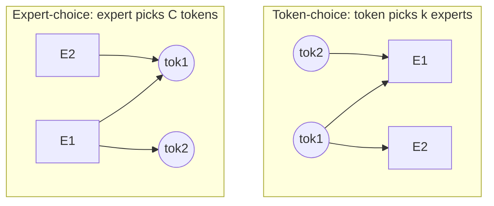

# Routing 變體

  <strong>等級：</strong>中階
  <strong>先備知識：</strong> <a href="../load-balancing/">負載平衡</a>
  <strong>硬體：</strong> 無

「在 softmax 上取 top-$k$」只是設計空間裡的一個點。本頁畫出現代 MoE 變化的幾條主軸：
**誰挑誰**（token-choice vs expert-choice）、**共享 expert**，以及 **expert 粒度**（細粒度
expert）。每一條都是 [負載平衡](load-balancing.md)那種平衡／品質／系統取捨上的槓桿。

## token-選擇 vs expert-選擇

基本問題：是每個 **token 挑自己的 expert**，還是每個 **expert 挑自己的 token**？

=== "token-choice（預設）"

    每個 token 對所有 expert 計分，挑出自己分數最高的 $k$ 個。這就是
    [從零實作 MoE layer](moe-from-scratch.md) 用的做法（Switch、GShard、Mixtral、DeepSeek）。

    - ✅ 每個 token 都保證被 routing（剛好分到 $k$ 個 expert）。
    - ❌ **不保證負載**——熱門 expert 會溢位；需要 auxiliary loss／capacity／偏差來平衡。
    - 對自回歸 inference 很自然（每個新 token 各自獨立 routing）。

=== "expert-choice"

    每個 expert 對所有 token 計分，挑出自己的 top-$C$（也就是它的容量）。（Zhou et al. 2022。）

    - ✅ **天生完美負載平衡**——每個 expert 剛好處理 $C$ 個 token，不需 auxiliary loss、不會
      因溢位而丟棄。
    - ❌ **覆蓋率不均**——一個 token 可能被 0 個 expert 選中（完全略過），也可能被很多個選中；
      有些 token 因此分到比別人更多的算力。
    - ❌ 對自回歸 *decode* 很尷尬：「batch 內 top-$C$」需要整個 batch 同時存在，這打破了一次
      一個 token 的設定。多半用於 training／encoder 場景。

兩者互為對偶：token-choice 固定 experts-per-token、讓 tokens-per-expert 浮動（造成不平衡）；
expert-choice 固定 tokens-per-expert、讓 experts-per-token 浮動（造成覆蓋不均）。各有各的毒。

## 分享 experts

**共享 expert（shared expert）**是一個*每個* token 都會經過的 FFN，疊加在它的路由 expert
之上（DeepSeekMoE、Qwen-MoE）：

$$ y = \underbrace{\text{shared}(h)}_{\text{always on}} + \sum_{e\in\text{TopK}} g_e\,\text{expert}_e(h). $$

動機：如果每個路由 expert 都得各自重學每個 token 都需要的*通用*知識（基本語法、常識先驗），
那很浪費。把這些共通負載交給一個共享 expert 吸收，路由 expert 的容量就不會耗在重複的東西上、
得以專注於*獨特*的模式。好處：

- **降低路由 expert 之間的冗餘** → 更好的專業化。
- **穩定 training**——始終存在一條密集的梯度路徑，緩解離散 routing 的病態（見
  [訓練穩定性](training-stability.md)）。
- 便宜：通常就 1 個共享 expert 搭配許多個路由 expert。

DeepSeek-V3 用 1 個共享 + 256 個路由（其中 8 個活躍）。共享 FFN 不過是加進該層的一個普通密集
block（在 [從零實作 MoE layer](moe-from-scratch.md) 裡只是一行）。

## 細粒度 experts

用**很多個小** expert，而不是少數幾個大的。把每個 expert 的隱藏維度除以 $m$、同時把 expert
數乘以 $m$，總參數與活躍 FLOP 大致不變，並按比例放大 $k$（DeepSeekMoE 的「細粒度 expert
切分」）。

為什麼在一定程度內越細越好：

- **組合式專業化。** 對 $E$ 個 expert 選 $k$，token 可用的 expert *組合*數是 $\binom{E}{k}$。
  從 8 選 2（28 種組合）到 64 選 8（約 44 億種組合），在相同活躍計算下大幅豐富了函數類。
- **更細的負載粒度**——許多小 expert 比少數大 expert 更容易平衡。

代價（這就是「在一定程度內」的原因）：

- **更多 routing 開銷**——更大的 router 矩陣（$d\times E$）、更多 top-$k$ 工作、更多 all-to-all
  訊息（payload 更小 → 網路效率更差，見 [系統與 EP](systems-ep.md)）。
- **每個 expert 的 GEMM 變小**——算術強度更低，更難餵飽 GPU。grouped GEMM [kernels](kernels.md)
  的存在正是為了把這個問題救回來。

DeepSeekMoE 證明，在同等計算下，細粒度 + 共享 expert 大幅勝過經典的「少數大 expert」
（GShard 風格）設計。現代大型 MoE（DeepSeek-V3：256 個 expert；Qwen3-MoE：128 個）都牢牢站在
細粒度這一邊。

## 將槓桿放在一起

現代配方（DeepSeek-V3 風格）把這幾項合在一起：

- **token-choice** routing（對自回歸友善），
- **sigmoid gate** + **aux-loss-free 偏差**做平衡，
- **1 個共享 expert** 負責常識，
- **許多個細粒度路由 expert**（$E$ 大、$k$ 中等），
- **node-limited routing**：限制一個 token 的 expert 能跨多少個*裝置*（例如 ≤4 個節點），
  以壓低 all-to-all 成本——一個感知系統的 routing 約束。

最後一點是 routing 與系統協同設計的好例子：routing 演算法被它所運行的網路拓樸塑形。

## 要點

- **token-choice** 保證覆蓋、不保證平衡（需要 [負載平衡](load-balancing.md)那套工具）；
  **expert-choice** 保證平衡、不保證覆蓋，對 decode 很尷尬。
- **共享 expert** 扛常識，讓路由 expert 得以專業化、training 更穩。
- **細粒度 expert** 在固定活躍計算下放大 expert 組合空間、提升品質——代價是 routing/comm 開銷
  與更小的 GEMM。
- 真實模型會把 routing 和硬體一起設計（例如 node-limited routing）。

## 練習

!!! tip "解決方案"
    參考解答位於 [解答頁](../solutions/moe.md) 上。請先嘗試每個練習，再展開解答。

1. 計算 expert 組合數：（8, top-2）、（64, top-8）、（256, top-8）。把它跟細粒度帶來的品質增益
   關聯起來。
2. 為什麼 expert-choice 在自回歸 decode 時很難用、在 training 時卻很好？它的 top-$C$ 打破了哪個
   批次假設？
3. 在玩具 MoE 裡加一個共享 expert，量它對 training 穩定性（損失變異）與最終損失的影響。
4. 當 $E$ 在固定總參數下增大時，all-to-all 的訊息變小。勾勒網路效率如何變化，以及為什麼
   node-limited routing 有幫助。

## 參考文獻

- Zhou et al. _Mixture-of-Experts with Expert Choice Routing._ 2022。
- Dai et al. _DeepSeekMoE: Towards Ultimate Expert Specialization_（共享 + 細粒度）。2024。
- DeepSeek-AI. _DeepSeek-V3._ 2024（node-limited routing、sigmoid + 偏差）。
- Qwen Team. _Qwen2-MoE / Qwen3 Technical Report._ 2024–2025。
- Jiang et al. _Mixtral of Experts._ 2024。
