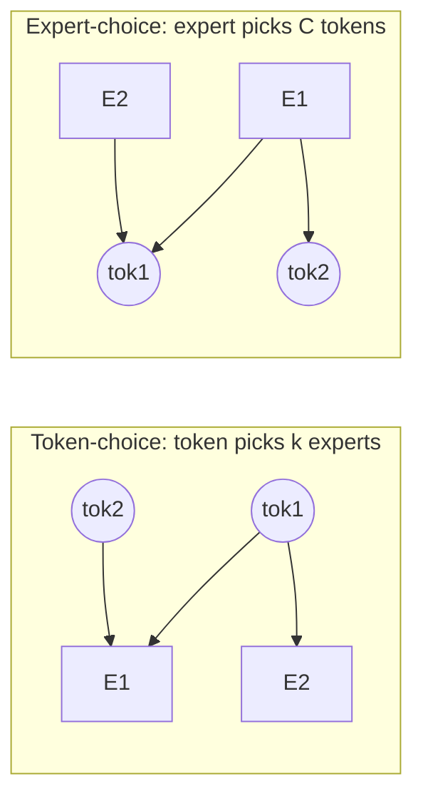

# routing 變體

  <strong>等級：</strong>中階
  <strong>先決條件：</strong> <a href="../load-balancing/">負載平衡</a>
  <strong>硬體：</strong> 無

「Top-$k$ over a softmax」只是設計空間中的一個點。該頁面映射了
現代 MoE 變化的主軸：**誰選擇誰**（token-選擇 vs
expert-選擇），**共用 experts**，以及**expert 粒度**（細粒度
experts）。每個都是平衡/品質/系統權衡的槓桿
[load-balancing](load-balancing.md)頁。

## token-選擇 vs expert-選擇

基本問題：每個**token 是否選擇其 experts**，或每個
**expert 選擇 tokens**？

=== "token-選擇（預設）"

    每個 token 對所有 experts 進行評分，並選擇其最高的 $k$。這就是
    [MoE-from-scratch](moe-from-scratch.md) 實作（Switch、GShard、Mixtral、
    深度搜索）。

    - ✅ 每個 token 都保證路由（精確取得 $k$ experts）。
    - ❌**無負載保證**— 流行的 experts 溢位；需要輔助損耗/
      平衡能力/偏差。
    - 自回歸 inference 的自然（每個新的 token 獨立路由）。

=== "expert-選擇"

    每個 expert 對所有 tokens 進行評分，並選擇其頂部 $C$（其容量）。 （週
    等人。 2022 年。 ）

    - ✅**透過構造達到完美的負載平衡**— 每個 expert 都完全符合 $C$
      tokens，無需輔助損耗，不會因溢出而掉落。
    - ❌**可變覆蓋率**— token 可由 0 experts 選擇（跳過）
      完全）或許多人。有些 tokens 比其他 tokens 獲得更多的運算能力。
    - ❌ 自回歸的尷尬 *decoding*：「批次中的 top-$C$」需要
      整批存在，這打破了一次一個 token 的設定。大部分是
      用於training/編碼器設定。

兩者是對偶的：token-choice 修復 experts-per-token 並讓 tokens-per-expert
浮動（不平衡）； expert-choice 修復了 tokens-per-expert 並讓
experts-per-token 浮動（覆蓋不均勻）。選擇你的毒藥。

## 分享 experts

**共用 expert**是*每個* token 都會經過的 FFN，除了
其路由 experts（DeepSeekMoE，Qwen-MoE）：

$$ y = \underbrace{\text{shared}(h)}_{\text{always on}} + \sum_{e\in\text{TopK}} g_e\,\text{expert}\_e(h). $$

動機：路由 experts 可以專注於*獨特的*模式，如果它們
難道每個人都必須重新學習每個 token 都需要的*通用*知識（基本知識）
文法、先驗常識）。共享的 expert 吸收了公共負載，因此
路由 experts 的容量不會浪費在冗餘上。好處：

-**減少路由 experts 的冗餘**→ 更好的專業化。 -**穩定 training**— 始終存在密集的漸變路徑，從而緩解
離散-routing 病理（參見 [training stability](training-stability.md)）。

- 便宜：通常 1 個共用 expert 以及許多路由的 expert。

DeepSeek-V3 使用 1 個共享 + 256 個路由（8 個活動）。共享的 FFN 只是
新增到圖層的普通密集區塊（一行中
[MoE-from-scratch](moe-from-scratch.md)）。

## 細粒度 experts

使用**許多小**，而不是幾個大的 experts。拆分每個 expert 的隱藏
尺寸乘以係數 $m$，並將 expert 計數乘以 $m$，保留總數
參數和活動 FLOP 大致固定，但按比例增加 $k$
（DeepSeekMoE 的「細粒度 expert 分割」）。

為什麼在某種程度上越精細越好：

-**組合專業化。**對於 $E$ experts 選擇 $k$，
expert _組合_ token 可以使用的是 $\binom{E}{k}$。從 8-選擇-2 開始
（28 個組合）到 64-choose-8（約 44 億個組合）大大豐富了
同一活動計算中的函數類別。 -**更精細的負載粒度**— 比少數幾個更容易平衡許多小型 experts
大的。

成本（這就是「在某種程度上」的原因）：

-**更多 routing 開銷**— 更大的 router 矩陣 ($d\times E$)，更多頂級 $k$
工作，更多的 all-to-all 訊息（較小的有效負載 → 更差的網路效率，
參見 [systems & EP](systems-ep.md)）。 -**每個 expert GEMM 較小**— 算術強度 較低，更難維持
GPU 忙。分組 GEMM [kernels](kernels.md) 的存在正是為了解決這個問題
回來。

DeepSeekMoE 展示了細粒度+共享的 experts 大幅擊敗了
同等計算下的經典的 Few-big-experts（GShard 風格）設計。現代化大型
MoE（DeepSeek-V3：256 experts；Qwen3-MoE：128）牢牢佔據細粒度
營地。

## 將槓桿放在一起

現代配方（DeepSeek-V3 風格）結合了這三者：

-**token-選擇**routing（自回歸友善）， -**S 形門**+**輔助無損耗偏壓**用於平衡， -**1 分享 expert**用於常識， -**許多細粒度路由的 experts**（$E$ 大，$k$ 中等）， -**節點限制 routing**：限制 token 的 experts 可以跨越多少個*裝置*
（例如 ≤4 個節點）來限制 all-to-all 成本 - 系統感知的 routing 限制。

最後一點是 routing 和系統協同設計的一個很好的例子：routing
演算法由其運行的網路拓撲決定。

## 要點

-**token-choice**保證覆蓋範圍，但不保證平衡（需要
[load-balancing](load-balancing.md)工具包）；**expert-選擇**保證
平衡但不覆蓋，對於 decoding 來說很尷尬。 -**共享 experts**攜帶常識，因此路由 experts 專業化和
training 穩定。 -**細粒度 experts**擴大了 expert 混合物的組合空間
固定活動計算，提高品質 - 以 routing/comm 開銷為代價
和較小的 GEMM。

- 真實模型與硬體共同設計 routing（例如節點限制的 routing）。

## 練習

!!! tip "解決方案"
    參考解答位於 [解答頁](../solutions/moe.md) 上。請先嘗試每個練習，再展開解答。

1. 計算 expert 組合的數量（8，top-2），（64，top-8），（256，top-8）。相關於
   細粒度的質量增益。
2. 為什麼 expert 在自回歸 decoding 時很難選擇，而在 decoding 時則很好
   training？它的 top-$C$ 打破了哪個批次假設？
3. 在玩具 MoE 中加入一個共享的 expert 並測量其對 training 的效果
   穩定性（損失變異數）和最終損失。
4. 隨著 $E$ 以固定總參數增長，all-to-all 訊息大小縮小。素描
   網路效率如何變化以及節點受限 routing 為何有幫助。

## 參考文獻

- 周等人。 _experts 與 expert 選擇 routing 的混合物。 _ 2022 年。
- 戴等。 _DeepSeekMoE：邁向終極 expert 專業化_（共享+細粒度）。 2024 年。
- DeepSeek-AI。 _DeepSeek-V3._ 2024（節點限制 routing，sigmoid + 偏置）。
- Qwen 團隊。 _Qwen2-MoE / Qwen3 技術報告。 _ 2024–2025。
- 江等人。 _experts 的混合。 _ 2024 年。
