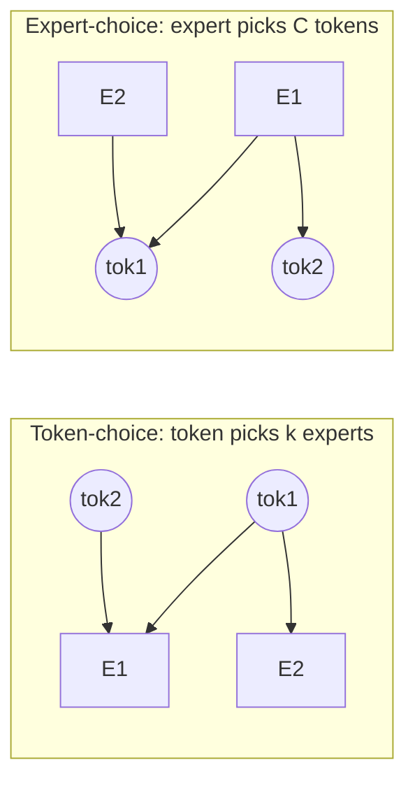

# Routing variants

  <strong>Level:</strong> intermediate
  <strong>Prereqs:</strong> <a href="../load-balancing/">load balancing</a>
  <strong>Hardware:</strong> none

"Top-$k$ over a softmax" is only one point in a design space. This page maps the
main axes that modern MoEs vary: **who chooses whom** (token-choice vs
expert-choice), **shared experts**, and **expert granularity** (fine-grained
experts). Each is a lever on the balance/quality/systems trade-offs from the
[load-balancing](load-balancing.md) page.

## Token-choice vs expert-choice

The fundamental question: does each **token pick its experts**, or does each
**expert pick its tokens**?

=== "Token-choice (the default)"

    Each token scores all experts and selects its top-$k$. This is what
    [MoE-from-scratch](moe-from-scratch.md) implements (Switch, GShard, Mixtral,
    DeepSeek).

    - ✅ Every token is guaranteed routed (gets exactly $k$ experts).
    - ❌ **No load guarantee** — popular experts overflow; needs aux loss /
      capacity / bias to balance.
    - Natural for autoregressive inference (each new token routes independently).

=== "Expert-choice"

    Each expert scores all tokens and selects its top-$C$ (its capacity). (Zhou
    et al. 2022.)

    - ✅ **Perfect load balance by construction** — every expert gets exactly $C$
      tokens, no aux loss needed, no drops from overflow.
    - ❌ **Variable coverage** — a token may be chosen by 0 experts (skipped
      entirely) or by many. Some tokens get more compute than others.
    - ❌ Awkward for autoregressive *decoding*: "top-$C$ over the batch" needs the
      whole batch present, which breaks the one-token-at-a-time setting. Mostly
      used in training / encoder settings.

The two are duals: token-choice fixes experts-per-token and lets tokens-per-expert
float (imbalance); expert-choice fixes tokens-per-expert and lets
experts-per-token float (uneven coverage). Pick your poison.

## Shared experts

A **shared expert** is an FFN that *every* token passes through, in addition to
its routed experts (DeepSeekMoE, Qwen-MoE):

$$ y = \underbrace{\text{shared}(h)}_{\text{always on}} + \sum_{e\in\text{TopK}} g_e\,\text{expert}_e(h). $$

The motivation: routed experts can specialize on *distinctive* patterns if they
don't each have to relearn the *common* knowledge every token needs (basic
grammar, common-sense priors). The shared expert absorbs that common load, so the
routed experts' capacity isn't wasted on redundancy. Benefits:

- **Reduces redundancy** across routed experts → better specialization.
- **Stabilizes training** — there's always a dense gradient path, easing the
  discrete-routing pathologies (see [training stability](training-stability.md)).
- Cheap: typically 1 shared expert alongside many routed ones.

DeepSeek-V3 uses 1 shared + 256 routed (8 active). The shared FFN is just a
normal dense block you add to the layer (one line in
[MoE-from-scratch](moe-from-scratch.md)).

## Fine-grained experts

Instead of a few big experts, use **many small ones**. Split each expert's hidden
dimension by a factor $m$ and multiply the expert count by $m$, keeping total
parameters and active FLOPs roughly fixed but increasing $k$ proportionally
(DeepSeekMoE's "fine-grained expert segmentation").

Why finer is better, up to a point:

- **Combinatorial specialization.** With $E$ experts choose $k$, the number of
  expert *combinations* a token can use is $\binom{E}{k}$. Going from 8-choose-2
  (28 combos) to 64-choose-8 (~4.4 billion combos) massively enriches the
  function class at the same active compute.
- **Finer load granularity** — easier to balance many small experts than few
  large ones.

Costs (this is why "up to a point"):

- **More routing overhead** — bigger router matrix ($d\times E$), more top-$k$
  work, more all-to-all messages (smaller payloads → worse network efficiency,
  see [systems & EP](systems-ep.md)).
- **Smaller per-expert GEMMs** — lower arithmetic intensity, harder to keep the
  GPU busy. The grouped-GEMM [kernels](kernels.md) exist precisely to claw this
  back.

DeepSeekMoE showed fine-grained + shared experts substantially beat the
classic few-big-experts (GShard-style) design at equal compute. Modern large
MoEs (DeepSeek-V3: 256 experts; Qwen3-MoE: 128) sit firmly in the fine-grained
camp.

## Putting the levers together

A modern recipe (DeepSeek-V3-style) combines all three:

- **Token-choice** routing (autoregressive-friendly),
- **sigmoid gate** + **aux-loss-free bias** for balance,
- **1 shared expert** for common knowledge,
- **many fine-grained routed experts** ($E$ large, $k$ moderate),
- **node-limited routing**: cap how many *devices* a token's experts can span
  (e.g. ≤4 nodes) to bound all-to-all cost — a systems-aware routing constraint.

That last point is a nice example of routing and systems co-design: the routing
algorithm is shaped by the network topology it has to run on.

## Key takeaways

- **Token-choice** guarantees coverage but not balance (needs the
  [load-balancing](load-balancing.md) toolkit); **expert-choice** guarantees
  balance but not coverage and is awkward for decoding.
- **Shared experts** carry common knowledge so routed experts specialize and
  training stabilizes.
- **Fine-grained experts** enlarge the combinatorial space of expert mixtures at
  fixed active compute, improving quality — at the cost of routing/comm overhead
  and smaller GEMMs.
- Real models co-design routing with the hardware (e.g. node-limited routing).

## Exercises

!!! tip "Solutions"
    Worked answers are on the [Part solutions page](../solutions/moe.md). Try each exercise before expanding.

1. Count expert combinations for (8, top-2), (64, top-8), (256, top-8). Relate to
   the fine-grained quality gains.
2. Why is expert-choice hard during autoregressive decoding but fine during
   training? What batch assumption does its top-$C$ break?
3. Add a shared expert to the toy MoE and measure its effect on training
   stability (loss variance) and final loss.
4. As $E$ grows at fixed total params, all-to-all message size shrinks. Sketch
   how network efficiency changes and why node-limited routing helps.

## References

- Zhou et al. *Mixture-of-Experts with Expert Choice Routing.* 2022.
- Dai et al. *DeepSeekMoE: Towards Ultimate Expert Specialization* (shared + fine-grained). 2024.
- DeepSeek-AI. *DeepSeek-V3.* 2024 (node-limited routing, sigmoid + bias).
- Qwen Team. *Qwen2-MoE / Qwen3 technical reports.* 2024–2025.
- Jiang et al. *Mixtral of Experts.* 2024.
