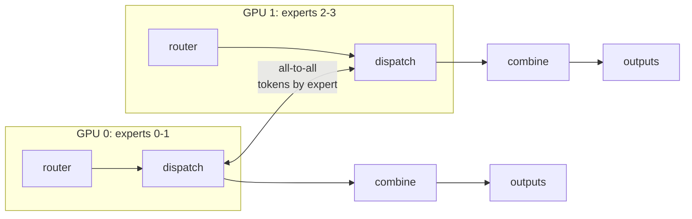
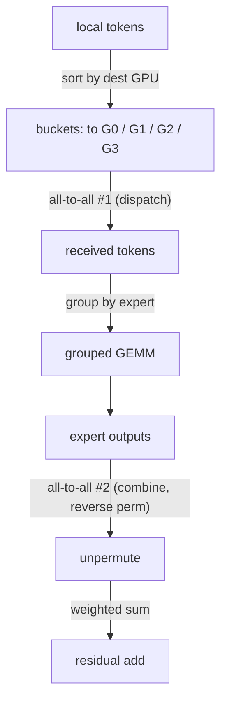
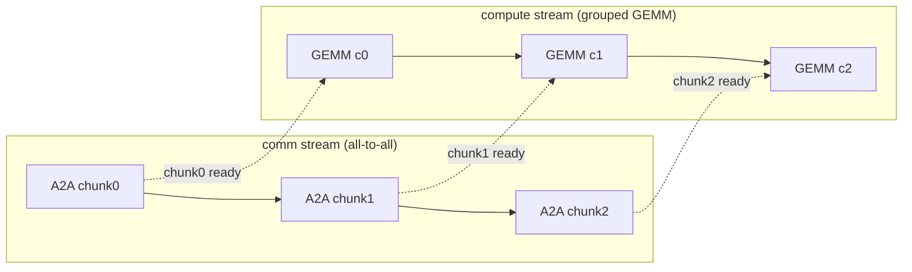

# 系統 & expert 平行性

<div class="page-meta">
  <span class="chip"><strong>等級：</strong> 高階</span>
  <span class="chip"><strong>先備知識：</strong> <a href="../moe-from-scratch/">MoE 從頭開始</a>、<a href="../../performance/distributed-training/">集體</a></span>
  <span class="chip"><strong>硬體：</strong> 多 GPU（概念適用於 1 個 GPU）</span>
</div>

experts 保存了 MoE 的大部分參數，因此我們將它們跨 GPU 分片：
**expert 並行性 (EP)**。但 routing 是與資料相關的 — token 的 expert 可能
運行在另一個 GPU 上 - 因此每個 MoE 層都需要**all-to-all**來運送 tokens
到他們的 experts 並將結果發回。此頁面建立 EP
調度形式，派生 all-to-all 資料流，並涵蓋以下最佳化：
防止它主導運行時：**通信/計算重疊、分組 GEMM、
MegaBlocks 區塊稀疏視圖以及容量/填充權衡。**

## expert 一張圖中的平行性

將 $E/G$ experts 放置在每個 $G$ GPU 上。 attention 和 router 重複運行
像往常一樣在每個 GPU 上（資料並行）。 MoE FFN 僅在 expert 的地方運行
生活：



每個 MoE 層的兩個集體：

1. **調度（all-to-all）**：每個 GPU 將其本地路由的 tokens 傳送到 GPU
   擁有目標 expert。
2. **組合(all-to-all)**：experts 運轉後，將輸出傳回
   tokens 的原始 GPU 將被匯總到殘差中。

## all-to-all，準確地說

從 [dispatch form](moe-from-scratch.md) 開始：在每個 GPU 上我們都有本地
tokens，分別分配給$k$ experts。發送給他們：

1. **按*目標 GPU*（哪個 GPU）對本機 token-expert 分配進行排序/儲存桶**
   擁有所選的 expert）。這會為每個目的地產生一個連續的緩衝區。
2. **all-to-all #1**：交換計數（每個 GPU 互相發送多少個 tokens
   GPU），然後是 token 有效負載。此後，每個 GPU 保存所有路由到的 tokens
   _其_ experts，依來源分組。
3. **本機分組 GEMM**：在其接收的 tokens 上執行每個駐留 expert
   （連續的區塊 → 一個分組/批量的 matmul，見下文）。
4. **all-to-all #2（組合）**：將 expert 輸出沿著反向發送回去
   排列。
5. **取消排列 + 加權和**到每個 token 在其主 GPU 上的殘差。



模式是**排列 → all-to-all → 分組 GEMM → all-to-all → 取消排列**。
排列是[kernels](kernels.md)頁面； all-to-all 是
我們現在攻擊系統成本。

## 為什麼 all-to-all 很貴——以及如何隱藏它

all-to-all 移動 $O(\text{tokens} \times d)$ 位元組*每層兩次*，
GPU 間結構（節點內的 NVLink、跨 InfiniBand/RoCE 或 Infinity Fabric）
節點）。對於每層都有 MoE 的深度模型，可以媲美或超過
expert 計算。三個槓桿：

### 1. 通訊與計算重疊

$\ell$ 層的調度 all-to-all 可以與*獨立*計算重疊：
下一個微批次的 attention、共享 expert FFN，甚至分塊
expert 計算。框架將其管道化：將 token 批次分割成區塊，並且，
當塊 $i$ 的 tokens 正在飛行時，計算塊 $i-1$ 的 experts。做得好，
comm 幾乎完全隱藏在計算背後——最重要的 EP
優化。 DeepSeek 的**DualPipe**和 DeepEP 庫的存在就是為了最大化這一點
重疊。 _在單一 GPU 內_ decode 中顯示了相同的重疊與串列分割
太 - 請參閱中的兩個 latency 曲目
[Anatomy of an MoE decode](decode-anatomy.md)，其中〜一半的跨堆疊間隙是
並發，不是 kernel 速度。



每個區塊的 GEMM 在*下一個*區塊仍在運作時運作（虛線
hand-offs）－通訊和計算重疊而不是序列化。

### 2. 通訊限制：節點限制 routing

如果 token 的$k$ experts 可以登陸$k$不同節點，則需要支付跨節點費用
頻寬$k$倍。**節點限制 routing**(DeepSeek-V3) 限制了節點數量
token 可以路由到的節點（例如 ≤4），因此大多數流量保持在快速的節點內
鏈接。這是由拓樸塑造的 routing — 請參閱
[routing variants](routing-variants.md)。

### 3.將 EP 與其他並行性結合起來

EP 由資料 (DP)、張量 (TP) 和管道 (PP) 並行性組成（參見
[distributed training](../performance/distributed-training.md)）。常見的 3D+EP
版面：attention 節點內 TP，experts 節點間 EP，experts 節點間 PP
階段，DP 在頂部。 EP 組到網路的對應決定了多少
all-to-all 遇到慢速連結。

## 分組 GEMM：計算端

發貨後，每個 expert 都有一個「可變」數量的 tokens——一個參差不齊的批次。
三種計算方法，越來越好：

-**GEMM 循環**（每個 expert 一個 matmul）：簡單，但 kernel 啟動開銷
小型 experts 的利用率較差。 （[naive reference](moe-from-scratch.md)。） -**帶有填充的批量 GEMM**：將每個 expert 填充到容量 $C$ 並執行一個
批次 matmul。常規，但在填充上浪費了 FLOP（容量/填充
權衡）。 -**分組 GEMM**：單一 kernel 可以執行許多*不同*大小的 matmuls
背靠背，共享啟動和調度——沒有填充浪費，完整
利用率。這是主力；[kernels](kernels.md) 頁面實現
Triton 中的一個並繪製了 CUDA/HIP 版本的草圖。

### MegaBlocks 區塊稀疏視圖

MegaBlocks 將整個 MoE FFN 重新建構為**一個大的塊稀疏 matmul**。堆疊
所有 experts 的權重並將 token→expert 分配視為區塊稀疏
操作數：每個 token 區塊僅乘以其 expert 的權重區塊。這個
**消除了 token 丟棄**（不需要固定容量 - 稀疏操作句柄
可變大小）並映射到高效的區塊稀疏 GEMM kernels。原來
將“參差不齊的分組 GEMM”轉換為“結構化稀疏性”，GPU 可以很好地處理這一點。

```text
dense view (wasteful):  pad each expert to C, batched GEMM
block-sparse view:      [tokens] × [block-diagonal expert weights]
                        only the nonzero blocks (token's expert) compute
```

## 容量和填充的權衡

從 [負載平衡](load-balancing.md) 開始，容量 $C$ 為每個 expert 的 tokens 提供上限。
在系統上下文中 $C$ 設定**all-to-all 緩衝區大小**和
**分組 GEMM 填充**：

-**高容量係數**→ 很少滴（品質好）但通訊緩衝區很大
更多填充 FLOP（慢）。 -**低容量係數**→ 緩衝區緊密，填充較少（快），但掉落較多
（質量打擊）。 -**Dropless**（MegaBlocks 區塊稀疏，或 expert-選擇）→ 根本沒有容量，
以可變大小的 kernels 和稍微複雜的調度為代價。

因此，容量係數是一個*聯合*品質 – throughput – 記憶體旋鈕，
出現在建模和系統預算中。

## 最小的 all-to-all 調度（單一進程模擬）

你可以在沒有真實集群的情況下開發和測試排列/分桶邏輯
透過在一個流程中模擬 $G$「排名」（真實版本交換分桶）
複製 `dist.all_to_all_single`）。參考文獻在
[`code/moe/`](https://github.com/youyun8/ml-perf-handbook/tree/main/code/moe)
包括按目的地排序分桶；生產調用是：

```python
import torch.distributed as dist

# send_counts[j] = #tokens this rank sends to rank j (computed from routing)
# After sorting local tokens by destination rank into `send_buf`:
recv_counts = torch.empty_like(send_counts)
dist.all_to_all_single(recv_counts, send_counts)            # exchange counts
recv_buf = torch.empty(recv_counts.sum(), d, device=dev)
dist.all_to_all_single(recv_buf, send_buf,
                       output_split_sizes=recv_counts.tolist(),
                       input_split_sizes=send_counts.tolist())  # exchange tokens
# ... run local experts on recv_buf (grouped GEMM) ...
# ... reverse all_to_all to combine, then unpermute + weighted sum ...
```

## 要點

-**expert 並行性**跨 GPU 分片 experts；每個 MoE 層需要**兩個
all-to-alls**（調度 + 合併），因為 routing 依賴資料。

- 資料流是**permute → all-to-all → 分組 GEMM → all-to-all →
  取消排列。**
- all-to-all 可以運行運行時；**將其與計算重疊**（分塊
  管線、DualPipe/DeepEP），**將其與節點限制的 routing 綁定**，以及
  **以映射到網路拓撲的 TP/PP/DP**組成 EP。
- 變數 tokens-per-expert 由**分組 GEMM**或**MegaBlocks 處理
  塊稀疏**配方（無滴）。**容量因素**聯合交易
  品質與 throughput 與記憶體。

## 練習

!!! tip "解決方案"
    參考解答位於 [解答頁](../solutions/moe.md) 上。請先嘗試每個練習，再展開解答。

1. 對於$T{=}4096$ tokens/GPU、$d{=}4096$、bf16，估計兩者移動的位元組數
   每層 all-to-all。超過 60 層，與 expert GEMM FLOP-time 相比
   H100。該層是受通訊限制還是受計算限制？
2. 展示節點限制的 routing（≤$M$節點）如何限制最壞情況的跨節點
   交通。 routing 彈性的成本是多少？
3. 比較填充浪費（容量因子為 2.0 的批量 GEMM）與分組 GEMM
   （無填充）用於 CV = 0.5 的負載分佈。
4. 繪製與調度 all-to-all 重疊的分塊管道調度表
   共享-expert 計算。是什麼限制了可實現的重疊？

## 參考文獻

- 萊皮欣等人。 _GShard._ 2020（all-to-all 調度/合併）。
- 費杜斯、佐夫、沙吉爾。 _開關 Transformer。 _ 2021 年。
- 大風等人。 _MegaBlocks：帶有 MoE 的高效稀疏 training。 _ 2022（塊稀疏，無滴）。
- 拉傑班達裡等人*DeepSpeed-MoE。 * 2022 年。
- DeepSeek-AI。 _DeepSeek-V3_ + _DeepEP_（節點限制 routing，DualPipe 重疊）。 2024 年。
