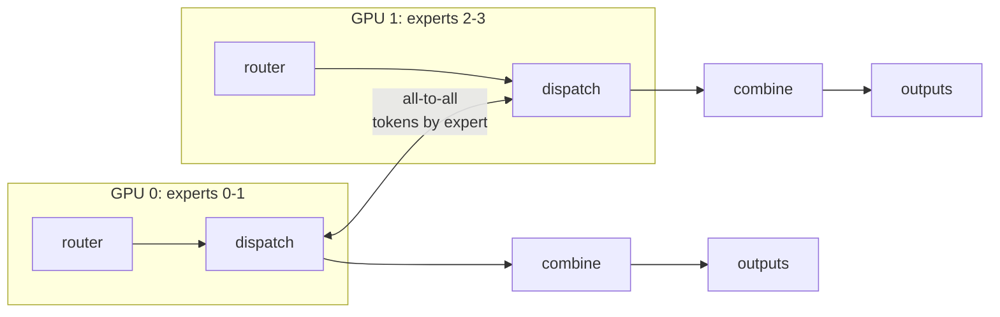
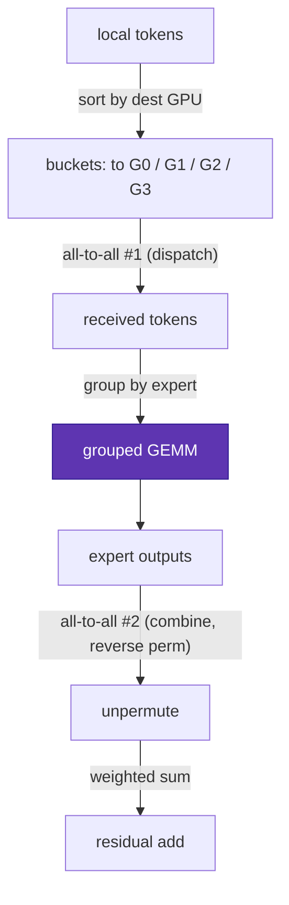
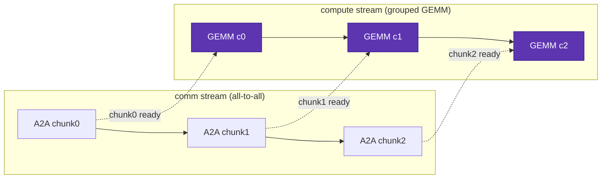

# Systems & expert parallelism

<div class="page-meta">
  <span class="chip"><strong>Level:</strong> advanced</span>
  <span class="chip"><strong>Prereqs:</strong> <a href="../moe-from-scratch/">MoE from scratch</a>, <a href="../../performance/distributed-training/">collectives</a></span>
  <span class="chip"><strong>Hardware:</strong> multi-GPU (concepts apply on 1 GPU)</span>
</div>

Experts hold most of an MoE's parameters, so we shard them across GPUs:
**expert parallelism (EP)**. But routing is data-dependent — a token's expert may
live on another GPU — so every MoE layer needs an **all-to-all** to ship tokens
to their experts and ship the results back. This page builds EP from the
dispatch form, derives the all-to-all dataflow, and covers the optimizations that
keep it from dominating runtime: **comm/compute overlap, grouped GEMM, the
MegaBlocks block-sparse view, and capacity/padding trade-offs.**

## Expert parallelism in one diagram

Put $E/G$ experts on each of $G$ GPUs. Attention and the router run replicated
(data-parallel) on every GPU as usual. The MoE FFN runs only where the expert
lives:



The two collectives per MoE layer:

1. **Dispatch (all-to-all)**: each GPU sends its locally-routed tokens to the GPU
   that owns the target expert.
2. **Combine (all-to-all)**: after experts run, send the outputs back to the
   tokens' original GPUs to be summed into the residual.

## The all-to-all, precisely

Start from the [dispatch form](moe-from-scratch.md): on each GPU we have local
tokens, each assigned to $k$ experts. To send them:

1. **Sort/bucket** local token-expert assignments by *destination GPU* (which GPU
   owns the chosen expert). This produces, per destination, a contiguous buffer.
2. **All-to-all #1**: exchange counts (how many tokens each GPU sends each other
   GPU), then the token payloads. After this, each GPU holds all tokens routed to
   *its* experts, grouped by source.
3. **Local grouped GEMM**: run each resident expert on its received tokens
   (contiguous blocks → one grouped/batched matmul, see below).
4. **All-to-all #2 (combine)**: send expert outputs back along the reverse
   permutation.
5. **Unpermute + weighted sum** into each token's residual on its home GPU.



The pattern is **permute → all-to-all → grouped-GEMM → all-to-all → unpermute**.
The permutations are the [kernels](kernels.md) page; the all-to-alls are the
systems cost we now attack.

## Why all-to-all is expensive — and how to hide it

All-to-all moves $O(\text{tokens} \times d)$ bytes *twice per layer*, over the
inter-GPU fabric (NVLink within a node, InfiniBand/RoCE or Infinity Fabric across
nodes). For deep models with an MoE every layer, this can rival or exceed the
expert compute. Three levers:

### 1. Overlap communication with computation

The dispatch all-to-all of layer $\ell$ can overlap with *independent* compute:
the attention of the next micro-batch, the shared-expert FFN, or even chunked
expert compute. Frameworks pipeline it: split the token batch into chunks and,
while chunk $i$'s tokens are in flight, compute chunk $i-1$'s experts. Done well,
comm hides almost entirely behind compute — the single most important EP
optimization. DeepSeek's **DualPipe** and DeepEP library exist to maximize this
overlap. The same overlap-vs-serial split shows up *within a single GPU's* decode
too — see the two latency tracks in
[Anatomy of an MoE decode](decode-anatomy.md), where ~half the cross-stack gap is
concurrency, not kernel speed.



Each chunk's GEMM runs while the *next* chunk is still in flight (dashed
hand-offs) — comm and compute overlap rather than serialize.

### 2. Bound the communication: node-limited routing

If a token's $k$ experts can land on $k$ different nodes, you pay cross-node
bandwidth $k$ times. **Node-limited routing** (DeepSeek-V3) caps the number of
nodes a token may route to (e.g. ≤4), so most traffic stays on fast intra-node
links. This is routing shaped by topology — see
[routing variants](routing-variants.md).

### 3. Combine EP with other parallelism

EP composes with data (DP), tensor (TP), and pipeline (PP) parallelism (see
[distributed training](../performance/distributed-training.md)). A common 3D+EP
layout: TP within a node for attention, EP across nodes for experts, PP across
stages, DP on top. The mapping of EP groups onto the network determines how much
all-to-all hits the slow links.

## Grouped GEMM: the compute side

After dispatch, each expert has a *variable* number of tokens — a ragged batch.
Three ways to compute it, increasingly good:

- **Loop of GEMMs** (one matmul per expert): simple, but kernel-launch overhead
  and poor utilization for small experts. (The [naive reference](moe-from-scratch.md).)
- **Batched GEMM with padding**: pad every expert to capacity $C$ and do one
  batched matmul. Regular, but wastes FLOPs on padding (the capacity/padding
  trade-off).
- **Grouped GEMM**: a single kernel that does many matmuls of *different* sizes
  back-to-back, sharing the launch and scheduling — no padding waste, full
  utilization. This is the workhorse; the [kernels](kernels.md) page implements
  one in Triton and sketches the CUDA/HIP version.

### The MegaBlocks block-sparse view

MegaBlocks reframes the whole MoE FFN as **one big block-sparse matmul**. Stack
all experts' weights and view the token→expert assignment as a block-sparse
operand: each token-block multiplies only the weight-block of its expert. This
**eliminates token dropping** (no fixed capacity needed — the sparse op handles
variable sizes) and maps to efficient block-sparse GEMM kernels. It turns
"ragged grouped GEMM" into "structured sparsity," which GPUs handle well.

```text
dense view (wasteful):  pad each expert to C, batched GEMM
block-sparse view:      [tokens] × [block-diagonal expert weights]
                        only the nonzero blocks (token's expert) compute
```

## Capacity and padding trade-offs

From [load balancing](load-balancing.md), capacity $C$ caps tokens per expert.
In the systems context $C$ sets the **all-to-all buffer size** and the
**grouped-GEMM padding**:

- **High capacity factor** → few drops (good quality) but large comm buffers and
  more padding FLOPs (slow). 
- **Low capacity factor** → tight buffers, less padding (fast) but more drops
  (quality hit).
- **Dropless** (MegaBlocks block-sparse, or expert-choice) → no capacity at all,
  at the cost of variable-size kernels and slightly more complex scheduling.

The capacity factor is therefore a *joint* quality–throughput–memory knob that
shows up in both the modeling and systems budgets.

## A minimal all-to-all dispatch (single-process simulation)

You can develop and test the permutation/bucketing logic without a real cluster
by simulating $G$ "ranks" in one process (the real version swaps the bucketing
copy for `dist.all_to_all_single`). The reference in
[`code/moe/`](https://github.com/youyun8/ml-perf-handbook/tree/main/code/moe)
includes the sort-by-destination bucketing; the production call is:

```python
import torch.distributed as dist

# send_counts[j] = #tokens this rank sends to rank j (computed from routing)
# After sorting local tokens by destination rank into `send_buf`:
recv_counts = torch.empty_like(send_counts)
dist.all_to_all_single(recv_counts, send_counts)            # exchange counts
recv_buf = torch.empty(recv_counts.sum(), d, device=dev)
dist.all_to_all_single(recv_buf, send_buf,
                       output_split_sizes=recv_counts.tolist(),
                       input_split_sizes=send_counts.tolist())  # exchange tokens
# ... run local experts on recv_buf (grouped GEMM) ...
# ... reverse all_to_all to combine, then unpermute + weighted sum ...
```

## Key takeaways

- **Expert parallelism** shards experts across GPUs; each MoE layer needs **two
  all-to-alls** (dispatch + combine) because routing is data-dependent.
- The dataflow is **permute → all-to-all → grouped GEMM → all-to-all →
  unpermute.**
- All-to-all can dominate runtime; **overlap it with compute** (chunked
  pipelining, DualPipe/DeepEP), **bound it with node-limited routing**, and
  **compose EP with TP/PP/DP** mapped to the network topology.
- Variable tokens-per-expert is handled by **grouped GEMM** or the **MegaBlocks
  block-sparse** formulation (dropless). **Capacity factor** jointly trades
  quality vs throughput vs memory.

## Exercises

!!! tip "Solutions"
    Worked answers are on the [Part solutions page](../solutions/moe.md). Try each exercise before expanding.

1. For $T{=}4096$ tokens/GPU, $d{=}4096$, bf16, estimate bytes moved by the two
   all-to-alls per layer. Over 60 layers, compare to expert GEMM FLOP-time on an
   H100. Is the layer comm- or compute-bound?
2. Show how node-limited routing (≤$M$ nodes) bounds worst-case cross-node
   traffic. What does it cost in routing flexibility?
3. Compare padding waste (batched GEMM at capacity factor 2.0) vs grouped GEMM
   (no padding) for a load distribution with CV = 0.5.
4. Sketch a chunked-pipeline schedule that overlaps dispatch all-to-all with
   shared-expert compute. What limits the achievable overlap?

## References

- Lepikhin et al. *GShard.* 2020 (all-to-all dispatch/combine).
- Fedus, Zoph, Shazeer. *Switch Transformer.* 2021.
- Gale et al. *MegaBlocks: Efficient Sparse Training with MoE.* 2022 (block-sparse, dropless).
- Rajbhandari et al. *DeepSpeed-MoE.* 2022.
- DeepSeek-AI. *DeepSeek-V3* + *DeepEP* (node-limited routing, DualPipe overlap). 2024.
