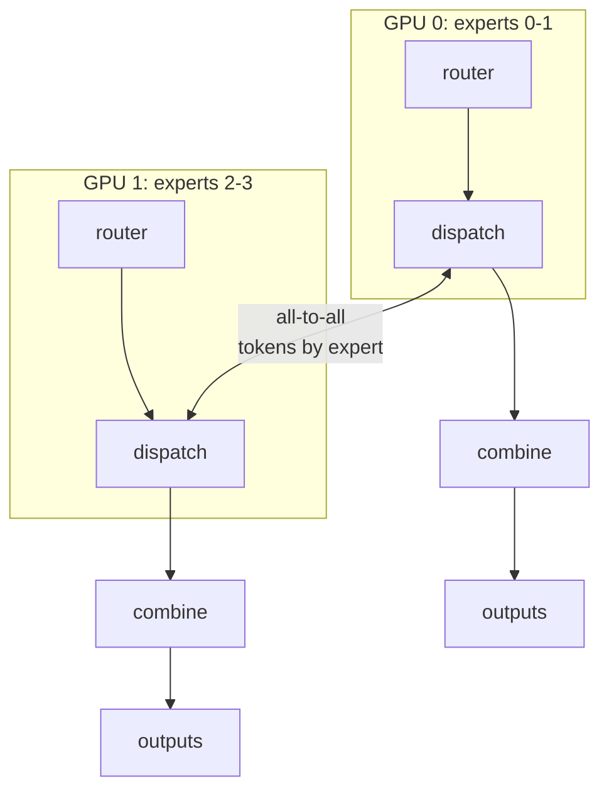
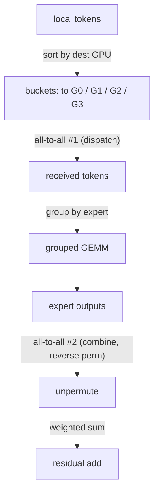
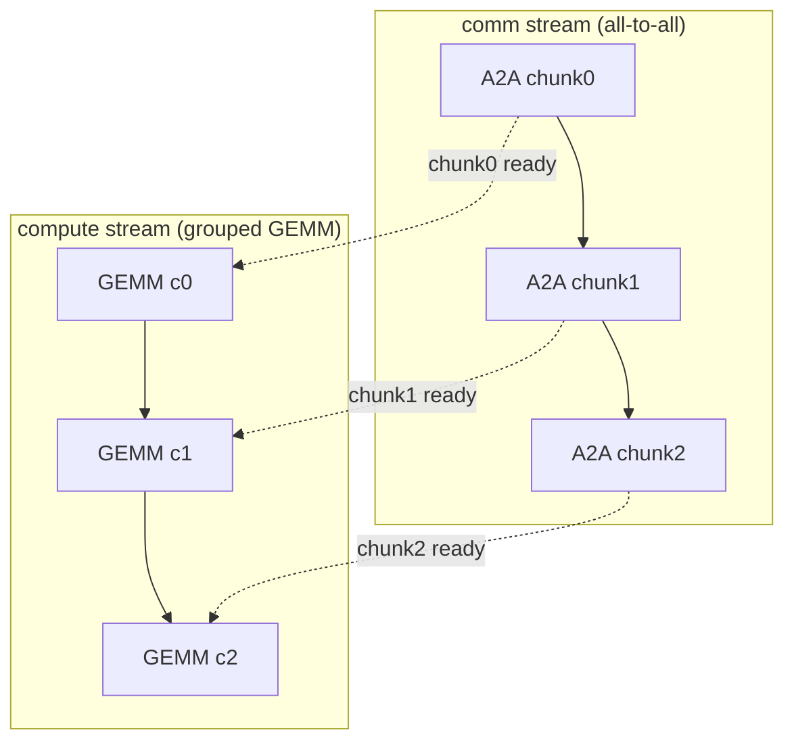

# 系統與 expert parallelism

<div class="page-meta">
  <span class="chip"><strong>等級：</strong> 高階</span>
  <span class="chip"><strong>先備知識：</strong> <a href="../moe-from-scratch/">MoE 從頭開始</a>、<a href="../../performance/distributed-training/">集體通訊</a></span>
  <span class="chip"><strong>硬體：</strong> 多 GPU（概念適用於 1 個 GPU）</span>
</div>

experts 保存了 MoE 的大部分參數，因此我們將它們跨 GPU 分片： **expert parallelism (EP)**。但 routing 是與資料相關的 — token 的 expert 可能 運行在另一個 GPU 上，因此每個 MoE 層都需要 **all-to-all** 來把 tokens 運送 到它們的 experts，並將結果送回。此頁面建立 EP 的 dispatch 形式，推導 all-to-all 資料流，並涵蓋下列最佳化， 以避免它主導執行時間：**通訊/計算重疊、grouped GEMM、 MegaBlocks 區塊稀疏視圖，以及 capacity/padding 權衡。**

## 用一張圖看 expert parallelism

將 $E/G$ 個 experts 放置在 $G$ 個 GPU 的每一個上。attention 與 router 一如往常 在每個 GPU 上重複運行（data parallel）。MoE FFN 僅在 expert 所在處運行：



每個 MoE 層有兩個 collective：

1. **dispatch（all-to-all）**：每個 GPU 將其本地路由的 tokens 傳送到 擁有目標 expert 的 GPU。
2. **combine（all-to-all）**：experts 運算後，將輸出送回 tokens 的原始 GPU，並匯總到殘差中。

## all-to-all，精確地說

從 [dispatch form](moe-from-scratch.md) 開始：在每個 GPU 上我們有本地 tokens，各自分配給 $k$ 個 experts。要送出它們：

1. **依*目標 GPU*（擁有所選 expert 的那個 GPU）對本地 token-expert 分配進行排序/分桶。**這會為每個目的地產生一段連續的緩衝區。
2. **all-to-all #1**：先交換計數（每個 GPU 互相要送多少個 tokens）， 再交換 token payload。此後，每個 GPU 保存所有路由到 _其_ experts 的 tokens，依來源分組。
3. **本地 grouped GEMM**：每個常駐 expert 在其接收到的 tokens 上運行 （連續的區塊 → 一個 grouped/batched matmul，見下文）。
4. **all-to-all #2（combine）**：沿著反向排列把 expert 輸出送回去。
5. **unpermute + 加權和**到每個 token 在其主 GPU 上的殘差。



模式是 **permute → all-to-all → grouped GEMM → all-to-all → unpermute**。 permute 在 [kernels](kernels.md) 頁面討論；all-to-all 的系統成本 是我們現在要攻克的對象。

## all-to-all 的通訊量

設定符號：$T$ 為每個 device 的本地 token 數，$k$ 為 top-$k$ routing 中 每個 token 選取的 expert 數，$H$ 為 hidden dimension，$c$ 為每個元素的位元組數 （BF16 為 $c=2$）。

dispatch all-to-all 將每個 token 複製到它的 $k$ 個 experts，因此每個 device 送出約

$$ B\_{\text{dispatch}} \approx T\,k\,H\,c \quad\text{(bytes/device)} $$

combine all-to-all 是對稱的（把 expert 輸出沿反向排列送回），再送出約 相同的量：

$$ B\_{\text{combine}} \approx T\,k\,H\,c \quad\text{(bytes/device)} $$

因此每個 MoE 層共有 **兩個 all-to-all**，合計約 $2\,T\,k\,H\,c$ bytes/device。 其中 $B_{\text{dispatch}}$、$B_{\text{combine}}$ 分別為 dispatch、combine 階段 每個 device 的位元組量。

## 為什麼 all-to-all 很貴——以及如何隱藏它

all-to-all _每層兩次_ 在 GPU 間互連（節點內 NVLink/Infinity Fabric、 跨節點 InfiniBand/RoCE）上搬移 $O(T\,k\,H)$ 個元素。對於每層都有 MoE 的 深度模型，這可與 expert 計算相當甚至超過它。三個槓桿：

### 1. 通訊與計算重疊

第 $\ell$ 層的 dispatch all-to-all 可以與*獨立*的計算重疊： 下一個 micro-batch 的 attention、shared expert FFN，甚至分塊的 expert 計算。框架會將其管線化：把 token 批次切成區塊，當區塊 $i$ 的 tokens 還在傳輸途中時，計算區塊 $i-1$ 的 experts。做得好的話， 通訊幾乎完全隱藏在計算背後——這是最重要的 EP 最佳化。DeepSeek 的 **DualPipe** 與 DeepEP 函式庫的存在就是為了最大化這個 重疊。在 _單一 GPU 內_ 的 decode 也展現相同的重疊與串列切分 ——參見 [Anatomy of an MoE decode](decode-anatomy.md) 裡的兩條 latency 軌跡， 其中約一半的跨堆疊間隙是並發的，而不是 kernel 速度造成的。



每個區塊的 GEMM 在*下一個*區塊仍在傳輸時運行（虛線 hand-off）——通訊與計算重疊而非序列化。

### 2. 限制通訊：node-limited routing

如果一個 token 的 $k$ 個 experts 可以落在 $k$ 個不同節點上，就要付出 $k$ 倍的跨節點頻寬。**node-limited routing**（DeepSeek-V3）限制一個 token 可路由到的節點數量（例如 ≤4），因此大部分流量留在快速的節點內 連結。這是由拓樸塑形的 routing——參見 [routing variants](routing-variants.md)。

### 3. 將 EP 與其他 parallelism 組合

EP 與 data (DP)、tensor (TP)、pipeline (PP) parallelism 組合使用（參見 [distributed training](../performance/distributed-training.md)）。常見的 3D+EP 佈局：attention 用節點內 TP，experts 用跨節點 EP，experts 用跨節點 PP 階段，DP 在最上層。EP group 到網路的對應關係決定了多少 all-to-all 會撞上慢速連結。

#### EP vs TP：通訊權衡

TP 與 EP 切分模型的方式不同，付出的通訊代價也不同。 設 $b$ 為 batch size、$s$ 為序列長度（decode 時 $s=1$），其餘符號同前。

- **TP**：每層透過 all-reduce 交換 activations，每次 reduce 約搬移

  $$ B\_{\text{TP}} \approx b\,s\,H\,c \quad\text{(bytes)} $$

  在小型 decode 訊息上是 latency-bound（受訊息延遲而非頻寬限制）。

- **EP**：透過 all-to-all 交換路由後的 tokens，每個 device 約 $T\,k\,H\,c$ bytes （見上節）。

EP 讓每個 expert 的權重 _不被切分_（GEMM 效率較佳），但要付 all-to-all 的 代價，且對 load imbalance 敏感；TP 則切分權重、每層都要 all-reduce。 選擇取決於在你的 batch size 下，哪種訊息大小、哪個 bottleneck 主導。

## Grouped GEMM：計算端

dispatch 之後，每個 expert 拿到「可變」數量的 tokens——一個參差不齊的批次。 三種計算方式，由差到好：

- **GEMM 迴圈**（每個 expert 一個 matmul）：簡單，但 kernel 啟動開銷大， 對小型 experts 的利用率較差。（[naive reference](moe-from-scratch.md)。）
- **帶 padding 的 batched GEMM**：把每個 expert padding 到 capacity $C$，執行一個 batched matmul。規整，但在 padding 上浪費 FLOP（capacity/padding 權衡）。
- **grouped GEMM**：單一 kernel 背靠背執行許多*不同*大小的 matmul， 共享啟動與調度——沒有 padding 浪費，利用率完整。這是主力； [kernels](kernels.md) 頁面用 Triton 實作了一個，並勾勒了 CUDA/HIP 版本。

### MegaBlocks 區塊稀疏視圖

MegaBlocks 把整個 MoE FFN 重新表述為 **一個大的區塊稀疏 matmul**。它堆疊 所有 experts 的權重，並把 token→expert 分配視為區塊稀疏的 運算元：每個 token 區塊只與其 expert 的權重區塊相乘。這 **消除了 token 丟棄**（不需要固定 capacity——稀疏運算能處理 可變大小），並映射到高效的區塊稀疏 GEMM kernels。它把 「參差不齊的 grouped GEMM」轉換成「結構化稀疏性」，而 GPU 很擅長後者。

```text
dense view (wasteful):  pad each expert to C, batched GEMM
block-sparse view:      [tokens] × [block-diagonal expert weights]
                        only the nonzero blocks (token's expert) compute
```

## Capacity factor 與 padding 的權衡

延續 [load balancing](load-balancing.md)：capacity factor $C$ 為每個 expert 的 tokens 數設定上限。設 $E$ 為 expert 總數、$T$ 為每個 device 的本地 token 數、 $k$ 為 top-$k$。在完美平衡下每個 expert 期望會收到 $T\,k/E$ 個 tokens， 因此 capacity factor $C$ 給每個 expert 一個固定的緩衝區，大小為

$$ \text{capacity} = C \cdot \frac{T\,k}{E} \quad\text{(tokens/expert)} $$

超過 capacity 的 tokens 在 training 時被丟棄、在 inference 時溢位 (overflow)。 因此 $C$ 在浪費的計算（padding）與丟棄率之間做權衡。在系統脈絡中， $C$ 同時決定 **all-to-all 緩衝區大小** 與 **grouped GEMM padding**：

- **高 capacity factor** → 很少丟棄（品質好），但通訊緩衝區大、padding FLOP 多（慢）。
- **低 capacity factor** → 緩衝區緊湊、padding 少（快），但丟棄較多（品質受損）。
- **Dropless**（MegaBlocks 區塊稀疏，或 expert-choice）→ 完全沒有 capacity， 代價是可變大小的 kernels 與稍微複雜的調度。

因此 capacity factor 是一個*聯合*的品質–throughput–記憶體旋鈕， 同時出現在建模與系統預算中。

### Load imbalance

even 有了 capacity，實際的 routing 也很少是均勻的。設 expert $i$ 收到 全部路由 tokens 中的比例 $p_i$（$\sum_i p_i = 1$）。由於一層要等到最忙的 expert 完成，其有效時間隨 **imbalance factor** 縮放：

$$ \frac{\max_i p_i}{1/E} = E \max_i p_i $$

完美平衡（$p_i = 1/E$）時此值為 $1$；越偏斜則越大。這正是 auxiliary load-balancing loss 所要對付的目標——將 $p_i$ 推向均勻， 以縮小最忙 expert 帶來的拖累。

## 最小的 all-to-all dispatch（單一行程模擬）

你不必有真實叢集，也能開發與測試 permute/分桶邏輯： 在單一行程中模擬 $G$ 個「rank」（真實版本則用 `dist.all_to_all_single` 交換分桶）。參考實作在 [`code/moe/`](https://github.com/youyun8/deep-kernel-handbook/tree/main/code/moe) 包括按目的地排序分桶；生產調用是：

```python
import torch.distributed as dist

# send_counts[j] = #tokens this rank sends to rank j (computed from routing)
# After sorting local tokens by destination rank into `send_buf`:
recv_counts = torch.empty_like(send_counts)
dist.all_to_all_single(recv_counts, send_counts)            # exchange counts
recv_buf = torch.empty(recv_counts.sum(), d, device=dev)
dist.all_to_all_single(recv_buf, send_buf,
                       output_split_sizes=recv_counts.tolist(),
                       input_split_sizes=send_counts.tolist())  # exchange tokens
# ... run local experts on recv_buf (grouped GEMM) ...
# ... reverse all_to_all to combine, then unpermute + weighted sum ...
```

## 要點

- **expert parallelism** 跨 GPU 分片 experts；每個 MoE 層需要 **兩個 all-to-all**（dispatch + combine），因為 routing 依賴資料，合計約 $2\,T\,k\,H\,c$ bytes/device。
- 資料流是 **permute → all-to-all → grouped GEMM → all-to-all → unpermute。**
- all-to-all 會主宰執行時間；**把它與計算重疊**（分塊管線、 DualPipe/DeepEP）、**用 node-limited routing 約束它**，並 **以映射到網路拓撲的 TP/PP/DP 來組成 EP**。
- 可變的 tokens-per-expert 由 **grouped GEMM** 或 **MegaBlocks 區塊稀疏** 配方（dropless）處理。**capacity factor** 聯合權衡 品質、throughput 與記憶體；**load imbalance** 讓一層慢到最忙 expert 的速度。

## 練習

!!! tip "解決方案"
    參考解答位於 [解答頁](../solutions/moe.md) 上。請先嘗試每個練習，再展開解答。

1. 對於 $T{=}4096$ tokens/GPU、$H{=}4096$、BF16，估計每層兩個 all-to-all 搬移的位元組數。在 60 層上，將其與 H100 上的 expert GEMM FLOP-time 比較。 該層是受 communication-bound 還是 compute-bound？
2. 證明 node-limited routing（≤$M$ 節點）如何限制最壞情況的跨節點 流量。routing 彈性的代價是什麼？
3. 比較 padding 浪費（capacity factor 為 2.0 的 batched GEMM）與 grouped GEMM （無 padding），在 CV = 0.5 的負載分佈下。
4. 畫出將 dispatch all-to-all 與 shared-expert 計算重疊的分塊管線調度表。 什麼限制了可達成的重疊？

## 參考文獻

- Lepikhin et al. _GShard._ 2020（all-to-all dispatch/combine）。
- Fedus, Zoph, Shazeer. _Switch Transformer._ 2021。
- Gale et al. _MegaBlocks: Efficient Sparse Training with MoE._ 2022（區塊稀疏，dropless）。
- Rajbhandari et al. _DeepSpeed-MoE._ 2022。
- DeepSeek-AI. _DeepSeek-V3_ + _DeepEP_（node-limited routing、DualPipe 重疊）。2024。
