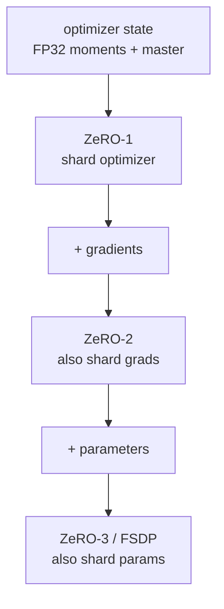
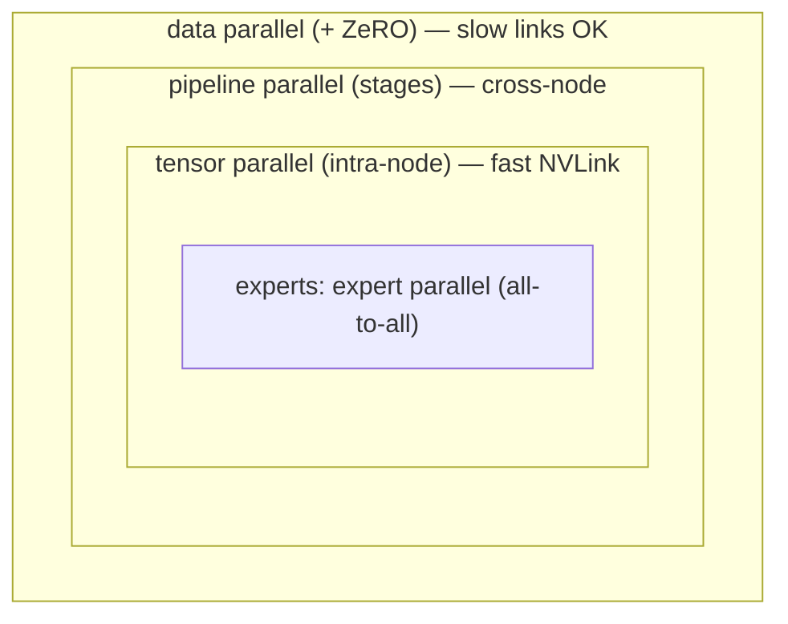

# 分散式訓練

<div class="page-meta">
  <span class="chip"><strong>等級：</strong>中階→高階</span>
  <span class="chip"><strong>先決條件：</strong> <a href="../../foundations/transformer-systems/">roofline</a>、<a href="../gpu-programming/">GPU 型號</a></span>
  <span class="chip"><strong>硬體：</strong> 多 GPU（概念適用於 1 個 GPU）</span>
</div>

前沿模型放不進單一 GPU－無論是它的參數、最佳化器 狀態，還是它的 activation。分散式 training 是一組策略， 把工作切分到多個裝置上，每種策略都以不同的方式用**通訊** 換取**記憶體**。本頁梳理各個並行維度（DP/TP/PP/SP/EP）、 ZeRO 分片以及底層的 collective，並展示它們如何組成 訓練真實模型所需的「N 維並行性」—其中包含 [expert parallelism](../moe/systems-ep.md)，它是 MoE 的核心。

## 你必須知道的 collective

所有並行性都是由少數幾個 collective 通訊原語建構的 （NVIDIA 上的 NCCL，AMD 上的 RCCL — 相同的 API）：

| collective | 它做什麼 | 使用者 |
| --- | --- | --- |
| **all-reduce** | 對各個 rank 的張量求和，每個 rank 都拿到結果 | DP 梯度同步 |
| **all-gather** | 每個 rank 把所有分片收集成完整的張量 | ZeRO、TP |
| **reduce-scatter** | 先求和，再讓每個 rank 各保留一個分片 | ZeRO、TP |
| **all-to-all** | 每個 rank 向其他每個 rank 各發送一個不同的區塊 | **MoE dispatch/combine** |
| **broadcast/P2P send-recv** | 一對多／點對點 | PP 階段切換 |

關鍵恆等式：**all-reduce = reduce-scatter + all-gather**。ZeRO 正是利用這點 來避免實體化完整梯度。

### Ring all-reduce 成本模型

設一條訊息大小為 $M$ 位元組、跨 $N$ 個裝置做 ring all-reduce。ring 演算法分成 reduce-scatter 與 all-gather 兩個階段，每階段各 $N-1$ 步， 每步每個裝置送出／收進 $M/N$ 位元組，因此每個裝置總共 送出／收進 $2\dfrac{N-1}{N}M$ 位元組。其時間約為

$$
T_{\text{all-reduce}} \approx 2(N-1)\,\alpha \;+\; 2\,\frac{N-1}{N}\,\frac{M}{\beta},
$$

其中 $M$ = 訊息位元組數，$N$ = 參與裝置數，$\alpha$ = 每一跳（per-hop）的 延遲，$\beta$ = 每條鏈路的頻寬（位元組／秒）。延遲項隨 $N$ 線性成長，但 頻寬項 $2\frac{N-1}{N}\frac{M}{\beta}\to 2\frac{M}{\beta}$ 在 $N$ 變大時趨於與 $N$ 無關 — 這正是 ring all-reduce（以及建立其上的 DP）能在頻寬上良好擴展的原因。

!!! Example "數值例子：8 卡 all-reduce 的資料量"
    若梯度 bucket 大小 $M=1$ GB、$N=8$，每張 GPU 在 ring all-reduce 中搬移約
    $2\cdot(7/8)\cdot1=1.75$ GB。若鏈路有效頻寬 $200$ GB/s，頻寬時間約 $1.75/200=8.75$ ms，再加上 $14\alpha$ 的延遲項。這說明大 bucket 主要看頻寬，小 bucket 則容易被延遲與 launch overhead 主導。

## Data parallelism (DP) 與 ZeRO

**data parallelism**：在每個 GPU 上複製模型、切分*批次*，並對梯度做 all-reduce，使每份副本更新到一致的權重。實作簡單、通訊量輕， 但每個 GPU 都得儲存**完整**的模型 + 梯度 + 最佳化器狀態 — 撞上記憶體牆。

### DP 的每步通訊量

每一步反向傳播後，梯度 all-reduce 在每個裝置上搬移約

$$
2\,\frac{N-1}{N}\,P\,c \quad\text{位元組／裝置},
$$

其中 $N$ = DP 裝置數，$P$ = 參數數量，$c$ = 每個參數的位元組數 （例如 FP16/BF16 時 $c=2$）。這一項與上面 ring all-reduce 的頻寬項 （取 $M = Pc$）一致。實務上把這個 all-reduce 與反向傳播**重疊** （逐層 bucket）即可大致隱藏其成本。

**ZeRO**(DeepSpeed) /**FSDP**(PyTorch) 把 DP 群組內的冗餘狀態分片， 分為三個階段：

- **ZeRO-1**：分片最佳化器狀態（最大的一塊 — Adam 的 FP32 矩 + master 權重）。
- **ZeRO-2**：再加上分片梯度。
- **ZeRO-3 / FSDP**：再加上分片參數；每層權重在 forward/backward 時即時 all-gather 起來，用完即釋放。

### ZeRO 記憶體模型

以 Adam 的混合精度訓練為例，每個參數的狀態約需 $16$ 位元組：FP16 參數 $2$ + FP16 梯度 $2$ + FP32 的 master 權重／一階動量／二階變異數 $4+4+4 = 12$。未分片時每 GPU 的這部分狀態為 $16P$ 位元組。ZeRO-1/2/3 分別把最佳化器狀態／+梯度／+參數跨 $N$ 個裝置分片，因此在 stage 3 時 每 GPU 狀態降為

$$
\frac{16P}{N} \quad\text{位元組},
$$

其中 $P$ = 參數數量、$N$ = DP（分片）裝置數。代價是額外的 all-gather/reduce-scatter 流量（與計算重疊）。這是在不動模型結構 的前提下，訓練大型 dense 模型的預設做法。

!!! Example "數值例子：70B 模型的 ZeRO 記憶體"
    70B 參數用 Adam mixed precision 時，未分片狀態約 $16P=16\cdot70$B bytes $\approx1.12$ TB/GPU，單卡不可能。若 $N=8$ 做 ZeRO-3/FSDP，狀態降到 $1.12/8\approx140$ GB/GPU；若還有 activation、workspace 與 fragmentation，仍需要 activation checkpointing、TP/PP 或更多 GPU。這就是為什麼 ZeRO 解的是「狀態冗餘」，不是所有記憶體問題。



每往後一個階段就多分片一類狀態，以通訊換取記憶體。

## Tensor parallelism（TP）

跨 GPU 切分每個**matmul**（Megatron-LM）。對 FFN，把上投影按列切、 下投影按行切；每個 GPU 算一個切片，再用一個 all-reduce 合併每層的結果。 對 attention，則按 head 切分。

### TP 的每層通訊量

在 Megatron 式 TP 中，每個 transformer 層在 forward pass 需要 2 個 all-reduce（attention 區塊與 MLP 區塊各一），backward pass 再多 2 個。 每個 all-reduce 作用在大小約

$$
B \cdot s \cdot H \cdot c \quad\text{位元組}
$$

的 activation 上，其中 $b$ = batch 大小、$s$ = 序列長度、$H$ = hidden 維度、 $c$ = 每個元素的位元組數。由於每層、每方向都要對整塊 activation 做 all-reduce，TP 是**頻寬密集**的。

- ✅ 同時降低每 GPU 的參數記憶體**與** activation 記憶體；讓單一裝置 放不下的層也能放下。
- ❌ 通訊量大（*每層內部*都要 all-reduce），因此要透過快速的 NVLink / Infinity Fabric (xGMI) 把它**限制在節點內**。典型 TP 度數 = 每節點的 GPU 數（例如 8）。

## Pipeline parallelism（PP）

**按層**把模型拆成放在不同 GPU 上的階段；activation 沿 階段 → 階段流動（P2P）。天真版本會讓大多數 GPU 閒置（「bubble」）； **microbatch**(GPipe) 與交錯排程（1F1B、Megatron interleaved）藉由 讓多個 microbatch 同時在管線中飛行來縮小 bubble。

### Bubble 比例

設管線有 $p$ 個階段、每步餵入 $m$ 個 microbatch。填滿與排空管線分別 需要 $p-1$ 個 microbatch 的時間，因此閒置時間占比為

$$
\text{bubble} = \frac{p-1}{m + p - 1},
$$

其中 $p$ = 管線階段數、$m$ = microbatch 數。提高 $m$ 即可壓低 bubble （$m \to \infty$ 時 bubble $\to 0$）。

!!! Example "數值例子：要多少 microbatch 才有 10% bubble"
    若 pipeline 有 $p=8$ 個 stage，要讓 $\frac{p-1}{m+p-1}\le0.1$，需
    $7/(m+7)\le0.1$，也就是 $m\ge63$。這代表 PP 需要足夠多 microbatch 才有效；若 batch 太小，bubble 會吞掉大量算力，即使每張 GPU 上的 kernel 都很快。

- ✅ 通訊量低（只在階段邊界傳 activation），可跨節點擴展。
- ❌ 管線 **bubble** 浪費算力；需要足夠多的 microbatch 來攤銷。 DeepSeek 的 **DualPipe** 是一種專為隱藏 MoE all-to-all 而設計的 PP 排程。

## Sequence/context parallelism（SP）

把**序列維度**切到多個 GPU 上，使每個 GPU 只持有一部分 tokens — 對於 activation 與 attention 計算量隨序列長度增長的長上下文至關重要。 變體：Megatron sequence parallelism（把 TP 未涵蓋區域的 LayerNorm/dropout 也分片），以及 ring attention / context parallelism（分片 attention 本身， 沿 ring 傳遞 K/V 區塊）。它攻克的是 [基礎篇](../foundations/attention-efficiency.md) 提到的 activation 記憶體牆與 attention 計算牆。

## Expert parallelism (EP) — MoE 維度

在 [Systems & EP](../moe/systems-ep.md) 中深入介紹：把**experts**分片到 不同 GPU 上；透過 **all-to-all** 把 tokens 路由到持有對應 expert 的 GPU。 EP 的獨特之處在於它使用 all-to-all（而非 all-reduce），且能與其他維度組合。

## 組合它們：N 維並行

真實的 training 堆疊會結合多個維度，並映射到網路拓撲上，讓 通訊最頻繁的 collective 走在最快的鏈路上：



由外而內讀：DP/ZeRO 包住一切（可容忍慢速鏈路）， 其次是跨節點的 PP，再把 TP 限制在節點內的快速 NVLink，最內層是 以 all-to-all 為核心的 expert parallelism。

經驗法則：**TP 留在節點內**（需要最大頻寬），**PP 與 EP 跨節點**， **DP/ZeRO 放在最外層**。長上下文再疊加 SP/CP。你最終拿到的 MFU 很大程度取決於是否做對了映射，以及是否把通訊與計算重疊。

## 一個最小的 DDP 範例

最簡單的分散式 training，用來建立直覺：

```python
import torch, torch.distributed as dist
from torch.nn.parallel import DistributedDataParallel as DDP

dist.init_process_group("nccl")                  # "rccl" path on ROCm, same API
torch.cuda.set_device(local_rank)
model = DDP(model.cuda(), device_ids=[local_rank])
for x, y in sharded_loader:                      # each rank gets a batch slice
    loss = model(x.cuda(), y.cuda())
    loss.backward()                              # DDP all-reduces grads here
    opt.step(); opt.zero_grad()
```

對大型模型，把 `DDP` 換成 **FSDP**(ZeRO-3)，再透過 Megatron-LM / DeepSpeed 在其上疊加 TP/PP/EP。

## 要點

- 所有並行性都由 **collective** 建構：DP 用 all-reduce，ZeRO/TP 用 all-gather + reduce-scatter，**MoE 用 all-to-all**，PP 用 P2P。
- **ZeRO/FSDP** 分片 optimizer/grad/param 狀態以打破 DP 記憶體牆； **TP** 切分 matmul（節點內、通訊密集）；**PP** 按層切分（跨節點、有 bubble）； **SP/CP** 切分長上下文的序列；**EP** 切分 experts。
- 真實的 training 把這些組合成 **N 維並行性**，做映射讓通訊最頻繁的 collective 走最快的鏈路，並把通訊重疊在計算之後。

## 練習

!!! Tip "解決方案"
    參考解答位於 [解答頁](../solutions/performance.md) 上。請先嘗試每個練習，再展開解答。

1. 證明 all-reduce = reduce-scatter + all-gather，並用它說明 ZeRO-2 的 通訊量與普通 DDP 相比如何。
2. 對一個用 Adam、以 BF16 訓練的 70B 模型，計算在 8 個 GPU 上 DDP 與 ZeRO-1/2/3 各自的每 GPU 記憶體（提示：用 $16P/N$ 的 ZeRO 記憶體模型）。
3. 用 $\text{bubble} = \frac{p-1}{m+p-1}$ 估算 $p$ 階段、$m$ 個 microbatch 的 管線 bubble 比例；要多少個 microbatch 才能把它壓到 10% 以下？
4. 為什麼 TP 該留在節點內，而 EP 可以跨節點？請用每層通訊量 與鏈路頻寬來論證。

## 參考文獻

[1] M. Shoeybi *et al.*, "Megatron-LM: Training multi-billion parameter language models using model parallelism," *arXiv:1909.08053*, 2019.

[2] D. Narayanan *et al.*, "Efficient large-scale language model training on GPU clusters using Megatron-LM," in *Proc. SC*, 2021.

[3] S. Rajbhandari *et al.*, "ZeRO: Memory optimizations toward training trillion parameter models," in *Proc. SC*, 2020.

[4] Y. Zhao *et al.*, "PyTorch FSDP: Experiences on scaling fully sharded data parallel," *Proc. VLDB Endow.*, vol. 16, no. 12, pp. 3848-3860, 2023.

[5] Y. Huang *et al.*, "GPipe: Efficient training of giant neural networks using pipeline parallelism," in *Proc. NeurIPS*, 2019.

[6] H. Liu, M. Zaharia, and P. Abbeel, "Ring attention with blockwise transformers for near-infinite context," *arXiv:2310.01889*, 2023.

[7] DeepSeek-AI, "DeepSeek-V3 technical report," *arXiv:2412.19437*, 2024.
