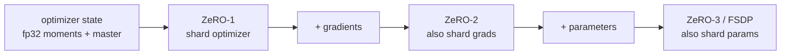
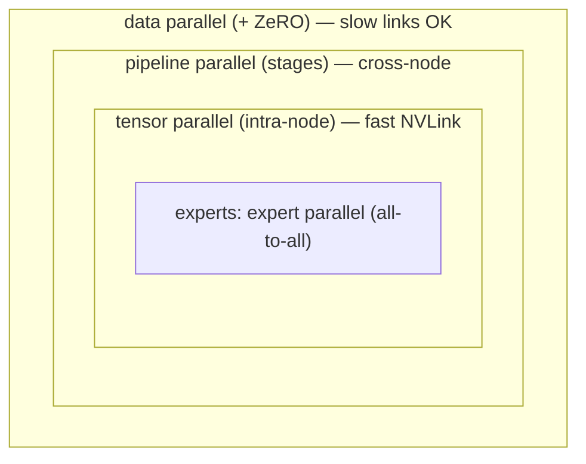

# Distributed training

<div class="page-meta">
  <span class="chip"><strong>Level:</strong> intermediate → advanced</span>
  <span class="chip"><strong>Prereqs:</strong> <a href="../../foundations/transformer-systems/">roofline</a>, <a href="../gpu-programming/">GPU model</a></span>
  <span class="chip"><strong>Hardware:</strong> multi-GPU (concepts apply on 1 GPU)</span>
</div>

A frontier model doesn't fit on one GPU — not its parameters, not its optimizer
state, not its activations. Distributed training is the set of strategies for
splitting the work across devices, each trading **memory** for **communication**
in a different way. This page maps the parallelism dimensions (DP/TP/PP/SP/EP),
ZeRO sharding, and the collectives underneath, and shows how they compose into the
"N-D parallelism" that trains real models — including the
[expert parallelism](../moe/systems-ep.md) at the heart of MoE.

## The collectives you must know

All parallelism is built from a handful of collective communication primitives
(NCCL on NVIDIA, RCCL on AMD — same API):

| Collective | What it does | Used by |
|---|---|---|
| **All-reduce** | sum a tensor across ranks, everyone gets the result | DP gradient sync |
| **All-gather** | each rank collects all shards into the full tensor | ZeRO, TP |
| **Reduce-scatter** | sum, then each rank keeps one shard | ZeRO, TP |
| **All-to-all** | each rank sends a distinct chunk to every other rank | **MoE dispatch/combine** |
| **Broadcast / P2P send-recv** | one-to-all / point-to-point | PP stage handoff |

A key identity: **all-reduce = reduce-scatter + all-gather**. ZeRO exploits this
to avoid ever materializing full gradients. Cost intuition (ring algorithm):
all-reduce of $S$ bytes moves $\approx 2S(G{-}1)/G$ bytes per rank — roughly
independent of $G$, which is why DP scales well on bandwidth.

## Data parallelism (DP) and ZeRO

**Data parallelism**: replicate the model on every GPU, split the *batch*, and
all-reduce gradients so every replica updates identically. Simple and
communication-light, but every GPU stores the **full** model + gradients +
optimizer state — the memory wall.

**ZeRO** (DeepSpeed) / **FSDP** (PyTorch) shard that redundant state across the DP
group in three stages:

- **ZeRO-1**: shard optimizer state (the biggest chunk — Adam's fp32 moments + master weights).
- **ZeRO-2**: also shard gradients.
- **ZeRO-3 / FSDP**: also shard parameters; each layer's weights are
  all-gathered just-in-time for its forward/backward, then freed.

ZeRO-3 cuts per-GPU memory ~$G$× at the cost of extra all-gather/reduce-scatter
traffic (which overlaps with compute). It's the default way to train large dense
models without model-surgery.



Each stage shards progressively more, trading communication for memory.

## Tensor parallelism (TP)

Split individual **matmuls** across GPUs (Megatron-LM). For an FFN, shard the
up-projection by columns and the down-projection by rows; each GPU computes a
slice, and one all-reduce combines the result per layer. For attention, shard by
heads.

- ✅ Reduces both parameter memory **and** activation memory per GPU; enables
  layers too big for one device.
- ❌ Heavy communication (an all-reduce *inside every layer*), so it's kept
  **intra-node** over fast NVLink/Infinity Fabric. Typical TP degree = GPUs per
  node (e.g. 8).

## Pipeline parallelism (PP)

Split the model **by layers** into stages on different GPUs; activations flow
stage→stage (P2P). The naive version idles most GPUs (the "bubble"); **micro-
batching** (GPipe) and interleaved schedules (1F1B, Megatron interleaved) shrink
the bubble by keeping multiple micro-batches in flight.

- ✅ Low communication (only activations at stage boundaries), scales across nodes.
- ❌ Pipeline **bubble** wastes compute; needs enough micro-batches to amortize.
  DeepSeek's **DualPipe** is a PP schedule designed to also hide MoE all-to-all.

## Sequence / context parallelism (SP)

Split the **sequence dimension** across GPUs so each holds part of the tokens —
essential for long context, where activations and the attention computation grow
with $N$. Variants: Megatron sequence parallelism (shards the LayerNorm/dropout
regions TP misses), Ring Attention / context parallelism (shards attention itself,
passing K/V blocks around a ring). Attacks the activation-memory and attention-
compute walls from [Part I](../foundations/attention-efficiency.md).

## Expert parallelism (EP) — the MoE dimension

Covered in depth in [Systems & EP](../moe/systems-ep.md): shard **experts** across
GPUs; route tokens to their expert's GPU via **all-to-all**. EP is unique in using
all-to-all (not all-reduce), and it composes with the others.

## Composing them: N-D parallelism

Real training stacks combine dimensions, mapped onto the network topology so the
chattiest collectives ride the fastest links:



Read outermost-to-innermost: DP/ZeRO wraps everything (tolerates slow links),
then PP across nodes, then TP confined to a node's fast NVLink, with expert
parallelism's all-to-all at the core.

Rules of thumb: **TP intra-node** (needs the most bandwidth), **PP and EP across
nodes**, **DP/ZeRO on the outside**. SP/CP added for long context. The MFU you
get depends heavily on getting this mapping right and overlapping communication
with computation.

## A minimal DDP example

The simplest distributed training, for grounding:

```python
import torch, torch.distributed as dist
from torch.nn.parallel import DistributedDataParallel as DDP

dist.init_process_group("nccl")                  # "rccl" path on ROCm, same API
torch.cuda.set_device(local_rank)
model = DDP(model.cuda(), device_ids=[local_rank])
for x, y in sharded_loader:                      # each rank gets a batch slice
    loss = model(x.cuda(), y.cuda())
    loss.backward()                              # DDP all-reduces grads here
    opt.step(); opt.zero_grad()
```

For large models you'd swap `DDP` for **FSDP** (ZeRO-3) and layer on TP/PP/EP via
Megatron-LM / DeepSpeed.

## Key takeaways

- All parallelism is built from **collectives**; DP uses all-reduce, ZeRO/TP use
  all-gather + reduce-scatter, **MoE uses all-to-all**, PP uses P2P.
- **ZeRO/FSDP** shards optimizer/grad/param state to break the DP memory wall;
  **TP** splits matmuls (intra-node, comm-heavy); **PP** splits layers (cross-node,
  bubble); **SP/CP** splits the sequence for long context; **EP** splits experts.
- Real training composes these into **N-D parallelism**, mapped so the chattiest
  collectives use the fastest links, with comm overlapped behind compute.

## Exercises

!!! tip "Solutions"
    Worked answers are on the [Part solutions page](../solutions/performance.md). Try each exercise before expanding.

1. Show all-reduce = reduce-scatter + all-gather and use it to explain ZeRO-2's
   communication volume vs plain DDP.
2. For a 70B model in bf16 with Adam, compute per-GPU memory under DDP vs ZeRO-1/2/3
   on 8 GPUs.
3. Estimate the pipeline bubble fraction for $P$ stages and $m$ micro-batches;
   how many micro-batches to keep it under 10%?
4. Why is TP kept intra-node while EP can cross nodes? Relate to per-layer comm
   volume and link bandwidth.

## References

- Shoeybi et al. *Megatron-LM.* 2019; Narayanan et al. *Efficient Large-Scale LM Training on GPU Clusters.* 2021.
- Rajbhandari et al. *ZeRO.* 2020; Zhao et al. *PyTorch FSDP.* 2023.
- Huang et al. *GPipe.* 2019.
- Liu et al. *Ring Attention.* 2023; Korthikanti et al. *Sequence Parallelism / activation recomputation.* 2022.
- DeepSeek-AI. *DeepSeek-V3 / DualPipe.* 2024.
