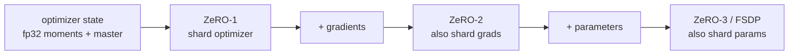
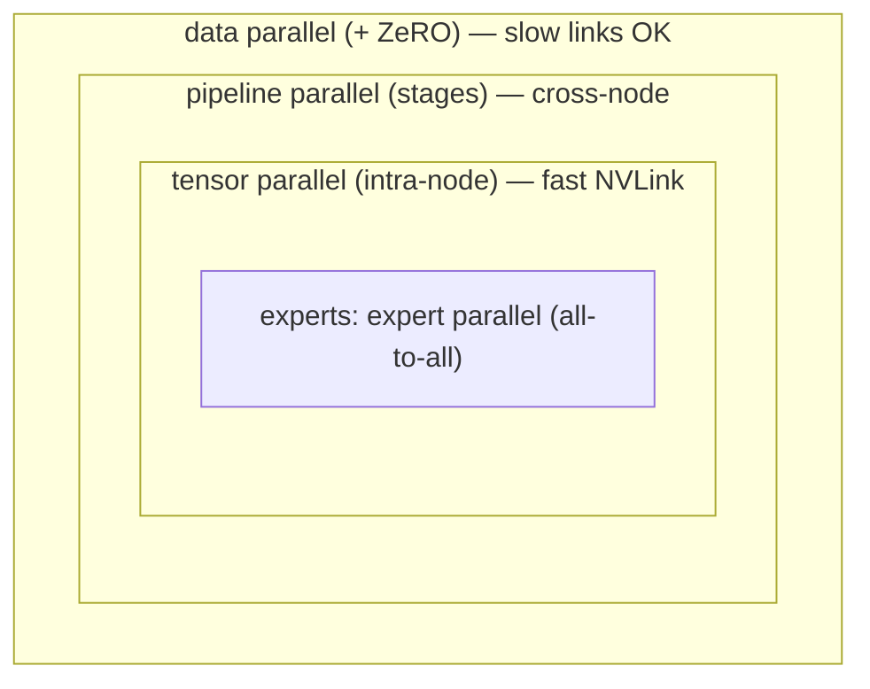

# 分散式 training

<div class="page-meta">
  <span class="chip"><strong>等級：</strong>中階→高階</span>
  <span class="chip"><strong>先決條件：</strong> <a href="../../foundations/transformer-systems/">roofline</a>、<a href="../gpu-programming/">GPU 型號</a></span>
  <span class="chip"><strong>硬體：</strong> 多 GPU（概念適用於 1 個 GPU）</span>
</div>

前沿模型不適合單一 GPU－不適合它的參數，也不適合它的最佳化器
狀態，而不是其啟動。分散式 training 是一組策略
跨裝置分配工作，每個裝置都以**記憶體**換取**通訊**
以不同的方式。本頁映射平行度尺寸（DP/TP/PP/SP/EP），
ZeRO 分片以及下面的集合，並展示了它們如何組成
訓練真實模型的「N 維並行性」—包括
[expert parallelism](../moe/systems-ep.md) 是 MoE 的核心。

## 你必須知道的集體

所有並行性都是由少數集體通信原語建構的
（NVIDIA 上的 NCCL，AMD 上的 RCCL — 相同的 API）：

| 集體                  | 它有什麼作用                             | 使用者            |
| --------------------- | ---------------------------------------- | ----------------- |
| **all-reduce**        | 對各個等級的張量求和，每個人都會得到結果 | DP 梯度同步       |
| **全員齊聚**          | 每個等級將所有碎片收集到完整的張量中     | 零，TP            |
| **減少分散**          | 總和，則每個等級保留一個分片             | 零，TP            |
| **all-to-all**        | 每個等級向每個其他等級發送一個不同的區塊 | **MoE 調度/合併** |
| **廣播/P2P 發送接收** | 一對多/點對點                            | PP 階段切換       |

關鍵標識：**all-reduce = 減少分散 + 全部聚集**。 ZeRO 利用了這一點
以避免實現完全梯度。成本直覺（環形演算法）：
$S$ 位元組中的 all-reduce 每個等級移動 $\approx 2S(G{-}1)/G$ 位元組 — 大致
獨立於 $G$，這就是 DP 在頻寬上具有良好擴展性的原因。

## 資料並行性 (DP) 和 ZeRO

**資料並行性**：在每個 GPU 上複製模型，分割*批次*，並且
all-reduce 漸變，因此每個副本更新相同。簡單且
通訊輕量級，但每個 GPU 都儲存**完整**模型 + 梯度 +
優化器狀態——記憶體牆。

**ZeRO**(DeepSpeed) /**FSDP**(PyTorch) 跨 DP 的冗餘狀態進行分片
分三個階段分組：

-**ZeRO-1**：分片優化器狀態（最大的區塊 - Adam 的 fp32 時刻 + 主權重）。 -**ZeRO-2**：也是分片梯度。 -**ZeRO-3 / FSDP**：也是分片參數；每層的權重是
所有人都及時聚集起來，進行前進/後退，然後釋放。

ZeRO-3 以額外的全聚集/減少分散為代價削減了每 GPU 記憶體 ~$G$×
流量（與計算重疊）。這是訓練大密集的預設方式
沒有模型手術的模型。



每個階段的碎片逐漸增多，以交流換取記憶。

## 張量並行性（TP）

跨 GPU (Megatron-LM) 分割各**matmuls**。對於 FFN，將
按列向上投影並按行向下投影；每個 GPU 計算一個
切片，一個 all-reduce 組合每層的結果。對於 attention，分片為
頭。

- ✅ 減少每個 GPU 的參數記憶體**和**啟動記憶體；使
  以一台設備來說層太大。
- ❌ 大量通訊（all-reduce _每層內部_），因此保留
  **節點內**透過快速 NVLink/Infinity Fabric。典型 TP 程度 = 每 GPU 數
  節點（例如 8）。

## 管道並行性（PP）

**按層**將模型拆分為不同 GPU 上的階段；啟動流程
階段 → 階段（P2P）。天真的版本會閒置大多數 GPU（“泡沫”）；**微-
批次**(GPipe) 和交錯時間表（1F1B、威震天交錯）收縮
透過保持多個微批次的飛行來消除氣泡。

- ✅ 低通訊（僅在階段邊界啟動），跨節點擴展。
- ❌ 管道**泡沫**浪費計算；需要足夠的微批次來攤銷。
  DeepSeek 的**DualPipe**是一個 PP 時間表，旨在隱藏 MoE all-to-all。

## 序列/上下文並行性（SP）

將**序列維度**分割到 GPU 上，以便每個 GPU 都包含 tokens 的一部份 —
對於激活和 attention 計算增長的長上下文至關重要
與 $N$。變體：Megatron 序列並行性（將 LayerNorm/dropout 分片）
區域 TP 未命中），環 attention / 上下文並行性（分片 attention 本身，
繞環傳遞 K/V 塊）。攻擊激活內存和 attention-
來自 [Part I](../foundations/attention-efficiency.md) 的計算牆。

## expert 平行度 (EP) — MoE 維度

[Systems & EP](../moe/systems-ep.md) 中深入介紹：跨分片**experts**
GPU；透過**all-to-all**將 tokens 路由到 expert 的 GPU。 EP 的獨特運用
all-to-all（不是 all-reduce），並且它與其他組合。

## 組合它們：N 維並行

真實的 training 堆疊結合了維度，映射到網路拓撲上，以便
最健談的集體乘坐最快的連結：



從最外層到最內層讀取：DP/ZeRO 包裝所有內容（容忍慢速連結），
然後跨節點進行 PP，然後將 TP 限制在節點的快速 NVLink，使用 expert
並行性的核心是 all-to-all。

經驗法則：**TP 節點內**（需要最大頻寬），**跨節點 PP 和 EP
節點**，**DP/ZeRO 在外部**。為長上下文添加了 SP/CP。 MFU 你
get 在很大程度上取決於正確的映射和重疊通信
與計算。

## 一個最小的 DDP 範例

最簡單的分佈式 training，用於接地：

```python
import torch, torch.distributed as dist
from torch.nn.parallel import DistributedDataParallel as DDP

dist.init_process_group("nccl")                  # "rccl" path on ROCm, same API
torch.cuda.set_device(local_rank)
model = DDP(model.cuda(), device_ids=[local_rank])
for x, y in sharded_loader:                      # each rank gets a batch slice
    loss = model(x.cuda(), y.cuda())
    loss.backward()                              # DDP all-reduces grads here
    opt.step(); opt.zero_grad()
```

對於大型型號，你可以將 `DDP` 替換為**FSDP**(ZeRO-3)，並透過以下方式在 TP/PP/EP 上分層
威震天-LM / DeepSpeed。

## 要點

- 所有並行性均由**集體**建構；DP 使用 all-reduce，ZeRO/TP 使用
  all-gather+reduce-scatter，**MoE 使用 all-to-all**，PP 使用 P2P。 -**ZeRO/FSDP**分片優化器/grad/param 狀態以打破 DP 記憶體牆；
  **TP**分割 matmuls（節點內，comm-heavy）；**PP**分層（跨節點，
  氣泡）；**SP/CP**分割長上下文的序列；**EP**拆分 experts。
- 真實的 training 將這些組合成**N 維並行性**，映射為最健談的
  集體使用最快的鏈接，通信重疊在計算後面。

## 練習

!!! tip "解決方案"
    參考解答位於 [解答頁](../solutions/performance.md) 上。請先嘗試每個練習，再展開解答。

1. 顯示 all-reduce = reduce-scatter + all-gather 並用它來解釋 ZeRO-2 的
   通訊量與普通 DDP 的比較。
2. 對於使用 Adam 的 bf16 中的 70B 模型，在 DDP 與 ZeRO-1/2/3 下計算每個 GPU 內存
   在 8 個 GPU 上。
3. 估算 $P$ 級和 $m$ 微批次的管道氣泡分數；
   多少微批次才能保持在 10% 以下？
4. 為什麼 TP 可以保留在節點內，而 EP 可以跨節點？與每層通訊相關
   容量和鏈路頻寬。

## 參考文獻

- Shoeybi 等人。 _威震天-LM。 _ 2019；納拉亞南等人。 _GPU 叢集上的高效大規模 LM training。 _ 2021。
- 拉傑班達裡等人*ZeRO。 * 2020；趙等人。 _PyTorch FSDP。 _ 2023。
- 黃等人*GPipe。 * 2019。
- 劉等人*戒指 attention。 * 2023；科蒂坎蒂等人。 _序列並行/激活重新計算。 _ 2022。
- DeepSeek-AI。 _DeepSeek-V3 / DualPipe。 _ 2024 年。
