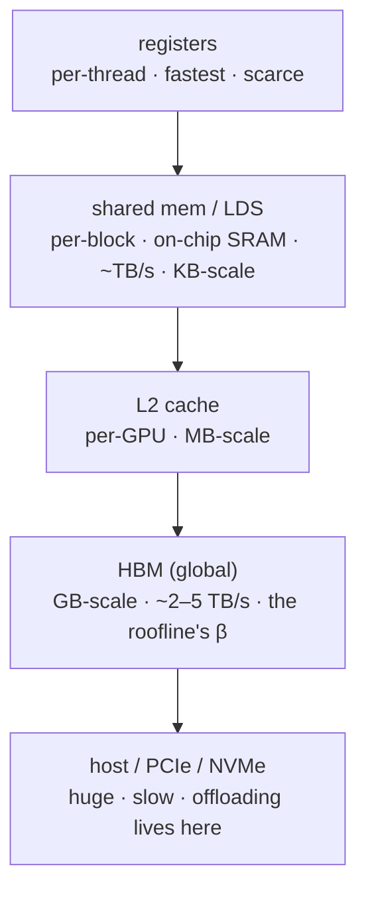

# GPU 程式設計模型與記憶體層次結構

<div class="page-meta">
  <span class="chip"><strong>等級：</strong>初級→中階</span>
  <span class="chip"><strong>先決條件：</strong> <a href="../../foundations/transformer-systems/">roofline</a></span>
  <span class="chip"><strong>硬體：</strong> 無（GPU 有助於後面的路線）</span>
</div>

要快速寫出 kernels，你需要一個關於 GPU 如何執行程式碼、 資料位於何處的正確思維模型。本頁從記憶體層次結構由下往上建構這個模型， 並**同時並列 CUDA 與 ROCm/HIP 術語**，讓 [Triton](triton-track.md) 與 [CUDA/HIP](cuda-hip-track.md) 兩條路線都有穩固的基礎。

### Roofline 速覽

整頁的核心張力都來自 roofline 模型。對一個 kernel，定義其 **arithmetic intensity（算術強度）**

$$ I = \frac{W}{Q} $$

其中 $W$ 為執行的浮點運算數（FLOP），$Q$ 為通過瓶頸記憶體（通常是 HBM） 所搬移的位元組數（bytes）。可達到的效能為

$$ P = \min(\pi,\ \beta I) $$

其中 $\pi$ 為峰值算力（FLOP/s），$\beta$ 為峰值頻寬（B/s）。兩條線交會於 **ridge point（脊點）**

$$ I^\ast = \frac{\pi}{\beta} $$

當 $I < I^\ast$ 時 kernel 為 **memory-bound（受記憶體限制）**，效能由 $\beta I$ 決定； 當 $I > I^\ast$ 時為 **compute-bound（受算力限制）**，效能逼近 $\pi$。本頁所有手法 （合併存取、重用 SMEM、提升佔用率）的最終目的，都是把 kernel 推離 memory-bound 區域。

## 執行層次

GPU 將 **kernel** 以執行緒（thread）網格的形式執行，並以層次結構組織：

| 層級 | NVIDIA 術語 | AMD 術語 | 它是什麼 |
| --- | --- | --- | --- |
| 單一 lane | thread（執行緒） | work-item | 一條純量執行流 |
| 鎖步組 | **warp (32)** | **wavefront (64)** | 一起執行的 lanes (SIMT) |
| 協作群組 | thread block | workgroup | 共享快速片上記憶體，可同步 |
| 整體啟動 | grid（網格） | grid（網格） | 一個 kernel 的所有 block |
| 硬體單元 | SM（streaming multiprocessor） | CU（compute unit） | 同時駐留許多 warp/wavefront |

**SIMT** 模型：在一個 warp/wavefront 內，所有 lane 對*不同資料*執行*相同*的指令。 當 lane 走向不一致的分支（**divergence，分支發散**）時，硬體會序列化兩條路徑 —— 這是主要的效能陷阱。一個 warp 內若有 $a$ 條 lane 走 if、其餘走 else，硬體會以 mask 依序執行兩側，成本約等於兩條路徑長度之和：

$$ T_{\text{branch}} \approx T_{\text{if}} + T_{\text{else}} $$

只有當整個 warp/wavefront 一致地走同一側時才不付出這個代價。最重要的一項 NVIDIA↔AMD 差異是：**warp = 32 個 lane（NVIDIA），wavefront = 64 個 lane（AMD）**。 凡是寫死 32（例如硬編碼的 shuffle reduction）的程式碼在 AMD 上都會出錯； 請一律查詢 `warpSize`。

## 記憶體層次結構

Roofline 的 $\beta$ 就誕生於此。latency 與頻寬在各層級之間相差數個數量級：



| 空間 | NVIDIA | AMD | 範圍 | 粗略角色 |
| --- | --- | --- | --- | --- |
| registers | registers | registers | thread | 運算元（operands） |
| 片上 scratchpad | **shared memory（SMEM）** | **LDS** | block/workgroup | 分段 tile、reduction |
| cache | L1/L2 | L1/L2 | 不一 | 自動重用 |
| 裝置 DRAM | global / HBM | global / HBM | grid | 大型張量 |

**GPU 效能的黃金法則**：把資料從 HBM 搬進 registers/SMEM **一次**， 盡可能在片上完成所有運算，再寫回去。這正是 [roofline](../foundations/transformer-systems.md) 中「提高 arithmetic intensity」的具體作法 —— 把 $Q$（搬移的 bytes）壓小、$W$（FLOP）做滿，從而拉高 $I = W/Q$， 讓 kernel 越過脊點 $I^\ast$。FlashAttention、grouped GEMM 以及每一個融合 kernel 都是這條法則的實例。

## 合併（coalescing）與 bank conflict

兩種存取模式主導著 kernel 效能：

- **合併的 global 存取（coalesced access）**：當一個 warp/wavefront 的所有 lane 命中一段連續且對齊的記憶體區段（例如 128 B）時，硬體會把它們合併成*一筆*寬交易。 反之，stride-$k$（跨步）或分散（scatter/gather）的存取會把單筆交易展開成最多 $\text{lanes}$ 筆獨立交易，使有效頻寬下降為原本的 $1/\text{lanes}$：

  $$ \beta_{\text{eff}} \approx \frac{\beta}{\min(k,\ \text{lanes})} $$

  其中 lanes 為 warp/wavefront 寬度（32 或 64）。MoE 的 gather 正是這類風險所在 （[kernels](../moe/kernels.md)） —— 它直接侵蝕 roofline 中的 $\beta$。

- **SMEM/LDS 的 bank conflict**：共享記憶體被切成 $B = 32$ 個 bank，相鄰的 4-byte 字輪流落在不同 bank（bank index $= (\text{address}/4) \bmod 32$）。若一個 warp 內有 $c$ 條 lane 同時存取*同一個 bank 內的不同位址*，該存取會被序列化為 $c$ 路（$c\times$ latency）：

  $$ T_{\text{access}} \approx c \cdot T_{\text{bank}} $$

  無 conflict（$c = 1$）的前提是所有 lane 映射到相異的 bank；對 tile 做寬度 padding （例如把列寬從 32 補到 33）是消除 conflict 的常用手法。

## 佔用率（occupancy）

**佔用率**定義為每個 SM 上實際駐留的 warp 數與該 SM 可容納的最大 warp 數之比：

$$ \text{occupancy} = \frac{\text{active warps per SM}}{\text{max warps per SM}} $$

可駐留的 warp 數由最稀缺的資源決定 —— 取以下三項的最小值：

$$ \text{warps} \le \min\!\left(\frac{\text{regs/SM}}{r\cdot 32},\ \frac{\text{smem/SM}}{\text{smem/block}}\cdot \frac{\text{warps}}{\text{block}},\ \text{HW limit}\right) $$

其中 $r$ 為每個 thread 使用的 registers 數（故每 warp 需要 $r\cdot 32$ 個 register）； 第一項是 register 上限，第二項是 SMEM/block 換算回 warp 的上限，第三項是硬體的 固定 warp 數上限。

**為何需要佔用率？** 為了隱藏記憶體 latency。以 Little's law 的形式來看：若一筆 記憶體運算的 latency 為 $L$ 個 cycle，而每個 warp 平均每 $t_i$ 個 cycle 才發出一筆 記憶體運算，則要完全遮蔽 $L$ 需要約

$$ N_{\text{warps}} \approx \frac{L}{t_i} $$

條 in-flight 的 warp 持續供給工作。warp 數不足時，latency 就會*暴露*（exposed latency），SM 閒置等待 HBM。

但**最大佔用率並不總是最快**：佔用率只在「你需要更多 warp 才能遮蔽 latency」時 才有幫助。若一個 kernel 每個 thread 刻意使用大量 registers/SMEM（例如一個大型 matmul tile），它可能在*較低*佔用率下反而更快，因為每條 thread 做了更多工作、 所需的 in-flight warp 本來就少。佔用率是手段（latency 隱藏），不是目標（throughput）。

!!! Note "改變調校方式的 AMD 細節"
    CDNA 的佔用率以 **CU** 為單位衡量，受 **LDS** 與 **VGPR** 限制；64 寬的 wavefront 意味著 256-thread 的 block 只有 4 個 wavefront（相對於 NVIDIA 上的 8 個 warp） —— 因此相同的 block 大小會對應到不同的佔用率與不同的理想 tile 尺寸。矩陣運算映射到 **MFMA** 指令（對應 NVIDIA Tensor Core 的 `mma`）。請改用 **rocprof/Omniperf** 來做 profiling。

## 兩種方言的 kernel 啟動

=== "CUDA"

    ```cpp
    __global__ void add(const float* a, const float* b, float* c, int n) {
        int i = blockIdx.x * blockDim.x + threadIdx.x;
        if (i < n) c[i] = a[i] + b[i];
    }
    add<<<(n + 255) / 256, 256>>>(a, b, c, n);   // grid, block
    ```

=== "ROCm/HIP"

    ```cpp
    #include <hip/hip_runtime.h>
    __global__ void add(const float* a, const float* b, float* c, int n) {
        int i = blockIdx.x * blockDim.x + threadIdx.x;   // identical body
        if (i < n) c[i] = a[i] + b[i];
    }
    hipLaunchKernelGGL(add, dim3((n+255)/256), dim3(256), 0, 0, a, b, c, n);
    ```

Kernel 本體完全相同；HIP 是疊在 CUDA 概念之上的一層薄可移植層。真正的 *效能*工作 —— Tile 尺寸、wavefront 感知的 reduction、LDS 與 SMEM 的容量調校、 MFMA 與 Tensor Core —— 才是你的專長所在。這正是 [CUDA/HIP track](cuda-hip-track.md) 的主題。不過對大多數 kernels 而言， [Triton](triton-track.md) 讓你可以跳過這些細節、仍然獲得接近峰值且可移植的效能 —— 建議從那裡開始。

## 要點

- GPU 在 **SIMT** 模型下，於 SM/CU 上以鎖步方式執行 thread 網格，單位是 **warp（32，NVIDIA）/ wavefront（64，AMD）**；分支發散會被序列化。
- **記憶體層次結構**（registers → SMEM/LDS → L2 → HBM → host）橫跨數個數量級； 黃金法則是**載入一次、最大化重用** —— 也就是提高 arithmetic intensity $I = W/Q$， 把 kernel 推過脊點 $I^\ast = \pi/\beta$。
- 對 global 存取做**合併（coalesce）**、**避免 SMEM/LDS 的 bank conflict**，並把 **佔用率**當作 latency 隱藏的手段而非目的。
- CUDA 與 HIP 共享概念與原始碼；AMD 的差異在於 wavefront 寬度、LDS、MFMA、 每 CU 的佔用率與工具鏈 —— 請據此調整。

## 練習

!!! Tip "解決方案"
    參考解答位於 [解答頁](../solutions/performance.md) 上。請先嘗試每個練習，再展開解答。

1. 為什麼一個為 32 條 lane 寫死的 warp/wavefront reduction 在 CDNA 上會給出 錯誤結果？把它改寫成使用 `warpSize`。
2. 對一個每 thread 使用 64 個 registers、每 block 使用 48 KB SMEM 的 kernel， 在一個擁有 64K registers 與 100 KB SMEM 的 SM 上，用佔用率公式估算限制因子 （register 上限與 SMEM 上限各自允許幾個 warp？）。
3. 寫出一個對 row-major 張量為合併、但對其轉置卻不合併的記憶體存取模式； 把它連結到 MoE 的 gather。
4. 解釋在什麼情況下*降低*佔用率反而能提升 throughput（提示：register 用量很重的 matmul tile）。

## 參考文獻

[1] NVIDIA, "CUDA C++ programming guide," Documentation, 2024.

[2] AMD, "ROCm HIP programming guide," Documentation, 2024.

[3] AMD, "AMD CDNA3 instruction set architecture," Reference Manual, 2023.

[4] V. Volkov, "Better performance at lower occupancy," in *Proc. GPU Technology Conf.*, 2010.

[5] D. B. Kirk, W. W. Hwu, and I. El Hajj, *Programming Massively Parallel Processors*, 4th ed. Cambridge, MA, USA: Morgan Kaufmann, 2022.
