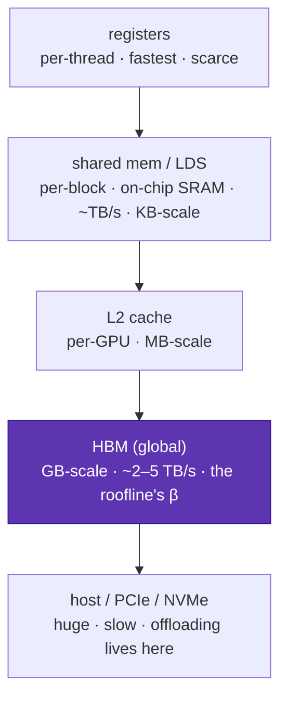

# GPU programming model & memory hierarchy

<div class="page-meta">
  <span class="chip"><strong>Level:</strong> beginner → intermediate</span>
  <span class="chip"><strong>Prereqs:</strong> <a href="../../foundations/transformer-systems/">roofline</a></span>
  <span class="chip"><strong>Hardware:</strong> none (a GPU helps for the later tracks)</span>
</div>

To write fast kernels you need a correct mental model of how a GPU executes code
and where data lives. This page builds that model from the memory hierarchy up,
in **CUDA and ROCm/HIP terms together**, so the [Triton](triton-track.md) and
[CUDA/HIP](cuda-hip-track.md) tracks have firm ground.

## The execution hierarchy

A GPU runs a **kernel** as a grid of threads, organized hierarchically:

| Level | NVIDIA term | AMD term | What it is |
|---|---|---|---|
| Single lane | thread | work-item | one scalar execution stream |
| Lock-step group | **warp (32)** | **wavefront (64)** | threads that execute together (SIMT) |
| Cooperating group | thread block | workgroup | shares fast on-chip memory, can sync |
| Whole launch | grid | grid | all blocks for one kernel |
| Hardware unit | SM (streaming multiprocessor) | CU (compute unit) | runs many warps/wavefronts concurrently |

The **SIMT** model: within a warp/wavefront, all lanes execute the *same*
instruction on different data. A branch where lanes disagree (**divergence**)
serializes the two paths — a major performance pitfall. The single most important
NVIDIA↔AMD difference: **warp = 32, wavefront = 64**. Code that assumes 32 (e.g.
a hardcoded shuffle reduction) is wrong on AMD; always use `warpSize`.

## The memory hierarchy

This is where the roofline lives. Latency and bandwidth differ by orders of
magnitude across levels:



| Space | NVIDIA | AMD | Scope | Rough role |
|---|---|---|---|---|
| Registers | registers | registers | thread | operands |
| On-chip scratch | **shared memory (SMEM)** | **LDS** | block/workgroup | staging tiles, reductions |
| Cache | L1/L2 | L1/L2 | varies | automatic reuse |
| Device DRAM | global / HBM | global / HBM | grid | the big tensors |

**The golden rule of GPU performance**: move data from HBM into registers/SMEM
**once**, do as much work on it as possible, then write back. This is literally
"raise arithmetic intensity" from the [roofline](../foundations/transformer-systems.md) —
FlashAttention, grouped GEMM, and every fused kernel are instances of it.

## Coalescing and bank conflicts

Two access patterns dominate kernel performance:

- **Coalesced global access**: consecutive lanes in a warp should read
  consecutive addresses, so the hardware merges them into a few wide memory
  transactions. Strided/scattered access wastes bandwidth (the MoE gather is
  exactly this risk — [kernels](../moe/kernels.md)).
- **Bank conflicts in SMEM/LDS**: shared memory is split into banks; if multiple
  lanes hit the same bank, accesses serialize. Pad tile widths to avoid it.

## Occupancy

**Occupancy** = how many warps/wavefronts are resident per SM/CU, bounded by the
scarcest resource: registers per thread, SMEM/LDS per block, or block-count
limits. More resident warps → more latency hiding (while one warp waits on HBM,
another computes). But maximum occupancy isn't always fastest — a kernel that
uses lots of registers/SMEM per thread (e.g. a big matmul tile) may run faster at
*lower* occupancy because each thread does more work. Occupancy is a means
(latency hiding), not the goal (throughput).

!!! note "AMD specifics that change tuning"
    Occupancy on CDNA is measured per **CU** with **LDS** and **VGPR** limits,
    and the 64-wide wavefront means a 256-thread block is 4 wavefronts (vs 8
    warps on NVIDIA) — so the same block size implies different occupancy and
    different ideal tile sizes. Matrix math maps to **MFMA** instructions
    (vs NVIDIA Tensor Core `mma`). Profile with **rocprof/Omniperf** rather than
    Nsight.

## The launch, in both dialects

=== "CUDA"

    ```cpp
    __global__ void add(const float* a, const float* b, float* c, int n) {
        int i = blockIdx.x * blockDim.x + threadIdx.x;
        if (i < n) c[i] = a[i] + b[i];
    }
    add<<<(n + 255) / 256, 256>>>(a, b, c, n);   // grid, block
    ```

=== "ROCm / HIP"

    ```cpp
    #include <hip/hip_runtime.h>
    __global__ void add(const float* a, const float* b, float* c, int n) {
        int i = blockIdx.x * blockDim.x + threadIdx.x;   // identical body
        if (i < n) c[i] = a[i] + b[i];
    }
    hipLaunchKernelGGL(add, dim3((n+255)/256), dim3(256), 0, 0, a, b, c, n);
    ```

The kernel body is identical; HIP is a thin portability layer over CUDA concepts.
The *performance* work — tile sizes, wavefront-aware reductions, LDS vs SMEM
sizing, MFMA vs Tensor Core — is where you specialize. That's the subject of the
[CUDA/HIP track](cuda-hip-track.md). For most kernels, though,
[Triton](triton-track.md) lets you skip this and still get near-peak performance
portably — start there.

## Key takeaways

- GPUs execute a grid of threads in lock-step **warps (32, NVIDIA)** /
  **wavefronts (64, AMD)** on SMs/CUs under the **SIMT** model; branch divergence
  serializes.
- The **memory hierarchy** (registers → SMEM/LDS → L2 → HBM → host) spans orders
  of magnitude; the golden rule is **load once, reuse maximally** — i.e. raise
  arithmetic intensity.
- **Coalesce** global accesses, **avoid bank conflicts** in SMEM/LDS, and treat
  **occupancy** as a latency-hiding means, not an end.
- CUDA and HIP share concepts and source; AMD differs in wavefront width, LDS,
  MFMA, per-CU occupancy, and tooling — tune accordingly.

## Exercises

!!! tip "Solutions"
    Worked answers are on the [Part solutions page](../solutions/performance.md). Try each exercise before expanding.

1. Why does a warp/wavefront reduction written for 32 lanes give wrong results on
   CDNA? Rewrite it to use `warpSize`.
2. For a kernel using 64 registers/thread and 48 KB SMEM/block on an SM with 64K
   registers and 100 KB SMEM, estimate the occupancy limiter.
3. Show a memory access pattern that is coalesced for a row-major tensor but not
   its transpose; relate to the MoE gather.
4. Explain when *lowering* occupancy can raise throughput (hint: register-heavy
   matmul tiles).

## References

- NVIDIA CUDA C++ Programming Guide.
- AMD ROCm / HIP Programming Guide; CDNA3 ISA (MI300).
- Volkov. *Better Performance at Lower Occupancy.* 2010.
- *Programming Massively Parallel Processors* (Hwu, Kirk, El Hajj).
