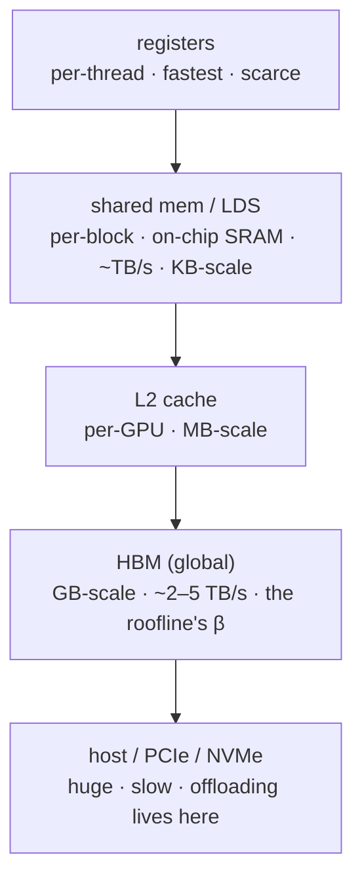

# GPU 程式設計模型與記憶體層次結構

  <strong>等級：</strong>初級→中階
  <strong>先決條件：</strong> <a href="../../foundations/transformer-systems/">roofline</a>
  <strong>硬體：</strong> 無（GPU 有助於後面的曲目）

要快速編寫 kernels，你需要一個關於 GPU 如何執行程式碼的正確思維模型
以及數據所在的位置。該頁面從記憶體層次結構向上建構該模型，
在**CUDA 和 ROCm/HIP 術語一起**中，因此 [Triton](triton-track.md) 和
[CUDA/HIP](cuda-hip-track.md) 路線有穩固基礎。

## 執行層次

GPU 將**kernel**作為執行緒網格運行，以層次結構組織：

| 水平     | NVIDIA 術語        | AMD 術語       | 它是什麼                     |
| -------- | ------------------ | -------------- | ---------------------------- |
| 單車道   | 執行緒             | 工作項目       | 一個標量執行流程             |
| 鎖步組   | **經線 (32)**      | **波前 (64)**  | 一起執行的線程 (SIMT)        |
| 合作團體 | 線程塊             | 工作小組       | 共享快速片上記憶器，可以同步 |
| 整體推出 | 網格               | 網格           | 一個 kernel 的所有區塊       |
| 硬體單元 | SM（流式多處理器） | CU（計算單元） | 同時運行許多扭曲/波前        |

**SIMT**模型：在扭曲/波前內，所有通道執行*相同*
不同數據的指令。車道不一致的分支（**分歧**）
序列化兩條路徑－這是一個主要的效能缺陷。最重要的一個
NVIDIA↔AMD 差異：**扭曲 = 32，波前 = 64**。假設為 32 的代碼（例如
硬編碼的隨機減少）在 AMD 上是錯誤的；始終使用 `warpSize`。

## 記憶體層次結構

這就是 roofline 所在的地方。 latency 和頻寬的順序不同
跨等級的大小：

| 空間      | 英偉達                 | AMD        | 範圍      | 粗角色         |
| --------- | ---------------------- | ---------- | --------- | -------------- |
| 暫存器    | 暫存器                 | 暫存器     | 執行緒    | 操作數         |
| 片上刮痕  | **共享記憶體（SMEM）** | **摩門教** | 塊/工作組 | 分段瓷磚，減少 |
| 快取      | L1/L2                  | L1/L2      | 變更      | 自動重複使用   |
| 設備 DRAM | 全球 / HBM             | 全球 / HBM | 網格      | 大張量         |

**GPU 效能的黃金法則**：將資料從 HBM 移至暫存器/SMEM
**一次**，盡可能地處理它，然後寫回來。這實際上是
來自 [roofline](../foundations/transformer-systems.md) 的「提高 算術強度」 —
Flashattention、分組 GEMM 和每個融合的 kernel 都是它的實例。

## 合併與銀行衝突

兩種存取模式主導 kernel 效能：

-**合併全域存取**：經紗中的連續通道應讀取
連續的位址，因此硬體將它們合併到幾個寬記憶體中
交易。跨步/分散訪問浪費頻寬（MoE 收集是
正是這種風險 - [kernels](../moe/kernels.md)）。 -**SMEM/LDS 中的儲存體衝突**：共享記憶體被分割成多個儲存體；如果有多個
通道到達同一銀行，存取串行化。墊塊寬度以避免它。

## 入住率

**佔用率**= 每個 SM/CU 駐留有幾個扭曲/波前，以
最稀缺的資源：每個執行緒的暫存器、每個區塊的 SMEM/LDS 或區塊計數
限制。更多常駐扭曲 → 更多 latency 隱藏（當一個扭曲等待 HBM 時，
另一個計算）。但最大入住率並不總是最快——kernel
每個執行緒使用大量暫存器/SMEM（例如，一個大的 matmul 區塊）可能會運行得更快
*降低*佔用率，因為每個執行緒執行更多工作。佔有是一種手段
（latency 隱藏），不是目標（throughput）。

!!! note "改變調整的 AMD 細節"
    CDNA 的佔用率以**CU**測量，並具有**LDS**和**VGPR**限制，
    64 寬波前意味著 256 線程塊有 4 個波前（相對於 8 個波前）
    NVIDIA 上的扭曲）—因此相同的區塊大小意味著不同的佔用率和
    不同的理想磁磚尺寸。矩陣數學映射到**MFMA**指令
    （與 NVIDIA Tensor Core `mma` 相比）。使用**rocprof/Omniperf**而不是進行設定文件
    視力。

## 兩種方言的發布

=== "CUDA"
`cpp
    __global__ void add(const float* a, const float* b, float* c, int n) {
        int i = blockIdx.x * blockDim.x + threadIdx.x;
        if (i < n) c[i] = a[i] + b[i];
    }
    add<<<(n + 255) / 256, 256>>>(a, b, c, n);   // grid, block
    `
=== "ROCm/HIP"
`cpp
    #include <hip/hip_runtime.h>
    __global__ void add(const float* a, const float* b, float* c, int n) {
        int i = blockIdx.x * blockDim.x + threadIdx.x;   // identical body
        if (i < n) c[i] = a[i] + b[i];
    }
    hipLaunchKernelGGL(add, dim3((n+255)/256), dim3(256), 0, 0, a, b, c, n);
    `
kernel 本體相同； HIP 是 CUDA 概念之上的一個薄可移植層。
*效能*工作 — 切片尺寸、波前感知縮減、LDS 與 SMEM
大小調整、MFMA 與 Tensor Core — 是你的專長。這就是本期的主題
[CUDA/HIP track](cuda-hip-track.md)。不過，對大多數 kernels 來說，
[Triton](triton-track.md) 讓你可以跳過此步驟，仍然獲得接近峰值的效能
可移植——從這裡開始。

## 要點

- GPU 以鎖步方式執行線程網格**warps (32, NVIDIA)**/
  **SIMT**模型下 SM/CU 上的**波前（64、AMD）**；分支分歧
  序列化。 -**記憶體層次結構**（暫存器 → SMEM/LDS → L2 → HBM → 主機）跨越順序
  數量級；黃金法則是**加載一次，最大限度地重複使用**- 即提高
  算術強度。 -**合併**全域訪問，**避免 SMEM/LDS 中的銀行衝突**，並處理
  **佔用**作為 latency 隱藏的手段，而不是目的。
- CUDA 和 HIP 共享概念和來源； AMD 的不同之處在於波前寬度、LDS、
  MFMA、每個 CU 佔用率和工具 - 進行相應調整。

## 練習

!!! tip "解決方案"
    參考解答位於 [解答頁](../solutions/performance.md) 上。請先嘗試每個練習，再展開解答。

1. 為什麼為 32 通道編寫的扭曲/波前減少會給出錯誤的結果
   CDNA？重寫它以使用 `warpSize`。
2. 對於在 64K SM 上使用 64 個暫存器/執行緒和 48 KB SMEM/區塊的 kernel
   寄存器和 100 KB SMEM，估計佔用限制器。
3. 顯示針對行主張量合併但不合併的記憶體存取模式
   它的轉置；與 MoE 收集有關。
4. 解釋什麼時候*降低*佔用率可以提高 throughput（提示：暫存器重
   matmul 瓷磚）。

## 參考文獻

- NVIDIA CUDA C++ 程式設計指南。
- AMD ROCm / HIP 程式指南； CDNA3 ISA (MI300)。
- 沃爾科夫。 _以更低的佔用率實現更好的效能。 _ 2010。
- _大規模平行處理器程式設計_（Hwu、Kirk、El Hajj）。
