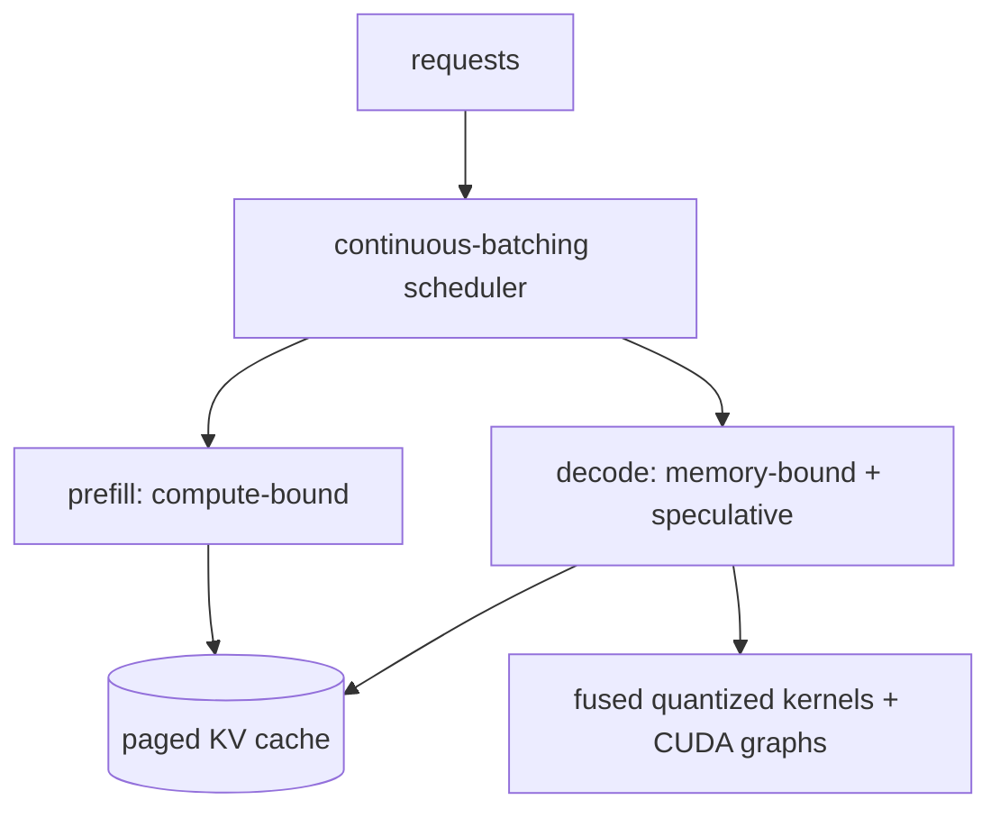

# Inference 優化

<div class="page-meta">
  <span class="chip"><strong>等級：</strong>中階→高階</span>
  <span class="chip"><strong>先備知識：</strong> <a href="../../foundations/attention-efficiency/">attention 效率</a>、<a href="../quantization/">量化</a></span>
  <span class="chip"><strong>硬體：</strong> GPU</span>
</div>

inference 是一個 throughput 與 latency 的最佳化問題，其根基是
[memory wall](../foundations/attention-efficiency.md)：decode 受頻寬限制，
因此整個賽局就是攤銷權重讀取並避免浪費工作。本頁
涵蓋 **Continuous Batching**、**speculative decoding**、**KV cache 管理**，
以及 serving 系統如何將它們串接起來。MoE 專屬的 serving 已在
[MoE inference & serving](../moe/inference-serving.md) 討論。

## 再談兩個階段

- **prefill**：一次處理整個 prompt — 大量 tokens → compute-bound →
  逼近峰值 FLOPs，決定第一個 token 的 latency（TTFT）。
- **decode**：一次產生一個 token → memory-bound → 每個 token 的 latency
  由所讀取的位元組數（權重 + KV cache）決定。

下面每項技術都針對其中一個或兩個階段。北極星指標：**TTFT**（time
to first token、prefill）、**TPOT/ITL**（每個輸出 token 的時間、decode），以及
**throughput**（所有並發請求合計的 tokens/秒）。

### KV cache 的大小

對 multi-head attention，KV cache 佔用的位元組數為

$$
\text{bytes} = 2\,L\,H_{kv}\,d_h\,s\,c
$$

其中因子 $2$ 對應 K 與 V 兩份；$L$ 為層數；$H_{kv}$ 為 KV head 數
（GQA/MQA 下小於 query head 數）；$d_h$ 為每個 head 的維度；$s$ 為序列
長度；$c$ 為每個元素的位元組數（fp16 為 $2$、fp8 為 $1$）。此式對每個
序列、每個 token 線性成長，是 serving 的動態記憶體瓶頸來源。

paged attention 與 KV 量化都直接作用於此式：fp8 KV 把 $c$ 減半。
MLA（multi-head latent attention）則改為每個 token 只儲存單一個低秩
latent，而非完整的 $H_{kv}$ 份 K/V，因而把上式縮小一個很大的因子。

## Continuous Batching

靜態批次（等待、湊滿一批、跑到全部完成）會浪費 GPU：較短的
序列提早完成，其時槽閒置直到最長的序列結束，而新到的
請求必須等下一批。**Continuous Batching（in-flight batching）**改以
**迭代（token）等級**排程：

- 每個 decode 步驟之後，完成的序列離開，等待中的請求即刻加入。
- GPU 維持滿載；在相同的 latency 預算下，throughput 比靜態批次提升 2–20 倍。

這是 serving 最大的單點勝利，也是權重攤銷得以從
[roofline](../foundations/transformer-systems.md) 落地的原因：
更多並發序列 → 每次權重讀取服務更多 tokens → 更高的有效
arithmetic intensity。它需要 [paged KV cache](../foundations/attention-efficiency.md)，
讓不同長度的序列共享記憶體而不產生碎片。

```text
static:      [====req A====]
             [==req B==]      idle........   ← B's slot wasted until A ends
continuous:  [====req A====]
             [==req B==][==req D==][==E==]    ← slot reused instantly
```

### 為什麼 decode 是 memory-bound

以 $P$ 個參數的模型產生一個 token，需要串流約 $P\,c$ 位元組的權重，
並執行約 $2P$ 次 FLOP（每個參數一次乘加，計 $2$ FLOP），其中 $c$ 為
每個權重元素的位元組數。因此 arithmetic intensity 為

$$
I \approx \frac{2P}{P\,c} = \frac{2}{c}\ \text{FLOP/byte},
$$

遠低於 roofline 的 ridge point（脊點），故 decode 受記憶體限制。批次
處理 $b$ 個 token 可重複使用同一份權重：

$$
I \approx \frac{2b}{c},
$$

這正是 decode throughput 會隨 batch 增加而提升的原因 — 直到 $I$ 超過
ridge point、轉為 compute-bound 為止。

每個 token 的 decode 時間下界（由權重串流主宰）為

$$
t_{\text{step}} \gtrsim \frac{P\,c}{\beta},
$$

其中 $\beta$ 為 HBM 頻寬（bytes/s）。這就是 decode 的頻寬牆：在轉為
compute-bound 之前，單步時間無法低於此值。

### Throughput 與 latency

在 Continuous Batching 下，throughput 為

$$
\text{throughput} = \frac{b}{t_{\text{step}}},
$$

其中 $b$ 為同時在飛行中的 token（請求）數，$t_{\text{step}}$ 為單一 decode
步驟的時間。增大 $b$ 會提高 throughput，但也會推高每個請求的 latency
（TPOT）。Little's law 將兩者綁定：

$$
b = \text{throughput} \times \text{latency}.
$$

因此 serving 的調參本質是在固定的 latency SLO 下，盡量把 $b$ 推大。

## Speculative decoding

decode 受記憶體限制，因此 GPU 在等待記憶體時有閒置的計算能力。
speculative decoding 花費這份計算，在每次昂貴的驗證步驟中一次
產生多個 tokens：

1. 一個便宜的 **draft**（一個小模型、模型自身的早期層，或
   [n-gram/Medusa/EAGLE heads](#)）提出 $k$ 個候選 tokens。
2. 大的 **target** 模型在**單一次** forward pass 中平行驗證全部 $k$ 個候選
   （成本與一個 decode 步驟相當，因為它本來就是 memory-bound）。
3. 接受與 target 分佈相符的最長前綴（一個保留 target 精確輸出
   分佈的 rejection sampling 規則 — 預期上是無損的），然後繼續。

設 draft 的 acceptance rate（接受率）為 $\alpha$、draft 長度為 $k$，則每個
target 步驟期望接受的 token 數為

$$
\mathbb{E}[\text{accepted}] = \sum_{i=0}^{k} \alpha^{i} = \frac{1 - \alpha^{\,k+1}}{1 - \alpha},
$$

其中第 $i$ 個 draft token 被接受的機率約為 $\alpha^{i}$（前綴需全部命中），
最後再加上由 target 自身產生的 $1$ 個 token。淨加速為此期望值除以
每步的成本比（draft + verify 相對於單一 decode 步驟）：

$$
\text{speedup} \approx \frac{1}{c_{\text{ratio}}}\cdot\frac{1 - \alpha^{\,k+1}}{1 - \alpha},
\qquad
c_{\text{ratio}} = \frac{t_{\text{draft}} + t_{\text{verify}}}{t_{\text{decode}}}.
$$

若 draft 夠好，每次 target forward pass 可近乎免費換得 2–3× tokens，
因為驗證本來就受記憶體限制。self-speculation（Medusa/EAGLE）
免去執行獨立的 draft 模型。DeepSeek-V3 的
[Multi-token Prediction](../moe/case-studies.md) 頭可充當起草者。

!!! note "為什麼是無損的"
    接受/拒絕步驟的建構，使得被接受 tokens 的分佈
    *完全*等同於直接從 target 模型取樣。speculation 改變的是
    _計算的時程_，而非輸出分佈。

## KV cache 管理

KV cache 是 serving 的動態記憶體消耗者（參見
[attention efficiency](../foundations/attention-efficiency.md)，並回顧上方
$\text{bytes} = 2\,L\,H_{kv}\,d_h\,s\,c$）。可用的槓桿：

- **paged attention**：以區塊為單位配置 → 無碎片，支援共享
  （prefix caching、平行取樣）。它是 Continuous Batching 的基底。
- **prefix/prompt caching**：對共享系統 prompt 的請求重複使用其 KV
  （copy-on-write 區塊）— 對具有固定前導的聊天場景效益巨大。
- **架構收縮**：GQA/MQA/MLA 從源頭（降低 $H_{kv}$ 或改存 latent）縮小 cache。
- **KV 量化**：以 int8/fp8 儲存 K/V（降低 $c$）以容納更多序列；
  在長上下文中要留意品質。
- **offloading/eviction**：將冷 KV 溢出到 CPU，或驅逐/壓縮舊 tokens
  （streaming/window attention），適用於極長的上下文。

## 其他槓桿

- **算子融合**（fused attention、fused MLP+activation、fused
  RMSNorm+residual）減少記憶體往返 — 屬於 [kernel](triton-track.md) 工作。
- **CUDA/HIP graphs** 擷取 decode 步驟以消除每次迭代的啟動
  開銷（小 batch 時影響顯著）。
- **分解 prefill/decode**：在兩個分別調校以適配不同 roofline 的
  GPU 池上各跑一個階段，並在其間傳輸 KV cache
  （disaggregated serving / split）。可改善負載下的 TTFT 與 TPOT。
- **權重量化**（W4/W8，來自[quantization](quantization.md)）直接削減
  decode latency（降低式中的 $P\,c$）。

## 將其放在一起：serving 堆疊

生產級引擎（vLLM、SGLang、TensorRT-LLM）整合了這些技術：



訣竅在於把 prefill 與 decode 一起調度以最大化 throughput，同時不
吹爆 latency SLO — chunked prefill（將 prompt 的區塊與 decode 步驟
交錯）是維持 TTFT 與 TPOT 健康的常見技巧。

## 要點

- decode **受記憶體限制**；serving 的核心是攤銷權重讀取而非
  浪費工作（$I \approx 2b/c$，下界 $t_{\text{step}} \gtrsim P c/\beta$）。
- **Continuous Batching**（paged KV cache 上的迭代級調度）是
  throughput 最大的勝利。
- **speculative decoding** 以備用計算換取更少的 target forward pass，
  且**無損** — 正因 decode 受記憶體限制才有效。
- **KV cache 管理**（paging、prefix caching、量化、架構
  收縮）控制動態記憶體上限；**融合、graphs、量化與
  prefill/decode 分解**讓堆疊更完整。

## 練習

!!! tip "解決方案"
    參考解答位於 [解答頁](../solutions/performance.md) 上。請先嘗試每個練習，再展開解答。

1. 將 speculative decoding 的期望加速推導為 draft 接受率 $\alpha$
   與提案長度 $k$ 的函數。
2. 估計 Continuous Batching 相對於靜態批次的 throughput 增益，工作負載
   的序列長度在 $[64, 1024]$ 間均勻分佈。
3. 以 prefix caching，計算 100 個共享同一個 2k-token 系統 prompt 的
   請求所節省的 KV 記憶體（用 $\text{bytes} = 2\,L\,H_{kv}\,d_h\,s\,c$）。
4. prefill/decode 分解何時有益、何時有害？請就池之間的 KV cache
   傳輸成本論證。

## 參考文獻

- Yu et al. _Orca: Continuous batching._ 2022；Kwon et al. _vLLM / PagedAttention._ 2023.
- Leviathan et al. & Chen et al. _Speculative decoding._ 2023.
- Cai et al. _Medusa._ 2024；Li et al. _EAGLE._ 2024.
- Zhong et al. _Distributed/disaggregated serving._ 2024；Patel et al. _Splitwise._ 2024.
