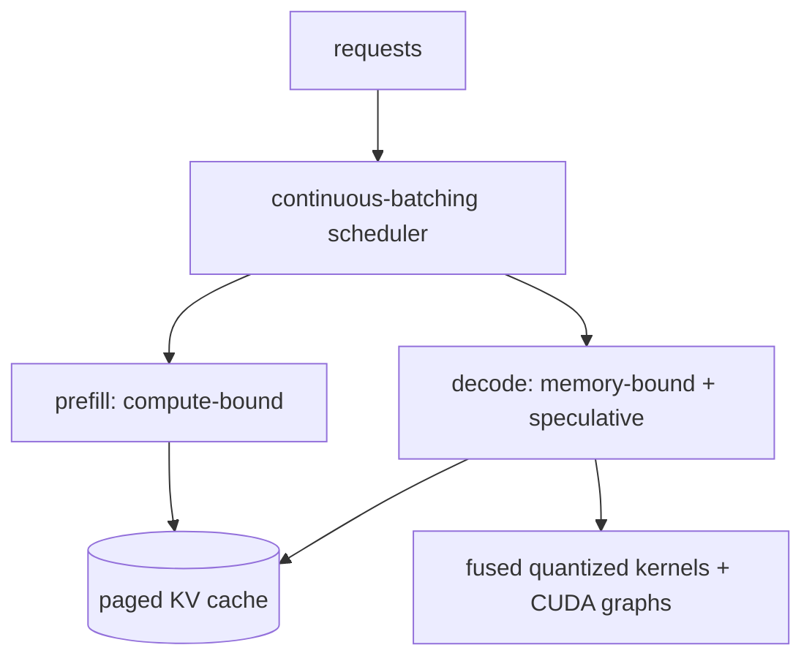

# inference 優化

<div class="page-meta">
  <span class="chip"><strong>等級：</strong>中階→高階</span>
  <span class="chip"><strong>先備知識：</strong> <a href="../../foundations/attention-efficiency/">attention 效率</a>、<a href="../quantization/">量化</a></span>PH
  <span class="chip"><strong>硬體：</strong> GPU</span>
</div>

inference 是 throughput 和 latency 最佳化問題的基礎
[memory wall](../foundations/attention-efficiency.md)：decoding 受頻寬限制，
所以整個遊戲都是在攤銷權重讀取並避免浪費工作。本頁
涵蓋**連續批次**、**推測性 decoding**、**KV 快取管理**、
以及 serving 系統如何將它們連接在一起。 MoE 專用 serving 已在
[MoE inference & serving](../moe/inference-serving.md)。

## 再次的兩個階段

-**prefill**：立即處理整個提示 — 許多 tokens → 計算密集型 →
達到峰值 FLOPs。 latency 到第一個 token。 -**decode**：一次產生一個 token → 記憶體限制 → 每個 token 集 latency
按讀取的位元組數（權重 + KV 快取）。

下面的每項技術都針對其中一個或兩個。北極星指標：**TTFT**（時間
到第一個 token、prefill)、**TPOT/ITL**（每個輸出 token、decode 的時間），以及
**throughput**（所有並發請求的 tokens/秒）。

## 連續配料

靜態批次（等待、形成批次、運行直至完成）會浪費 GPU：短
序列提前完成並且它們的時隙空閒，直到最長的一個完成，並且新的
請求等待下一批。**連續（飛行中）配料**
**迭代**(token) 等級的計畫：

- 在每個 decode 步驟之後，完成的序列離開並等待請求加入。
- GPU 保持滿載；在相同的情況下，throughput 比靜態配料提高 2–20 倍
  latency 預算。

這是 serving 最大的單場勝利，這就是權重攤銷的原因
從 [roofline](../foundations/transformer-systems.md) 實際實現：
更多並發序列 → 每個重量讀取更多 tokens → 更高有效
強度。需要[paged KV cache](../foundations/attention-efficiency.md)
因此不同長度的序列可以共享記憶體而不會產生碎片。

```text
static:      [====req A====]
             [==req B==]      idle........   ← B's slot wasted until A ends
continuous:  [====req A====]
             [==req B==][==req D==][==E==]    ← slot reused instantly
```

## 推測性 decoding

decode 受記憶體限制，因此 GPU 在等待記憶體時有空閒的「計算」。
推測性 decoding 花費該計算來為每個產生多個 tokens
昂貴的驗證步驟：

1. 一個便宜的**草稿**（一個小模型，或模型自己的早期層，或者
   [n-gram/Medusa/EAGLE heads](#)）提出$\gamma$候選 tokens。
2. 大**目標**模型在**一次**前方傳遞中驗證所有$\gamma$
   （與候選者平行 - 與 decode 步驟的成本相同，因為它是
   無論如何，內存限制）。
3. 接受與目標分佈相符的最長前綴（a
   **保留目標的精確輸出的拒絕採樣規則
   分佈**－預期是無損的），然後繼續。

如果選秀不錯，你可以免費獲得每個目標前傳 2-3× tokens，
因為無論如何驗證都會受到記憶體限制。自我推測
(Medusa/EAGLE) 避免執行單獨的草稿模型。 DeepSeek-V3 的
[Multi-token Prediction](../moe/case-studies.md)頭可作為起草人。

!!! note "為什麼是無損的"
    建構接受/拒絕步驟，以便分發接受的 tokens
    *完全*就像從目標模型中取樣一樣。猜測改變了
    _計算時間表_，而不是輸出分佈。

## KV-快取管理

KV 快取是 serving 的動態記憶體消耗者（參見
[attention efficiency](../foundations/attention-efficiency.md)）。槓桿：

-**Pagedattention**：基於區塊的分配 → 無碎片，支援共享
（前綴緩存，並行樣本）。用於連續配料的基材。 -**前綴/提示符號快取**：重複使用共享系統提示符號的 KV
請求（寫時複製區塊）—對於具有固定前導碼的聊天來說非常巨大。 -**架構收縮**：GQA/MQA/MLA 從源頭減少快取大小。 -**KV 量化**：將 K/V 儲存在 int8/fp8 中以適應更多序列；手錶質量
在長上下文中。 -**卸載/驅逐**：將冷 KV 溢出到 CPU，或驅逐/壓縮舊的 tokens
（流/視窗 attention）適用於很長的上下文。

## 其他槓桿

-**算子融合**（融合 attention、融合 MLP+活化、融合
RMSNorm+residual）減少記憶體傳遞 — [kernel](triton-track.md) 工作。 -**CUDA/HIP 圖表**擷取 decode 步驟以刪除每次迭代啟動
開銷（小批量時顯著）。 -**分解 prefill/decode**：在單獨的 GPU 池上運行兩個階段
調整大小以適應不同的 roofline，在它們之間傳送 KV 緩存
（分散式服務/拆分）。改善負載下的 TTFT 和 TPOT。 -**量化權重**（W4/W8 來自[quantization](quantization.md)）直接切割
decode latency。

## 將其放在一起：serving 堆疊

生產引擎（vLLM、SGLang、TensorRT-LLM）結合了這些：



藝術是將 prefill 和 decode 一起調度以最大化 throughput，而不需要
吹 latency SLO — 分塊 prefill（將提示方塊與 decode 交錯）
步驟）是保持 TTFT 和 TPOT 健康的常見技巧。

## 要點

- decode**受記憶體限制**；serving 是關於攤銷重量讀數而不是
  浪費工作。 -**連續批次處理**（分頁 KV 快取上的迭代級調度）是
  throughput 最大的勝利。 -**推測性 decoding**用備用計算換取更少的目標前向傳遞，
  **無損**- 有效正是因為 decode 受記憶體限制。 -**KV-快取管理**（分頁、前綴快取、量化、架構
  Shrink）控制動態記憶體限制；**融合、圖表、量化和
  prefill/decode 分解**讓堆疊更加完整。

## 練習

!!! tip "解決方案"
    參考解答位於 [解答頁](../solutions/performance.md) 上。請先嘗試每個練習，再展開解答。

1. 將投機性 decoding 的預期加速推導為草稿的函數
   接受率 $\alpha$ 和提案長度 $\gamma$。
2. 估計連續批次與靜態批次對工作負載的 throughput 增益
   序列長度統一在[64, 1024]。
3. 使用前綴緩存，計算 100 個共享 a 的請求所節省的 KV 內存
   2k-token 系統提示。
4. prefill/decode 分解何時有益，何時有害？關於 KV-cache 的原因
   池之間的轉移成本。

## 參考文獻

- 餘等人。 _Orca：連續配料。 _ 2022；權等人。 _vLLM / Pagedattention。 _ 2023 年。
- 利維坦等。 ＆陳等人。 _推測 decoding。 _ 2023 年。
- 蔡等人。 _美杜莎。 _ 2024；李等人。 _老鷹。 _ 2024 年。
- 鐘等人*分散式服務。 * 2024；帕特爾等人。 _分開。 _ 2024 年。
