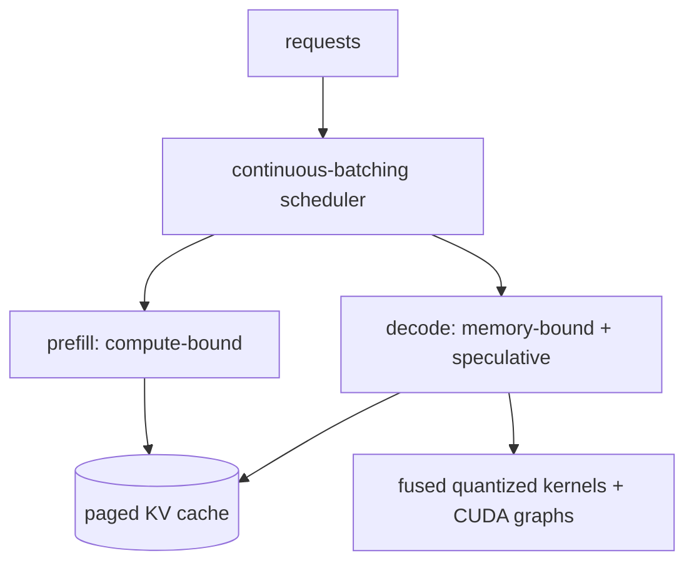

# Inference optimization

<div class="page-meta">
  <span class="chip"><strong>Level:</strong> intermediate → advanced</span>
  <span class="chip"><strong>Prereqs:</strong> <a href="../../foundations/attention-efficiency/">attention efficiency</a>, <a href="../quantization/">quantization</a></span>
  <span class="chip"><strong>Hardware:</strong> GPU(s)</span>
</div>

Inference is a throughput-and-latency optimization problem on top of the
[memory wall](../foundations/attention-efficiency.md): decoding is bandwidth-bound,
so the whole game is amortizing weight reads and avoiding wasted work. This page
covers **continuous batching**, **speculative decoding**, **KV-cache management**,
and how serving systems tie them together. MoE-specific serving is in
[MoE inference & serving](../moe/inference-serving.md).

## The two phases, again

- **Prefill**: process the whole prompt at once — many tokens → compute-bound →
  hits peak FLOPs. Latency to first token.
- **Decode**: generate one token at a time → memory-bound → latency per token set
  by bytes read (weights + KV cache).

Every technique below targets one or both. The north-star metrics: **TTFT** (time
to first token, prefill), **TPOT/ITL** (time per output token, decode), and
**throughput** (tokens/sec across all concurrent requests).

## Continuous batching

Static batching (wait, form a batch, run it to completion) wastes the GPU: short
sequences finish early and their slots idle until the longest one is done, and new
requests wait for the next batch. **Continuous (in-flight) batching** instead
schedules at the **iteration** (token) level:

- After every decode step, finished sequences leave and waiting requests join.
- The GPU stays full; throughput rises 2–20× over static batching at the same
  latency budget.

This is the single biggest serving win, and it's why the weight-read amortization
from the [roofline](../foundations/transformer-systems.md) actually materializes:
more concurrent sequences → more tokens per weight read → higher effective
intensity. It requires [paged KV cache](../foundations/attention-efficiency.md)
so sequences of different lengths can share memory without fragmentation.

```text
static:      [====req A====]
             [==req B==]      idle........   ← B's slot wasted until A ends
continuous:  [====req A====]
             [==req B==][==req D==][==E==]    ← slot reused instantly
```

## Speculative decoding

Decode is memory-bound, so the GPU has spare *compute* while waiting on memory.
Speculative decoding spends that compute to generate multiple tokens per
expensive verification step:

1. A cheap **draft** (a small model, or the model's own early layers, or
   [n-gram/Medusa/EAGLE heads](#)) proposes $\gamma$ candidate tokens.
2. The big **target** model verifies all $\gamma$ in **one** forward pass
   (parallel over the candidates — same cost as one decode step, since it was
   memory-bound anyway).
3. Accept the longest prefix that matches the target's distribution (a
   rejection-sampling rule that **preserves the target's exact output
   distribution** — it's lossless in expectation), then continue.

If the draft is good, you get 2–3× tokens per target forward pass for free,
because the verification was going to be memory-bound regardless. Self-speculation
(Medusa/EAGLE) avoids running a separate draft model. DeepSeek-V3's
[Multi-Token Prediction](../moe/case-studies.md) heads can serve as the drafter.

!!! note "Why it's lossless"
    The accept/reject step is constructed so the accepted tokens are distributed
    *exactly* as if sampled from the target model. Speculation changes the
    *compute schedule*, not the output distribution.

## KV-cache management

The KV cache is the dynamic memory hog of serving (see
[attention efficiency](../foundations/attention-efficiency.md)). Levers:

- **PagedAttention**: block-based allocation → no fragmentation, enables sharing
  (prefix caching, parallel samples). The substrate for continuous batching.
- **Prefix / prompt caching**: reuse the KV of a shared system prompt across
  requests (copy-on-write blocks) — huge for chat with a fixed preamble.
- **Architectural shrink**: GQA/MQA/MLA reduce cache size at the source.
- **KV quantization**: store K/V in int8/fp8 to fit more sequences; watch quality
  on long context.
- **Offload / eviction**: spill cold KV to CPU, or evict/compress old tokens
  (streaming/window attention) for very long contexts.

## Other levers

- **Operator fusion** (fused attention, fused MLP+activation, fused
  RMSNorm+residual) cuts memory passes — the [kernel](triton-track.md) work.
- **CUDA/HIP graphs** capture the decode step to remove per-iteration launch
  overhead (significant at small batch).
- **Disaggregated prefill/decode**: run the two phases on separate GPU pools
  sized to their different rooflines, shipping the KV cache between them
  (DistServe / Splitwise). Improves both TTFT and TPOT under load.
- **Quantized weights** (W4/W8 from [quantization](quantization.md)) directly cut
  decode latency.

## Putting it together: a serving stack

Production engines (vLLM, SGLang, TensorRT-LLM) combine these:



The art is scheduling prefill and decode together to maximize throughput without
blowing latency SLOs — chunked prefill (interleave prompt chunks with decode
steps) is a common trick to keep TTFT and TPOT both healthy.

## Key takeaways

- Decode is **memory-bound**; serving is about amortizing weight reads and not
  wasting work.
- **Continuous batching** (iteration-level scheduling on a paged KV cache) is the
  biggest throughput win.
- **Speculative decoding** trades spare compute for fewer target forward passes,
  **losslessly** — effective precisely because decode was memory-bound.
- **KV-cache management** (paging, prefix caching, quantization, architectural
  shrink) controls the dynamic memory limit; **fusion, graphs, quantization, and
  prefill/decode disaggregation** round out the stack.

## Exercises

!!! tip "Solutions"
    Worked answers are on the [Part solutions page](../solutions/performance.md). Try each exercise before expanding.

1. Derive the expected speedup of speculative decoding as a function of draft
   acceptance rate $\alpha$ and proposal length $\gamma$.
2. Estimate throughput gain from continuous vs static batching for a workload with
   sequence lengths uniform in [64, 1024].
3. With prefix caching, compute the KV memory saved for 100 requests sharing a
   2k-token system prompt.
4. When does prefill/decode disaggregation help vs hurt? Reason about the KV-cache
   transfer cost between pools.

## References

- Yu et al. *Orca: continuous batching.* 2022; Kwon et al. *vLLM / PagedAttention.* 2023.
- Leviathan et al. & Chen et al. *Speculative decoding.* 2023.
- Cai et al. *Medusa.* 2024; Li et al. *EAGLE.* 2024.
- Zhong et al. *DistServe.* 2024; Patel et al. *Splitwise.* 2024.
