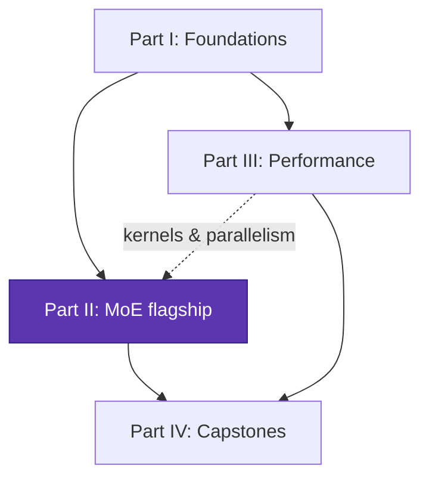

# Reading path

This page lays out a recommended order through the handbook, from **beginner**
(you know Python + basic DL) to **advanced** (you're writing fused kernels and
multi-node parallelism). Each module lists its prerequisites so you can skip
ahead safely.

## Stage 0 — Orientation (everyone)

Read the [home page](index.md) and this page. Skim the
[glossary](glossary.md) so terms like *arithmetic intensity*, *all-to-all*, and
*expert capacity* aren't surprising later. You don't need to memorize anything.

## Stage 1 — Foundations (beginner)

The vocabulary of performance. Do these in order; everything later assumes them.

1. [The transformer from scratch](foundations/transformer-from-scratch.md) — what a transformer *is*, one diagram at a time. **Skip if you already know transformers cold.**
2. [The transformer as a system](foundations/transformer-systems.md) — learn to count FLOPs and bytes and read a roofline.
3. [Numerics & precision](foundations/numerics-precision.md) — bf16 vs fp16 vs fp8, why training doesn't explode.
4. [Attention efficiency](foundations/attention-efficiency.md) — the KV cache and why decoding is memory-bound.
5. [FlashAttention from scratch](foundations/flashattention.md) — your first real "fuse it to save memory traffic" win.

??? note "Prerequisites for Stage 1"
    Python and basic linear algebra (matrix multiply). No prior transformer
    knowledge needed — page 1 builds it from scratch. No GPU required; the math
    and the numpy/PyTorch reference code run on CPU.

## Stage 2 — The MoE flagship (intermediate)

The heart of the handbook. The first five pages are model/algorithm; the last
four are systems and need a little of Part III (you can read them in parallel).

1. [Why sparsity](moe/why-sparsity.md)
2. [MoE layer from scratch](moe/moe-from-scratch.md)
3. [Load balancing](moe/load-balancing.md)
4. [Routing variants](moe/routing-variants.md)
5. [Training stability](moe/training-stability.md)
6. [Systems & expert parallelism](moe/systems-ep.md) ← needs collectives (Stage 3.2)
7. [MoE kernels](moe/kernels.md) ← needs the kernel tracks (Stage 3.1)
8. [Inference & serving](moe/inference-serving.md)
9. [Case studies](moe/case-studies.md)

## Stage 3 — Performance engineering (intermediate → advanced)

Read this **alongside** Stage 2; the MoE systems pages link into it.

1. Kernels: [GPU programming model](performance/gpu-programming.md) → [Triton track](performance/triton-track.md) → [CUDA / HIP track](performance/cuda-hip-track.md)
2. Scale: [Distributed training](performance/distributed-training.md)
3. Deploy: [Quantization](performance/quantization.md) → [Inference optimization](performance/inference-optimization.md)
4. Always: [Profiling & methodology](performance/profiling.md) — read early, reread often.

## Stage 4 — Capstones (advanced)

Put it together end to end.

1. [Build a small MoE LM](capstones/build-moe.md) — train it, then optimize and measure.
2. [Scaling it up](capstones/scaling.md) — apply DP/TP/PP/EP to the model you built.

---

## Three express lanes

=== "I want MoE, fast"

    [Transformer as a system](foundations/transformer-systems.md) (FLOPs/roofline only) →
    [MoE from scratch](moe/moe-from-scratch.md) →
    [Load balancing](moe/load-balancing.md) →
    [Systems & EP](moe/systems-ep.md) →
    [Case studies](moe/case-studies.md).

=== "I want to write kernels"

    [Transformer as a system](foundations/transformer-systems.md) →
    [GPU programming model](performance/gpu-programming.md) →
    [Triton track](performance/triton-track.md) →
    [CUDA / HIP track](performance/cuda-hip-track.md) →
    [FlashAttention](foundations/flashattention.md) →
    [MoE kernels](moe/kernels.md).

=== "I want to scale training"

    [Transformer as a system](foundations/transformer-systems.md) →
    [Numerics & precision](foundations/numerics-precision.md) →
    [Distributed training](performance/distributed-training.md) →
    [Systems & EP](moe/systems-ep.md) →
    [Scaling it up](capstones/scaling.md).
