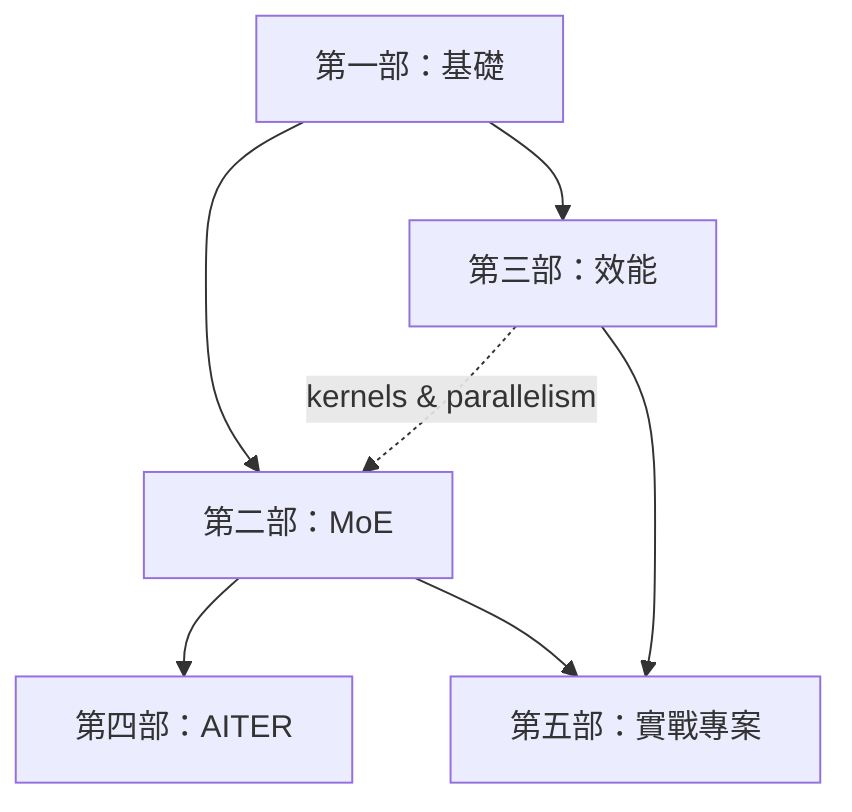

# 閱讀路線

本頁給出整本手冊的建議順序，從**初學者**（會 Python + 基本深度學習）一路到**進階**（在寫融合
kernel 與多節點並行）。每個模組都標了先備知識，所以你可以安全地跳著前進。

## 第 0 階段 — 入門（所有人）

先讀 [首頁](index.md) 和本頁。略翻 [詞彙表](glossary.md)，讓*算術強度*、*all-to-all*、
*expert capacity* 這類術語之後出現時不至於陌生。你現在不需要背任何東西。

## 第 1 階段 — 基礎（初學者）

建立效能分析的共同語彙。請依序閱讀；後面的內容都假設你已掌握這些概念。

1. [從零實作 Transformer](foundations/transformer-from-scratch.md)——Transformer *是什麼*，一次一張圖。**已經懂 Transformer 的話可跳過。**
2. [作為系統的 Transformer](foundations/transformer-systems.md)——學會數 FLOP 與 bytes、讀懂 roofline。
3. [數值與精度](foundations/numerics-precision.md)——bf16 vs fp16 vs fp8，以及為什麼 training 不會爆掉。
4. [Attention 效率](foundations/attention-efficiency.md)——KV cache，以及 decode 為何受記憶體限制。
5. [從零實作 FlashAttention](foundations/flashattention.md)——你第一個真正的「靠融合省下記憶體流量」勝利。

??? note "第 1 階段的先備知識"
    Python 與基本線性代數（矩陣乘法）。不需要任何 Transformer 先備知識——第一頁會從零把它建起來。
    不需要 GPU；數學與 numpy/PyTorch 參考程式碼都能在 CPU 上跑。

## 第 2 階段 — MoE（中階）

手冊的核心。前五頁是模型/演算法；後面幾頁是系統，會用到第三部的一些內容（兩部可以並行讀）。

1. [為什麼需要稀疏化](moe/why-sparsity.md)
2. [從零實作 MoE layer](moe/moe-from-scratch.md)
3. [負載平衡](moe/load-balancing.md)
4. [Routing 變體](moe/routing-variants.md)
5. [訓練穩定性](moe/training-stability.md)
6. [系統與 expert parallelism](moe/systems-ep.md) ← 需要 collective（階段 3.2）
7. [MoE kernels](moe/kernels.md) ← 需要 kernel 路線（階段 3.1）
8. [推論與 serving](moe/inference-serving.md)
9. [案例研究](moe/case-studies.md)

## 第 3 階段 — 效能工程（中階 → 進階）

**請和第 2 階段一起讀；MoE 的系統章節會直接連回這裡。**

1. kernel：[GPU 程式設計模型](performance/gpu-programming.md) → [Triton 路線](performance/triton-track.md) → [CUDA / HIP 路線](performance/cuda-hip-track.md)
2. 規模：[分散式訓練](performance/distributed-training.md)
3. 部署：[量化](performance/quantization.md) → [推論最佳化](performance/inference-optimization.md)
4. 永遠：[Profiling 與方法論](performance/profiling.md)——趁早讀、常常回頭重讀。

## 第 4 階段 — AITER（進階）

把前三部的觀念對到一條*具名、可量測*的真實執行路徑上。**建議先讀完第 2、3 階段再進來。**

1. [AITER decode 深入解析](aiter/index.md)——以 Kimi-K2.5 MXFP4 的 decode trace 為例，
   把 Chrome/Kineto bucket 一路對回 SGLang→AITER 呼叫、Python dispatcher 與底層 HIP / CK /
   FlyDSL kernel，並用 roofline 解釋為何 MoE expert GEMM 是 decode 的主瓶頸。

??? note "第 4 階段的先備知識"
    第 1 階段的 roofline 與 KV cache（[作為系統的 Transformer](foundations/transformer-systems.md)、
    [Attention 效率](foundations/attention-efficiency.md)）、第 2 階段的
    [MoE kernels](moe/kernels.md) 與 [MoE decode 剖析](moe/decode-anatomy.md)，以及第 3 階段的
    [Profiling 與方法論](performance/profiling.md)。不需要 AMD GPU 就能讀懂分析；要重現量測才需要 MI355X 等硬體。

## 第 5 階段 — 實戰專案（進階）

把整套首尾接起來。

1. [建立小型 MoE LM](capstones/build-moe.md)——訓練它，然後優化並量測。
2. [擴展到更大規模](capstones/scaling.md)——把 DP/TP/PP/EP 套到你建好的模型上。

---

## 三條快速通道

=== "我只想快點上手 MoE"

    [作為系統的 Transformer](foundations/transformer-systems.md)（只看 FLOPs/roofline）→
    [從零實作 MoE layer](moe/moe-from-scratch.md) →
    [負載平衡](moe/load-balancing.md) →
    [系統與 EP](moe/systems-ep.md) →
    [案例研究](moe/case-studies.md)。

=== "我想寫 kernel"

    [作為系統的 Transformer](foundations/transformer-systems.md) →
    [GPU 程式設計模型](performance/gpu-programming.md) →
    [Triton 路線](performance/triton-track.md) →
    [CUDA / HIP 路線](performance/cuda-hip-track.md) →
    [FlashAttention](foundations/flashattention.md) →
    [MoE kernels](moe/kernels.md)。

=== "我想擴展 training"

    [作為系統的 Transformer](foundations/transformer-systems.md) →
    [數值與精度](foundations/numerics-precision.md) →
    [分散式訓練](performance/distributed-training.md) →
    [系統與 EP](moe/systems-ep.md) →
    [擴展到更大規模](capstones/scaling.md)。

=== "我想讀真實 trace / 調 AITER kernel"

    [作為系統的 Transformer](foundations/transformer-systems.md)（roofline）→
    [Attention 效率](foundations/attention-efficiency.md)（MLA/KV cache）→
    [MoE kernels](moe/kernels.md) →
    [MoE decode 剖析](moe/decode-anatomy.md) →
    [Profiling 與方法論](performance/profiling.md) →
    [AITER decode 深入解析](aiter/index.md)。
