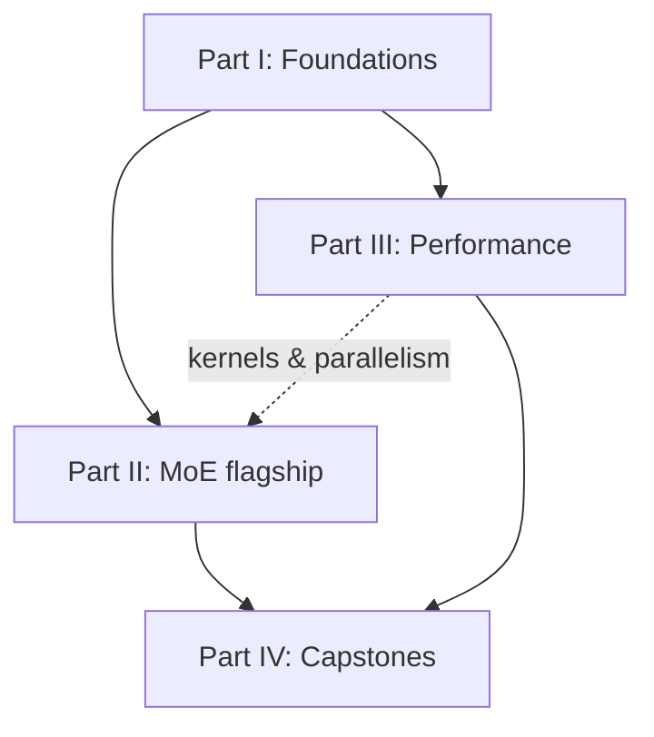

# 讀取路徑

本頁列出了手冊中的推薦順序，來自**初學者**
（你知道 Python + 基本 DL）到**高級**（你正在寫融合的 kernels 和
多節點並行）。每個模組都列出了其先決條件，因此你可以跳過
安全前進。

## 第 0 階段 — 迎新（每個人）

閱讀 [home page](index.md) 和本頁。略讀
[glossary](glossary.md) 等術語如 _算術強度_、_all-to-all_ 和
*expert 容量*稍後就不足為奇了。你不需要記住任何東西。

## 第 1 階段 — 基礎（初學者）

建立效能分析的共同語彙。請按順序閱讀；後面的內容都假設你已理解這些概念。

1. [The transformer from scratch](foundations/transformer-from-scratch.md) — Transformer*是什麼*，一次一張圖。** 如果你已經了解 Transformer，請跳過。**
2. [The transformer as a system](foundations/transformer-systems.md) — 學習計算 FLOP 和位元組數並讀取 roofline。
3. [Numerics & precision](foundations/numerics-precision.md) — bf16 vs fp16 vs fp8，為什麼 training 不爆炸。
4. [attention efficiency](foundations/attention-efficiency.md) — KV 快取以及 decoding 受記憶體限制的原因。
5. [Flashattention from scratch](foundations/flashattention.md) — 你的第一個真正的「融合它以節省記憶體流量」勝利。

??? note "第一階段的先決條件"
Python 和基本線性代數（矩陣乘法）。沒有預先 Transformer
所需的知識－第 1 頁從頭開始建構它。無需 GPU；數學
以及在 CPU 上運行的 numpy/PyTorch 參考程式碼。

## 第 2 階段 — MoE 旗艦（中級）

手冊的核心。前五頁是模型/演算法；最後一個
四個是系統，需要第三部分的一些內容（你可以並行閱讀它們）。

1. [Why sparsity](moe/why-sparsity.md)
2. [MoE layer from scratch](moe/moe-from-scratch.md)
3. [負載平衡](moe/load-balancing.md)
4. [routing variants](moe/routing-variants.md)
5. [training stability](moe/training-stability.md)
6. [Systems & expert parallelism](moe/systems-ep.md) ← 需要集體（階段 3.2）
7. [MoE kernels](moe/kernels.md) ← 需要 kernel 軌道（階段 3.1）
8. [inference & serving](moe/inference-serving.md)
9. [Case studies](moe/case-studies.md)

## 第 3 階段 — 效能工程（中階 → 進階）

**請與第二階段一起閱讀此部分；MoE 系統頁面會直接連回這裡。**

1. kernels：[GPU programming model](performance/gpu-programming.md) → [Triton track](performance/triton-track.md) → [CUDA / HIP track](performance/cuda-hip-track.md)
2. 規模化：[Distributed training](performance/distributed-training.md)
3. 部署：[Quantization](performance/quantization.md) → [inference optimization](performance/inference-optimization.md)
4. 總是：[Profiling & methodology](performance/profiling.md) — 儘早閱讀，經常重讀。

## 第 4 階段 — Capstone（進階）

將其首尾相連。

1. [Build a small MoE LM](capstones/build-moe.md) — 訓練它，然後最佳化和測量。
2. [Scaling it up](capstones/scaling.md) — 將 DP/TP/PP/EP 套用至你建置的模型。

---

## 三個快速車道

=== "我想要 MoE，快點"

    [Transformer as a system](foundations/transformer-systems.md)（僅限 FLOPs/roofline）→
    [MoE from scratch](moe/moe-from-scratch.md) →
    [負載平衡](moe/load-balancing.md) →
    [Systems & EP](moe/systems-ep.md) →
    [Case studies](moe/case-studies.md)。

=== "我想寫 kernels"

    [Transformer as a system](foundations/transformer-systems.md) →
    [GPU programming model](performance/gpu-programming.md) →
    [Triton track](performance/triton-track.md) →
    [CUDA / HIP track](performance/cuda-hip-track.md) →
    [Flashattention](foundations/flashattention.md) →
    [MoE kernels](moe/kernels.md)。

=== "我想縮放 training"

    [Transformer as a system](foundations/transformer-systems.md) →
    [Numerics & precision](foundations/numerics-precision.md) →
    [Distributed training](performance/distributed-training.md) →
    [Systems & EP](moe/systems-ep.md) →
    [Scaling it up](capstones/scaling.md)。
